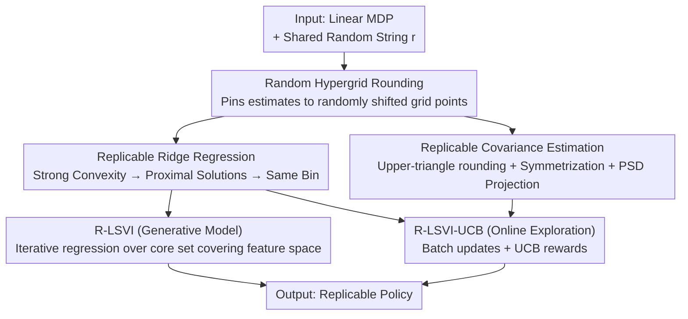

# Replicable Reinforcement Learning with Linear Function Approximation

**Conference**: ICLR 2026  
**OpenReview**: [https://openreview.net/forum?id=Ccflf8sqjF](https://openreview.net/forum?id=Ccflf8sqjF)  
**Code**: None  
**Area**: Reinforcement Learning / Learning Theory  
**Keywords**: Replicability, Linear MDP, Function Approximation, Sample Complexity, Randomized Rounding

## TL;DR
Ours provides the first **provably replicable** reinforcement learning algorithm beyond tabular settings for **linear MDPs**: by constructing two foundational tools—replicable ridge regression and uncentered covariance estimation—and integrating them into LSVI / LSVI-UCB frameworks, the algorithm outputs **bit-wise identical** policies with high probability when run on two independent datasets. Empirical results on CartPole and Atari confirm that quantization ideas lead to more consistent neural policies.

## Background & Motivation
**Background**: Reinforcement learning is notorious for instability—running the same algorithm twice on the same MDP with different sampled trajectories often results in vastly different policies. The learning theory community has recently formalized this stability using "replicability" (Impagliazzo et al.), requiring a randomized algorithm to produce **exactly the same** output with high probability across two executions with fixed internal randomness but independent data samples.

**Limitations of Prior Work**: Existing replicable RL works (Eaton 2023, Karbasi 2023) only handle **tabular settings**, where the state-action space is small enough to be enumerated and sampled sufficiently for concentration. Once moving to **function approximation** used in practice (where state spaces are massive or continuous), existing replicable mechanisms fail because states cannot be enumerated and individual state-action pairs cannot be sampled in isolation.

**Key Challenge**: Replicability requires the learned parameter vectors from two runs to be **extremely close** in Euclidean norm (close enough to be rounded to the same grid point). In function approximation, data distributions shift with agent exploration and state visitation is non-stationary, making traditional "closeness to ground truth" techniques inapplicable. Furthermore, exploration in linear MDPs requires pushing the Q-function beyond the linear class, complicating the assumption that Q resides in a fixed subspace.

**Goal**: Extend replicability guarantees from tabular RL to **linear MDPs**, covering both the generative model setting and the more difficult episodic setting requiring online exploration.

**Key Insight**: The authors observe that the ridge regression objective is **strongly convex** and thus has a unique global optimum. By ensuring empirical solutions from two runs are sufficiently close to this unique optimum and applying randomized rounding, "closeness" can be converted into "bit-wise identity." Crucially, this does not require proximity to the ground truth, only the ability to minimize a given objective—enabling the method to hold even in agnostic (non-linear) cases.

**Core Idea**: Construct replicable linear estimation primitives using "strong convexity optimality + randomized hypergrid rounding," then use them as building blocks within LSVI/LSVI-UCB to propagate replicability through dynamic programming via induction across layers/rounds.

## Method

### Overall Architecture
The structure consists of a two-layer hierarchy: "Tools → Algorithms → Settings." The bottom layer builds two **replicable linear algebra primitives**: Replicable Ridge Regression (R-Ridge-Regression) and Replicable Uncentered Covariance Estimation (R-UC-Cov-Estimation), both based on a shared subroutine, R-Hypergrid-Rounding. The top layer integrates these primitives into value iteration frameworks to produce two RL algorithms: **R-LSVI** for the generative model setting (covering the feature space with a core set) and **R-LSVI-UCB** for online exploration (adding UCB exploration rewards calculated via covariance estimation).

The logic pipeline: First, solve "how to make a single linear estimation replicable" (rounding to a randomly shifted grid); then, use strong convexity to prove two estimates are close enough to round to the same point; finally, use **strong induction** across layers/rounds in RL to ensure the entire policy is replicable if each estimation step is replicable.

### Key Designs

**1. Random Hypergrid Rounding: Forcing "Approximately Equal" to "Exactly Equal"**

The fundamental difficulty of replicability is that continuous estimates are almost never exactly equal across runs. Ours adapts and extends the randomized rounding from Impagliazzo et al. from vectors to **matrices**: Given a matrix $A$, use shared randomness $r$ to draw a random offset $\alpha_{\text{off}}\in[0,\alpha)$. Construct a family of randomly shifted grid intervals in each dimension and map each element to the midpoint of its interval to obtain $\bar A$. This step provides two guarantees (Lemma 2.1): for accuracy, each element changes by at most $\alpha/2$, thus $\|A-\mathcal{A}(A)\|_F\le \sqrt{d_1 d_2}\,\tfrac{\alpha}{2}$; for replicability, if the Frobenius distance between two estimates is $\Delta=\|A^{(1)}-A^{(2)}\|_F$, the probability they round to the same point is:

$$\Pr[\mathcal{A}(A^{(1)})=\mathcal{A}(A^{(2)})]\ge 1-d_1 d_2\,\frac{\Delta}{\alpha}.$$

The intuition is that the randomly shifted grid makes the probability of being separated by a boundary proportional to the ratio of distance $\Delta$ to grid width $\alpha$. By forcing estimates close (small $\Delta$) or using a coarse grid (large $\alpha$), they land in the same bin with high probability. This serves as the foundation for all replicable primitives.

**2. Replicable Ridge Regression: Using Strong Convexity to Avoid Dimension Decay**

To operate in linear MDPs, linear regression must be made replicable. Prior replicable least squares (Esfandiari 2023a) only apply to **fixed designs**—requiring a replicable design distribution that spans the input space, which rarely holds in RL where distributions evolve. Ours uses ridge regression: calculate the classic ridge solution $\hat w=(\sum_i x_i x_i^\top+\lambda I)^{-1}\sum_j x_j y_j$, then apply randomized rounding (Algorithm 2).

The key is proving the ridge solutions from two runs are close. A naive approach using Rademacher complexity for excess risk and strong convexity to bound parameters would yield a square-root relationship $\|\hat w-\tilde\theta\|\in O(\sqrt{\varepsilon'/\lambda})$, which significantly worsens polynomial dependence on dimension $d$. Ours uses a stronger guarantee: if empirical gradients are uniformly close to population gradients $\sup_\theta|\nabla_\theta R(\theta)-\nabla_\theta\hat R(\theta)|\le\varepsilon'$, strong convexity gives a **linear** bound $\|\hat w-\tilde\theta\|\in O(\varepsilon'/\lambda)$. To prove uniform convergence of this vector-valued gradient, the authors employ efficient gradient symmetrization (Foster et al. 2018) and extend Rademacher results to **multi-distribution** settings—notably, this analysis lacks explicit dependence on $d$. The final sample complexity $N\in\Omega\!\big(\tfrac{(B+Y)^2 d^3}{\lambda^2\varepsilon^2(\rho-2\delta)^2}\log\tfrac1\delta\big)$ achieves $\rho$-replicability. Combined with a "core set" assumption, it provides a prediction error bound $\max_x|x^\top(w-\theta^*)|\le\varepsilon$ without second-moment assumptions.

**3. Replicable Uncentered Covariance Estimation: Maintaining Symmetry and PSD under Rounding**

Online exploration requires identifying visited regions via the second-moment matrix $\mathbb{E}[xx^\top]$. The difficulty is that covariance matrices are inherently **symmetric and positive semi-definite (PSD)**, but element-wise rounding destroys these properties. R-UC-Cov-Estimation (Algorithm 3) fixes this in three steps: round only the **upper-triangle** $\hat\Sigma_{jl}$, **explicitly symmetrize** by copying to the lower-triangle, and perform a **PSD projection** $\Pi_{\text{PSD}}(\Sigma)$ (truncating negative eigenvalues). Since the true uncentered covariance lies in the PSD cone, this projection does not increase estimation error. With $\|x\|\le1$, the sample complexity is $N\in\Omega\!\big(\tfrac{d^8 t^2}{\varepsilon^2(\rho-\delta)^2}\log\tfrac{d^2}{\delta}\big)$ for $\|\Pi_{\text{PSD}}(\Sigma)-\mathbb{E}[xx^\top]\|_F\le\varepsilon$. This estimate is used for UCB rewards in LSVI-UCB.

**4. Integrating Primitives into LSVI / LSVI-UCB: Propagating Replicability via Strong Induction**

With replicable regression and covariance, the authors embed them into value iteration. **R-LSVI** (Algorithm 4) for the generative setting works backwards from $h=H$ to $1$. At each layer, it samples the next state using a core set $\mathcal{C}$, constructs a dataset, and calls R-Ridge-Regression to obtain weights $\hat w_h$, and thus $\hat Q_h,\hat V_h$. Since each layer's estimate is replicable and starts from a fixed initialization, induction proves the entire policy is replicable with sample complexity $N\in\Omega\!\big(\tfrac{d^6 k^3 H^{23}}{\varepsilon^8(\rho-2\delta)^2}\log\tfrac H\delta\big)$.

The online setting uses **R-LSVI-UCB** (Algorithm 5). Instead of per-episode updates, it uses **batching**: each round clones the current policy to sample $M$ trajectories, then fits $Q$ via R-Ridge-Regression and calculates the Gram matrix $\bar\Lambda$ via R-UC-Cov-Estimation. The reward is $\hat Q=\min\{H,\langle\bar w,\phi\rangle+\beta[\phi^\top\bar\Lambda^{-1}\phi]^{1/2}\}$. Two non-trivial aspects: First, batching breaks the symmetry where regression and reward share the same Gram matrix, requiring a new regret analysis for "perturbed Gram" matrices. Second, since data in later rounds depends on previous policies, the authors use **strong induction across rounds**—under the event that policies are identical up to round $t$, data for round $t+1$ comes from the same distribution determined by shared randomness. The final cost is $MT\in\Omega\!\big(\tfrac{d^{56}H^{62}\log^5(1/\delta)}{\varepsilon^{44}\rho^2}\big)$ trajectories for replicability and $\varepsilon$-optimality.

> Note: The sample complexity exponents for R-LSVI-UCB ($d^{56}$, $H^{62}$, $\varepsilon^{-44}$) are extremely high worst-case theoretical bounds; the authors acknowledge practical requirements are much smaller.

## Key Experimental Results

### Main Results
Ours validates a replicable Fitted Q-Iteration (FQI) variant on offline **CartPole** (d3rlpy dataset, random Fourier features $\phi$, grid width $\alpha=0.2$, 5 iterations). By **subsampling data** at different ratios to create independent samples and sweeping regularization $\lambda$, they measure average return and the "max proportion of identical weight vectors" over 100 runs.

| Setting | Mean Return | Most Common Policy % | Conclusion |
|------|--------|--------------------|------|
| Not Replicable (No Reg + No Rounding) | Lower, volatile | Low | Not replicable |
| Replicable (Reg + Rounding) | 300–500 (High) | ~100% | Replicable with subset of data |

Key finding: **Replicability can be achieved with only a fraction of available data and correlates positively with high returns**—replicability is harder when the algorithm fails to fit the value function. Data volume, rather than $\lambda$, is the primary driver of replicability.

### Ablation Study
On **Atari** (MsPacman, Breakout) using PQN to train neural Q-functions, "weight rounding" is replaced by "quantizing Q-values to a grid." Comparing baseline / baseline+reg / quantized / quantized+reg using **pairwise action agreement** on an expert holdout set (15 runs).

| Configuration | Action Agreement | Return | Note |
|------|-----------|------|------|
| Baseline | Low | High | Poor consistency |
| Baseline + Reg. | Still Low | High | Reg. alone insufficient |
| Quantized | High | Lower (Breakout) | Consistent but potentially wrong |
| Quantized + Reg. | High | Baseline level | Improved consistency without Gain loss |

### Key Findings
- Quantization (the empirical counterpart to rounding) is the main driver of consistency; regularization alone is insufficient, likely due to small **action gaps** in Atari where policies diverge easily.
- Quantization alone may cause a policy to "consistently choose the wrong action"; however, **quantization + regularization** restores returns to baseline levels while maintaining consistency gains.

## Highlights & Insights
- **"Near Optimum, Not Near Truth"**: Traditional replicability relies on approaching a ground truth; ours only requires the algorithm to minimize a (strongly convex) objective. This decoupling makes ridge regression a natural vehicle for replicability, transferable to other strongly convex ERM.
- **Gradient Uniform Convergence vs. Risk Convergence**: Using gradient proximity + strong convexity to obtain a parameter bound without a square root avoids polynomial explosion in $d$.
- **Bridge from Theory to Practice**: Translating "weight rounding" into "output quantization" avoids the instability of rounding deep neural weights directly, providing a simple method to enhance policy consistency in deep RL.

## Limitations & Future Work
- Authors admit sample complexity for the replicable version is much higher than non-replicable counterparts ($d^{56}/\varepsilon^{44}$), representing the "cost" of stability.
- The linear MDP assumption is often insufficient in practice; feature learning for linear MDPs currently lacks replicability guarantees—replicable feature learning in low-rank MDPs remains an open problem.
- Experimental scope is limited to CartPole and two Atari games; the gap between theoretical exponents and empirical samples remains large and unexplored.

## Related Work & Insights
- **vs Tabular Replicable RL (Eaton 2023 / Karbasi 2023)**: These handle only enumerable spaces; ours is the first to provide guarantees for linear function approximation in both generative and online settings.
- **vs Fixed-Design Replicable LS (Esfandiari 2023a)**: They assume a replicable fixed design distribution; ours uses ridge regression + core sets to work under random designs with non-stationary distributions and no second-moment assumptions.
- **vs LSVI-UCB (Jin 2020)**: Ours is the replicable counterpart. By introducing batching, it requires a new perturbed Gram regret analysis and handles adaptivity via strong induction across rounds.

## Rating
- Novelty: ⭐⭐⭐⭐⭐ First provably replicable RL beyond tabular settings for linear MDPs.
- Experimental Thoroughness: ⭐⭐⭐ Theory-focused; empirical tests are limited to CartPole and two Atari games.
- Writing Quality: ⭐⭐⭐⭐ Clear hierarchy from primitives to algorithms.
- Value: ⭐⭐⭐⭐ Opens the door for replicability in function approximation RL; quantization is directly applicable to deep RL.

<!-- RELATED:START -->

## Related Papers

- [\[ICLR 2026\] Is Pure Exploitation Sufficient in Exogenous MDPs with Linear Function Approximation?](is_pure_exploitation_sufficient_in_exogenous_mdps_with_linear_function_approxima.md)
- [\[ICLR 2026\] Analysis of Approximate Linear Programming Solution to Markov Decision Problem with Log Barrier Function](analysis_of_approximate_linear_programming_solution_to_markov_decision_problem_w.md)
- [\[ICLR 2026\] Universal Value-Function Uncertainties](universal_value-function_uncertainties.md)
- [\[NeurIPS 2025\] A Unifying View of Linear Function Approximation in Off-Policy RL Through Matrix Splitting and Preconditioning](../../NeurIPS2025/reinforcement_learning/a_unifying_view_of_linear_function_approximation_in_offpolic.md)
- [\[ICLR 2026\] Accelerated Learning with Linear Temporal Logic using Differentiable Simulation](accelerated_learning_with_linear_temporal_logic_using_differentiable_simulation.md)

<!-- RELATED:END -->
