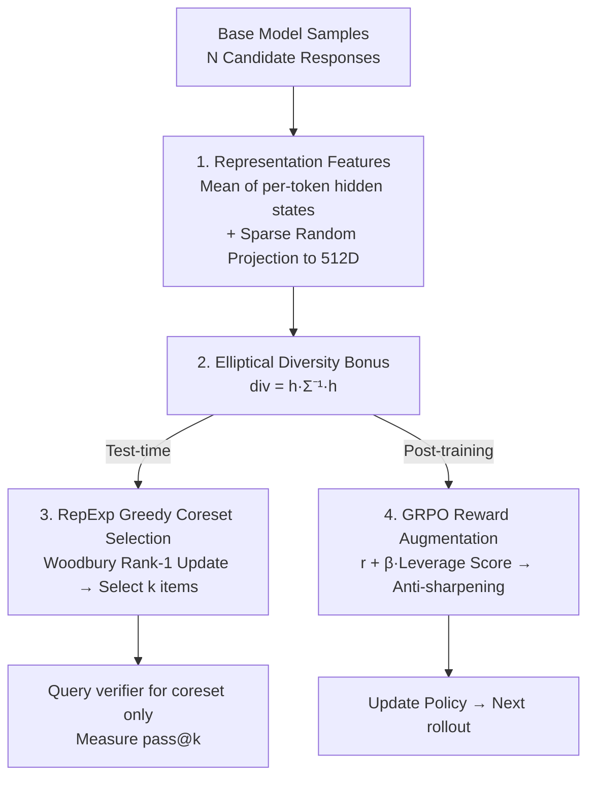

# Representation-Based Exploration for Language Models: From Test-Time to Post-Training

**Conference**: ICLR 2026  
**OpenReview**: [https://openreview.net/forum?id=S4PCF1YxoR](https://openreview.net/forum?id=S4PCF1YxoR)  
**Code**: https://rep-exp.github.io  
**Area**: Reinforcement Learning / LLM Reasoning  
**Keywords**: Exploration, Elliptical Bonus, Diversity, pass@k, GRPO

## TL;DR
Ours proposes RepExp: an "elliptical diversity bonus" constructed from a pretrained language model's own hidden states to explicitly incentivize exploration. It is first validated on a clean "test-time selection" testbed, then integrated into GRPO post-training. Results demonstrate a 50%+ improvement in verifier efficiency at test-time and the complete elimination of the common RL phenomenon where "pass@k collapses at large k" during post-training.

## Background & Motivation

**Background**: RL post-training with verifiable rewards (GRPO/PPO) has significantly enhanced the reasoning capabilities of language models in tasks like mathematics and code, becoming a mainstream practice.

**Limitations of Prior Work**: Increasing evidence (Yue et al. 2025, Gandhi et al. 2025) suggests that existing RL recipes act more like **sharpening**—they merely increase the probability of behaviors already present in the base model with low probability, rather than discovering truly novel behaviors. A direct symptom is "diversity collapse": after standard GRPO training, pass@1 increases, but performance at larger k (e.g., pass@256) becomes worse than the base model, indicating that the model concentrates probability mass on a few paths.

**Key Challenge**: To truly "discover new behaviors," explicit exploration is required. However, the decision space of language is combinatorically explosive. Traditional deep RL exploration techniques (count-based, curiosity, RND, posterior sampling) either do not scale to large spaces or require training auxiliary networks, which is overly complex for language models. How to **scalably quantify "novelty/diversity" and act upon it** in the vast language space remains an unsolved problem.

**Goal**: ① Can the knowledge within pretrained representations be used to guide the search for "new behaviors"? ② Can explicit exploration break the ceiling of "merely sharpening the base model"?

**Key Insight**: The authors observe that language model hidden states already encode a vast amount of prior knowledge—instead of learning an auxiliary network to measure novelty, it is better to directly use the model's own representations as features. Simultaneously, the authors propose a key methodological observation: since exploration effects are entangled with optimization and generalization in RL, it is difficult to evaluate them in isolation. Thus, exploration is first decoupled into a simple **test-time** setting for validation before being moved into post-training.

**Core Idea**: Adapt the mature **elliptical bonus** from linear bandits and active learning by using language model hidden states as d-dimensional features. Use $h^\top \Sigma^{-1} h$ to measure the novelty of a response relative to already selected ones, achieving scalable exploration at minimal cost without extra networks.

## Method

### Overall Architecture

The core of RepExp is a "diversity reward" $\mathrm{div}(x,y)$, applied in two settings. The authors adopt a **two-pronged** methodology: first validating the reward's effectiveness on a clean "test-time selection" testbed, then integrating the same reward into RL post-training. The underlying hypothesis is that "a diversity reward that performs well at test-time will also perform well in post-training."

- **Test-Time Selection (Testbed)**: For a prompt $x$, a large pool of candidates $y_1,\dots,y_N$ is first sampled from the base model. Then, an algorithm **without querying a verifier** identifies a subset (coreset) of $k$ items that are most "diverse and likely to contain the correct answer." Finally, the verifier is queried only for these $k$ items to measure pass@k. By excluding optimization and generalization, this setting isolates "diversity" as a variable for evaluation.
- **RL Post-Training**: The same elliptical bonus is added as an auxiliary reward term in GRPO to incentivize the model to produce mutually novel responses across rollouts.

Both settings share the same representations and reward, differing only in "usage": **selection** (coreset) for test-time and **reward augmentation** for post-training. The overall pipeline is as follows:

### Key Designs

**1. Test-Time Selection: A Clean Testbed for Decoupling Exploration**

The authors first address how to fairly evaluate whether a reward is truly effective. In full RL, exploration gains are confounded by optimization dynamics and generalization. Thus, the problem is simplified to a pure selection task: given a fixed strategy $\pi$ and prompt $x$, sample $N$ candidates, and select a subset $S$ of size $k$ using algorithm $\mathrm{Alg}$ to measure:

$$\mathbb{E}_{y_1,\dots,y_N\sim\pi(\cdot|x)}\Big[\mathbb{E}_{S\sim\mathrm{Alg}}\big[\max_{i\in S} r^\star(x,y_i)\big]\Big].$$

Crucially, the **selection algorithm does not query the verifier**. If it can retain high-quality answers in the coreset, it effectively increases verifier efficiency. This setting serves as a low-cost sandbox for reward validation and has independent value in scenarios where verifier queries are expensive.

**2. Representation-Driven Elliptical Diversity Bonus: Using Hidden States as Novelty Features**

To address the large language space and the limitations of traditional exploration, Ours uses the **elliptical bonus**—the gold standard in linear bandits—and utilizes the model's own representations as features. Given features $h_1,\dots,h_{i-1}$, the novelty of a new feature $h$ is defined as:

$$\mathrm{div}(h\mid h_{1:i-1}) = h^\top \Sigma_i^{-1} h,\qquad \Sigma_i = \lambda I_d + \sum_{j<i} h_j h_j^\top.$$

Theoretical foundations from linear regression state that the prediction error for $h$ is upper-bounded by $\mathrm{div}$. Thus, a larger $\mathrm{div}$ indicates $h$ is "not covered by existing data." For a response $y_i$ of length $T$, the feature is the **mean of the last-layer hidden states across all tokens** $\bar h_\theta(x,y_i)=\frac1T\sum_t h_\theta(x,y_i^{1:t})$, followed by sparse random projection to 512 dimensions. Ablations (Figure 4) show that "mean pooling" is $>2\times$ more sample-efficient than using only the last or second-to-last token.

**3. RepExp: Efficient Test-Time Algorithm with Greedy Selection and Rank-1 Updates**

RepExp (Algorithm 1) **iteratively and greedily picks** the candidate with the maximum current elliptical reward:

$$y_{t+1} = \arg\max_{y\in Y}\ \bar h_\theta(x,y)^\top \Lambda_t\, \bar h_\theta(x,y),$$

updating the inverse covariance $\Lambda_t=\Sigma_t^{-1}$ at each step. To avoid $O(d^3)$ matrix inversion, the Woodbury/Sherman–Morrison rank-one update reduces the complexity of each step to $O(d^2)$:

$$\Lambda_t = \Lambda_{t-1} - \frac{\Lambda_{t-1}\bar h_t \bar h_t^\top \Lambda_{t-1}}{1+\bar h_t^\top \Lambda_{t-1}\bar h_t}.$$

**4. GRPO Reward Augmentation: Counteracting Sharpening in Post-Training**

In post-training, the elliptical bonus is added directly to the GRPO reward. For a batch of $k$ rollouts, let $\Sigma=\lambda I+\sum_i \bar h_\theta(x,y_i)\bar h_\theta(x,y_i)^\top$. The reward for the $i$-th rollout is modified to:

$$r^\star(x,y_i) + \beta\cdot \bar h_\theta(x,y_i)^\top \Sigma^{-1}\bar h_\theta(x,y_i),$$

where the bonus term is in the form of a **leverage score**, bounded in $[0,1]$ for easier scale control. Engineering details include: the covariance $\Sigma$ is **reinitialized for each batch** (intra-group exploration), and **random projections are resampled** at each optimization step to maximize exploration across all relevant directions.

## Key Experimental Results

### Main Results

At test-time (Figure 1/5/6): Across 5 datasets (GSM8K/MATH/MBPP+/Game-of-24/AIME 2025) and multiple model families, RepExp's samples-to-correct mostly fall below the $y=x$ line (outperforming random sampling).

| Setting | Model / Task | Metric | Results |
|---------|--------------|--------|---------|
| Test-time | Qwen-2.5-14B / MATH, etc. | Verifier Efficiency | 50%+ Gain |
| Test-time (Pool) | Qwen-2.5-7B / MATH | vs. Random | 3×–6× Efficiency Gain (except for high-temp) |
| Post-training | Qwen-2.5-7B / AIME 2024 | Sample Efficiency | RepExp pass@80 ≈ GRPO pass@256 (3× Gain) |

Post-training pass@k (Figure 2, Sample efficiency relative to base model):

| Task | RepExp vs GRPO | RepExp vs Unlikeliness |
|------|----------------|------------------------|
| MATH | 4.1× | 2.1× |
| GSM8K | 13.4× | 3.0× |
| AIME 2024 | 3.2× | Outperforms at large k |

### Ablation Study

| Config | Key Finding | Description |
|--------|-------------|-------------|
| Features: Mean vs. Last Token | Mean Gain > 2× | Mean pool summarizes the full response better (Figure 4) |
| Model Strength | Strong models benefit; weak (0.5B) do not | RepExp depends on representation quality |
| Problem Difficulty | Harder problems → Higher Gain | Difficult tasks require more diverse exploration |
| Base Sampling Policy | Benefits all except high-temp | High-temp produces incoherent "fake novelty" |

### Key Findings

- **Anti-sharpening is the core value**: While standard GRPO suffers from diversity collapse at large k, RepExp almost completely eliminates this, maintaining or improving performance across all k.
- **Novelty is Quantifiably Validated** (Figure 8): Responses from RepExp show significantly lower log-likelihood under the base model than GRPO, proving it avoids simple sharpening.
- **Synergy with Strong Models and Hard Tasks**: Gains correlate positively with model strength and task difficulty.
- Token-level variant (Figure 7) serves as a proof-of-concept for beyond-inference exploration.

## Highlights & Insights

- The **"sandbox verification before RL" methodology** is highly transferable: decoupling exploration into a test-time selection task allows diversity rewards to be evaluated cheaply and in isolation.
- **Directly using latent states as exploration features** removes the need for auxiliary networks like RND, making elliptical bonuses essentially zero-cost and scalable.
- Using **leverage score rewards** to bound the bonus in $[0,1]$ solves the long-standing issue of exploration rewards being difficult to scale against ground-truth rewards.

## Limitations & Future Work

- Performance is capped by representation quality, making it less effective for very small models (e.g., 0.5B).
- Covariance resets per batch in post-training, meaning it lacks memory of global training history.
- Currently focused on **verifiable reward** domains (math/code); applying this to open domains while avoiding reward hacking remains an open challenge.
- Experiments focus on the "vanilla elliptical bonus"; integration with prolonged RL or more complex diversity measures is left for future work.

## Related Work & Insights

- **vs. Unlikeliness (He et al. 2025)**: Unlikeliness scales rewards based on the inverse probability of generation; RepExp explicitly measures diversity in representation space. RepExp shows more pronounced anti-sharpening (2.1×–4.1× gain at large k).
- **vs. Standard GRPO**: GRPO lacks explicit exploration and suffers from diversity collapse; RepExp maintains base model diversity.
- **vs. Traditional Deep RL**: Ours avoids the need for auxiliary networks and handles the combinatorically large language space using rank-one updates on existing representations.

## Rating
- Novelty: ⭐⭐⭐⭐ Combines elliptical bonus with LM representations and a test-time verification paradigm.
- Experimental Thoroughness: ⭐⭐⭐⭐ 5 tasks, multiple models, test-time and post-training; post-training scale is somewhat limited.
- Writing Quality: ⭐⭐⭐⭐⭐ Clear motivation, excellent framing of "sharpening vs. exploration."
- Value: ⭐⭐⭐⭐ High practical value for RL post-training and verifier efficiency.

<!-- RELATED:START -->

## Related Papers

- [\[ICLR 2026\] Post-training Large Language Models for Diverse High-Quality Responses](post-training_large_language_models_for_diverse_high-quality_responses.md)
- [\[ICLR 2026\] Spectral Bellman Method: Unifying Representation and Exploration in RL](spectral_bellman_method_unifying_representation_and_exploration_in_rl.md)
- [\[ICLR 2026\] Prompt Curriculum Learning for Efficient LLM Post-Training](prompt_curriculum_learning_for_efficient_llm_post-training.md)
- [\[ICLR 2026\] Thinking on the Fly: Test-Time Reasoning Enhancement via Latent Thought Policy Optimization](thinking_on_the_fly_test-time_reasoning_enhancement_via_latent_thought_policy_op.md)
- [\[ICLR 2026\] Using Reinforcement Learning to Train Large Language Models to Explain Human Decisions](using_reinforcement_learning_to_train_large_language_models_to_explain_human_dec.md)

<!-- RELATED:END -->
