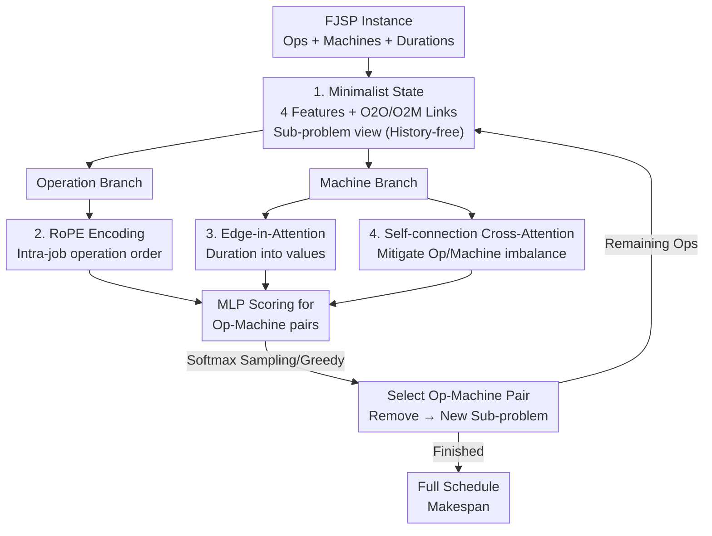

# RESCHED: Rethinking Flexible Job Shop Scheduling from a Transformer-based Architecture with Simplified States

**Conference**: ICLR 2026  
**OpenReview**: [https://openreview.net/forum?id=s5pWbwf2tk](https://openreview.net/forum?id=s5pWbwf2tk)  
**Code**: https://github.com/XiangjieXiao/ReSched  
**Area**: Reinforcement Learning / Combinatorial Optimization / Neural Scheduling  
**Keywords**: Flexible Job Shop Scheduling, Deep Reinforcement Learning, Transformer, Minimalist State, RoPE

## TL;DR
RESCHED reduces the state of Flexible Job Shop Scheduling (FJSP) from "20+ manual features + historical dependency" to just 4 core features. It pairs this with a dual-branch Transformer tailored for scheduling (using RoPE for operation ordering, embedding processing time as edge features into attention values, and employing self-connections to mitigate imbalances in operation/machine counts). Using only basic REINFORCE for training, it outperforms all scheduling rules and SOTA Graph Neural Network methods on FJSP, while generalizing to JSSP and FFSP variants with zero modifications.

## Background & Motivation
**Background**: FJSP is a classic combinatorial optimization problem commonly encountered in manufacturing, edge computing, and logistics. Each job is decomposed into a sequence of operations, and each operation can be processed by one machine chosen from a set of compatible machines, aiming to minimize the total completion time (makespan). Recent mainstream approaches use Deep Reinforcement Learning (DRL) to model scheduling as a "constructive" sequential decision process: representing the partial solution as a disjunctive graph with numerous manual features per node and learning a dispatching policy via Graph Attention Networks (GAT/GNN).

**Limitations of Prior Work**: This paradigm has become increasingly heavy. First, **over-engineering of states**: many methods stack over 20 manual features per node. The authors verified on DANIEL that "removing half of the input features results in no performance drop," indicating significant redundancy. Furthermore, embedding "historical construction information" into the current state hinders learning. Second, **relying on manual heuristics for action space pruning**: while intended to improve efficiency, this damages policy generalization, leads to sub-optimal convergence, and requires continuous tracking of auxiliary variables, incurring extra overhead. Third, **architectural over-reliance on GAT**: the inductive bias is too rigid. Stacking many layers is required for long-range dependencies, yet linear attention cannot express complex non-local scheduling interactions.

**Key Challenge**: The root cause is the assumption that "state information is insufficient, thus requiring complex features and strongly biased graph networks to compensate." However, if the state itself is Markov-sufficient, is such a heavy architectural bias necessary? In other words, there is a trade-off between state sufficiency and architectural complexity; prior works maximized both.

**Goal**: Design a minimalist constructive policy—compressing the state to the minimum while maintaining Markov sufficiency, using a general Transformer architecture, and naturally generalizing to various FJSP variants.

**Key Insight**: By re-evaluating "what information is actually needed to calculate makespan" from the MDP formulation, the authors found that only 4 features are required for state sufficiency. Given a sufficient state, GNNs can be replaced with more expressive general Transformers with three lightweight modifications for scheduling. REINFORCE is used for training to decouple the contributions of state/architecture design from the RL algorithm.

## Method

### Overall Architecture
RESCHED is a "constructive" neural scheduler: it views scheduling as a sequence of sub-problems, selecting an "operation-machine" pair from all feasible candidates at each step until completion. The process consists of two stages—first **simplifying the state** (deriving only 4 features + two types of graph links from the MDP), then using a **dual-branch Transformer for feature extraction + MLP scoring** as the policy network, optimized via REINFORCE. The key is that since each step only solves the "current sub-problem," scheduled operations and their links are removed from the graph, resulting in a smaller new sub-problem, thereby eliminating the need for historical tracking.

### Key Designs

**1. Minimalist State: 4 Markov-sufficient features derived from MDP**

Instead of empirical design, the authors trace the "minimum information required" from the completion time recursion. From $FT_{ij} = \max\big(FT_{i(j-1)}, AT^m_t\big) + D^m_{ij}$, calculating the completion time for operation $O_{ij}$ requires three elements: predecessor completion time ("operation available time"), the duration $D^m_{ij}$ on a specific machine, and that machine's available time $AT^m_t$. Based on this, Definition 4.1 and Proposition 1 state: as long as two construction trajectories reach the same state $S_t$, the set of feasible solutions for the remaining sub-problem is identical. Thus, optimal decisions depend only on the current state and not the historical trajectory, making scheduling a Markovian finite-state MDP.

Implementation-wise, the state is compressed into 4 features: ① operation available time, ② machine available time, ③ duration, and ④ minimum duration on candidate machines $\min_{m\in M_{ij}} D^m_{ij}$ (a compact proxy for operation difficulty). "Dependencies" and "machine compatibility" are expressed through O2O (Operation-to-Operation) and O2M (Operation-to-Machine) links. To completely eliminate history, the authors implement two things: **relative available time** (subtracting the global minimum available time at each step to prevent absolute time growth) and **backward + skip O2O edges** (in the sub-problem view, an operation only needs successor information, so standard bi-directional edges are changed to look backward only, with "skip connections" to all successors to capture job-level future constraints without multi-layer passing). This ensures the state is both minimal and sufficient, avoiding the maintenance of auxiliary variables like free time.

**2. RoPE Encoding: Order-awareness in Transformers without extra parameters**

Switching to Transformers introduces a challenge: self-attention is order-agnostic, yet operation sequence (O2O dependency) is critical. RESCHED introduces Rotary Positional Encoding (RoPE) in the **operation branch** so the similarity between query $q_a$ and key $k_b$ depends on their relative position $a-b$: $\langle \mathrm{RoPE}_q(x_a,a), \mathrm{RoPE}_k(x_b,b)\rangle = g(x_a, x_b, a-b)$. RoPE characterizes relative distances within a job without adding learnable parameters. It is **only used in the operation branch** because relative positions are meaningless across different jobs or machines.

**3. Edge-in-Attention: Embedding durations directly into values**

The interaction between operations and machines is defined by "processing duration," which is an edge feature. The **machine branch** uses cross-attention for operations to attend to candidate machines. Unlike previous methods that indirectly add edge features to attention scores, this method embeds edge information **directly into the value vector**:

$$\mathrm{Attention}(M_m, O_{ij}) = \sigma\!\left(\frac{(q_m + q_{m,ij})^\top (k_{ij} + k_{m,ij})}{\sqrt{d}}\right)\cdot (v_{ij} + v_{m,ij})$$

where $q_{m,ij}, k_{m,ij}, v_{m,ij}$ are projected from duration $D^m_{ij}$. To keep memory usage low, projection weights are shared across attention heads and between q/k/v. This allows edge features to participate directly in aggregation rather than just acting as weights.

**4. Self-connection Cross-attention: Handling operation-machine count imbalance**

In scheduling, operations often outnumber machines by 10x or more. This asymmetry can drown out machine-specific information during aggregation. The authors introduce "self-connection" in cross-attention—letting each machine node **attend to itself**: $h'_m = \alpha_{mm} v_m + \sum_{(ij)\in N(M_m)} \alpha_{ij} v_{ij}$. While residual connections add self-information fixedly, self-connection allows the model to assign a soft, adaptive weight to the machine’s own embedding, preserving machine-level features against the influx of operation messages.

### Loss & Training
Rewards are defined by the change in the "estimated lower bound makespan" (similar to L2D). The lower bound completion time is calculated as $\overline{FT}_{ij} = \overline{FT}_{i(j-1)} + \min_{m} D^m_{ij}$, leading to a global lower bound $\overline{FT}_{\max}$. The reward is $r_t = -(\overline{FT}_{\max}(s_{t+1}) - \overline{FT}_{\max}(s_t))$. The decision module concatenates operation/machine/edge embeddings for each feasible pair and scores them via an MLP to get an action distribution. Optimization uses the most basic REINFORCE without global embeddings or heuristic pruning, isolating the contributions of design from complex RL tricks.

## Key Experimental Results

### Main Results
Training was performed on small instances (e.g., JSSP 10×10, FFSP 20×12), and evaluation on larger scales and standard benchmarks (Brandimarte/Hurink for FJSP, Taillard/DMU for JSSP). The metric is Gap (relative difference to lower bound/optimum). RESCHED won in 14 out of 16 in-distribution settings.

| Dataset | Scale | DANIEL (Greedy) | RESCHED (Greedy) | DANIEL (Sampling) | RESCHED (Sampling) |
|---------|-------|-----------------|------------------|-------------------|--------------------|
| SD1 | 15×10 | 12.42 | **6.51** | 6.79 | **3.09** |
| SD1 | 20×10 | 1.31 | **0.48** | -1.03 | **-1.55** |
| SD2 | 10×5 | 25.68 | **16.36** | 12.57 | **6.39** |
| SD2 | 15×10 | 57.16 | **18.14** | 38.70 | **9.81** |
| SD2 | 20×10 | 31.58 | **14.18** | 19.13 | **7.90** |

(Values in Gap%↓). The advantage is most significant in the harder SD2 cases; for 15×10, the greedy Gap dropped from DANIEL's 57.16 to 18.14. Negative gaps (e.g., -1.55) indicate sampling results better than the reference lower bound.

### Ablation Study

| Setting | Description | Result |
|---------|-------------|--------|
| Large-scale OOD FJSP | Train 10×5/20×10, Test 30×10/40×10 | 30×10 Greedy Gap 3.49 vs DANIEL 4.43 |
| JSSP | Train on 10×10 only | Competitive with L2D/RL-GNN |
| FFSP | Train on 20×12 only | Competitive with specialized MatNet |

### Key Findings
- **State sufficiency precedes architectural complexity**: With a Markov-sufficient state, a tweaked general Transformer is sufficient without heavy graph inductive biases.
- **History is harmful**: Including historical construction data in the state drags down learning (Section 4.1.2), whereas a sub-problem perspective improves generalization.
- **Feature redundancy**: Dropping half of DANIEL's features and removing global embeddings does not hurt performance, supporting the "minimalist state" hypothesis.
- **Cross-variant generalization**: Training on small samples allows migration to larger scales and other variants (JSSP/FFSP).

## Highlights & Insights
- **Deriving states from formulas**: Instead of empirical feature engineering, the authors prove Markov sufficiency from the makespan recursion. This "prove sufficiency, remove redundancy" approach is more rigorous than empirical pruning.
- **Edge-in-Value Attention**: A small but correct change—previous works added edge info to scores (affecting "who to attend to"), but embedding into values affects both "who to attend to" and "what is aggregated," which is more suitable for physical quantities like duration.
- **Self-connection vs. Residual**: The distinction that residuals are fixed while self-connections are learned/soft helps preserve machine identity in highly imbalanced many-to-one aggregations.
- **Deliberate use of REINFORCE**: Using the weakest optimizer to prove that gains come from design rather than RL engineering is a commendable research practice.

## Limitations & Future Work
- **Reward dependency on lower bounds**: Reward signals rely on the tightness of lower bound estimates; loose bounds may provide less informative signals.
- **Sensitivity of minimum duration features**: The $\min_m D^m_{ij}$ feature depends on the candidate set and lacks strong theoretical guarantees beyond empirical effectiveness.
- **REINFORCE high variance**: While useful for controlled experiments, REINFORCE has high variance and might not represent the performance ceiling (PPO results in the appendix suggest further gains).
- **Single objective**: The study focuses only on makespan, lacking multi-objective considerations (energy, tardiness, load balance) common in industry.

## Related Work & Insights
- **vs. HGNN/DANIEL/DOAGNN (Graph-based)**: These follow a "heavy features + heterogeneous GNN + heuristic pruning" route. RESCHED shows that simpler states and Transformers can achieve better generalization.
- **vs. L2D (JSSP DRL)**: RESCHED adopts L2D's rewards but simplifies the state and architecture for a unified framework across JSSP/FFSP/FJSP.
- **vs. MatNet (FFSP Attention)**: RESCHED competes with specialized FFSP models using a general framework with single-scale training.
- **vs. Lee & Kim (2024)**: RESCHED generalizes history-free relative time principles beyond JSSP to all FJSP variants.

## Rating
- Novelty: ⭐⭐⭐⭐⭐ The "subtractive Innovation" from formula-derived minimal states is a refreshing direction for combinatorial optimization.
- Experimental Thoroughness: ⭐⭐⭐⭐⭐ Covers in-dist/OOD, three variants, and multiple baselines with solid ablations.
- Writing Quality: ⭐⭐⭐⭐ Clear motivation and derivations, though some symbols (RoPE, projection sharing) require the appendix for full clarity.
- Value: ⭐⭐⭐⭐⭐ Provides a "state first, architecture second" paradigm for neural scheduling with clear industrial deployment potential.

<!-- RELATED:START -->

## Related Papers

- [\[NeurIPS 2025\] Learning Memory-Enhanced Improvement Heuristics for Flexible Job Shop Scheduling](../../NeurIPS2025/reinforcement_learning/learning_memory-enhanced_improvement_heuristics_for_flexible_job_shop_scheduling.md)
- [\[ICLR 2026\] STAIRS-Former: Spatio-Temporal Attention with Interleaved Recursive Structure Transformer for Offline Multi-Task Multi-Agent Reinforcement Learning](stairs-former_spatio-temporal_attention_with_interleaved_recursive_structure_tra.md)
- [\[ICLR 2026\] Task Tokens: A Flexible Approach to Adapting Behavior Foundation Models](task_tokens_a_flexible_approach_to_adapting_behavior_foundation_models.md)
- [\[ICLR 2026\] Flowing Through States: Neural ODE Regularization for Reinforcement Learning](flowing_through_states_neural_ode_regularization_for_reinforcement_learning.md)
- [\[ICLR 2026\] Scheduling Your LLM Reinforcement Learning with Reasoning Trees](scheduling_your_llm_reinforcement_learning_with_reasoning_trees.md)

<!-- RELATED:END -->
