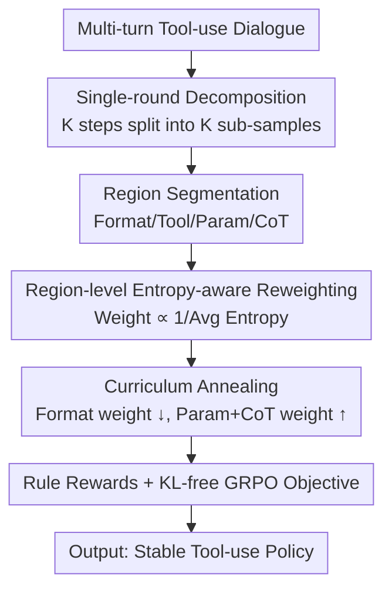

# ResT: Reshaping Token-Level Policy Gradients for Tool-Use Large Language Models

**Conference**: ICLR 2026  
**OpenReview**: [https://openreview.net/forum?id=gNZlaKRWki](https://openreview.net/forum?id=gNZlaKRWki)  
**Code**: https://github.com/1229095296/ResT_Tool_use_LLM  
**Area**: Alignment RLHF / LLM Agent / Reinforcement Learning  
**Keywords**: Tool-use, Policy Gradient, Token-level Reweighting, Entropy-aware, Curriculum Learning

## TL;DR
ResT targets RL training for tool-use LLMs. It theoretically proves that "low-entropy structured tokens (tool names, parameters, format tags) are the primary determinants of rewards, and reducing average entropy minimizes policy gradient variance." Based on this, it proposes inverse reweighting of token-level policy gradients by regional average entropy and employs curriculum annealing to transition weights from "format correctness" to "semantic reasoning." It achieves up to an 8.76% improvement over GRPO on BFCL/API-Bank, with the 4B model outperforming GPT-4o by 1.50% on multi-turn base tasks.

## Background & Motivation
**Background**: Training LLMs as agents capable of calling external tools relies on post-training methods like SFT and RL. RL (especially critic-free variants like GRPO) offers better generalization and robustness. Most approaches provide a single outcome reward after a multi-turn tool-use session.

**Limitations of Prior Work**: Pure outcome rewards suffer from two major issues in tool-use. First, rewards are inherently noisy—many tool tasks (e.g., recommendations) have multiple valid outputs without a unique reference, leading outcome rewards to induce high-variance gradients while failing to incentivize intermediate reasoning, even with LLM-as-a-judge. Second, multi-round interaction systems incur high overhead, low throughput, and uncertain horizons, making tool RL significantly heavier than SFT or single-turn RL.

**Key Challenge**: The success or failure of a tool call often depends on a few critical tokens (tool name, parameters, output format), yet standard RL distributes reward signals **uniformly** across all tokens in a sequence. This uniform treatment dilutes sparse but decisive signals, which is particularly fatal for GRPO without a token-level critic—reasoning and idle tokens contribute little in early training but receive equal gradient weights as critical tokens.

**Goal**: (1) Identify which tokens dominate rewards and why emphasizing them stabilizes training; (2) Design a lightweight mechanism to assign appropriate gradient weights to each token that adjusts dynamically as training progresses.

**Key Insight**: The authors approach this through the lens of "Policy Entropy $\leftrightarrow$ Training Stability." The intuition is that structured control tokens (tool names/formats) are naturally low-entropy (the model is certain about the output), while open-ended CoT (Chain-of-Thought) tokens are high-entropy. Quantifying this entropy difference as a variance contribution can guide the assignment of gradient weights.

**Core Idea**: Reshape policy gradients inversely proportional to the average entropy of token regions—assigning high weights to low-entropy structural tokens and low weights to high-entropy reasoning tokens—while using curriculum learning to shift focus from structural correctness to semantic reasoning over time.

## Method

### Overall Architecture
ReseT addresses the issue of "uniform reward dilution" in tool-use RL. The approach involves decomposing multi-round tasks into **single-round dense supervision**, applying **gradient reweighting** based on the average entropy of token regions within a round, and utilizing **curriculum annealing** to evolve weight assignments across training stages, all optimized within a KL-free GRPO objective.

The pipeline is as follows: input a multi-turn tool-use dialogue $\rightarrow$ decompose into $K$ single-turn sub-samples (each seeing the full history and supervising the current action) $\rightarrow$ segment generated responses into four regions: "Format Tags / Tool Name / Parameters / CoT" $\rightarrow$ assign initial weights inversely proportional to the average entropy of each region $\rightarrow$ dynamically adjust weights via curriculum annealing $\rightarrow$ multiply normalized weights into the token-level policy gradient using a KL-free GRPO objective $\rightarrow$ output a stable tool-calling policy. The "Entropy-Variance" theory provides the foundation for this mechanism.

### Key Designs

**1. Entropy-Variance Theory: Proving Low-Entropy Tokens Dominate Rewards**

This serves as the foundation, justifying the bias toward structural tokens. The authors decompose the policy gradient variance: Lemma 1 gives the variance scaling law for mini-batch estimation $\mathrm{Var}(\widehat{\nabla J}^{(k)}) = \frac{1}{G}\mathrm{Var}(g_i^{(k)})$. Lemma 2 links the second moment of single-trajectory gradients to token entropy, where the core inequality shows the score norm is controlled by entropy: $\mathbb{E}[\lVert s_t\rVert^2] = 1 - \sum_v p_{t,v}^2 \le 1 - e^{-H_t}$, where $H_t = -\sum_v p_{t,v}\log p_{t,v}$ is the Shannon entropy. This indicates that higher entropy results in higher variance contribution.

Following this, the authors derive the variance upper bound for the reweighted estimator $g_i^{(rw)} = \big(\sum_t \tilde w_t \nabla_\theta \log\pi_\theta\big)\hat A_i$ (under the constraint $\sum_t \tilde w_t = T$) in Theorem 1: $\mathrm{Var}(g_i^{(rw)}) \le \mathbb{E}[\hat A_i^2]\sum_t \beta_t(\tilde w_t)^2$, where $\beta_t = \mathbb{E}[\lVert J_t\rVert_F^2(1-e^{-H_t})]$ combines the Jacobian norm and token entropy into a variance coefficient for step $t$. Minimizing this bound yields the optimal closed-form weights (Theorem 2): $\tilde w_t^\star = \frac{T}{\sum_u \beta_u^{-1}}\cdot\frac{1}{\beta_t}$—effectively downweighting high-variance (high-entropy) positions. This theoretically justifies the bias toward low-entropy tokens as a variance reduction scheme while maintaining unbiased estimation.

**2. Region-level Entropy-aware Reweighting: Scalable Entropy Proxies**

A practical challenge is that $\beta_t$ in Theorem 2 depends on variance terms that are difficult to estimate reliably during large-scale training. The authors use token-level entropy as a proxy for $\beta_t$, approximating the closed-form solution with simple rules: $\tilde w_t \propto \frac{1}{1-e^{-H_{avg}}}$ or $\tilde w_t \propto \frac{1}{H_{avg}}$.

Critically, $H_{avg}$ is calculated per **region** rather than per token. The trajectory is segmented into format tags, tool names, parameters, and CoT. Each region uses its average entropy as a shared variance proxy. Consequently, open-ended CoT (high entropy) naturally receives lower weight, while structured tool names/formats (low entropy) receive higher weights. Finally, intra-sequence normalization is applied: $\bar w = \frac{1}{|T|}\sum_t \hat w_t$, $w_t = \frac{\hat w_t}{\bar w + \delta}$ to redistribute weights without altering the overall scale.

**3. Curriculum Annealing: From Structural Correctness to Semantic Reasoning**

Static weights are insufficient. An ideal tool RL process should first master format compliance, then parameter precision, and finally complex reasoning. ResT internalizes this via annealing driven by training progress $\nu\in(0,1)$.

Specifically, tool names maintain a high weight throughout. Format weights **decay** with progress, while parameter and CoT weights **increase**: $\tilde w_{t,fmt}(\nu) = \max(w_{min}, \tilde w_{t,fmt} - \alpha_f\nu)$, $\tilde w_{t,para}(\nu) = \min(w_{max}, \tilde w_{t,para} + \alpha_p\nu)$, and the CoT weight grows synchronously with parameters $\tilde w_{t,thk}(\nu) = \min(w_{max}, \tilde w_{t,thk} + \alpha_t\nu)$. This ensures "correct syntax" early on and invests in "correct semantics" later, stabilizing convergence.

**4. Rule Rewards + KL-free GRPO Objective: Dense, Low-variance Rewards**

Tool calling requires dense, interpretable rewards. ResT uses rule-based rewards rather than learned reward models. Total reward is a weighted sum of format and accuracy scores: Format score $S_{format}$ uses exact-match (1 only if all required fields are present and ordered). Accuracy score $S_{acc}$ comprises three parts: tool name using Jaccard similarity $r_{name} = \frac{|N_G\cap N_P|}{|N_G\cup N_P|}$, parameter names using Jaccard, and parameter values using exact-match. The final reward is scaled by a factor $(1-\bar\nu)$ for dynamic scaling.

The optimization objective integrates the reweighting factor $\omega_t$ into GRPO: $L_{ResT}(\theta) = -\frac{1}{G}\sum_i\sum_t \frac{\omega_t}{T}\min\big(r_{i,t}\hat A_i, \mathrm{clip}(r_{i,t}, 1-\epsilon, 1+\epsilon)\hat A_i\big)$, where $r_{i,t}$ is the ratio of new to old policy probabilities, and advantage $\hat A_i$ is normalized within the group. Notably, ResT **removes the KL penalty from GRPO**, relying instead on the combination of entropy-aware reweighting, clipping, and curriculum annealing to regulate the exploration/exploitation trade-off.

### Loss & Training
Training utilizes the verl 0.5.0 framework with a mixture of ToolACE (learning "when to call vs. answer"), Hammer-masked (randomizing tool/parameter names to force generalization via descriptions), and XLAM (combinatorial tasks). Multi-turn dialogues are decomposed into single-step instances via the SWiRL method, transforming final outcome rewards into step-wise process supervision to significantly increase training signal density.

## Key Experimental Results

### Main Results
Qwen3 series (1.7B/4B/8B/14B) models were fine-tuned on BFCL Multi-turn and API-Bank, compared against base, SFT, TSFT (tool-weighted SFT), RSFT (reasoning-weighted SFT), GRPO, SFT+GRPO, and Dr.GRPO.

| Benchmark / Model | Metric | ResT | Strongest Baseline | Note |
|--------|------|------|----------|------|
| BFCL Multi-turn (Qwen3-4B-2507) | Overall Acc | 50.38% | 48.62% (Dr.GRPO) | Multi-turn base: 62.50% |
| BFCL Multi-turn (Qwen3-14B) | Overall Acc | 44.25% | 38.88% (GRPO) | +5.37% over GRPO |
| BFCL Multi-turn (Qwen3-8B) | Overall Acc | 40.13% | 38.12% (Dr.GRPO) | base 50.50% |
| API-Bank (Qwen3-8B) | Overall Acc | 70.69% | 68.15% (Dr.GRPO) | Level 3 reached 60.31% |
| GPT-4o-2024-11-20 (Ref) | BFCL Overall | 50.00% | — | ResT-4B exceeds it by 1.50% on multi-turn base |

Overall, ResT improves upon GRPO by up to 8.76% (BFCL) and 3.02% (API-Bank). Qwen3-4B-2507 outperforms GPT-4o by 1.50% on multi-turn base tasks and by 4.11% on single-turn tasks.

### Ablation Study

| Config (Qwen3-8B, API-Bank) | Overall Acc | Explanation |
|------|---------|------|
| Full ResT | 70.69% | Complete model |
| w/o Dynamic Reward | 64.15% | Removed reward scaling (-6.54%) |
| w/o CoT Gradient | 66.33% | CoT excluded from gradient (-4.36%) |
| w/o Curriculum Learning | 65.83% | Constant weights per region (-4.86%) |

### Key Findings
- All three components (dynamic rewards, CoT gradients, curriculum learning) are essential. Removing dynamic rewards caused the largest drop (-6.54% on 8B), highlighting the importance of scaling rewards by progress.
- Curriculum annealing improved performance by up to 4.86% over static weights, validating the "structure-then-semantics" progression.
- ResT showed significant gains in API-Bank Level 3 (complex multi-turn calls), suggesting entropy-aware reweighting is highly beneficial for long-horizon, high-precision scenarios.
- Removal of the KL penalty did not compromise stability, as the weight reshaping and curriculum mechanisms effectively replaced its regularization role.

## Highlights & Insights
- The empirical problem of "which tokens to weight" is transformed into a provable variance reduction chain (Lemma 1 $\rightarrow$ Lemma 2 $\rightarrow$ Theorem 1 $\rightarrow$ Theorem 2). The transition from theoretical optimality to a practical entropy proxy is a clean bridge between theory and engineering.
- "Region-level" entropy instead of "per-token" calculation is a key engineering choice: the four semantic regions align with the tool-calling structure, saving compute while matching the intuition that structural tokens require higher weight.
- Curriculum annealing encodes the "training phase" into weights, a concept transferable to any structured generation task requiring syntax-before-semantics (e.g., Code or SQL generation).
- The fact that training remains stable without KL suggests that fine-grained token-level signal management can partially substitute for sequence-level KL constraints in GRPO-like methods.

## Limitations & Future Work
- The method relies heavily on the ability to clearly segment responses into the four regions; this holds for structured tool-use but may be challenging for free-form text tasks where boundaries are fuzzy.
- The entropy proxy is an approximation of optimal $\beta_t$; the paper does not quantify the gap between the proxy and reality, which could be unreliable under extreme distributions.
- Experiments are focused on the Qwen3 series and two tool benchmarks; generalization across model families and more open API environments requires further validation.
- Curriculum annealing introduces several hyperparameters ($\alpha_f, \alpha_p, \alpha_t, w_{min}, w_{max}$), and performance appears sensitive to their tuning.

## Related Work & Insights
- **vs ToolRL (Qian et al., 2025)**: Both decompose multi-turn calls into single rounds and use rule-based rewards. However, ToolRL treats all tokens uniformly, whereas ResT reshapes gradients at the token level via regional entropy and curriculum annealing.
- **vs Dr.GRPO**: Dr.GRPO addresses bias from the perspective of advantage normalization, making sequence-level changes. ResT is orthogonal, focusing on token-level reweighting, and outperformed Dr.GRPO in experiments.
- **vs Token-level RLHF (TLCR / TLDR)**: These methods explicitly construct token-level rewards or critics, often requiring heavy labeling or extra models. ResT is more lightweight, utilizing existing entropy signals.
- **vs Curriculum RL (E2H Reasoner)**: Classic curriculum RL orders samples by difficulty; ResT implements an "implicit curriculum" at the level of token region weights.

## Rating
- Novelty: ⭐⭐⭐⭐⭐ Maps entropy-variance theory to regional gradient reshaping with curriculum learning.
- Experimental Thoroughness: ⭐⭐⭐⭐ Covers 4 model scales and 2 benchmarks, though limited to Qwen3.
- Writing Quality: ⭐⭐⭐⭐ Clear theoretical derivation and progressive motivation.
- Value: ⭐⭐⭐⭐ Provides a stable, rule-based training solution for tool-use RL without extra reward models.

<!-- RELATED:START -->

<!-- Paper links would go here -->

<!-- RELATED:END -->

## Related Papers

- [\[ICLR 2026\] ReTool: Reinforcement Learning for Strategic Tool Use in LLMs](retool_reinforcement_learning_for_strategic_tool_use_in_llms.md)
- [\[ICLR 2026\] AutoTool: Automatic Scaling of Tool-Use Capabilities in RL via Decoupled Entropy Constraints](autotool_automatic_scaling_of_tool-use_capabilities_in_rl_via_decoupled_entropy_.md)
- [\[ICLR 2026\] SPG: Sandwiched Policy Gradient for Masked Diffusion Language Models](spg_sandwiched_policy_gradient_for_masked_diffusion_language_models.md)
- [\[ICLR 2026\] Does “Do Differentiable Simulators Give Better Policy Gradients?” Give Better Policy Gradients?](does_do_differentiable_simulators_give_better_policy_gradients_give_better_polic.md)
- [\[ICLR 2026\] On Predictability of Reinforcement Learning Dynamics for Large Language Models](on_predictability_of_reinforcement_learning_dynamics_for_large_language_models.md)

<!-- RELATED:END -->
