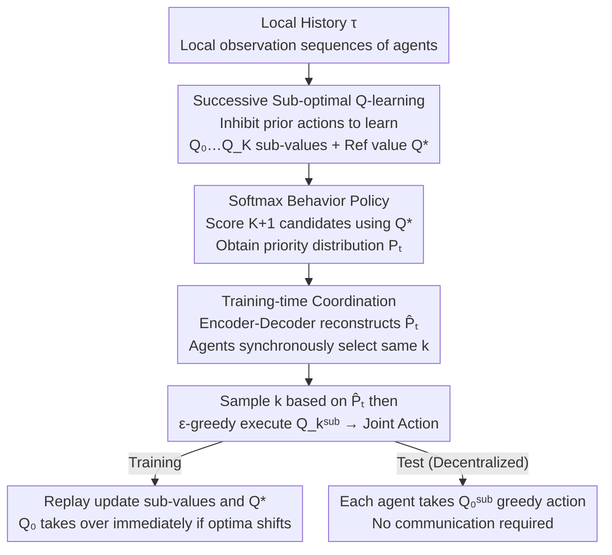

# Retaining Suboptimal Actions to Follow Shifting Optima in Multi-Agent RL

**Conference**: ICLR 2026  
**arXiv**: [2602.17062](https://arxiv.org/abs/2602.17062)  
**Code**: [GitHub](https://github.com/hyeon1996/S2Q)  
**Area**: Reinforcement Learning  
**Keywords**: Multi-Agent RL, Value Decomposition, Suboptimal Action Retention, Softmax Behavior Policy, S2Q, CTDE

## TL;DR

Ours proposes S2Q (Successive Sub-value Q-learning), which explicitly retains suboptimal joint actions by progressively learning $K$ sub-value functions. Combined with a Softmax behavior policy for prioritized sampling among candidates, it addresses the fundamental issue in cooperative MARL where value decomposition methods converge to suboptimal policies due to dynamic shifts in the optimal point.

## Background & Motivation

**Background**: Under the Centralized Training and Decentralized Execution (CTDE) paradigm, value decomposition methods (e.g., QMIX) are the mainstream framework for cooperative MARL. QMIX satisfies the IGM (Individual-Global-Max) condition through monotonicity constraints, ensuring that maximizing individual utilities does not decrease the joint value function. WQMIX introduces an unconstrained objective $Q^*$ to alleviate monotonicity restrictions but still focuses on a single optimal action.

**Limitations of Prior Work**:
- The monotonicity constraint of QMIX limits the expressiveness of the joint value function $Q^{\text{tot}}$, making it unable to represent non-monotonic value structures.
- Although WQMIX improves value estimation by introducing the unconstrained $Q^*$, it still only tracks a single optimal joint action.
- When the **optimal action shifts** due to exploration updating value estimates during training, information about previously discarded high-value alternative actions cannot be recovered.
- The joint exploration probability of $\epsilon$-greedy in large joint action spaces decays exponentially: for $N$ agents each with $|\mathcal{A}|$ actions, the joint exploration probability $\propto \epsilon^N$.

**Key Challenge**: Existing methods discard suboptimal action information after use. Once the value landscape changes such that a previous suboptimal action becomes optimal, the learner cannot adapt quickly. This is clearly verified in payoff matrix experiments—after the optimum shifts from $(A,A)$ to $(C,C)$, both QMIX and WQMIX fail to track the new optimum.

**Goal**: Explicitly retain the value functions of $K$ suboptimal actions. When the optimum changes, the corresponding sub-value functions can be immediately utilized to guide $Q^{\text{tot}}$ for adaptation. A Softmax behavior policy replaces $\epsilon$-greedy to achieve more efficient directed exploration.

## Method

### Overall Architecture

In cooperative MARL, value decomposition methods (e.g., QMIX/WQMIX) focus only on a single optimal joint action. Once the value landscape changes during training and the original optimal point shifts, previously discarded alternative high-value actions cannot be retrieved. S2Q is built upon WQMIX. The core idea is to expand the "optimal action" into a prioritized set of candidates: localized histories of each agent are first fed into the **Successive Sub-optimal Q-learning** module to simultaneously learn a set of sub-value functions—$Q_0^{\text{sub}} := Q^{\text{tot}}$ tracks the current optimum, $Q_1^{\text{sub}}, \dots, Q_K^{\text{sub}}$ sequentially lock onto the 1st to $K$-th suboptimal joint actions, plus an unconstrained reference value $Q^*$ (following WQMIX). Subsequently, the **Softmax Behavior Policy** uses $Q^*$ to score these $K{+}1$ candidates, obtaining a priority distribution $\mathbf{P}_t$. Since the distribution depends on global information and all agents must select the same candidate for joint execution, **Communication Coordination during training** uses an Encoder-Decoder to reconstruct an approximate distribution $\hat{\mathbf{P}}_t$. This allows all agents to synchronously sample the same index $k$, and then individually execute $Q_k^{\text{sub}}$ using $\epsilon$-greedy to form a joint action. During training, these experiences are reused to update all sub-value functions and $Q^*$. When the optimal point shifts, the corresponding sub-value function has already stored the alternative action and can immediately take over to guide $Q^{\text{tot}}$ adaptation. During testing, execution is fully decentralized; each agent takes the greedy action from $Q_0^{\text{sub}}$ without any communication.

### Key Designs

**1. Successive Sub-optimal Q-learning: Locking each sub-value to the remaining optimum after "masking" previous ones**

To make $K$ functions learn non-overlapping suboptimal actions, the difficulty lies in excluding actions "already occupied by other functions." S2Q constructs TD objectives sequentially: when learning $Q_k^{\text{sub}}$, a negative inhibition term is applied to the previously identified $k-1$ actions in the target, lowering their estimated values. Consequently, the argmax of $Q_k^{\text{sub}}$ naturally falls on the next optimum after excluding identified actions. The loss is:

$$\mathcal{L}_k = \mathbb{E}\left[w_k \left(Q_k^{\text{sub}} - \left(y_t - \alpha \cdot \mathbb{I}(\mathbf{a}_t \in \mathcal{A}_{k-1,t}) \cdot \max(Q_{\text{targ}}^*, C)\right)\right)^2\right]$$

Where $\mathcal{A}_{k,t} = \{\mathbf{a}_{0,t}^*, \dots, \mathbf{a}_{k,t}^*\}$ is the set of the first $k$ identified actions, the indicator function $\mathbb{I}(\mathbf{a}_t \in \mathcal{A}_{k-1,t})$ ensures inhibition only affects these actions, $\alpha$ controls the inhibition strength, and $\max(\cdot, C)$ ($C>0$) handles cases where $Q_{\text{targ}}^*$ might be negative. All sub-value functions share the monotonic mixing architecture of QMIX to satisfy the IGM condition. Theorem 4.1 in the paper provides correctness guarantees: as long as rewards are bounded and $\alpha$ is large enough, $\mathbf{a}_{k,t}^* = \arg\max_{\mathbf{a}} Q_k^{\text{sub}}(s_t, \boldsymbol{\tau}_t, \mathbf{a}_t)$ accurately corresponds to the $k$-th suboptimal joint action of $Q^*$. This step explicitly retains the suboptimal info that was previously discarded.

**2. Softmax Behavior Policy: Spending exploration budget on promising candidates rather than uniform random noise**

Simply storing suboptimal actions is not enough—they must be executed for $Q^*$ to converge globally. However, the joint exploration probability of $\epsilon$-greedy in large joint action spaces decays exponentially as $\propto \epsilon^N$. S2Q instead uses $Q^*$ estimates to score the $K+1$ candidates and constructs a Softmax distribution:

$$\mathbf{P}_t = \text{Softmax}\left(\frac{Q^*(s_t, \boldsymbol{\tau}_t, \mathbf{a}_{0,t}^*)}{T}, \dots, \frac{Q^*(s_t, \boldsymbol{\tau}_t, \mathbf{a}_{K,t}^*)}{T}\right)$$

During execution, an index $k$ is sampled according to $\mathbf{P}_t$, and then the action corresponding to $Q_k^{\text{sub}}$ is executed via $\epsilon$-greedy. The temperature $T$ adjusts the exploration-exploitation trade-off ($T=0.1$ is found to be optimal). This ensures exploration is directed around high-potential suboptimal actions, allowing $Q^*$ to discover better optimal/suboptimal solutions faster than uniform random sampling.

**3. Training-time Coordination: Ensuring agents synchronously select the same candidate**

The aforementioned Softmax distribution $\mathbf{P}_t$ relies on global info. Under decentralized execution, each agent only sees its local history, and consistency only occurs if all agents select the same index $k$. S2Q adopts an Encoder-Decoder structure: the Encoder $E$ compresses each agent's local history into a latent representation $z_t = E(\boldsymbol{\tau}_t)$, and the Decoder $D$ reconstructs the global state and approximate distribution $(\hat{s}_t, \hat{\mathbf{P}}_t) = D(z_t)$. This coordination is only used during training. At test time, agents are fully decentralized, taking local greedy actions from $Q_0^{\text{sub}} = Q^{\text{tot}}$ without message passing.

## Key Experimental Results

### Main Results: SMAC-Hard+ and GRF

| Environment | QMIX | WQMIX | DOP | PAC | RiskQ | MARR | MASIA | **S2Q** |
|------|------|-------|-----|-----|-------|------|-------|---------|
| 5m_vs_6m | ~85% | ~88% | ~82% | ~90% | ~87% | ~90% | ~84% | **~93%** |
| MMM2 | ~75% | ~80% | ~70% | ~82% | ~78% | ~83% | ~76% | **~88%** |
| 27m_vs_30m | ~60% | ~65% | ~55% | ~68% | ~62% | ~70% | ~58% | **~78%** |
| corridor | ~40% | ~50% | ~35% | ~55% | ~45% | ~58% | ~42% | **~68%** |
| 6h_vs_8z | ~30% | ~40% | ~25% | ~45% | ~35% | ~48% | ~32% | **~65%** |
| 3s5z_vs_3s6z | ~50% | ~55% | ~40% | ~60% | ~52% | ~62% | ~48% | **~72%** |
| **Avg Win Rate** | 43.94% | - | - | - | - | - | - | **73.43%** |
| academy_3_vs_2 | ~40% | ~45% | ~30% | ~48% | ~42% | ~50% | ~38% | **~60%** |
| academy_4_vs_3 | ~25% | ~30% | ~20% | ~35% | ~28% | ~38% | ~22% | **~50%** |

S2Q consistently outperforms baselines across all environments, with the advantage being most significant in exploration-heavy scenarios (6h_vs_8z, 3s5z_vs_3s6z).

### Ablation Study

| Method | Avg Win Rate (SMAC-Hard+) |
|------|--------------------------|
| **S2Q** | **73.43 ± 5.29** |
| S2Q_oracle (True $\mathbf{P}_t$) | 77.47 ± 4.32 |
| S2Q_independent (Indep. k sampling) | 46.22 ± 8.20 |
| S2Q_no_wTD (No weighted TD) | 70.59 ± 4.78 |
| S2Q_no_soft (No Softmax execution) | 55.17 ± 6.71 |
| S2Q_random (Uniform k sampling) | 48.05 ± 9.37 |
| QMIX (Baseline) | 43.94 ± 10.06 |

Key conclusions:
- **S2Q_oracle** serves as a performance upper bound, proving the importance of accurate $\hat{\mathbf{P}}_t$ estimation.
- **S2Q_independent** shows a sharp decline, indicating that synchronization among agents is critical.
- **S2Q_no_soft** drops significantly, proving that retaining suboptimal actions is insufficient without prioritized execution.

## Highlights & Insights

Trajectory behavior analysis in 6h_vs_8z observed:
- In early training, agents prefer "move" (survival strategy), with low "hit" rates.
- As training progresses, $Q^*$ discovers that "hit" yields higher returns.
- S2Q gradually increases the execution frequency of "hit" via the Softmax behavior policy.
- $Q_0^{\text{sub}}$ quickly switches from "move" to "hit", leading to a rise in win rate.
- This demonstrates how S2Q tracks suboptimal actions and efficiently adapts when the optimum shifts.

## Limitations & Future Work

- Multiple sub-value functions increase computational and memory overhead.
- The Softmax temperature $T$ still requires manual tuning.
- Theoretical guarantees depend on the condition that "$\alpha$ is large enough"—how to determine an appropriate $\alpha$ in practice remains unclear.
- Validated only on discrete action space environments; applicability to continuous spaces is unknown.

## Rating
⭐⭐⭐⭐ — Precise problem definition, elegant design, and supported by both theory and experiments. This is a solid piece of work in the field of value decomposition MARL.

<!-- RELATED:START -->

## Related Papers

- [\[ICLR 2026\] Potentially Optimal Joint Actions Recognition for Cooperative Multi-Agent Reinforcement Learning](potentially_optimal_joint_actions_recognition_for_cooperative_multi-agent_reinfo.md)
- [\[ICLR 2026\] Multi-Agent Guided Policy Optimization](multi-agent_guided_policy_optimization.md)
- [\[ICLR 2026\] MARL2Grid-TR: A Multi-Agent RL Benchmark in Power Grid Operations](marl2grid-tr_a_multi-agent_rl_benchmark_in_power_grid_operations.md)
- [\[ICLR 2026\] Inter-Agent Relative Representations for Multi-Agent Option Discovery](inter-agent_relative_representations_for_multi-agent_option_discovery.md)
- [\[ICLR 2026\] When Is Diversity Rewarded in Cooperative Multi-Agent Learning?](when_is_diversity_rewarded_in_cooperative_multi-agent_learning.md)

<!-- RELATED:END -->
