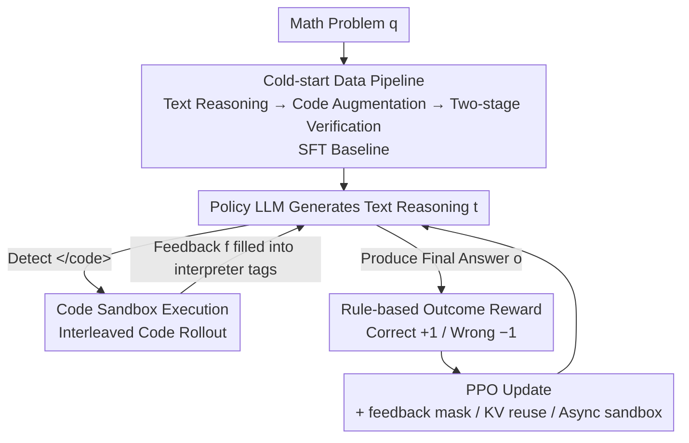

# ReTool: Reinforcement Learning for Strategic Tool Use in LLMs

**Conference**: ICLR 2026  
**OpenReview**: [https://openreview.net/forum?id=tRk1nofSmz](https://openreview.net/forum?id=tRk1nofSmz)  
**Code**: To be confirmed  
**Area**: Reinforcement Learning / LLM Reasoning / Tool Use  
**Keywords**: Tool-integrated Reasoning, Code Interpreter, PPO, Outcome Reward, Mathematical Reasoning

## TL;DR
ReTool employs a training framework of "cold-start SFT + tool-augmented RL" to enable LLMs to autonomously learn "when and how to call a code interpreter" during long-chain reasoning. By using only outcome-based rewards, a 32B model achieved 67.0% on AIME2024, significantly surpassing the text-only RL baseline (40.0%) while using only one-third of the training steps.

## Background & Motivation

**Background**: Reasoning models trained with reinforcement learning (RL), such as OpenAI o1 and DeepSeek R1, can perform self-correction and generate long chains of thought (CoT) in pure text, showing strong performance in mathematics and logical reasoning. The mainstream paradigm treats "longer, more deliberate textual reasoning" as the primary means to enhance reasoning capabilities.

**Limitations of Prior Work**: Pure textual reasoning has a ceiling in scenarios requiring "precise numerical calculation or symbolic manipulation." For tasks like geometric reasoning, complex equation solving, and large-number brute-force verification, relying on linguistic models to perform "mental math" in token space is prone to calculation errors and compounding errors. Conversely, a Code Interpreter (CI) provides an **executable and verifiable** formal interface to perform these calculations precisely.

**Key Challenge**: How to integrate CI into the reasoning loop? Existing works rely on prompting or Supervised Fine-Tuning (SFT) to imitate carefully labeled tool-call data. These methods only replicate calling patterns seen in the training distribution, fail to generalize to new problems, and do not learn to **adaptively determine "whether and how to use tools."** Consequently, models either abuse tools or degenerate into fragile heuristic rules.

**Goal**: Enable models to explore strategies for "when to call code, what code to write, and how to recover from errors" autonomously, rather than being constrained by human priors.

**Key Insight**: RL is naturally suited for this task—it allows models to explore flexible reasoning trajectories and uses **outcome feedback** (correctness of the answer) to shape tool-use strategies. Correct reward design allows the model to spontaneously discover advanced behaviors like "code self-correction" and "proactive tool usage."

**Core Idea**: First, perform cold-start SFT using code-augmented long reasoning data to provide a baseline. Then, use an RL process that supports "real-time interleaved code execution" during reasoning, using only the final answer correctness as a reward. This allows the model to autonomously optimize tool-call strategies through interaction with a sandboxed code interpreter.

## Method

### Overall Architecture

ReTool consists of **two phases**: The first phase is **cold-start SFT**, utilizing a data pipeline to automatically rewrite pure text reasoning data into "code-augmented long reasoning trajectories," giving the model basic capabilities for "calling code + analyzing execution results." The second phase is **tool-augmented RL**. The model acts as a policy during rollout, generating text reasoning while sending code to a sandbox for execution upon detecting code end-markers. The execution result is fed back to continue reasoning. Finally, a rule-based reward ( $+1$ for correct, $-1$ for incorrect) is used for PPO to iteratively refine the tool-call strategy.

The core of the RL phase is the interleaved cycle of "text $\oplus$ code $\oplus$ interpreter feedback" during rollout, as illustrated below:

### Key Designs

**1. Cold-start Data Pipeline: Automatically replacing "mental calculation" steps with executable code to provide a stable RL starting point.**

Training a model that has never seen tool-call formats directly with RL leads to convergence issues due to poor initial policies. ReTool addresses the "starting point" problem by taking open-source mathematical reasoning data (e.g., Open-Thoughts) and filtering invalid samples using a "human expert + DeepSeek-R1 evaluation" dual-check to obtain a high-quality text reasoning set $D_{init}$. Then, a structured prompt template is used to automatically replace "calculation steps suitable for code" with corresponding code snippets and execution results, resulting in the code-augmented set $D_{CI}$. After generation, a **two-stage verification** is performed: format verification to ensure syntactic consistency for reliable RL "trigger" detection, and answer verification to discard samples with incorrect final results. SFT on $D_{CI}$ teaches the model "when and how to call the code interpreter." Ablations show this cold-start model achieves 40.9% on AIME2024, comparable to the text-only RL baseline (40.0%) and much higher than the base model (26.7%).

**2. Interleaved Code Execution Rollout: Enabling true "reason-while-calculating" with real-time results.**

Unlike traditional RL rollouts that generate only text (Figure 2a), ReTool rollouts involve the policy LLM and an external sandbox collaborating to produce a mix of "text + code + real-time feedback" (Figure 2b). Specifically, the model is prompted to use `<code></code>` tags to mark code boundaries. During rollout, the model generates text reasoning $t_1$. Upon detecting the closing tag `</code>`, generation pauses, the code $c_1$ is parsed and executed in the sandbox, and the output $f_1$ (success or error message) is inserted into `<interpreter></interpreter>` tags and fed back to the model. The model continues until a final answer $o$ or a new block of code is produced, resulting in a trajectory $[t_1 \oplus c_1 \oplus f_1 \oplus \dots \oplus o]$. Crucially, **error messages are also fed back**, allowing the model to refine its strategy based on execution failures, leading to emergent self-correction behaviors.

**3. Minimalist Outcome Reward: Judging only answer correctness, intentionally not rewarding "executability."**

The reward design follows a minimalist approach using rule-based accuracy: the model must place the final answer in a specific format like `\boxed{}` for reliable validation. The reward is defined as:

$$R(a, \hat{a}) = \begin{cases} 1, & \text{is\_equivalent}(a, \hat{a}) \\ -1, & \text{otherwise} \end{cases}$$

where $a$ is the ground truth and $\hat{a}$ is the prediction. The authors intentionally **omit** "code executability" as a reward term to prevent "reward hacking," where models might write meaningless but executable code just to gain rewards. Relying solely on the final outcome forces the model to weigh "whether the code is worth calling" to solve the problem correctly, leading to more diverse problem-solving behaviors.

**4. Three Engineering Stabilizations: Ensuring stability for "external token injection + multi-turn execution."**

Injecting sandbox feedback into the reasoning trajectory introduces engineering challenges, addressed by three techniques. First, **Interpreter Feedback Mask**: feedback tokens within `<interpreter></interpreter>` are masked from loss calculation. Since these tokens are generated by the environment, including them would interfere with the gradient and disrupt the learning of the model's coherent reasoning sequence. Second, **KV-Cache Reuse**: when `</code>` is detected, the entire KV-cache prior to execution is cached. Calculations are performed only for the feedback part and appended, significantly reducing GPU memory overhead per rollout. Third, **Asynchronous Sandbox**: sandbox pods act as workers in a pool, pulling tasks based on capacity to achieve natural load balancing and avoiding slow-thread bottlenecks.

### Loss & Training
RL uses PPO (based on the VeRL framework) with a KL coefficient of 0.0. The cold-start model is trained for 2 epochs. Optimizer is AdamW with a starting learning rate of 1e-6, max sequence length of 16384 tokens, and mini-batch size of 512. The backbone is Qwen2.5-32B-Instruct, with DeepSeek-R1-Distill-Qwen-32B used for additional verification. All experiments were conducted on NVIDIA H20 GPUs.

## Key Experimental Results

### Main Results
Evaluations were measured using pass@1 estimates on AIME2024/2025 (32 samples), GPQA-Diamond (8 samples), MATH500 (4 samples), and GSM8K (2 samples). Generation temperature was 1.0, top-p 0.7.

| Model | AIME2024 | AIME2025 | GSM8K | MATH500 | GPQA |
|------|----------|----------|-------|---------|------|
| Qwen2.5-Math-72B-Instruct-TIR | 40.0 | - | 95.8 | 88.1 | - |
| OpenAI o1-preview | 44.6 | 37.9 | - | 85.5 | 73.3 |
| QwQ-32B-Preview | 50.0 | 33.5 | - | 90.6 | 54.5 |
| s1-32B | 56.7 | - | - | 93.0 | 59.6 |
| **ReTool (Qwen2.5-32B-Instruct)** | **67.0** | **49.3** | 95.9 | 93.1 | 58.7 |
| **ReTool (DeepSeek-R1-Distill-Qwen-32B)** | **72.5** | **54.3** | 96.3 | 95.2 | 62.3 |

ReTool (Qwen2.5-32B) reached 67.0% on AIME2024 in only 400 steps, while the text-only baseline required 1080 steps to reach 40.0%, demonstrating superior performance and efficiency. On AIME2025, it outperformed o1-preview by 11.4%.

### Ablation Study
The base model used was Qwen2.5-32B-Instruct. The focus was on the impact of removing RL or CI.

| Configuration | AIME2024 | AIME2025 | Description |
|------|----------|----------|------|
| ReTool (Full) | 67.0 | 49.3 | Cold-start + Tool-augmented RL |
| w/o RL | 40.9 | 34.5 | Cold-start SFT only (with CI) |
| w/o CI | 40.0 | 36.7 | Text-only RL (comparable cold-start) |
| w/o Training | 26.7 | 11.9 | Original Base Model |

Removing either RL or CI leads to a significant performance drop. The cold-start model (40.9%) is already comparable to text-only RL (40.0%), while adding CI to RL pushed AIME2024 from ~40% to 67.0%, proving both components are essential.

### Key Findings
- **Shorter yet more accurate responses**: After RL training, average response length decreased by ~40% (from ~10k to ~6k tokens), as concise code replaced verbose manual calculations, improving token efficiency.
- **Enhanced tool usage capacity**: The proportion of responses containing code rose to nearly 98%. The average number of code lines at the end of training was 5x higher than at the start, indicating the model learned complex code strategies.
- **Emergence of code self-correction**: Despite no explicit self-correction training data, the model learned to reflect on errors (e.g., "undefined function") and generate corrected versions. Self-correction frequency peaked early in training and declined as the model became proficient at "writing it right the first time."
- **Generalization to Web Search**: Equipping ReTool with a Bing search tool (per MCP definitions) outperformed WebDancer and Search-o1 on GAIA and BrowseComp-ZH benchmarks, showing the method generalizes beyond mathematics.

## Highlights & Insights
- **"Less is more" in rewards**: Intentionally avoiding rewards for code executability prevents reward hacking. Pure outcome rewards force the model to develop truly useful strategies.
- **Cold-start as a scaffolding for RL**: The automated data pipeline ensures the SFT starting point matches the text-only RL endpoint, allowing RL to jump to 67% within 400 steps.
- **Universal engineering tricks**: Feedback masking, KV-cache reuse, and asynchronous sandboxes are directly applicable to any RL training involving multi-turn external environment calls.
- **Counter-intuitive boost in efficiency**: While tool use might be expected to lengthen trajectories, ReTool actually shortens them by 40% by offloading mental math to code, providing strong evidence for neuro-symbolic hybrid systems.

## Limitations & Future Work
- **Narrow Task Domain**: The primary focus is math competitions (AIME) with clear numerical answers. Outcome rewards for open-ended tasks without unique answers remain an open question.
- **Single Tool Focus**: Main experiments focused on CI; web search was a secondary validation. Stability in larger multi-tool spaces was not fully explored.
- **Sparse Reward Signals**: Relying on $\pm 1$ rewards for the final outcome makes credit assignment difficult for long trajectories.
- **Future Directions**: Exploring process-level but hacking-resistant rewards, larger tool libraries, and extending the data pipeline to non-mathematical domains.

## Related Work & Insights
- **vs. Text-only RL (o1 / R1 paradigm)**: Those models rely on extending text CoT for self-correction. ReTool embeds code execution into the loop, offloading computation to programs. ReTool is more accurate on numerical tasks and trains faster (400 vs 1080 steps) at the cost of requiring sandbox infrastructure.
- **vs. Prompting / SFT Tool Learning (e.g., TIR)**: Those methods imitate fixed distributions and struggle to generalize. ReTool uses outcome rewards for autonomous exploration. ReTool (32B) at 67.0% on AIME2024 far exceeds Qwen2.5-Math-72B-Instruct-TIR (40.0%) with far fewer parameters.

## Rating
- Novelty: ⭐⭐⭐⭐ Systematizes "interleaved execution rollout + outcome reward" into a framework with emergent self-correction analysis.
- Experimental Thoroughness: ⭐⭐⭐⭐⭐ Comprehensive coverage across benchmarks, ablations, and behavioral analysis.
- Writing Quality: ⭐⭐⭐⭐ Clear description of framework, mechanisms, and equations.
- Value: ⭐⭐⭐⭐⭐ Surpasses o1-preview using a 32B model, with highly reusable engineering tricks and efficiency gains.

<!-- RELATED:START -->

## Related Papers

- [\[ICLR 2026\] AutoTool: Automatic Scaling of Tool-Use Capabilities in RL via Decoupled Entropy Constraints](autotool_automatic_scaling_of_tool-use_capabilities_in_rl_via_decoupled_entropy_.md)
- [\[ICLR 2026\] ResT: Reshaping Token-Level Policy Gradients for Tool-Use Large Language Models](rest_reshaping_token-level_policy_gradients_for_tool-use_large_language_models.md)
- [\[ICML 2026\] What Does Reinforcement Learning for Visual Tool Use Really Learn?](../../ICML2026/reinforcement_learning/what_does_vision_tool-use_reinforcement_learning_really_learn_disentangling_tool.md)
- [\[ICLR 2026\] Towards Strategic Persuasion with Language Models](towards_strategic_persuasion_with_language_models.md)
- [\[ICLR 2026\] Getting Your LLMs Ready for Reinforcement Learning with Lightweight SFT](getting_your_llms_ready_for_reinforcement_learning_with_lightweight_sft.md)

<!-- RELATED:END -->
