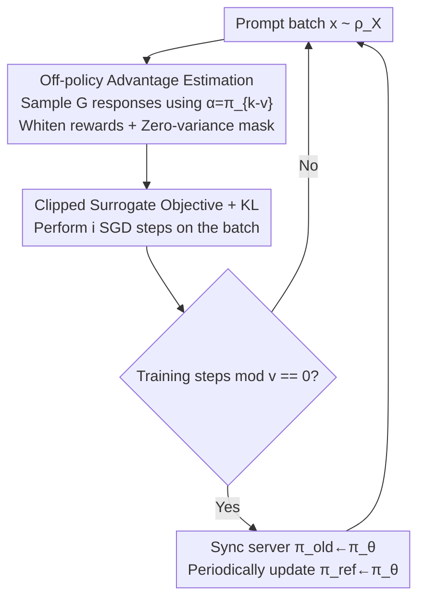

# Revisiting Group Relative Policy Optimization: Insights into On-Policy and Off-Policy Training

**Conference**: ICLR2026  
**OpenReview**: [https://openreview.net/forum?id=XXfOf22o3K](https://openreview.net/forum?id=XXfOf22o3K)  
**Code**: To be confirmed (modified based on the TRL implementation of GRPO)  
**Area**: Reinforcement Learning / RL with Verifiable Rewards (RLVR) / LLM Post-training  
**Keywords**: GRPO, Off-policy, Verifiable Rewards, Policy Improvement Lower Bound, Clipped Surrogate Objective

## TL;DR
This paper generalizes DeepSeek's GRPO from on-policy to off-policy by utilizing a lagged policy $\alpha=\pi_{k-v}$ to whiten rewards and estimate advantages. It proves that both on-policy and off-policy objectives provide a lower bound for expected reward improvement, leading to a clipped surrogate objective consistent with off-policy PPO. Experiments demonstrate that off-policy GRPO (updating the inference server every $v$ steps) performs as well or better than its on-policy counterpart in mathematical reasoning tasks while increasing training throughput for a 7B model by approximately 1.35×.

## Background & Motivation

**Background**: GRPO (Shao et al. 2024) is a mainstream algorithm for LLM post-training, particularly in Reinforcement Learning with Verifiable Rewards (RLVR) used to train reasoning and coding models (e.g., DeepSeek-R1). Its key simplification over PPO is removing the critic network: for each prompt $x$, it samples a group of $G$ responses using the current policy $\pi_k$, standardizes the rewards using the group mean and standard deviation to serve as the advantage function, and updates using a clipped surrogate objective with KL regularization. It is integrated into open-source libraries like TRL and VERL.

**Limitations of Prior Work**: Standard GRPO is on-policy, meaning advantage statistics must be calculated using the latest $\pi_k$. This requires resynchronizing updated weights to the inference server (e.g., vLLM) after every training step. For large models requiring tensor parallelism and multi-GPU serving, this "step-wise weight redistribution" triggers deep copies and cross-GPU communication overhead that grows linearly with model scale. Frequent updates ($v=1$) can dominate the total training time.

**Key Challenge**: On-policy training ensures "fresh" advantage estimates at the cost of high communication and serving overhead. Reducing these costs requires using samples from an old policy, which turns advantage estimation into an off-policy process. Whether monotonic reward improvement can still be theoretically guaranteed under such conditions remains an open question. Furthermore, existing analysis (Mroueh 2025) noted that the original GRPO implicitly performs off-policy advantage estimation when $\mu>1$ (re-using the same batch for SGD), which empirically improves performance but lacks theoretical support.

**Goal**: (1) Explicitly generalize GRPO to an off-policy setting using a lagged policy $\alpha=\pi_{k-v}$ for advantage estimation; (2) provide policy improvement lower bounds for both on-policy and off-policy scenarios to elucidate conditions under which "optimizing advantage" truly improves rewards; (3) derive a practical clipped surrogate objective via constrained optimization.

**Key Insight**: Drawing from the extensive literature on off-policy PPO (GePPO, ToPPO, OPPO, etc.), which proves that PPO can reuse samples while maintaining convergence guarantees, the authors adapt this logic to GRPO. The critical difference is that GRPO's advantage is an analytical form of "whitened rewards." Thus, the proof can bypass the state visitation distribution required in PPO analysis, making it independent of MDP assumptions.

**Core Idea**: Use a lagged policy $\pi_{k-v}$ for GRPO advantage estimation combined with importance sampling. The authors prove it guarantees reward improvement similarly to the on-policy version, allowing weight synchronization to be relaxed from every step to every $v$ steps, saving communication without sacrificing performance.

## Method

### Overall Architecture

The goal is to determine if GRPO can be safely "off-policized." The approach delegates sampling and advantage estimation to a lagged old policy $\alpha=\pi_{k-v}$ (synchronized with the latest policy only every $v$ steps) and rewrites the objective under $\alpha$ using importance sampling. It is theoretically proven that as long as $\alpha$ is not too far from the current policy $\pi_k$ and the reward variance is non-zero, maximizing the (regularized) off-policy advantage improves the expected reward. This theory is implemented as an iterative algorithm controlled by two knobs $(v, i)$, where on-policy GRPO is a special case $(v=1, i=1)$.

The training loop (Algorithm 1) proceeds as follows: sample a batch of prompts $x$ from the distribution $\rho_X$ → use the old policy $\pi_{\text{old}}=\alpha$ on the server to sample $G$ responses for each $x$ → execute verifiable rewards → calculate whitened advantages using group statistics of $\alpha$ (optionally masking zero-variance samples) → perform $i$ steps of SGD using the clipped surrogate objective and KL regularization → synchronize the latest weights to the server every $v$ steps and periodically update the reference policy $\pi_{\text{ref}}$. Here, $v$ controls the synchronization frequency (off-policy degree) and $i$ controls sample reuse.

### Key Designs

**1. Off-policy Advantage Estimation: Whitening rewards with lagged policy $\alpha=\pi_{k-v}$**

To address the high communication cost of step-wise synchronization, the paper decouples advantage estimation from the current policy $\pi_k$ to a lagged policy $\alpha$. On-policy GRPO advantages are whitened rewards estimated from the current group:

$$\hat{A}_{\pi_k}(x, y_i) = \frac{r_i - \text{mean}(\{r_\ell\})}{\sqrt{\text{std}^2(\{r_\ell\}) + \varepsilon}}$$

The authors calculate the mean and standard deviation using the off-policy distribution $\alpha$, yielding off-policy advantages:

$$A_\alpha(x,y) = \frac{r(x,y) - \mu_{\alpha,r}(x)}{\sigma_{\alpha,r,\varepsilon}(x)},\qquad \sigma_{\alpha,r,\varepsilon}(x)=\sqrt{\sigma_{\alpha,r}^2(x)+\varepsilon}$$

The objective is rewritten under $\alpha$ via importance sampling: $L_\alpha(\pi)=\mathbb{E}_{y\sim\alpha}\frac{\pi(y|x)}{\alpha(y|x)}A_\alpha(x,y)$. This reduces to on-policy GRPO when $\alpha=\pi_k$. In practice, $\alpha=\pi_{k-v}$ is used, where the same old policy provides "fresh samples" within each $v$-step cycle. This allows the inference server to be updated only once ogni $v$ steps.

**2. Unified Policy Improvement Bound: Proving advantage optimization improves reward**

The authors provide a core theorem (Theorem 1): Assuming bounded rewards $0\le r\le 1$, for any policy $\pi$:

$$J(\pi) - J(\pi_k) \ge L_\alpha(\pi) - 2\,\frac{1-\sigma_{\alpha,r,\varepsilon}(x)}{\sigma_{\alpha,r,\varepsilon}(x)}\,\mathrm{TV}(\pi,\alpha) - 2\,\mathrm{TV}(\pi_k,\alpha)$$

where $\mathrm{TV}$ is the Total Variation distance. This indicates that as long as $\alpha$ is sufficiently close to $\pi_k$ ($\mathrm{TV}(\pi_k,\alpha)\le\delta$) and the variance term does not explode, maximizing off-policy advantage guarantees an increase in expected reward. Setting $\alpha=\pi_k$ recovers the on-policy version (Corollary 1). Unlike PPO/TRPO where the TV constant is absolute, the weight in GRPO $\frac{1-\sigma_{\alpha,r,\varepsilon}}{\sigma_{\alpha,r,\varepsilon}}$ depends on the policy and data. For verifiable (Bernoulli) rewards with success probability $p$:

$$\frac{1-\sigma_{\alpha,r,\varepsilon}(x)}{\sigma_{\alpha,r,\varepsilon}(x)} = \frac{1-\sqrt{p(1-p)+\varepsilon}}{\sqrt{p(1-p)+\varepsilon}}$$

This term diverges as $p\to 0$ or $p\to 1$, allowing negative terms to dominate. This theoretically justifies why DAPO filters out "all-correct/all-wrong" prompts. Consequently, the authors propose a **zero-variance mask** to exclude samples where $\sigma_{\pi_k,r}(x)=0$:

$$\mathbb{E}_{x}\,\mathbb{1}_{\sigma_{\pi_k,r}(x)\ne 0}\big(L^c_{\pi_k}(\pi)-\beta\,\mathrm{KL}(\pi\|\pi_\text{ref})\big)$$

**3. Clipped Surrogate Objective from Constrained Optimization**

The authors formulate "maximizing the lower bound" as a constrained optimization $\max_\pi \mathbb{E}_x L_\alpha(\pi)\ \text{s.t.}\ \mathbb{E}_x\mathrm{TV}^2(\pi,\alpha)\le\Delta^2$. Using Pinsker’s inequality to replace TV with KL constraints yields a problem isomorphic to constrained PPO. The practical implementation is the clipped surrogate: define $f_\epsilon(r,r',a)=\min\big(ra,\ \text{clip}(r,\max(r'-\epsilon,0),r'+\epsilon)\,a\big)$, the off-policy GRPO clipped objective is:

$$L^c_\alpha(\pi)=\mathbb{E}_{y\sim\alpha}\,f_\epsilon\!\left(\frac{\pi(y|x)}{\alpha(y|x)}, \frac{\pi_k(y|x)}{\alpha(y|x)}, A_\alpha(x,y)\right)$$

Clipping ensures the ratio $\pi/\alpha$ does not deviate from $\pi_k/\alpha$ by more than $\epsilon$. When $\alpha=\pi_k$ (where $\pi_k/\alpha=1$), this precisely recovers the original on-policy GRPO objective.

**4. $(v, i)$ Dual-Knob Algorithm**

Algorithm 1 is controlled by two hyperparameters: $i$ (SGD steps per batch) and $v$ (server synchronization period, i.e., $\alpha=\pi_{k-v+1}$).

| Method | $i$ (SGD per batch) | $v$ (Sync period) |
|------|------|------|
| On-policy GRPO (Shao 2024) | $i=1$ | $v=1$ |
| Off-policy GRPO (Shao 2024, sample reuse) | $i>1$ | $v=1$ |
| Off-policy GRPO (Ours) | $i=1$ | $v>1$ |

The proposed $(v>1, i=1)$ configuration targets the communication bottleneck directly, especially in tensor-parallel collocated serving.

## Key Experimental Results

### Main Results

GSM8K Ablation (Qwen2.5-0.5B-Instruct, Pass@1 on test set):

| Configuration | Pass@1 | Note |
|------|--------|------|
| On-policy GRPO $(v{=}1,i{=}1)$ | 45% | Converges but unstable |
| On-policy + Zero-variance mask | 50% | Stable and higher |
| Off-policy GRPO (Ours) $(v{=}10,i{=}1)$ | 50% | Stable, matches masked version |
| Off-policy GRPO (Shao) $(v{=}1,i{=}10)$ | Slower | 10× slower than other configs |

DeepSeek-R1-Distill-Qwen-1.5B finetuned on DeepScaleR (~40K problems):

| Task | Baseline | On-policy (Max / Mean) | Off-policy (Max / Mean) |
|------|------|------|------|
| Aime24 (Pass@1) | 29% | 0.3229 / 0.3022 | 0.3250 / 0.3049 |
| Math500 | 83% | 0.870 / 0.8519 | 0.872 / 0.8474 |

Off-policy results are essentially on par with on-policy.

### Key Findings
- **Zero-variance masking acts as a stabilizer**: On-policy GRPO is unstable (45%) until $\sigma=0$ samples are masked (yielding 50%), consistent with theoretical predictions of diverging constants.
- **Off-policy is efficient**: $(v{=}10,i{=}1)$ maintains performance while achieving a **1.35× speedup** for a Qwen2.5-7B model by reducing communication.
- **Off-policy $\ne$ Sample Reuse**: The proposed $(v{>}1,i{=}1)$ saves communication via lagged servers; the original $(v{=}1,i{>}1)$ reuses samples but is $i$ times slower with poorer convergence.

## Highlights & Insights
- **Analytical Proof bypassing MDP**: By utilizing the analytical whitening of GRPO, the proof avoids state visitation distributions, making the conclusions more general and independent of MDP frameworks.
- **Engineering-Theory Alignment**: The $(v, i)$ knobs are precisely mapped to "off-policy degree" and "reuse frequency," providing a theoretical basis for what were previously heuristic engineering choices.
- **Theoretical Grounding for Heuristics**: Both zero-variance masking and success rate amplification (periodically updating $\pi_{\text{ref}}$) are explained through the lens of the policy improvement lower bound.

## Limitations & Future Work
- **Scale**: Experiments are limited to models up to 7B and single-node 8-GPU setups; stability in larger-scale, multi-node environments requires further validation.
- **Heuristic $v$ Selection**: The selection of synchronization period $v$ remains empirical; there is no adaptive rule based on task or model behavior.
- **Bias in Variance Estimation**: Using small group sizes $G$ to estimate variance introduces bias, which was not extensively compared against techniques like those in DAPO.

## Related Work & Insights
- **vs. On-policy GRPO (Shao et al. 2024)**: Proves that the requirement for step-wise synchronization can be relaxed and provides a unified framework for off-policy variants.
- **vs. Off-policy PPO**: While sharing the goal of sample reuse, this work does not rely on the Kakade-Langford MDP analysis, leveraging the specific structure of GRPO's advantage instead.
- **vs. DAPO (Yu et al. 2025)**: Explains the theoretical necessity of the "all-correct/all-wrong" filtering proposed empirically in DAPO.

## Rating
- Novelty: ⭐⭐⭐⭐ Systematic generalization to off-policy with non-MDP dependent bounds.
- Experimental Thoroughness: ⭐⭐⭐ Covers various scales and throughput, but lacks multi-epoch large-scale runs.
- Writing Quality: ⭐⭐⭐⭐ Clear derivations and intuitive mapping between engineering and theory.
- Value: ⭐⭐⭐⭐ Provides a theoretically grounded solution to saving communication costs in RLVR.

<!-- RELATED:START -->

## Related Papers

- [\[ICLR 2026\] Group Verification-based Policy Optimization for Interactive Coding Agents](group_verification-based_policy_optimization_for_interactive_coding_agents.md)
- [\[ICLR 2026\] Relative Entropy Pathwise Policy Optimization](relative_entropy_pathwise_policy_optimization.md)
- [\[ICLR 2026\] BAPO: Stabilizing Off-Policy Reinforcement Learning for LLMs via Balanced Policy Optimization with Adaptive Clipping](bapo_stabilizing_off-policy_reinforcement_learning_for_llms_via_balanced_policy_.md)
- [\[ICLR 2026\] Single-stream Policy Optimization](single-stream_policy_optimization.md)
- [\[ICLR 2026\] Buffer Matters: Unleashing the Power of Off-Policy Reinforcement Learning in Large Language Model Reasoning](buffer_matters_unleashing_the_power_of_off-policy_reinforcement_learning_in_larg.md)

<!-- RELATED:END -->
