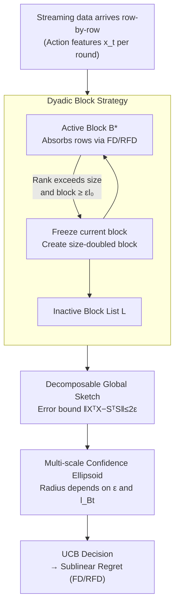

# Revisiting Matrix Sketching in Linear Bandits: Achieving Sublinear Regret via Dyadic Block Sketching

**Conference**: ICLR 2026  
**arXiv**: [2410.10258](https://arxiv.org/abs/2410.10258)  
**Authors**: Dongxie Wen, Hanyan Yin, Xiao Zhang, Peng Zhao, Lijun Zhang, Zhewei Wei (Renmin University of China & Nanjing University)
**Code**: None  
**Area**: Reinforcement Learning / Online Learning / Bandits  
**Keywords**: Linear Bandits, Matrix Sketching, Frequent Directions, Multi-scale Sketching, Sublinear Regret, Dyadic Block Sketching

## TL;DR

This paper reveals the fundamental flaw of existing matrix-sketching-based linear bandit methods, which degrade to linear regret when the spectral tail of the streaming data is heavy. It proposes the Dyadic Block Sketching framework, a multi-scale sketching approach that controls the global approximation error to a preset parameter $\epsilon$ by dynamically doubling sketch sizes. This ensures sublinear regret without prior knowledge of the spectral properties of the stream matrix and adaptively recovers the computational efficiency of single-scale methods in spectral-friendly scenarios.

## Background & Motivation

**Background**: Stochastic Linear Bandits (SLB) is a core framework in online learning. The classic OFUL algorithm achieves an $\widetilde{O}(d\sqrt{T})$ regret bound via regularized least squares and upper confidence bounds, but its per-round update complexity is $\Omega(d^2)$. This is prohibitive in high-dimensional scenarios, leading the community to introduce matrix sketching to reduce complexity to $O(dl + l^2)$, where $l < d$ is the sketch size.

**Limitations of Prior Work**: Regret bounds of sketching-based methods like SOFUL and CBSCFD depend on the spectral error $\Delta_T$. When the stream matrix has a heavy-tailed spectrum, fixed small sketches fail to retain sufficient spectral information, causing $\Delta_T$ to grow rapidly and leading to **linear regret**—completely defeating the goal of online learning.

**Key Challenge**: The optimal sketch size depends on the unknown spectral properties of the stream matrix; a sketch too small leads to linear regret, while one too large loses efficiency. The authors prove that in local convex arm spaces with geometric constant $q \geq 1/3$, **any** SOFUL algorithm with a fixed $l < d$ will inevitably suffer linear regret (Observation 1).

**Key Insight**: Borrowing the dyadic framework from streaming algorithms, the authors approximate the stream matrix using multiple sketch blocks that grow in geometric progression. This ties the global error to a preset parameter $\epsilon$, thereby decoupling it from unknown spectral properties.

## Method

### Overall Architecture

DBSLinUCB replaces a "single fixed-size sketch" with a "stack of geometrically growing sketch blocks." Streaming data (action features pulled each round) arrives row by row and is first fed into an active block. When the active block's rank is about to exceed its sketch size and the block size is at least $\epsilon l_0$, it is frozen, and a new block with double the size is created. Consequently later blocks maintain larger sketches. Leverging a "decomposability" lemma, all block sketches can be merged into a global sketch with an approximation error fixed by the parameter $\epsilon$. This global sketch is then used for UCB-based decision-making. Crucially, the user no longer guesses the unknown optimal sketch size but sets a global error $\epsilon$; the blocking mechanism adaptively decides the number and size of blocks. This decouples approximation quality from spectral properties—remaining efficient with few blocks in friendly scenarios, and increasing blocks up to exact updates in heavy-tailed scenarios to preserve accuracy.

### Key Designs

**1. Dyadic Block Strategy: Self-growing Sketch Size**

Fixed small sketches fail to preserve information under heavy-tailed spectra, while fixed large sketches waste computation; the difficulty lies in the unknown optimal size. The strategy maintains an active block $\mathcal{B}^\star$ and a list of frozen inactive blocks $\mathcal{L}$. Beginning with a sketch size $l_0$, whenever the active block's rank approaches its sketch size and the size is at least $\epsilon l_0$, the block is frozen and replaced by one twice as large. The process is constrained by two invariants: inactive blocks either have their rank covered by their sketch size or have a size smaller than $\epsilon l_0$ (ensuring per-block quality), and the total number of blocks is capped at $\lfloor \log(d/l_0 + 1) \rfloor$ (ensuring bounded overhead). In extreme heavy-tailed cases, the algorithm degrades to rank-1 exact updates, equivalent to OFUL, preventing both distortion and infinite expansion.

**2. Decomposability and Global Error Bound: Locking Error at $\epsilon$**

Multiple sketch blocks can be aggregated while ensuring the final error is independent of the spectrum due to a decomposability lemma (Lemma 3): if each block sketch satisfies a local covariance error bound $\|X_i^\top X_i - S_i^\top S_i\|_2 \leq \epsilon_i \|X_i\|_F^2$, the global combined error is controlled by the sum of individual errors. Integrating the invariants of the block strategy yields a global error bound independent of spectral properties (Theorem 1):

$$\|X^\top X - S^\top S\|_2 \leq 2\epsilon$$

The actual number of blocks $B = \lceil \min\{\log(k/l_0), \|X\|_F^2 / (\epsilon l_0)\} \rceil$ adapts to the data—remaining small in low-rank scenarios and increasing toward exact updates in heavy-tailed ones. The complexity shifts from "selecting the right size" to "$\epsilon$-driven adaptive computation."

**3. Multi-scale Confidence Ellipsoid: Unbinding Regret from Spectral Error $\Delta_T$**

Sketching approximations contaminate least-squares estimates; this error must be absorbed into the UCB confidence radius to avoid misleading decisions. The confidence ellipsoid radius derived for multi-scale sketching (Theorem 2) is:

$$\hat{\beta}_t(\delta) \lesssim R\sqrt{d \ln(1 + \epsilon/\lambda) + 2l_{B_t}} \cdot \sqrt{1 + \epsilon/\lambda} + \frac{H(\lambda + \epsilon)}{\sqrt{\lambda}}$$

This depends only on the controllable $\epsilon$ and current sketch size $l_{B_t}$, rather than the spectral error $\Delta_T$ that explodes in heavy-tailed cases. This step severs the chain of "sketch degradation $\rightarrow$ ellipsoid expansion $\rightarrow$ linear regret."

**4. FD and RFD Instances: Dual Guarantees of Sublinear Regret**

Integrating the ellipsoid into standard UCB analysis yields regret bounds for two underlying sketching methods. For DBSLinUCB-FD (Theorem 3):

$$\text{Regret}_T = \widetilde{O}\left(\left(1 + \frac{\epsilon}{\lambda}\right)^{3/2} \cdot (d + l_{B_T}) \cdot \sqrt{T}\right),$$

Setting $\epsilon = O(1)$ yields $\widetilde{O}(\sqrt{T})$, matching OFUL's order. Using regularized FD (RFD) in DBSLinUCB-RFD (Theorem 4) further reduces the power of $\epsilon$ from $3/2$ to $1/2$ and decouples $d$ from $\epsilon$:

$$\text{Regret}_T = \widetilde{O}\left(\left(1 + \frac{\epsilon}{\lambda}\right)^{1/2} \cdot \sqrt{l_{B_T} T} + \sqrt{d l_{B_T} T}\right),$$

This benefits from the positive-definite monotonicity and conditioning of RFD. Setting $\epsilon = O(T^{(2\gamma-1)/3})$ allows for a specified $O(T^\gamma)\ (\gamma \in [0.5,1))$ regret, providing a continuous curve between accuracy and efficiency.

## Key Experimental Results

### Experiment 1: Synthetic Data Linear Regret Verification

Setup: $d=500$, 100 arms, Gaussian distribution $\mathcal{N}(0, I_d)$, sketch size $l \in \{50, 450\}$.

| Algorithm | Sketch Size | Regret Trend | Spectral Error $\log(\Delta_T)/\log t$ |
| :--- | :--- | :--- | :--- |
| OFUL | No Sketch | Sublinear (Baseline) | — |
| SOFUL | $l=450$ | Sublinear | $< 1/3$ ✔ |
| SOFUL | $l=50$ | **Near-linear** ❌ | $> 1/3$ ❌ (Crossed threshold) |
| CBSCFD | $l=450$ | Sublinear | $< 1/3$ ✔ |
| CBSCFD | $l=50$ | **Near-linear** ❌ | $> 1/3$ ❌ (Crossed threshold) |
| DBSLinUCB-FD | $l_0=50, \epsilon=8$ | **Sublinear** ✔ | Adaptively controlled |
| DBSLinUCB-RFD | $l_0=50, \epsilon=8$ | **Sublinear** ✔ | Adaptively controlled |

**Key Findings**: When $l=50$, the spectral error of SOFUL/CBSCFD exceeds the $1/3$ threshold, resulting in linear regret, which validates Observation 1. DBSLinUCB maintains sublinear regret using the same initial sketch size.

### Experiment 2: MNIST Real Data + Pareto Frontier

Setup: $d=784$, $M=10$ classes, 60,000 samples, 2000 rounds of online classification.

| Method | Configuration | Regret (2000 rounds) | Time Saving | Space Saving |
| :--- | :--- | :--- | :--- | :--- |
| OFUL | No Sketch | ~200 (Optimal) | 0% (Baseline) | 0% (Baseline) |
| SOFUL | $l=600$ | ~250 | ~30% | ~25% |
| SOFUL | $l=50$ | >500 ❌ | ~85% | ~90% |
| DBSLinUCB-FD | $\epsilon=4, l_0=50$ | ~220 | ~60% | ~80% |
| DBSLinUCB-RFD | $\epsilon=4, l_0=50$ | ~210 | ~60% | ~80% |
| DBSLinUCB-FD | $\epsilon=25, l_0=50$ | ~300 | ~80% | ~90% |

**Key Findings**: (1) DBSLinUCB outperforms SOFUL across the Pareto frontier (regret vs. time/space), reducing regret by up to 40% or saving 60% time + 80% space at similar regret levels. (2) Regret stays <300, while SOFUL exceeds 500 with small sketches. (3) With small $\epsilon$, performance across different $l_0$ converges due to the prevalence of exact updates under Invariant 2.

## Highlights & Insights

- **Paradigm Shift from "Guessing Size" to "Setting Error"**: Users directly control the precision $\epsilon$ instead of guessing unknown spectral properties, cleverly shifting problem complexity to adaptive computation.
- **Elegant Two-sided Degradation**: Best-case scenario recovers the optimal $O(dk)$ sketch complexity; worst-case degrades to $O(d^2)$ OFUL—both extremes are known optimal results, with a smooth transition in between.
- **Framework Universality**: Not tied to a specific sketching method; any sketch satisfying covariance error guarantees (FD, RFD, Random Projection) can be integrated modularly.
- **Tight Theory-Experiment Coupling**: Spectral critical conditions in Observation 1 are precisely replicated in experiments, and Pareto frontiers intuitively demonstrate the efficiency-accuracy trade-off.

## Limitations & Future Work

- **$\epsilon$ still requires manual setting**: The optimal $\epsilon$ depends on instance and $T$ priors; fully adaptive tuning of $\epsilon$ remains unsolved.
- **No acceleration in heavy-tail scenarios**: When $k=d$, complexity degrades to $O(d^2)$, matching OFUL—an information-theoretic necessity, though more refined schemes might exist.
- **Scale of experiments**: $d=784$ (MNIST) is relatively small; validation in recommendation system scenarios with $d=10000+$ is needed.
- **Limited to stochastic stationary settings**: Block splitting strategies for non-stationary environments or adversarial noise need further design.
- **Frobenius norm bounds are non-tight**: The authors suggest using FD's adaptive spectral tail bounds to improve block allocation, representing a clear direction for theoretical enhancement.

## Related Work & Insights

- **vs SOFUL (Kuzborskij et al., 2019)**: Uses fixed FD sketches; regret depends on $\Delta_T$, leading to possible linear regret. DBSLinUCB decouples error via multi-scale sketching, recovering efficiency when low-rank.
- **vs CBSCFD (Chen et al., 2020)**: Uses RFD to improve $\Delta_T$ order, but the fundamental issue of fixed size remains. DBSLinUCB-RFD combines RFD advantages with adaptive sizing.
- **vs OFUL (Abbasi-Yadkori et al., 2011)**: Exact method without sketching, $O(d^2)$. DBSLinUCB accelerates significantly in spectral-friendly cases and degrades to OFUL in the worst case—essentially a computationally adaptive generalization of OFUL.
- **Source of Dyadic Framework**: Originates from dyadic decomposition in streaming (Wang et al., 2013; Wei et al., 2016). Migration to bandits requires non-trivial handling of confidence ellipsoids and regret analysis.

## Rating

- Novelty: ⭐⭐⭐⭐ The multi-scale sketching idea originates from streaming, but its application to bandits to prove sublinear regret is a non-trivial new contribution.
- Experimental Thoroughness: ⭐⭐⭐⭐ Clearly validates theory with synthetic and MNIST data, but lacks large-scale, high-dimensional real-world datasets.
- Writing Quality: ⭐⭐⭐⭐⭐ Well-structured, transitioning smoothly from revealing flaws to proposing solutions; charts are intuitive.
- Value: ⭐⭐⭐⭐ Resolves a fundamental defect in sketch-based bandits with a universal framework, although the application niche is relatively specific.

<!-- RELATED:START -->

## Related Papers

- [\[ICLR 2026\] Online Minimization of Polarization and Disagreement via Low-Rank Matrix Bandits](online_minimization_of_polarization_and_disagreement_via_low-rank_matrix_bandits.md)
- [\[ICLR 2026\] Single Index Bandits: Generalized Linear Contextual Bandits with Unknown Reward Functions](single_index_bandits_generalized_linear_contextual_bandits_with_unknown_reward_f.md)
- [\[NeurIPS 2025\] Generalized Linear Bandits: Almost Optimal Regret with One-Pass Update](../../NeurIPS2025/reinforcement_learning/generalized_linear_bandits_almost_optimal_regret_with_one-pass_update.md)
- [\[ICLR 2026\] AWM: Accurate Weight-Matrix Fingerprint for Large Language Models](awm_accurate_weight-matrix_fingerprint_for_large_language_models.md)
- [\[ICML 2026\] Practical and Optimal Algorithm for Linear Contextual Bandits with Rare Parameter Updates](../../ICML2026/reinforcement_learning/practical_and_optimal_algorithm_for_linear_contextual_bandits_with_rare_paramete.md)

<!-- RELATED:END -->
