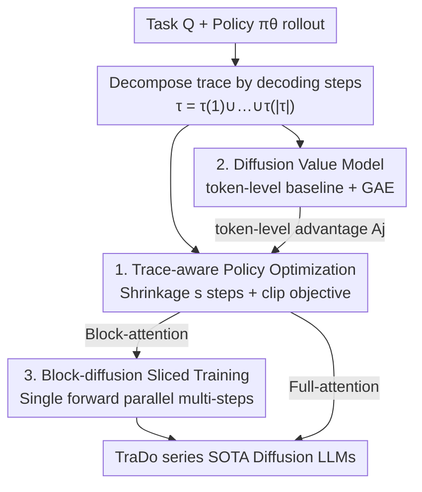

# Revolutionizing Reinforcement Learning Framework for Diffusion Large Language Models

**Conference**: ICLR 2026  
**OpenReview**: [https://openreview.net/forum?id=KNAyc9DMe3](https://openreview.net/forum?id=KNAyc9DMe3)  
**Code**: https://github.com/Gen-Verse/dLLM-RL  
**Area**: Reinforcement Learning / Diffusion Language Models / LLM Reasoning  
**Keywords**: Diffusion Language Models, Trace-aware RL, Value Model, Block Diffusion, Math/Code Reasoning

## TL;DR
This paper proposes TraceRL—a trace-aware reinforcement learning framework that incorporates the **decoding trace** of Diffusion Large Language Models (DLMs) during inference into the post-training objective. It features a variance-reducing diffusion value model that uniformly adapts to both full-attention and block-attention DLMs. Based on this, the TraDo series of SOTA diffusion language models are trained, outperforming autoregressive models of the same or even larger sizes in math and code reasoning.

## Background & Motivation
**Background**: The most promising route for adapting diffusion models to language is currently Masked Diffusion Language Models (MDM). During training, parts of tokens are randomly replaced with `[MASK]`, and during inference, high-confidence positions are iteratively decoded from a fully masked sequence to achieve parallel generation. This approach follows two primary architectures: full-attention DLMs (e.g., Dream, LLaDA) and block-attention DLMs (e.g., SDAR, which generates block-by-block from left to right and naturally supports KV-cache).

**Limitations of Prior Work**: Existing DLM post-training (including RL) almost exclusively focuses on full-attention models. The common practice involves **randomly masking** the sampled sequence and optimizing it with ELBO-like objectives ($J_{\text{full}}$). The problem is that natural language is inherently sequential and logically dependent, and the actual decoding strategies used during inference (confidence-based with KV-cache) are far from purely random. Consequently, there is a **systemic mismatch** between the "random masking training objective" and the "actual inference trace preferred by the model," and no unified RL framework exists for both full-attention and block-attention architectures.

**Key Challenge**: Post-training objectives optimize "random-order restoration," whereas inference follows a "trace-aligned, approximately left-to-right" path. The optimization target and the actual usage are inconsistent, leading to inefficient learning. This paper confirms this mismatch through controlled experiments: under equal compute, fine-tuning with a semi-autoregressive objective (block-by-block left-to-right) or directly using the model’s preferred inference trace yields significantly higher MATH500 accuracy than random masking (e.g., 54.4% for trace-based vs. 45.1% for random masking under full-attention).

**Goal**: To explicitly incorporate "inference trace" information into post-training and develop a robust RL framework applicable to both full-attention and block-attention DLMs.

**Key Insight**: While collecting preferred traces for fine-tuning is effective, the computational cost of offline trace collection is high. **Reinforcement learning naturally produces these traces during the rollout process**. By rewarding or punishing the RL agent based on these traces (rather than random masked sequences), one can align with inference while eliminating additional collection costs.

**Core Idea**: Replace "random masking RL" with "trace-aware RLVR." A rollout is decomposed into a trace organized by decoding steps $\tau=\tau(1)\cup\cdots\cup\tau(|\tau|)$. Policy optimization with clipping is performed at the trace level, and a diffusion value model is introduced to provide token-level advantages. This ensures inference alignment, reduces variance, and incorporates process rewards.

## Method

### Overall Architecture
TraceRL addresses the granularity of rewards in DLM RL. Instead of scoring a generation as a "whole sequence + random masks," it preserves the **authentic decoding step structure**: for a task $Q$, the current policy $\pi_\theta$ rolls out a response $\tau_i$, which is sliced into trace segments $\tau_i(t)$ (the batch of tokens decoded at step $t$). Policy optimization is performed on this trace using a verifiable reward $r_i$. The pipeline consists of three components: ① trace-aware policy optimization (with a shrinkage parameter $s$ for compute control), ② a diffusion value model (providing token-level baselines, reducing variance, and consuming process rewards), and ③ block-diffusion sliced training (enabling multi-step parallel training for block-attention). The value model is an optional enhancement compatible with both full and block architectures.

### Key Designs

**1. Trace-aware Policy Optimization + Shrinkage Parameter: Aligning RL with Preference Traces over Random Masks**

This design targets the mismatch between training objectives and inference traces. Responses are organized into traces based on decoding steps. A GRPO-style clipped policy objective is applied at the trace level: for a token $o_k$ within step $\tau_i^s(t)$, the ratio $\pi_{\theta_p}/\pi_{\text{old}}$ is multiplied by the normalized advantage $A_i$. The objective function uses $C_\epsilon(r,A)=\min(rA,\text{clip}(r,1-\epsilon,1+\epsilon)A)$, normalized by the number of tokens in that step, with KL regularization:

$$J_{\text{policy}}(\theta_p)=\mathbb{E}\Big[\sum_{i=1}^{G}\sum_{t=1}^{|\tau_i^s|}\sum_{o_k\in\tau_{i,t}^s}C_\epsilon\!\big(\tfrac{\pi_{\theta_p}(o_k\mid\tau_i^s(1{:}t{-}1))}{\pi_{\text{old}}(o_k\mid\tau_i^s(1{:}t{-}1))},A_i\big)/|\tau_i^s(t)|\Big]-\beta\,\mathrm{KL}.$$

The critical innovation is the **shrinkage parameter $s$**. Decomposing traces for every sampling step in full-attention models would lead to an explosion in forward passes. By aggregating $s$ consecutive steps into one $\tau_i^s(k)=\cup_{j=s(k-1)+1}^{\min(sk,|\tau_i|)}\tau_i(j)$, the trace length is compressed from $|\tau_i|$ to $\lceil|\tau_i|/s\rceil$, reducing training complexity to $1/s$. This preserves the "trace-aligned" advantage while keeping compute feasible. Compared to legacy random masking RL, it optimizes the actual decoding path, leading to faster convergence and better performance under the same compute.

**2. Diffusion Value Model: Token-level Baseline for Variance Reduction and Process Reward Integration**

Assigning a single sequence-level advantage to all tokens results in high variance and unstable training. This design introduces a diffusion value network to provide **prefix-conditioned token-level values** as a variance-reduction baseline. Specifically, a frozen value network $V_{\text{old}}$ provides token values $V^{\text{old}}_j$ along the trace, which are aggregated into step-level values $V^{\star,\text{old}}_t=\sum_{j\in\tau(t)}V^{\text{old}}_j/|\tau(t)|$. Step-level rewards $r^\star_t$, returns $R^\star_t=r^\star_t+\gamma R^\star_{t+1}$, TD residuals $\delta^\star_t=r^\star_t-V^{\star,\text{old}}_t+\gamma V^{\star,\text{old}}_{t+1}$, and step-level GAE $A^\star_t=\delta^\star_t+\gamma\lambda A^\star_{t+1}$ are calculated recursively and mapped back to token-level advantages $A_j$. The value network is updated using a clipped regression loss:

$$J_{\text{value}}(\theta_v)=\tfrac12\,\mathbb{E}_\tau\Big[\tfrac{1}{|\tau|}\sum_{j\in\tau}\max\big((V_{\theta_v}(\tau)_j-R_j)^2,(V^{\text{clip}}_j-R_j)^2\big)\Big],$$

where $V^{\text{clip}}_j=V^{\text{old}}_j+\text{clip}(V_{\theta_v}(\tau)_j-V^{\text{old}}_j,-\epsilon,\epsilon)$. This value model **naturally accommodates process rewards**: by feeding intermediate rewards from a process reward model (e.g., Qwen3-4B scoring 200-token segments) directly as token-level $r_j$ into the return calculation, finer-grained supervision is achieved compared to outcome-only rewards. In practice, this reduces reward variance from $6.6\times10^{-4}$ to $3.6\times10^{-4}$ (approx. −45.5%), stabilizing the training curve.

**3. Block Diffusion Sliced Training: Maximizing Block-attention Parallelism for RL**

Block-diffusion originally used block-attention for efficient SFT; this design extends it to RL. For a trace $\tau=(b_1,\dots,b_{\lceil|\tau|/B\rceil})$ produced by block-wise inference, the sequentially accumulated training objective $\sum_i f(\tau(i))$ is **reorganized into slices** $\{\sum_k f(\tau_{k,l})\mathbb{1}_{l\le|b_k|}\}_{l=1}^{B'}$, where the slice width $B'=\max_k|b_k|\le\lceil B/s\rceil$. Each slice requires only **one forward pass with block-attention** to parallelize the $l$-th step across all blocks. Both policy and value networks can be trained this way, proving more efficient than step-by-step training in full-attention. This addresses the limitation where RL training might revert to inefficient step-wise passes if block structures aren't exploited. Slicing ensures the parallel advantages of block-attention are realized during RL, serving as a key engineering lever for TraDo.

### Loss & Training
The policy uses $J_{\text{policy}}$ (clip + KL, $\epsilon=0.2$, $\beta=0.01$, learning rate $1\times10^{-6}$; $5\times10^{-6}$ with value model), and the value model uses clipped regression $J_{\text{value}}$ with $\gamma=\lambda=1.0$. Block diffusion samples 128 tasks × 32 responses per step, with a dynamic threshold $T=0.9$ and temperature 1.0; full-attention samples 56 tasks × 8 responses with KV-cache. The TraDo training curriculum: converge on math -> converge on code -> final refinement on math. TraDo-8B-Thinking is built upon TraDo-8B-Instruct using 75K OpenThoughts-3 samples for semi-autoregressive long CoT SFT.

## Key Experimental Results

### Main Results
The base models are block-attention SDAR and full-attention Dream/LLaDA. TraDo series are trained using TraceRL. The table below shows accuracy (%) for math/code reasoning, comparing TraDo with its SDAR base and noting the relative Gain.

| Model | MATH500 | AIME2024 | GSM8K | LiveCodeBench-v2 | LiveBench |
|------|---------|----------|-------|------------------|-----------|
| Llama3.1-8B-Instruct (AR) | 51.9 | 6.7 | 84.5 | 20.0 | 19.7 |
| Qwen2.5-7B-Instruct (AR) | 74.0 | 8.2 | 89.9 | 26.9 | 31.1 |
| SDAR-4B-Chat | 70.2 | 5.0 | 90.2 | 15.6 | 14.0 |
| **TraDo-4B-Instruct** | **75.6** (+5.4) | 8.3 (+3.3) | 91.2 (+1.0) | 18.7 (+3.1) | 12.9 |
| SDAR-8B-Chat | 74.3 | 11.8 | 91.1 | 18.5 | 11.5 |
| **TraDo-8B-Instruct** | **78.5** (+4.2) | 13.3 (+1.5) | 92.3 (+1.2) | **25.9** (+7.4) | 22.7 (+11.2) |
| **TraDo-8B-Thinking** | **87.4** (+13.1) | 35.5 (+23.7) | 94.2 (+3.1) | 34.6 (+16.1) | 36.0 (+23.8) |

(Data from static sampling.) TraDo-4B-Instruct gains +5.4% on MATH500, surpassing the larger Qwen2.5-7B-Instruct. TraDo-8B-Instruct gains +7.4% on LiveCodeBench-v2, outperforming Llama3.1-8B-Instruct by 5.9%. TraDo-8B-Thinking is the first 8B-scale long CoT diffusion language model.

### Ablation Study

| Configuration | Key Phenomenon | Description |
|------|---------|------|
| TraceRL (with Value Model) | Fast convergence and highest performance for block diffusion math RL | Full method |
| TraceRL (without Value Model) | Still outperforms baselines but with larger training jitters | Value model removed |
| Within-block Random Masking (≈Semi-AR) | Significantly trails TraceRL | Random masking restricted to blocks |
| Within-block Coupled Masking | More stable than random but still inferior to TraceRL | Replicating coupled RL |
| Value Model on SDAR-4B | Reward variance $6.6\to3.6\times10^{-4}$ (−45.5%) | Evidence of variance reduction |
| Value Model + Process Reward (SDAR-1.7B) | Faster optimization than outcome-only rewards | Process reward adaptation |

### Key Findings
- **Trace Alignment is Primary**: Even when controlling for within-block masking, optimizing along preferred traces consistently outperforms random/semi-AR masking, indicating benefits stem from "optimizing the actual decoding path" rather than just the value engine.
- **Value Model Primarily Provides Stability**: Removing it doesn't necessarily crash accuracy, but training jitters increase significantly with variance rising by 35–46%; its further value lies in acting as a carrier for process rewards.
- **Block-diffusion Slicing is an Efficiency Lever**: Sliced training enables parallelized multi-step forward passes, which is critical for training 8B models to SOTA within reasonable compute.
- **Side Benefits**: TraceRL optimization increases the acceleration ratio of dynamic sampling (e.g., +15.4% for 4B on MATH500) because the model becomes more confident in optimized domains, decoding more tokens per step. It also allows scaling block size from $B{=}4$ to $B{=}8$ with minimal performance loss (MATH500 60.2→67.7).

## Highlights & Insights
- **"Inference Trace" as a First-Class Citizen**: DLM RL long followed autoregressive logic (sequence-level scoring with random masks). This paper identifies the mismatch with real diffusion traces and quantifies it through controlled experiments—a sharp and effective framing.
- **Shrinkage Parameter $s$ as a Strategic Engineering Knob**: By aggregating $s$ steps to reduce training complexity by $1/s$, it makes trace-aware RL for full-attention models (which otherwise suffer from forward pass explosion) feasible without breaking alignment properties.
- **Value Model Bridges Diffusion RL and Process Rewards**: The token-level GAE baseline reduces variance and naturally provides an interface for process rewards, an idea transferable to any "stepwise generation + intermediate scoring" scenario.
- **Parallelism of Block-attention Carried to RL**: Reorganizing $\sum_i f(\tau(i))$ into column-wise slices is a clever engineering move to port the parallel SFT benefits of block models to the RL phase, serving as a valuable reference for post-training block diffusion.

## Limitations & Future Work
- The value model adds stability but introduces a pair of networks and hyperparameters ($\gamma,\lambda, \epsilon$). While results are robust to $(\gamma, \lambda)$, the coupling of value and policy network training complicates overall scheduling.
- Evaluation is concentrated on math and code—tasks with **verifiable rewards**. Whether this benefits open-ended generation or preference alignment without clear verifiers remains to be fully explored.
- The shrinkage parameter $s$ reduces compute but also coarsens trace granularity. The trade-off between "alignment precision vs. efficiency" for $s$ lacks a systematic sweep; whether excessively large $s$ causes trace-awareness to degenerate into semi-AR behavior is worth studying.
- Long CoT capability relies on an additional 75K SFT samples; the extent to which TraceRL alone can independently induce long-chain reasoning remains to be clarified.

## Related Work & Insights
- **vs. Random Masking RL (MMaDA / d1 etc.)**: These apply random masks to each rollout and optimize with $J_{\text{full}}$/PPO at sequence level. Ours organizes traces by real decoding steps to align with inference, performing better under equal compute and uniformly covering block-attention.
- **vs. Coupled RL (Gong et al. 2025)**: Coupled RL uses complementary masked samples to reduce variance. This paper replicates its coupled objective within blocks as a baseline, but TraceRL still outperforms it in math RL due to trace alignment.
- **vs. Semi-AR Fine-tuning**: Semi-AR (block-by-block left-to-right) already outperforms random masking, validating the importance of left-to-right alignment. TraceRL further uses RL to naturally generate preference traces during rollouts, avoiding the cost of offline trace collection.

## Rating
- Novelty: ⭐⭐⭐⭐⭐ First unified trace-aware RL framework for full/block-attention DLMs, complemented by a diffusion value model. Solid framing and methodology.
- Experimental Thoroughness: ⭐⭐⭐⭐⭐ Multi-architecture, multi-task results + exhaustive ablation + analysis on variance/acceleration/block scaling. Complete evidence chain.
- Writing Quality: ⭐⭐⭐⭐ Clear motivation and convincing mismatch experiments; value model derivation is somewhat dense with heavy notation.
- Value: ⭐⭐⭐⭐⭐ Trains the TraDo SOTA series, outperforming similar/larger AR models, and releases the first 8B diffusion long CoT model. High practical utility.

<!-- RELATED:START -->

## Related Papers

- [\[ICLR 2026\] GraphOmni: A Comprehensive and Extensible Benchmark Framework for Large Language Models on Graph-theoretic Tasks](graphomni_a_comprehensive_and_extensible_benchmark_framework_for_large_language_.md)
- [\[ICLR 2026\] On Predictability of Reinforcement Learning Dynamics for Large Language Models](on_predictability_of_reinforcement_learning_dynamics_for_large_language_models.md)
- [\[ICLR 2026\] Using Reinforcement Learning to Train Large Language Models to Explain Human Decisions](using_reinforcement_learning_to_train_large_language_models_to_explain_human_dec.md)
- [\[NeurIPS 2025\] MMaDA: Multimodal Large Diffusion Language Models](../../NeurIPS2025/reinforcement_learning/mmada_multimodal_large_diffusion_language_models.md)
- [\[ICLR 2026\] TROLL: Trust Regions improve Reinforcement Learning for Large Language Models](troll_trust_regions_improve_reinforcement_learning_for_large_language_models.md)

<!-- RELATED:END -->
