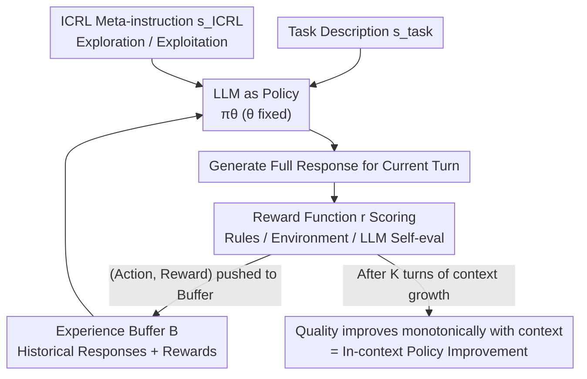

# Reward is Enough: LLMs are In-Context Reinforcement Learners

**Conference**: ICLR 2026  
**OpenReview**: [https://openreview.net/forum?id=keCXNHOe4W](https://openreview.net/forum?id=keCXNHOe4W)  
**Code**: None  
**Area**: Reinforcement Learning / Test-time Scaling / LLM Reasoning  
**Keywords**: In-Context Reinforcement Learning, ICRL, Test-time Self-improvement, Scalar Reward, Multi-turn Prompting

## TL;DR
This paper discovers that Reinforcement Learning behaviors emerge in LLMs during the inference phase (In-Context RL, ICRL). By concatenating past responses and corresponding scalar rewards into the context through multi-turn prompting, the model's response quality monotonically improves with context growth. It significantly outperforms Self-Refine and Reflexion on Game of 24, Creative Writing, ScienceWorld, and AIME/HMMT, remaining effective even when rewards are generated through self-evaluation.

## Background & Motivation

**Background**: To enable an LLM to function as an effective agent on new tasks, it must be capable of self-improvement during inference, a concept known as "test-time scaling." Sutton identified only two paths for trading computation for performance: search and learning. In the context of LLMs, search has been extensively explored, from Best-of-N to Tree-of-Thoughts and MCTS, all of which enhance performance using external search structures during inference.

**Limitations of Prior Work**: In contrast, the "learning" path at test time has been largely ignored. While In-Context Supervised Learning (ICL) is a form of inference-time learning, it requires expert demonstrations as ground-truth labels. Such data is difficult to acquire at scale during inference, limiting its applicability for test-time scaling. Reinforcement Learning is the most potent algorithm for "self-improvement without human knowledge," yet its success has been confined to simulated environments or the **training phase** of LLMs (e.g., RLHF / R1), and has never been verified to emerge spontaneously during the LLM **inference phase**.

**Key Challenge**: Most existing ICRL research is limited to bandits or small-scale simulated environments using small models trained from scratch, often requiring manual intervention. These methods fail to address open action spaces like natural language. The real world is a "big world"—environments are far more complex than agents. Agents must adapt on the fly during inference when encountering novel situations rather than incurring the high cost of retraining.

**Goal**: To verify whether Reinforcement Learning can spontaneously emerge during the inference phase (i.e., forward pass) of an LLM. If so, it would elegantly satisfy two needs: the LLM provides a general initial policy, while RL provides the capability for continuous self-improvement.

**Key Insight**: The authors adhere to a "minimality" principle. To prove that performance gains stem from the LLM’s intrinsic RL capability rather than external mechanisms, they deliberately exclude text gradients, prioritized experience replay, sampling heuristics, and additional engineering modules. The **only** supervisory signal provided to the model is the scalar reward itself. This aligns with Sutton’s "Reward Hypothesis" and Silver’s "Reward is Enough" hypothesis.

**Core Idea**: Utilizing a minimalist multi-turn prompting framework (ICRL prompting)—every turn, the "entire history of responses + corresponding scalar rewards" is appended to the context, along with a meta-instruction for exploration/exploitation. This encourages the model to maximize scalar reward signals during inference, behaving like an RL algorithm.

## Method

### Overall Architecture

ICRL prompting maps "multi-turn self-improvement of an LLM" directly onto the RL MDP framework: the LLM acts as the policy $\pi_\theta$ (parameters $\theta$ remain **fixed throughout**), the token generation process acts as agent-environment interaction (state = generated tokens, action = next token), each response is an episode, and a scalar reward is provided for each response. Similar to how ICL places $(x, y)$ pairs in the context, ICRL places "state-action-reward" triplets into the context along with simple meta-instructions.

The process is an outer loop (Algorithm 1): maintenance of an experience buffer $B$; at the start of the $k$-th episode, all history in the buffer (past responses + rewards), the task description $s_{\text{task}}$, and ICRL meta-instructions $s_{\text{ICRL}}$ are concatenated into the initial prompt $S_0$. The LLM executes the policy to generate a complete response, a reward function $r$ scores the response, and the "action sequence + step-wise rewards" are pushed back into buffer $B$ for the next episode. The key observation is that as the context (buffer) grows, response quality consistently improves—since $\theta$ is fixed, this improvement **must** originate from context growth, which is essentially "in-context policy improvement."

### Key Designs

**1. LLM as Policy + Scalar Reward as Sole Supervision: Reformulating Multi-turn Prompting as RL**

This addresses a specific pain point: previous test-time self-improvement relied on either search (external structures) or textual self-correction (like Self-Refine / Reflexion where natural language feedback is provided). The latter relies on the model’s parametric knowledge and is prone to hallucination accumulation, leading to performance collapse after a few iterations. This work treats each response as an action sequence of an episode. After the response, only a **numerical scalar** reward $R_{t+1} \doteq r(S_{t+1})$ is provided, with the word "Reward:" **explicitly** written before the number. The initial prompt $S_0$ for the next round consists of "buffer history + $s_{\text{task}}$ + $s_{\text{ICRL}}$." The model must infer a better response from the "response ↔ reward" patterns in the history—this is the fundamental difference of RL, "learning from rewards" rather than "correcting by instructions." The comparison between ICRL and Self-Refine/Reflexion is essentially **scalar vs. textual feedback**, where scalar feedback avoids amplifying hallucinations.

**2. Minimalist and Flexible Reward Functions: Eliminating the Need for External Feedback**

The reward $r$ can be sparse (only non-zero at the terminal state $R_T$, corresponding to outcome reward) or dense (non-zero at non-terminal states, corresponding to progress reward). Sources include rules, separately trained models, or **self-evaluation by the same LLM**. The most counter-intuitive design is the latter: when $r$ is the LLM’s own score, **no external feedback** exists in the framework, yet the authors expect the responses to improve. The underlying assumption is that "evaluation is easier than generation"—a model might not generate the optimal solution initially but can recognize which response is better, converting this asymmetry into improvement. The authors honestly hypothesize that the performance ceiling for pure self-evaluation will be lower than with external feedback (Game of 24 and Creative Writing use self-evaluation; Math/ScienceWorld use ground-truth rewards). To ensure improvement stems from intrinsic RL capability, the framework excludes external tools like text gradients or experience replay.

**3. Experience Buffer + Explore/Exploit Meta-instructions: Carrying "Policy" in Context**

The experience buffer $B$ concatenates as many past episode responses and rewards as possible (within context window limits) into the current prompt. The core assumption is that "pretrained LLMs inherently possess ICRL capabilities," and presenting experiences in the context allows "on-the-fly reinforcement learning" during the forward pass. On top of this, the authors use natural language meta-instructions $s_{\text{ICRL}}$ to explicitly inject RL's classical exploration-exploitation trade-off. Three types of instructions are used: exploration (requesting a new response different from all history), exploitation (requesting the best response based on the highest reward in history), and "explore or exploit." This leads to two strategies: **ICRL Preset** (alternating explore/exploit instructions by episode parity) and **ICRL Autonomous** (providing "explore or exploit" and letting the LLM decide). Ablations show this exploration capability distinguishes ICRL from Best-of-N: it can **generate** new responses superior to any seen during exploration, rather than just selecting the best from history.

### Mechanism Example: Game of 24

Given four numbers, use each exactly once with basic arithmetic to get 24. GPT-4.1 acts as both policy $\pi_\theta$ and reward $r$. The task description uses CoT for 4 thought steps, with 5 in-context examples for formatting. While a ground-truth reward $r^*$ exists, the algorithm only has access to $r$, where GPT-4.1 scores each step from 0–3 based on the "likelihood of reaching 24." Each episode has 4 rewards, which are appended with the "Reward:" label after each corresponding action in $S_0$. As trials increase, the success rate of ICRL Preset shows an "explore-exploit" oscillation and steady climb, reaching 90% after 50 trials, while Best-of-N (even with $r^*$ for selection) achieves 49%, Self-Refine 47%, and Reflexion 44%.

## Key Experimental Results

### Main Results

ICRL outperforms self-correction baselines (Self-Refine / Reflexion) and search baselines (Best-of-N) across four tasks:

| Task | Metric | ICRL (Ours) | Best-of-N | Self-Refine | Reflexion |
|------|------|------|----------|-------------|-----------|
| Game of 24 | Success Rate (50 trials) | **90%** (Preset) | 49% | 47% | 44% |
| Creative Writing | LC Win Rate (vs. baseline) | — | 93.81% | 86.32% | 59.48% |
| ScienceWorld | Avg Return | ~**20%** higher | — | — | — |

Note: Creative Writing uses Length-Controlled Alpaca-Eval 2.0. In Game of 24, Best-of-N used the ground-truth reward $r^*$ for selection but still lagged significantly.

Cross-model / Olympiad Math (Table 4, 32k context, CW=Creative Writing):

| Model | Method | HMMT | AIME | CW |
|------|------|------|------|-----|
| Qwen3-32B | Base | 9.14 | 22.54 | 34.14 |
| Qwen3-32B | ICRL | **33.33** | **46.66** | **50.00** |
| Llama-4 Maverick | Base | 8.50 | 17.58 | — |
| Llama-4 Maverick | ICRL | **20.00** | **35.00** | **50.00** |

ICRL consistently surpasses Self-Refine and Reflexion across models/tasks, typically improving 10–20 points over base models.

### Ablation Study

| Configuration | Effect | Description |
|------|------|------|
| Full (ICRL Preset/Autonomous) | Best Curve | Complete framework, robust to prompt settings |
| Zero Rewards | Significant drop | Removing reward signals causes degradation |
| Short Context (Last 3 episodes) | Significant drop | Performance drops as context shortens, confirming context growth is key |
| Exploration Only | Significantly worse | Proves improvement is not just "sampling and picking" like Best-of-N |
| Exploitation Only | Near optimal | Strong performance even with only exploitation, highlighting reward signal core |
| No ICRL Instruction | Drop | Meta-instructions are helpful |

### Key Findings
- **"Degradation without rewards, improvement with context" is the ICRL "Duck Test"**: Authors observed reward maximization, explore-exploit trade-offs, gains from context growth, and drops from context shortening or reward removal—all typical RL behaviors, implying RL emerges during inference.
- **Exploration is key to distinguishing ICRL from search**: The "Exploration Only" running-max curve is significantly lower than ICRL, showing ICRL **generates** better responses rather than just selecting from a sample pool.
- **True test-time learning vs. test-time search**: When summarizing arXiv papers published after training data cutoff, Best-of-N and Reflexion plateau quickly, while ICRL continues to improve, proving it learns from external rewards rather than searching parametric knowledge.
- **Context length as compute efficiency**: For Qwen3-32B, CW win rates remain stable while AIME scores rise from 40% to 46.66% as context grows from 8k to 32k, showing better performance per unit of compute compared to Self-Refine.

## Highlights & Insights
- **Strictly aligning multi-turn prompting to MDP**: Mapping states, actions, and episodes allows "test-time self-improvement" to be described precisely in RL language. Since $\theta$ is fixed, gains are attributed solely to context, creating a clean logical loop.
- **Minimality as both design and proof**: Deliberately removing engineering components isolates the "intrinsic RL capability" of LLMs. This "subtraction for proof" methodology is highly effective.
- **Self-eval rewards enable endogenous scaling**: When the same LLM provides rewards, no external information enters the loop, yet the model improves. This leverages the "eval-generation asymmetry" into a new test-time scaling paradigm.

## Limitations & Future Work
- The performance ceiling with pure self-evaluation is lower than with external feedback, limited by the model's evaluation capability.
- Strong dependency on long-context capabilities: Buffer requirements might hit context window or compute budget limits; Self-Refine plateaus or drops in CW due to excessive context growth.
- "Emergent RL" is a behavioral attribution (the "Duck Test"); it lacks a mechanistic proof of which specific RL algorithm is being implemented in the forward pass.
- Experiments focus on text and benchmarks; applicability to sparse-reward "big world" tasks remains to be verified.

## Related Work & Insights
- **vs. Self-Refine / Reflexion**: These use natural language feedback as "new instructions," creating language-guided search that risks hallucination accumulation; ICRL uses scalar rewards, forcing the model to infer patterns, facilitating learning from failure.
- **vs. Best-of-N / ToT / MCTS**: These are test-time search methods relying on external heuristics; ICRL relies on internal learning and can generate novel solutions beyond its sampling history.
- **vs. Traditional ICRL**: Previous works utilized small models or restricted environments (bandits); this work validates ICRL emergence in open natural language action spaces using pretrained LLMs.
- **vs. prompt optimization**: Those methods use top-k selection and filtering (Behavioral Cloning/SL style); ICRL learns from negative experiences, making it closer to true RL.

## Rating
- Novelty: ⭐⭐⭐⭐⭐ Systematically demonstrates "RL emergence in inference" with a minimalist, isolated framework.
- Experimental Thoroughness: ⭐⭐⭐⭐ Covers 4 tasks, multiple models, and 6 ablations; mechanistic evidence is primarily behavioral.
- Writing Quality: ⭐⭐⭐⭐⭐ Clear logical derivation (big world, reward hypothesis) and "Duck Test" argumentation.
- Value: ⭐⭐⭐⭐⭐ Proves a new paradigm for test-time scaling, especially the effectiveness of self-evaluation.

<!-- RELATED:START -->

## Related Papers

- [\[ICLR 2026\] Principled Fast and Meta Knowledge Learners for Continual Reinforcement Learning](principled_fast_and_meta_knowledge_learners_for_continual_reinforcement_learning.md)
- [\[ICLR 2026\] Enough is as good as a feast: A Comprehensive Analysis of How Reinforcement Learning Mitigates Task Conflicts in LLMs](enough_is_as_good_as_a_feast_a_comprehensive_analysis_of_how_reinforcement_learn.md)
- [\[ICLR 2026\] LongRLVR: Long-Context Reinforcement Learning Requires Verifiable Context Rewards](longrlvr_long-context_reinforcement_learning_requires_verifiable_context_rewards.md)
- [\[ICLR 2026\] Vintix II: Decision Pre-Trained Transformer is a Scalable In-Context Reinforcement Learner](vintix_ii_decision_pre-trained_transformer_is_a_scalable_in-context_reinforcemen.md)
- [\[ICLR 2026\] Scalable In-Context Q-Learning](scalable_in-context_q-learning.md)

<!-- RELATED:END -->
