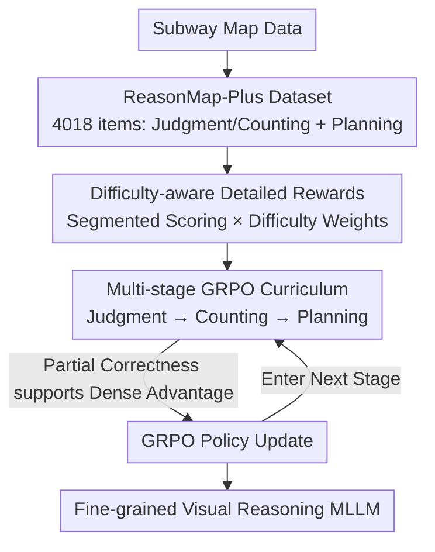

# RewardMap: Tackling Sparse Rewards in Fine-grained Visual Reasoning via Multi-Stage Reinforcement Learning

**Conference**: ICLR 2026  
**arXiv**: [2510.02240](https://arxiv.org/abs/2510.02240)  
**Code**: [Project Page](https://fscdc.github.io/RewardMap)  
**Area**: Reinforcement Learning  
**Keywords**: Multimodal Large Language Models, Visual Reasoning, Sparse Rewards, Multi-Stage RL, Subway Route Planning

## TL;DR

Ours proposes the RewardMap framework to overcome sparse rewards in fine-grained visual reasoning through difficulty-aware detailed reward design and a multi-stage RL curriculum strategy transitioning from simple perception to complex reasoning.

## Background & Motivation

Fine-grained visual reasoning (e.g., subway route planning) is a core challenge for Multimodal Large Language Models (MLLMs). The ReasonMap benchmark reveals that even advanced MLLMs struggle with spatial reasoning in structured, information-dense visual scenes.

Applying standard RL methods (e.g., GRPO) directly to such complex tasks faces a **sparse reward bottleneck**:
- Success signals are only provided at the end of long reasoning chains (final answer correct/incorrect).
- Task difficulty further amplifies sparsity—most sampled rewards $r_i \approx 0$.
- In GRPO, when all samples in a group fail, the intra-group advantage $\hat{A}_i$ approaches zero, resulting in weak gradient signals and convergence difficulties.

While traditional SFT provides dense supervision, it fails to empower the model with long-chain decision-making reasoning capabilities. The **Key Challenge** is the mismatch between task complexity and supervision signal density.

**Key Insight**: (1) Construct the ReasonMap-Plus dataset as a source for dense reward cold starting; (2) Design a coarse-to-fine multi-stage RL training process to transition from perception to reasoning.

## Method

### Overall Architecture

RewardMap addresses sparse rewards in fine-grained visual reasoning (represented by subway route planning), where binary success signals are only provided at the end of a long reasoning chain. To prevent RL from failing due to zero signals on difficult problems, it modifies the rewards to allow partial credit and restructures the training sequence. The model "warms up" on simple perception tasks with dense rewards before transitioning to complex planning tasks. This is supported by two components: difficulty-aware detailed rewards that decompose signals into segment-based scores, and multi-stage GRPO curricula that organize training data from "judgment → counting → planning." The ReasonMap-Plus dataset is specifically constructed to provide simple tasks for cold starting.

### Key Designs

**1. ReasonMap-Plus Dataset: Preparing dense-reward simple tasks for RL cold start.**

ReasonMap planning tasks are too sparse for direct cold starts. Ours utilizes the Metro Data from ReasonMap to construct 4,018 VQA problems covering 30 cities, 13 countries, and 5 expanded types, categorized by difficulty into global counting, local counting, and judgment. These problems have unique answers and automatically generated labels, ensuring higher accuracy and dense rewards. Functions as "warm-up material" in the curriculum to solidify basic visual understanding (reading maps, counting stations) before approaching long-chain reasoning.

**2. Difficulty-aware Detailed Reward: Decomposing binary signals into segmentable dense rewards.**

The sparsity of planning tasks stems from holistic answer evaluation. However, a subway route consists of independently verifiable parts. Logic behind detailed rewards exploits this structure: rewards/penalties are assigned for start/end points, line names, transfer stations, and segment counts. Even if the final answer is incorrect, the model receives partial credit for correct segments. Total reward is formulated as:

$$R = W_{\text{difficulty}}(R_{\text{format}} + R_{\text{correctness}} + \alpha \times R_{\text{detail}})$$

Where $R_{\text{format}}$ and $R_{\text{correctness}}$ are existing format and correctness rewards, $R_{\text{detail}}$ is the new partial credit term, and $\alpha$ controls its weight. This is scaled by a difficulty weight $W_{\text{difficulty}} = W_{\text{map}} + W_{\text{question}}$, determined by map complexity and transfer counts—harder tasks provide larger learning signals upon success to prevent the model from only optimizing for simple cases. This preserves gradients in GRPO that would otherwise disappear when $\hat{A}_i \approx 0$.

**3. Multi-Stage GRPO Curriculum: Perception before reasoning to avoid collapse.**

Directly exposing RL to difficult planning tasks can cause training to collapse. Ours employs a global curriculum strategy, sequencing training as judgment → counting → planning to bridge the transition from perception to reasoning. Lower-level tasks provide dense rewards for effective cold starts. While the global stages are ordered, samples within each stage are shuffled (local randomness) to prevent overfitting to a fixed curriculum trajectory and maintain generalization.

### Loss & Training

Ours follows the standard GRPO policy gradient objective, using group relative advantage for updates. The primary innovation lies in the reward structure and data scheduling. Using RL for cold start instead of SFT ensures that reward signals and task objectives are aligned from the first step, avoiding overfitting and cognitive rigidity associated with SFT supervision and RL reward mismatch.

## Key Experimental Results

### Main Results (Qwen2.5-VL-7B-Instruct)

| Method | ReasonMap Weighted Acc (S/L) | ReasonMap-Plus Weighted Acc |
|------|-------------------------|------------------------|
| Base Model | 13.28%/7.12% | 44.21% |
| +RL (GRPO) | 26.22%/26.04% | 44.64% |
| +RL (REINFORCE++) | 27.17%/27.60% | - |
| +RewardMap (Full) | **Best** | **Best** |

### Ablation Study

| Configuration | Key Metrics | Description |
|------|---------|------|
| Format + Correctness Reward only | Baseline performance | Learning difficulty under sparse rewards |
| + Detailed Reward | Substantial improvement | Partial credit mitigates sparsity |
| + Difficulty Weights | Further improvement | Harder tasks contribute more learning signal |
| + Multi-stage Curriculum | Best performance | Cold-start strategy effectiveness |

### Key Findings
- Models trained with RewardMap show an average improvement of 3.47% across 6 external benchmarks, indicating strong generalization.
- RL cold start outperforms SFT cold start, avoiding SFT-induced overfitting and cognitive rigidity.
- GPT-5 achieves 59.98%/62.50% on ReasonMap, highlighting the extreme difficulty of the task.
- Seed1.5-VL and GPT-4o reach 73.58% and 64.42% on ReasonMap-Plus, respectively.

## Highlights & Insights

- **Valuable Problem Definition**: Subway route planning serves as a natural testbed for MLLM visual reasoning, offering both practical utility and scientific value.
- **RL as Cold-Start for SFT**: Replacing SFT cold-starts with RL is an insightful design choice to avoid supervisor/reward mismatch.
- **Smart Reward Engineering**: Leverages the inherent structural nature of planning tasks (verifiable start, end, and transfers) to decompose rewards.

## Limitations & Future Work

- Detailed reward design relies on task-specific structural information; generalization to other visual reasoning tasks requires manual redesign.
- Hyperparameters for difficulty weights ($\gamma_e, \gamma_m, \gamma_h, \beta_0, \beta_1$) require pre-setting.
- Current validation is restricted to the Qwen2.5-VL model family; architectural generalization remains unknown.

## Related Work & Insights

- ReasonMap (Feng et al., 2025b) provides the benchmark and data foundation for Ours.
- GRPO (Shao et al., 2024) provides the RL optimization framework.
- Curriculum RL (Parashar et al., 2025) principles inspired the multi-stage design.
- Insight: For complex reasoning tasks, reward engineering may be more critical than core algorithm innovation.

## Rating
- Novelty: ⭐⭐⭐⭐ Multi-stage RL cold-starting instead of SFT is innovative, though individual components are standard.
- Experimental Thoroughness: ⭐⭐⭐⭐ Multi-benchmark validation including external generalization and ablation studies.
- Writing Quality: ⭐⭐⭐⭐ Clear motivation and framework visualization.
- Value: ⭐⭐⭐⭐ Provides a practical solution for RL training in MLLM visual reasoning.

<!-- RELATED:START -->

## Related Papers

- [\[ICLR 2026\] DiVE-k: Differential Visual Reasoning for Fine-grained Image Recognition](dive-k_differential_visual_reasoning_for_fine-grained_image_recognition.md)
- [\[ICLR 2026\] SRFT: A Single-Stage Method with Supervised and Reinforcement Fine-Tuning for Reasoning](srft_a_single-stage_method_with_supervised_and_reinforcement_fine-tuning_for_rea.md)
- [\[ICLR 2026\] Q-Learning with Fine-Grained Gap-Dependent Regret](q-learning_with_fine-grained_gap-dependent_regret.md)
- [\[ICLR 2026\] R1-Code-Interpreter: LLMs Reason with Code via Supervised and Multi-stage Reinforcement Learning](r1-code-interpreter_llms_reason_with_code_via_supervised_and_multi-stage_reinfor.md)
- [\[ICLR 2026\] Preference-based Policy Optimization from Sparse-reward Offline Dataset](preference-based_policy_optimization_from_sparse-reward_offline_dataset.md)

<!-- RELATED:END -->
