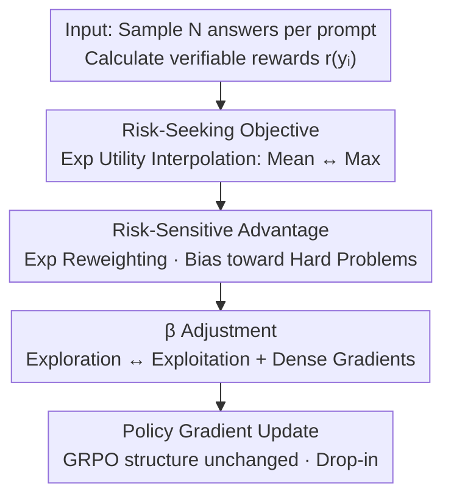

# Risk-Sensitive Reinforcement Learning for Alleviating Exploration Dilemmas in Large Language Models

**Conference**: ICLR 2026  
**OpenReview**: [https://openreview.net/forum?id=7kC8ORye4l](https://openreview.net/forum?id=7kC8ORye4l)  
**Area**: Reinforcement Learning / LLM Reasoning  
**Keywords**: Risk-sensitive RL, RLVR, Exploration Dilemma, pass@k, GRPO

## TL;DR
To address the "exploration dilemma" in Reinforcement Learning with Verifiable Rewards (RLVR), where pre-trained LLMs only strengthen existing sparse solutions leading to stagnant or declining diversity (pass@k), this paper constructs a risk-seeking objective using exponential utility that smoothly interpolates between "mean reward" and "max reward." This derives the RS-GRPO algorithm, which requires only modifying the advantage function, effectively improving pass@k while maintaining or enhancing pass@1 across 6 mathematical reasoning benchmarks and 5-6 LLMs.

## Background & Motivation

**Background**: RLVR (RL using verifiable rewards) has become the dominant paradigm for enhancing the complex reasoning capabilities of LLMs, as seen in models like DeepSeek-R1 and o1, pushing pass@1 accuracy significantly. The standard approach involves policy gradient algorithms like GRPO, which optimize the **expectation (mean)** of answer rewards.

**Limitations of Prior Work**: A common failure mode is observed: RLVR often improves pass@1 by "sharpening" the policy distribution onto a few homogenized solutions, concentrating probability mass excessively. Consequently, solution diversity collapses, and the pass@k metric (at least one correct among k samples), which better reflects exploration capability, stagnates or even falls below the base model. In essence, RL "distills" existing capabilities rather than "discovering" new reasoning strategies.

**Key Challenge**: The root cause is attributed to a fundamental mismatch between the LLM optimization landscape and standard RL dynamics. Unlike traditional RL (e.g., Chess) which starts from random initialization and encourages broad exploration, LLMs begin with a **highly sharp policy distribution already clustered around specific solutions**. If these initial peaks are not in the optimal reward region, standard RL optimizers struggle to escape the "gravity" of pre-training bias, converging toward nearby sub-optimal modes.

**Goal**: Design an RL framework capable of breaking local optima induced by initial bias to explore uncovered regions of the solution space without sacrificing pass@1.

**Key Insight**: Since the problem stems from "optimizing only the mean reward," the objective is shifted to emphasize all high-reward outcomes, leaning toward the "maximum reward." Risk-sensitive RL provides a natural framework for controllable interpolation between "mean" and "max."

**Core Idea**: Replace the risk-neutral (mean-optimizing) objective with a risk-seeking (max-biased) objective using an exponential utility function. This derives RS-GRPO—a method that **only modifies the advantage function while keeping the rest of the architecture intact**—dynamically increasing learning weights for "hard problems" to force exploration.

## Method

### Overall Architecture

The core proposition of RS-GRPO can be summarized as: **modifying only the advantage calculation within GRPO while keeping everything else unchanged**. Standard GRPO samples N answers for a prompt and uses the reward minus the group mean as the advantage. RS-GRPO replaces this with a **risk-sensitive advantage** derived from a "risk-seeking objective," which exponentially amplifies high-reward samples and suppresses low-reward ones. This shifts the optimization focus from "medium-difficulty" prompts to "low-accuracy hard problems," driving deeper exploration. The data flow is: sample N answers → calculate verifiable rewards → construct risk-seeking objective with exponential utility → derive risk-sensitive advantage (reweighted by difficulty) → adjust exploration/exploitation via hyperparameter $\beta$ → update via GRPO policy gradient.

### Key Designs

**1. Risk-Seeking Objective: Smooth Interpolation between "Mean" and "Max" via Exponential Utility**

Standard objectives $J(\pi_\theta)=\mathbb{E}_{x,y}[r(x,y)]$ only optimize reward **expectation**. The policy can increase the mean simply by concentrating probability on its current most likely solution, lacking incentive to reach low-probability, high-reward solutions. This paper adopts a risk-sensitive objective:

$$J_{RS}(\pi_\theta)=\mathbb{E}_{x\sim D}\left[\frac{1}{\beta}\log \mathbb{E}_{y\sim\pi_\theta(\cdot|x)}\left[e^{\beta r(y)}\right]\right]$$

Here, the hyperparameter $\beta\in\mathbb{R}$ acts as the "risk sensitivity" switch: as $\beta\to 0$, Taylor expansion returns it to the standard expected reward $\mathbb{E}[r(y)]$ (risk-neutral); as $\beta\to+\infty$, it approaches $\max_y r(y)$ (risk-seeking, encouraging exploration); as $\beta\to-\infty$, it approaches $\min_y r(y)$ (risk-averse). Ours utilizes the risk-seeking side ($\beta>0$)—the larger $\beta$, the more the objective values high-reward outcomes, sliding from "mean" to "max." The key is not introducing new networks or loss terms, but adopting an objective that **prioritizes "finishing correctly at least once" over "how good the average is,"** aligning perfectly with the semantics of pass@k.

**2. Risk-Sensitive Advantage: A Drop-in Formula for GRPO Advantage**

The risk-sensitive objective is integrated into the policy gradient. Ours proves (Theorem 1) that the gradient $\nabla_\theta J_{RS}=\mathbb{E}[A_\beta^{\pi_\theta}(y)\nabla_\theta\log\pi_\theta(y|x)]$ retains the standard form, but with a risk-sensitive advantage:

$$A_\beta^{\pi_\theta}(y)=\frac{1}{\beta}\left(\frac{e^{\beta r(y)}}{\mathbb{E}_{y'\sim\pi_\theta}[e^{\beta r(y')}]}-1\right)$$

In practice, the expectation in the denominator is replaced by the empirical mean of N samples: $\hat{A}_\beta^{\pi_\theta}(y_i)=\frac{1}{\beta}\big(\frac{e^{\beta r(y_i)}}{\frac{1}{N}\sum_j e^{\beta r(y_j)}}-1\big)$. The elegance lies in **modifying only the advantage calculation while keeping the policy gradient structure identical**, allowing it to be a plug-and-play replacement in GRPO (and variants like DAPO). Mechanistically, it performs an exponential transformation $e^{\beta r}$: for binary rewards (common in RLVR), it **increases rewards for correct answers on low-accuracy hard problems and reduces penalties for incorrect answers on high-accuracy simple problems**. This shifts the total advantage magnitude from 50% accuracy peaks to "low-accuracy hard problems," driving exploration.

**3. Mechanism: The Dual Nature of β**

Risk sensitivity $\beta$ is not "the larger the better." Using a multi-armed bandit model, Lemma 2 indicates that standard policy gradients can **decrease the probability of the optimal action** when a "sub-optimal but above-mean" action exists. Lemma 3 proves that with a sufficiently large $\beta$, risk-sensitive updates will always **increase** the probability of the optimal action. Together, these explain why $\beta\ge 4$ escapes local optima in a 100-arm bandit experiment whereas $\beta=0$ fails. However, Lemma 4 provides a constraint: beyond a certain threshold, the magnitude of the increase in the optimal action's probability **decreases** as $\beta$ grows, slowing convergence. Practically, $\beta=2$ is identified as the best trade-off between pass@k and pass@1.

### Loss & Training

The training framework is based on VeRL and incorporates dynamic sampling from DAPO (filtering samples where all are correct or all are incorrect) and the clip-higher trick. All comparative experiments share the same hyperparameters, with the only variable being the substitution of standard advantage with risk-sensitive advantage. Base models include Qwen2.5-Math-1.5B/7B, Qwen2.5-7B, Qwen3-4B-Base, and Llama3.1-8B-Instruct. Training sets consist of math12k, deepmath103k, and dapo17k.

## Key Experimental Results

### Main Results

Evaluated on 6 mathematical reasoning benchmarks (MATH500, AIME24/25, HMMT-Feb24/25, CMIMC25), sampling N=1024 for most problems and N=32 for MATH500 to estimate pass@k. Table 2 summary (pass@1 / pass@32, subscripts denote gains over GRPO):

| Model (Training Set) | Metric | Base | GRPO | RS-GRPO |
|--------|------|------|------|---------|
| Qwen2.5-Math-1.5B (deepmath103k) | Pass@1 Avg | 6.7 | 21.4 | 21.3 (-0.1) |
| Qwen2.5-Math-1.5B (deepmath103k) | Pass@32 Avg | 30.5 | 37.5 | **42.0 (+4.5)** |
| Qwen2.5-Math-7B (deepmath103k) | Pass@1 Avg | 4.9 | 26.6 | **28.6 (+2.0)** |
| Qwen2.5-Math-7B (deepmath103k) | Pass@32 Avg | 28.7 | 45.3 | **48.3 (+3.0)** |
| Qwen2.5-Math-7B (dapo17k) | Pass@1 Avg | 4.9 | 24.5 | **26.4 (+1.9)** |
| Qwen2.5-Math-7B (dapo17k) | Pass@32 Avg | 28.7 | 40.0 | **44.5 (+4.5)** |

Overall trend: RS-GRPO consistently exceeds GRPO by ~4% on pass@32 while maintaining or improving pass@1. Compared to other pass@k optimization methods (e.g., Walder & Karkhanis 2025, Chen et al. 2025), which often lag behind GRPO on pass@1, RS-GRPO pulls up pass@1 while matching their pass@32 performance.

### Ablation Study

Training dynamics analysis for $\beta\in\{0,2,4,8\}$ on Qwen2.5-Math ($\beta=0$ is standard GRPO):

| Config | Cumul. Solve Rate | Reward Growth | Test pass@32 | Test pass@1 |
|------|------|---------|---------|---------|
| $\beta=0$ (GRPO) | Lowest | Fastest | Baseline | Baseline |
| $\beta=2$ | Increased | Slower | +~5% | +1~2% (Best Trade-off) |
| $\beta=4,8$ | Further Higher | Much Slower | Continued Gain | Maintained |

### Key Findings

- **Hard-problem-driven exploration is the core mechanism**: As $\beta$ increases, the cumulative training solve rate (percentage of problems solved at least once) rises, while reward growth slows—indicating signals are moved to hard problems. The slower reward growth acts as a form of anti-overfitting regularization.
- **Moderate Optimal $\beta$**: $\beta=2$ yields ~5% gain in pass@32 and 1~2% in pass@1; excessive $\beta$ continues exploration but significantly delays convergence.
- **Base pass@k ceiling**: For certain models (Qwen2.5-7B, Llama3.1-8B), RS-GRPO still fails to surpass the base model's performance when k is very large, likely because the global optimum is too far from the initial distribution.
- **Dense gradients facilitate pass@1**: Many pass@k methods zero out weights when prompt accuracy exceeds a threshold, hurting pass@1. Risk-sensitive advantage retains non-zero gradients for high-accuracy prompts, better balancing pass@1 and pass@k.

## Highlights & Insights
- **Reframing exploration as risk preference**: By replacing intrinsic reward networks or entropy terms with an exponential utility objective, exploration is achieved through a clean, theoretically sound mechanism.
- **Engineering-friendly drop-in**: Modifying only the advantage calculation allows for easy integration into existing GRPO/DAPO pipelines with minimal code changes.
- **Semantic alignment**: pass@k is essentially "max of k," and the risk-seeking objective interpolates toward maximum reward, aligning the optimization target directly with the evaluation metric.
- **Theoretical grounding for $\beta$**: Lemmas 2-4 explain why risk-seeking is necessary and why $\beta$ shouldn't be infinite, providing clear guidance for tuning.

## Limitations & Future Work
- **Reach of global optima**: When the global optimum is extremely distant from the initial policy, RS-GRPO still settles in local optima (e.g., in high-k regimes for some models).
- **Scope of verification**: Only validated on mathematical reasoning with verifiable rewards; effectiveness in sparse or subjective scenarios like code, agents, or open generation is unknown.
- **Model-dependent $\beta$**: While $\beta=2$ is an empirical best, the threshold $\bar\beta$ depends on the specific policy and reward landscape, lacking an adaptive mechanism.
- **Numerical Stability**: $e^{\beta r}$ may pose numerical stability issues at high $\beta$ or varying reward scales, which requires further implementation-level stabilization.

## Related Work & Insights
- **vs. Standard GRPO/DAPO**: These are risk-neutral, optimizing mean rewards and sharpening existing solutions. RS-GRPO uses risk-seeking to weight hard problems, expanding exploration boundaries for significantly better pass@k without losing pass@1.
- **vs. Entropy/Intrinsic Reward**: Those methods encourage exploration via added complexity (new networks or entropy terms); Ours achieves this through the fundamental optimization objective.
- **vs. Other pass@k methods**: Previous methods often hit gradient vanish for high-accuracy prompts, hurting pass@1; RS-GRPO supports continuous rewards and maintains dense gradients.
- **vs. Classical Risk-Sensitive RL**: Traditionally used for risk-aversion in safety-critical robotics/finance, Ours uniquely applies exponential utility for **risk-seeking** to escape sharp initial distributions in LLMs.

## Rating
- Novelty: ⭐⭐⭐⭐⭐ Reframing LLM exploration through risk-sensitive RL is insightful and theoretically aligned.
- Experimental Thoroughness: ⭐⭐⭐⭐ Extensive benchmarks and model coverage, though restricted to math reasoning.
- Writing Quality: ⭐⭐⭐⭐ Clear chain of logic from motivation to theory and experiments.
- Value: ⭐⭐⭐⭐⭐ Practical, drop-in improvement for GRPO-based RLVR.

<!-- RELATED:START -->

## Related Papers

- [\[ICLR 2026\] CDE: Curiosity-Driven Exploration for Efficient Reinforcement Learning in Large Language Models](cde_curiosity-driven_exploration_for_efficient_reinforcement_learning_in_large_l.md)
- [\[ICLR 2026\] Representation-Based Exploration for Language Models: From Test-Time to Post-Training](representation-based_exploration_for_language_models_from_test-time_to_post-trai.md)
- [\[ICLR 2026\] Using Reinforcement Learning to Train Large Language Models to Explain Human Decisions](using_reinforcement_learning_to_train_large_language_models_to_explain_human_dec.md)
- [\[ICLR 2026\] On Predictability of Reinforcement Learning Dynamics for Large Language Models](on_predictability_of_reinforcement_learning_dynamics_for_large_language_models.md)
- [\[ICLR 2026\] Toward Efficient Exploration by Large Language Model Agents](toward_efficient_exploration_by_large_language_model_agents.md)

<!-- RELATED:END -->
