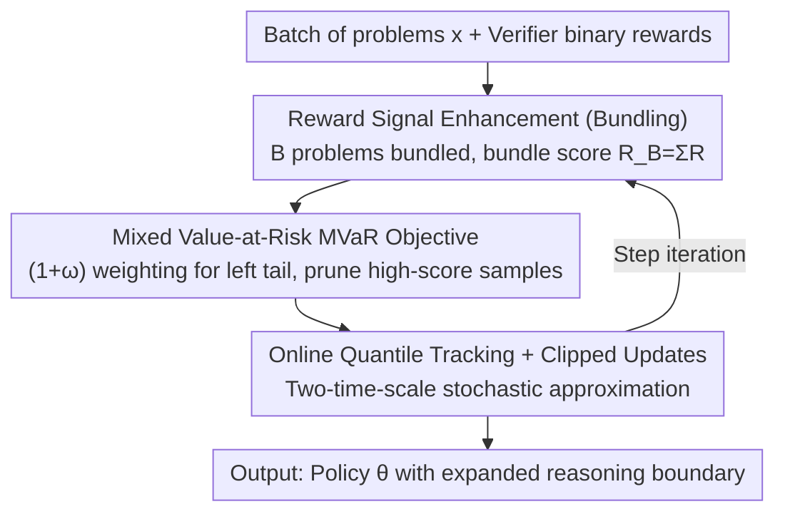

# RiskPO: Risk-based Policy Optimization with Verifiable Reward for LLM Post-Training

**Conference**: ICLR 2026  
**OpenReview**: [https://openreview.net/forum?id=KjHB7rebQO](https://openreview.net/forum?id=KjHB7rebQO)  
**Code**: https://github.com/RTkenny/RiskPO  
**Area**: Reinforcement Learning / LLM Post-Training / RLVR  
**Keywords**: RLVR, Risk metrics, Entropy collapse, Policy optimization, Reasoning capability

## TL;DR
Addressing the issues of early entropy collapse and reasoning boundary stagnation in RLVR methods like GRPO that "optimize mean reward," this paper proposes RiskPO. It replaces the mean objective with a Mixed Value-at-Risk (MVaR) objective, focusing gradient signals on the left tail of the reward distribution (hard problems). Combined with problem bundling to transform binary feedback into a continuous distribution, RiskPO consistently outperforms GRPO and its variants in Pass@1 and Pass@k across mathematical, multimodal, and code reasoning tasks.

## Background & Motivation

**Background**: Reinforcement Learning with Verifiable Rewards (RLVR) has become a mainstream post-training paradigm for enhancing LLM reasoning. Unlike RLHF, which relies on human preferences, RLVR uses rule-based verifiers to provide binary "correct/incorrect" rewards, aiming to maximize expected reward $J(\theta)=\mathbb{E}_{x,y}[R(y)]$. GRPO has become the de facto baseline in this field by removing the redundant value model structure of standard RL and using "group-relative normalized rewards" instead.

**Limitations of Prior Work**: Methods represented by GRPO exhibit **entropy collapse** in early training—policy entropy drops rapidly, leading to premature convergence and performance plateaus. Entropy is a key indicator of exploration capability; once it collapses, the model becomes overconfident and stops exploring. Observed improvements are often merely "more efficient sampling of already known answers" (increase in Pass@1 without expanding the reasoning boundary), rather than learning truly new reasoning skills.

**Key Challenge**: The root cause lies in GRPO's use of the **mean** as the optimization target. A mean-based objective naturally favors high-probability, common generation paths while ignoring rare but informative reasoning trajectories. Worse, when all sampled answers for a problem are incorrect, GRPO's normalized advantage collapses to zero—the model receives no learning signal in its weakest areas, and gradient updates accumulate on simple problems already mastered, leading to diminishing returns.

**Goal**: Shift the optimization objective from the "mean of the distribution" to the "structure of the distribution," specifically the **left tail** representing hard problems, allowing fine-grained and robust training signals to drive the model to conquer unsolved tasks.

**Key Insight**: The authors adopt a distributional perspective from risk-sensitive reinforcement learning—the left tail of the reward distribution represents the difficult problems the model has yet to master. Risk-averse objectives like CVaR/RVaR amplify gradient signals for low-reward samples, naturally encouraging the model to reduce overconfidence, diversify its search, and explore new reasoning strategies.

**Core Idea**: Use **risk metrics** instead of the mean as the RLVR training objective—specifically a "Mixed Value-at-Risk (MVaR)" objective that weights multiple distribution segments. By bundling multiple problems into a single unit, sparse binary feedback is converted into a continuous distribution, mitigating entropy collapse and expanding the reasoning boundary.

## Method

### Overall Architecture

RiskPO takes a batch of training problems as input and outputs optimized policy parameters. Building on the standard RLVR sampling loop (sampling $G$ responses per problem with binary rewards), it performs two main operations: **densifying the feedback signal** and **optimizing with a risk-sensitive objective**.

The first step, "Reward Signal Enhancement," addresses the coarse nature of binary 0/1 rewards. RiskPO bundles $B$ problems together, using the sum of scores within the bundle $R_B=\sum_{i=1}^{B}R(y_i)$ as the new reward unit. Sparse binary feedback is aggregated into a more continuous bundle score distribution, which distinguishes different difficulty levels and avoids the zero-gradient issue when all samples are incorrect.

The second step, "Risk-Sensitive Policy Optimization," defines an MVaR objective over the bundle score distribution. It online tracks the $\alpha$ and $\beta$ quantiles $F_\theta^{-1}(\alpha), F_\theta^{-1}(\beta)$, concentrates gradient weights on the left tail (hard problems), and prunes gradient signals for well-learned high-score samples. A clipped trust-region update (sequence-level importance sampling) is used to stabilize multi-step updates. The overall framework is a **two-time-scale stochastic approximation** algorithm: one time-scale updates the quantile tracker, and the other updates the policy parameters.

### Key Designs

**1. Mixed Value-at-Risk (MVaR) Objective: Shifting Focus to the Left Tail**

This core component replaces GRPO's mean objective. First, consider Range Value-at-Risk (RVaR), which measures the conditional expectation of rewards within the $[\alpha, \beta]$ quantile range: $J_{\text{RVaR}_{\alpha:\beta}}(\theta)=\mathbb{E}[R(y)\mid R(y)\in[F_\theta^{-1}(\alpha),F_\theta^{-1}(\beta)]]$. This acts as a "window" for control. When $\alpha=0$, it simplifies to CVaR at the $\beta$ level. MVaR further combines multiple weighted windows:

$$J_{\text{MVaR}^\omega_{\alpha:\beta}}(\theta)=\Big[(1+\omega)\!\int_{F_\theta^{-1}(0)}^{F_\theta^{-1}(\alpha)}+\int_{F_\theta^{-1}(\alpha)}^{F_\theta^{-1}(\beta)}\Big]\,r\,dF_\theta(r),$$

where $\omega\ge 0$ controls the emphasis on tail samples. The hardest left tail $[0, \alpha]$ is extra-weighted by $(1+\omega)$, while high-score samples above $\beta$ are excluded from current training. Intuitively, it "shifts gradients from mastered problems to unlearned ones." Theorem 1 provides the strategy gradient form for RVaR: $\nabla_\theta J_{\text{RVaR}_{\alpha:\beta}}=\frac{1}{\beta-\alpha}\mathbb{E}[g(R(y),F_\theta^{-1}(\alpha),F_\theta^{-1}(\beta))\nabla_\theta\ln\pi_\theta(y|x)]$, where $g(z,a,b)=(z-a)^+-(z-b)^++a-b$, allowing this distributional objective to be optimized via gradient ascent. Compared to GRPO, it avoids over-emphasizing common paths and provides stronger learning signals for weak areas.

**2. Bundling Reward Signal Enhancement: Aggregating Binary Feedback**

Single-problem binary rewards contain low information for risk metrics—especially when all samples are wrong, leading to zero advantage. The authors group $B$ problems into a bundle $X=\{x_i\}_{i=1}^{B}$ and use the bundle score sum $R_B=\sum_i R(y_i)$ as the optimization unit. Rewards are transformed from $\{0, 1\}$ to a finer distribution $\{0, 1, \dots, B\}$, which distinguishes "difficulty levels" and avoids zero gradients. Implementation-wise, $G$ responses $\{y_i^j\}_{j=1}^G$ are sampled per problem. For each problem, a permutation $\xi_i\sim\text{Unif}(S_G)$ is independently sampled, and $G\times B$ responses are concatenated **without replacement** into $G$ non-overlapping bundles (the $j$-th bundle uses $\{y_i^{\xi_{i,j}}\}_{i=1}^B$). This ensures each response is used once while facilitating $G$ bundles to estimate MVaR advantage $A_j$. The bundle size $B$ is a key hyperparameter: too large dilutes gradients across many samples; too small destabilizes quantile tracking. $B=5$ was found to be optimal.

**3. Online Quantile Tracking + Clipped Trust Region Updates: Stable Training**

MVaR advantages depend on real-time quantiles $F_\theta^{-1}(\alpha), F_\theta^{-1}(\beta)$, which drift as the policy changes. RiskPO tracks them online: $q^s_{k+1}=q^s_k+\gamma_k\big(s-\frac{1}{G}\sum_j \mathbb{1}\{R_{B_j}<q^s_k\}\big),\ s\in\{\alpha,\beta\}$, using different learning rates (time scales) for quantile estimation and parameter updates. To support multi-step updates, a clipped trust-region objective is used with **sequence-level** importance sampling ratios $s_i^j(\theta)=\big(\pi_\theta(y_i^{\xi_{i,j}}|x_i)/\pi_{\theta'}(y_i^{\xi_{i,j}}|x_i)\big)^{1/|y_i^{\xi_{i,j}}|}$ (since RLVR rewards are only available at the sequence level). The final backpropagation objective is:

$$J^{\text{clip}}_{\text{MVaR}}(\theta)=\mathbb{E}\Big[\tfrac{1}{G}\sum_{j=1}^{G}\tfrac{1}{B}\sum_{i=1}^{B}\min\big(s_i^j(\theta)A^{(j)},\ \text{clip}(s_i^j(\theta),1-\epsilon,1+\epsilon)A^{(j)}\big)\Big].$$

All tokens within a bundle share the same MVaR advantage $A^{(j)}$, ensuring the optimization unit aligns with the reward unit (bundle score).

### Loss & Training

The final loss is $J^{\text{clip}}_{\text{MVaR}}$. Theoretically, the authors use Proposition 1 to link step-wise entropy changes to the "covariance of advantage $A$ and log-probability $\log\pi$": positive correlation leads to entropy decrease. Since mean-based objectives over-optimize mastered problems (high advantage, high log-prob), the positive covariance causes rapid entropy collapse. Theorem 2 proves that under Assumption 1 (monotonic log-probs at distribution tails, verified by DeepSeek-R1-Distill-Qwen-1.5B), MVaR advantage covariance with log-prob is **smaller** than mean-based methods, inducing higher-entropy updates and mitigating collapse. Conversely, risk-seeking (emphasizing the upper tail) exacerbates covariance and accelerates collapse.

## Key Experimental Results

### Main Results

Pass@1 on six difficult math reasoning benchmarks (Base model: DeepSeek-R1-Distill-Qwen-1.5B):

| Method | AIME25 | AIME24 | AMC | MATH500 | Minerva | Oly. | Avg. |
|------|--------|--------|-----|---------|---------|------|------|
| GRPO-1.5B | 20.0 | 20.0 | 56.6 | 79.2 | 27.1 | 39.6 | 40.41 |
| DAPO-1.5B | 30.0 | 26.6 | 58.6 | 78.2 | 29.2 | 40.6 | 43.87 |
| GMPO-1.5B | 23.3 | 23.3 | 54.2 | 76.2 | 29.2 | 39.2 | 40.90 |
| **RiskPO-1.5B** | **33.3** | **33.3** | **60.8** | **81.8** | **29.5** | **41.2** | **46.65** |

RiskPO averages 46.65, +2.78 higher than the strongest baseline DAPO and +6.24 higher than vanilla GRPO. On the hardest AIME, it exceeds DAPO by nearly +6.7 points (33.3 vs 26.6). Notable gains are also seen in easier math/multimodal/code tasks (MATH 56.2, LiveCodeBench 26.8, Geometry3K 54.5).

Crucially, as $k$ increases in Pass@k, the gap between RiskPO and GRPO continues to widen (Figure 4). This indicates RiskPO is not just improving sampling efficiency (turning "1/16 success" into "1/1 success") but is genuinely solving problems that GRPO fails to solve even with 16 samples—validating the claim of "expanding reasoning boundaries."

### Ablation Study

| Config | Key Metric (easy math Avg.) | Description |
|------|------|------|
| Full (risk-averse, $B=5$, $\alpha,\beta=0.2,0.8$) | 68.25 | Full model |
| risk-seeking (upper tail focus) | — | Entropy drops sharply, plateaus after 50 steps (MATH 52%→54%), worse than risk-averse (52%→56%) |
| $(\alpha,\beta)=(0.1,0.8)$ | 66.90 | Reduced $\alpha$ weakens left tail focus, performance drops |
| $(\alpha,\beta)=(0.2,0.9)$ | 66.95 | Increased $\beta$ weights upper tail more, performance drops |
| Bundle $B=1$ (no bundling) | 65.80 | Most severe degradation, drop of 2.45% |
| Bundle $B=10$ | 66.65 | Over-diluted gradients, drop of 1.6% |

### Key Findings
- **Risk-Averse vs. Risk-Seeking**: Risk-seeking shows slightly higher early Pass@1 (<50 steps) but quickly plateaus due to inability to optimize hard problems. Risk-averse improves continuously (MATH 52%→56%) and maintains entropy at ~0.2, while GRPO entropy collapses early.
- **Bundle Sweet Spot**: $B=5$ is optimal, balancing "advantage sharing" and "quantile tracking stability."
- **Quantile Range (0.2, 0.8) is Robust**: Deviations consistently cause performance drops, confirming the importance of maintaining a risk-averse stance (focusing on the left tail).
- **Entropy Dynamics Validate Theory**: Figure 5 shows nearly identical mean reward curves for GRPO and RiskPO (indicating mean is a poor objective), but RiskPO significantly leads in lower-tail RVaR/MVaR curves and maintains higher entropy throughout.

## Highlights & Insights
- **Introduction of "Risk Metrics" to RLVR Objectives**: Moving beyond "optimizing expected reward," identifying "left tail = hard problems" allows MVaR to guide gradients precisely. This perspective is highly transferable to any RL task with binary/sparse rewards.
- **Bundling as a Simple yet Crucial Trick**: Aggregating problems transforms binary feedback into a continuous distribution with zero extra cost, effectively solving the "zero gradient for total failure" issue in GRPO.
- **Theory-Phenomenon Loop**: The "advantage-log probability covariance" explains why mean/risk-seeking methods collapse and why risk-averse methods do not, supported by empirical log-probability curves.
- **Pass@k as Evidence of "Reasoning Boundaries"**: Using the widening gap in Pass@k to distinguish "sampling efficiency" from "new capability acquisition" is a valuable evaluation methodology.

## Limitations & Future Work
- Experiments primarily focus on 1.5B scale (DeepSeek-R1-Distill-Qwen-1.5B / Qwen2.5-Math-1.5B). Whether risk objectives yield similar gains and if entropy collapse is as severe on larger models is not fully explored.
- MVaR introduces several hyperparameters ($\alpha,\beta,\omega,B$). Ablations show sensitivity to $(\alpha,\beta)$ and $B$, implying non-negligible tuning costs in deployment.
- Theoretical analysis relies on simplified settings (tabular softmax + deterministic sequence rewards) and Assumption 1 (monotonic tail log-probs), representing intuitive validation rather than strict guarantees for large-scale training.
- Shared advantage within a bundle may lead to improper credit assignment if bundles contain a mix of very easy and very hard problems.

## Related Work & Insights
- **vs. GRPO**: GRPO optimizes expected reward with group-relative mean advantage. RiskPO uses MVaR risk objectives + bundling to shift focus to the "left tail" (hard problems), mitigating entropy collapse and expanding reasoning boundaries rather than just improving sampling efficiency.
- **vs. DAPO**: DAPO improves GRPO via engineering tricks (e.g., clip-higher, dynamic sampling) while remaining mean-based. RiskPO modifies the objective function itself, outperforming it by +2.78 on average and significantly on AIME.
- **vs. Risk-Sensitive RL**: Classical risk-sensitive RL optimizes CVaR or distortion risk in MDP/Control settings. RiskPO is the first to apply this to LLM post-training in RLVR scenarios, designing "bundling" to make risk metrics viable for binary rewards.

## Rating
- Novelty: ⭐⭐⭐⭐⭐ First application of risk metrics (MVaR) to RLVR objectives; clear distributional perspective with theoretical support.
- Experimental Thoroughness: ⭐⭐⭐⭐ Covers 10+ benchmarks and extensive ablations, though model scale is limited.
- Writing Quality: ⭐⭐⭐⭐⭐ Motivation, method, theory, and experiments form a coherent loop; clear visualization of entropy and reasoning boundaries.
- Value: ⭐⭐⭐⭐⭐ Provides a principled, transferable optimization paradigm for RLVR that directly addresses entropy collapse.

<!-- RELATED:START -->

## Related Papers

- [\[ICLR 2026\] Prompt Curriculum Learning for Efficient LLM Post-Training](prompt_curriculum_learning_for_efficient_llm_post-training.md)
- [\[ICLR 2026\] From Verifiable Dot to Reward Chain: Harnessing Verifiable Reference-based Rewards for RL of Open-ended Generation](from_verifiable_dot_to_reward_chain_harnessing_verifiable_reference-based_reward.md)
- [\[ICLR 2026\] Towards High Data Efficiency in Reinforcement Learning with Verifiable Reward](towards_high_data_efficiency_in_reinforcement_learning_with_verifiable_reward.md)
- [\[ICLR 2026\] Breaking Barriers: Do Reinforcement Post Training Gains Transfer To Unseen Domains?](breaking_barriers_do_reinforcement_post_training_gains_transfer_to_unseen_domain.md)
- [\[ICLR 2026\] Preference-based Policy Optimization from Sparse-reward Offline Dataset](preference-based_policy_optimization_from_sparse-reward_offline_dataset.md)

<!-- RELATED:END -->
