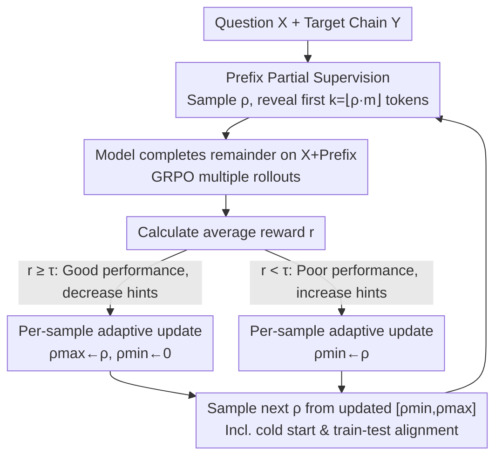

# RL for Reasoning by Adaptively Revealing Rationales

**Conference**: ICLR 2026  
**OpenReview**: [https://openreview.net/forum?id=wdbgTG5kib](https://openreview.net/forum?id=wdbgTG5kib)  
**Area**: LLM Reasoning / Reinforcement Learning  
**Keywords**: Curriculum Learning, Partial Supervision, GRPO, Reasoning Chain, Adaptive Backtracking  

## TL;DR
This paper proposes **AdaBack (Adaptive Backtrack)**: a method that dynamically reveals a prefix of the target reasoning chain as a prompt during RL training and performs a stochastic binary search on the "reveal ratio" based on reward feedback. This allows the model to transition from "completing the last step" to "generating the full chain from scratch," enabling the learning of novel reasoning capabilities on sparse reward tasks where both SFT and standard RL fail.

## Background & Motivation
**Background**: There are two primary paths for teaching Large Language Models (LLMs) long-chain reasoning (chain-of-thought). One is **SFT**, which involves supervised learning directly using expert-provided full reasoning trajectories. The other is **RL** (STaR / PPO / GRPO, etc.), which allows the model to explore reasoning paths using only a verifiable reward (e.g., whether the final answer is correct).

**Limitations of Prior Work**: Both paths fail for long-chain reasoning. SFT requires massive amounts of high-quality reasoning trajectories, which is extremely costly in specialized fields like mathematics. RL is bottlenecked by the **exploration challenge**—as reasoning chains lengthen, the space of valid output sequences explodes exponentially while rewards are sparse and often binary. The probability of randomly sampling a correct solution decays exponentially with sequence length. Consequently, standard RL mostly reinforces paths already present with high probability in the pretrained model (as supported by empirical evidence from Havrilla, Yue, et al.), making it difficult to learn truly new capabilities.

**Key Challenge**: A gap exists between dense demonstration (SFT) and zero demonstration (RL)—**partial supervision**. For a task requiring $n$ consecutive correct steps with a constant success probability $p$ per step, the probability of completing the entire chain correctly is $p^n$, meaning positive feedback appears on average once every $p^{-n}$ attempts. However, if the preceding steps are "fed" to the model, leaving it to complete only the final step, the probability of positive feedback immediately returns to $\Theta(p)$.

**Goal**: Can "adaptive partial supervision" break down a search with success probability $p^n$ into $n$ simple sub-searches with success probabilities of $\Theta(p)$ each, thereby allowing the model to learn solutions that were originally exponentially improbable to sample?

**Key Insight**: The authors start from a simple observation: the more of the target solution's prefix is revealed, the shorter and easier the remaining generation becomes, facilitating rewards. By **gradually reducing the revealed prefix** as the model improves, dense positive feedback can be maintained, decomposing the long chain into learnable small steps. The difficulty lies in the fact that different samples vary in difficulty; a uniform reveal ratio is both wasteful and ineffective. It must be **per-sample and automatically driven by the model's current performance**.

**Core Idea**: Replace fixed, manual curriculum schedules with a "per-sample adaptive reveal ratio." Provide fewer hints when rewards are high and more hints when rewards are low. This is essentially a stochastic binary search on the reveal ratio using the reward as the success signal.

## Method

### Overall Architecture
AdaBack is integrated into RL frameworks like GRPO, which sample multiple rollouts per sample and use the average reward to estimate difficulty. Given a question $X^{(i)}$ and its target reasoning chain $Y^{(i)}=(Y_1,\dots,Y_{m_i})$, each training step first samples a reveal ratio $\rho^{(i)}_t$ for the sample. The first $k=\lfloor \rho^{(i)}_t\cdot m_i\rfloor$ tokens are revealed as a prompt, and the model generates the remaining portion $\hat Y^{(i)}_{k+1:}\sim P_\theta(\cdot\mid X^{(i)}, Y^{(i)}_{1:k})$. The average reward $r^{(i)}_t$ from multiple rollouts is compared against a threshold $\tau$. Based on this, the **reveal ratio interval $[\rho^{(i)}_{\min},\rho^{(i)}_{\max}]$ for that sample is contracted**, and a new $\rho$ is sampled from the updated interval in the next round. This process independently maintains a trajectory from "full supervision to full generation" for each sample without requiring any global curriculum phases or manual scheduling.

### Key Designs

**1. Prefix Partial Supervision: Decomposing Long Chains into Rewardable Completions**

This targets the failure of standard RL to "sample correct solutions and obtain rewards" in long chains. Instead of forcing the model to generate the entire chain from scratch, AdaBack reveals the first $k$ tokens of the target solution ($k=\lfloor\rho\cdot m\rfloor$) from the dataset, allowing the model to **continue writing the second half conditioned on a known correct prefix**. This keeps the remaining generation length manageable, pulling the probability of positive feedback from $\approx 2^{-L}$ (in a synthetic parity task) back to $\Theta(p)$. Crucially, "revealing the ground-truth prefix" serves as both a scaffold and an anchor for exploration: the model only needs to explore the final steps near a known reachable local solution rather than searching blindly in an exponentially large space. As $\rho$ gradually decreases from 1 to 0, the model is guided from "completing the last step" to "completing longer segments" and finally "generating the full chain from scratch."

**2. Per-Sample Adaptive Update Rule: Stochastic Binary Search on Reveal Ratio using Rewards**

This addresses the limitation where different samples have vast difficulty variations, making uniform or manually designed curricula inefficient. AdaBack maintains a reveal ratio interval $[\rho^{(i)}_{\min},\rho^{(i)}_{\max}]$ (initially $[0,1]$) for each sample $i$. In each round, $\rho^{(i)}_t\sim U(\rho^{(i)}_{\min},\rho^{(i)}_{\max})$ is sampled. After obtaining the average reward $r^{(i)}_t$, the interval is updated according to a fixed threshold $\tau$:

$$\text{If } r^{(i)}_t<\tau:\ \rho^{(i)}_{\min}\leftarrow\rho^{(i)}_t;\qquad \text{If } r^{(i)}_t\ge\tau:\ \rho^{(i)}_{\max}\leftarrow\rho^{(i)}_t,\ \rho^{(i)}_{\min}\leftarrow 0$$

The intuition is straightforward: if performance is good ($r\ge\tau$), lower the upper bound to provide fewer hints and increase difficulty; if performance is poor ($r<\tau$), raise the lower bound to provide more hints and ensure useful rewards are obtained. This is essentially a **stochastic binary search** aiming to reveal as little as possible while maintaining sufficient rewards. $\tau$ is the only hyperparameter (the paper notes training is insensitive to it). Compared to non-adaptive methods like R3, which slice all blank spaces and apply RL uniformly, per-sample scheduling ensures each training point "advances only when ready."

**3. Cold Start and Train-Test Alignment: Ensuring Stability for New Samples and Deployment**

Two engineering gaps are addressed. The first is **Cold Start**: samples just entering training with no reward history cannot have their difficulty estimated. AdaBack uses global moving averages $\bar\rho_{\min}$ and $\bar\rho_{\max}$ (updated via exponential moving average) to initialize $\rho^{(i)}$, effectively borrowing the "average difficulty of the batch" to give new samples a reasonable starting point. The second is **Train-Test Distribution Mismatch**: during training, the model always sees a ground-truth prefix, but during testing, it must generate from scratch. To bridge this gap, AdaBack sets the reveal ratio to zero with a small probability, forcing some samples to experience "generation from scratch without hints" during training to align behavior with testing.

## Key Experimental Results

### Synthetic Task: Separation Results on Chain-of-Parities
The authors constructed a **Chain-of-Parities** synthetic task: given binary input $X\in\{0,1\}^L$, generate $Y_1,Z_1,\dots,Y_L,Z_L$, where $Y_i$ is arbitrary and $Z_i=Z_{i-1}\oplus Y_i\oplus X_i$. Each $Z_i$ depends on the previous step; a single early error leads to total failure. The probability of randomly generating a valid output is only $2^{-L}$. Results on $L=16, n=1024$ using Llama 3.2 1B:

| Method | Task Mastered | Description |
|------|----------------|------|
| SFT | ✗ | Fails to achieve even "weak learning" of degree-3 parity under small samples (SQ complexity $\Omega(L^{k-1})$) |
| Standard RL | ✗ | Sparse rewards; reward remains plateaued at 0.1 (only preserving format) |
| SFT + RL | ✗ | SFT fails to provide weak learning; RL still explores randomly |
| R3 | Partial | Test reward only ~0.8 after 16k+ iterations; non-adaptive slicing is inefficient |
| **AdaBack** | ✓ | Mastered in <700 iterations; reveal ratio naturally decreases during training |

This provides a clear **separation result**: a class of tasks exists that SFT, RL, and their naive combinations cannot learn, but AdaBack can reliably master.

### Main Results: Three Math Reasoning Benchmarks + Two Generalization Variants
Tested on DeepScaleR, MATH, GSM8k, and two new variants: **Base-7 GSM8k** (numbers converted to base-7 to create unseen symbolic shifts) and **Tensor-2 GSM8k** (concatenating two problems to lengthen the reasoning chain). Using Llama-3 1B/3B base models with GRPO:

| Method | DeepScaleR 1B/3B | MATH 1B/3B | GSM8k 1B/3B | Base-7 1B/3B | Tensor-2 1B/3B |
|------|------|------|------|------|------|
| Base+RL | 6.8 / 6.6 | 6.4 / 15.0 | 7.9 / 63.7 | 4.8 / 4.9 | 0.0 / 0.0 |
| SFT+RL | 7.1 / 9.1 | 7.4 / 17.7 | 36.7 / 72.7 | 14.4 / 45.4 | 6.9 / 42.7 |
| **AdaBack** | 9.0 / 10.6 | 9.1 / 19.1 | 39.2 / 73.3 | 18.4 / 43.9 | 8.5 / **49.2** |
| **SFT+AdaBack** | **9.5** / **12.5** | **9.5** / **19.9** | **43.2** / 70.7 | **24.5** / **49.9** | **11.3** / 42.2 |

Ours (AdaBack) is consistently superior to GRPO and SFT+GRPO in most settings, with advantages becoming more pronounced in "out-of-pretraining distribution" tasks (e.g., Base-7, Tensor-2). An interesting observation: **running AdaBack directly on the base model often matches or exceeds** the standard pipeline of SFT followed by RL, suggesting that SFT initialization sometimes prematurely narrows the search space and restricts exploration.

### Key Findings
- **AdaBack Expands the Solution Space**: Evaluating with pass@k shows that AdaBack is significantly higher than standard RL on both base and SFT models, especially at large $k$. This counters the claim that "RL only re-weights existing distributions"; AdaBack increases pass@k even when base coverage is low, indicating it discovers new solution patterns.
- **When AdaBack is Less Effective**: When the dataset is too easy for the model (e.g., Llama 3.2 3B-Instruct on MATH), where RL reaches near-perfect training rewards in a few hundred steps, AdaBack provides no extra gain. Its value is concentrated in scenarios where sparse rewards or symbolic mismatches create real learning barriers.
- **vs. R3 on Difficulty Trends**: As difficulty increases (GSM8k < MATH < DeepScaleR), AdaBack becomes more dominant. However, on GSM8k, it is slightly inferior to R3. This is because GSM8k steps can be cleanly split by newlines; slicing by "real reasoning steps" (R3) is more accurate than random token slicing (AdaBack) for easy tasks. For MATH/DeepScaleR, long LaTeX blocks make R3's heuristic slicing brittle, where AdaBack's reward-driven approach excels.

## Highlights & Insights
- **Turning "Curriculum Design" into Reward-Driven Binary Search**: Traditional curriculum learning requires manual phase definitions and timing. AdaBack uses only one threshold $\tau$ and lets each sample perform a stochastic binary search on the reveal ratio.
- **Partial Supervision as a Continuous Spectrum**: The most insightful point is unifying SFT (reveal ratio 1) and RL (reveal ratio 0) into a single axis, where the reveal ratio $\rho$ slides continuously, making the "middle ground" an optimizable quantity.
- **Transferable Per-Sample Adaptation**: The idea of dynamically adjusting supervision strength based on per-sample performance is not limited to prefix revealing; it can be applied to any structured generation task (code, theorem proving, planning) where a success signal can be estimated.

## Limitations & Future Work
- **Limitations**: For instruct-tuned models or scenarios where pretraining already covers the task type (low uncertainty), AdaBack, like standard RL, provides little gain—it is only useful when exploration itself is the bottleneck.
- **Dependence on Ground-Truth Chains**: AdaBack reveals ground-truth prefixes from the dataset, thus still requiring data with correct reasoning trajectories. It does not provide a solution for tasks with only final answer verifiers and no reference solutions.
- **Random vs. Semantic Slicing**: On tasks with clean step divisions (GSM8k), slicing by reward-driven token positions is less effective than semantic reasoning steps. A natural improvement would be combining reward-driven adaptation with "semantic boundary-aware slicing."

## Related Work & Insights
- **vs. Standard RL (GRPO / PPO / STaR)**: These generate from scratch and rely on sparse rewards, reinforcing only existing paths on long chains. AdaBack uses ground-truth prefixes as scaffolds, decomposing exponential searches into linear simple sub-searches.
- **vs. R3 (Xi et al., 2024)**: R3 also performs a curriculum of completing chains from earlier positions, but it applies RL non-adaptively to all slices. AdaBack is **per-sample and driven by the model's performance**, eliminating global schedules and slicing heuristics.
- **vs. Traditional Curricula / SFT→RL Pipelines**: AdaBack internalizes scheduling into a search process. Experiments show that running AdaBack on base models often matches or exceeds SFT+RL, suggesting partial supervision might be a better prior than SFT initialization.

## Rating
- Novelty: ⭐⭐⭐⭐⭐ Unifies SFT and RL into a "reveal ratio" spectrum with an adaptive binary search curriculum.
- Experimental Thoroughness: ⭐⭐⭐⭐ Covers synthetic separation, three benchmarks, two variants, and pass@k, primarily on 1B/3B models.
- Writing Quality: ⭐⭐⭐⭐ Clear $p^n\to n\cdot\Theta(p)$ argument; well-designed synthetic tasks.
- Value: ⭐⭐⭐⭐ Provides a simple, practical intermediate solution for sparse-reward long-chain reasoning.

<!-- RELATED:START -->

## Related Papers

- [\[ICLR 2026\] REA-RL: Reflection-Aware Online Reinforcement Learning for Efficient Reasoning](rea-rl_reflection-aware_online_reinforcement_learning_for_efficient_reasoning.md)
- [\[ICLR 2026\] RL Squeezes, SFT Expands: A Comparative Study of Reasoning LLMs](rl_squeezes_sft_expands_a_comparative_study_of_reasoning_llms.md)
- [\[ICLR 2026\] Scheduling Your LLM Reinforcement Learning with Reasoning Trees](scheduling_your_llm_reinforcement_learning_with_reasoning_trees.md)
- [\[ACL 2026\] Glance-or-Gaze: Incentivizing LMMs to Adaptively Focus Search via Reinforcement Learning](../../ACL2026/reinforcement_learning/glance-or-gaze_incentivizing_lmms_to_adaptively_focus_search_via_reinforcement_l.md)
- [\[AAAI 2026\] Revealing POMDPs: Qualitative and Quantitative Analysis for Parity Objectives](../../AAAI2026/reinforcement_learning/revealing_pomdps_qualitative_and_quantitative_analysis_for_parity_objectives.md)

<!-- RELATED:END -->
