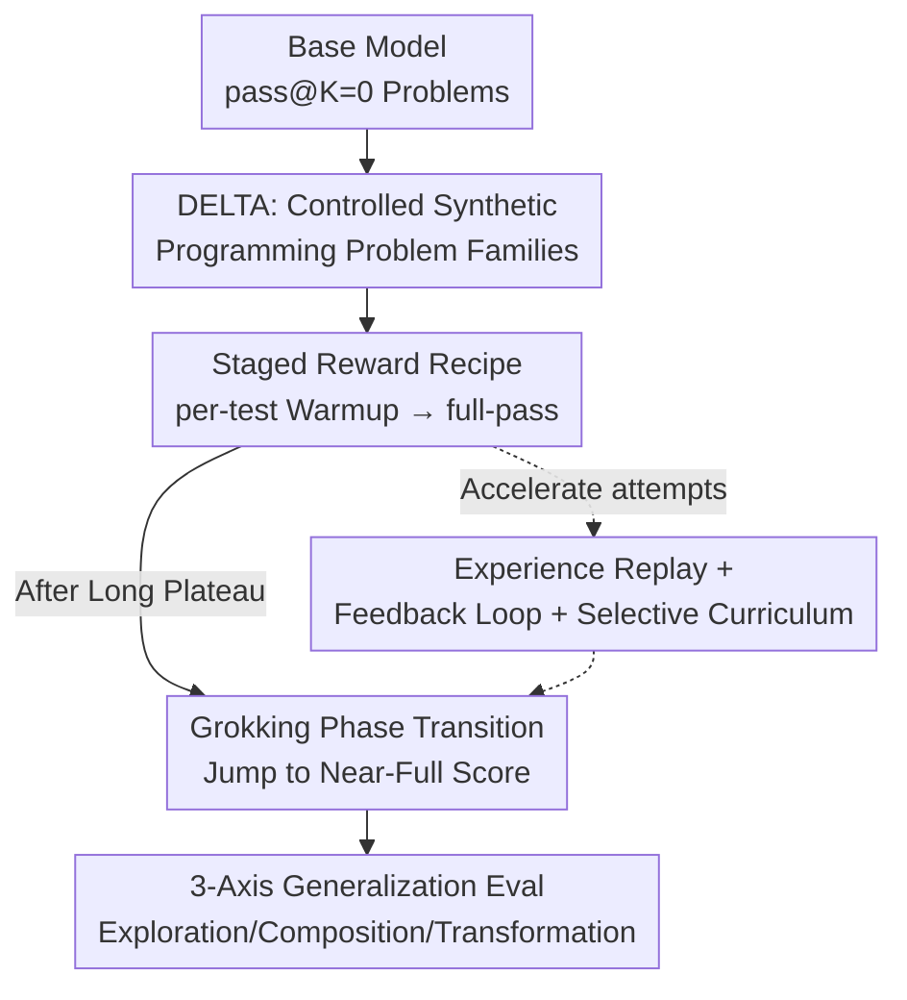

# RL Grokking Recipe: How Does RL Unlock and Transfer New Algorithms in LLMs?

**Conference**: ICLR 2026  
**OpenReview**: [https://openreview.net/forum?id=CJJ8VxOWbG](https://openreview.net/forum?id=CJJ8VxOWbG)  
**Code**: https://github.com/sunblaze-ucb/rl-grok-recipe  
**Area**: Reinforcement Learning / LLM Reasoning / Code Generation  
**Keywords**: RLVR, grokking, learnability, generalization, controlled synthetic benchmarks

## TL;DR
The authors developed a controlled synthetic programming benchmark, DELTA, demonstrating that on "hard problem families" where base models fail to sample any correct solution ($pass@K=0$), a staged RL recipe—initial dense per-test reward warmup followed by a switch to binary full-pass reward—enables models to undergo a grokking phase transition after a near-zero reward plateau, jumping to near-perfect scores. This process unlocks entirely new algorithmic strategies unavailable to the base model and systematically characterizes generalization boundaries along three axes: exploration, composition, and transformation.

## Background & Motivation
**Background**: RLVR (Reinforcement Learning with Verifiable Rewards, such as GRPO/PPO) has become a mainstream approach for enhancing LLM reasoning. However, there is an intense debate regarding its essence: one school of thought posits that RL merely "sharpens" existing heuristic strategies embedded during pre-training, improving $pass@1$ without breaking the $pass@K$ ceiling of the base model; the other school believes RL can "unlock" entirely new strategies that the base model could not execute.

**Limitations of Prior Work**: This debate has been difficult to resolve cleanly because existing math and code benchmarks (e.g., Numina-Math, DeepMath, OpenCodeReasoning) mix various topics and difficulties, conflating "capability sharpening" with "genuine acquisition." Furthermore, many tasks allow for shortcuts via tool-use (e.g., calling Python for matrix rank) or template memorization, failing to isolate pure reasoning.

**Key Challenge**: To determine whether RL can cross the base model's boundary, researchers require problems where **train-test splits are strictly controlled and demonstrably beyond the pre-training distribution**. These problems must be OOD enough to force the model to invent new strategies, yet "clean" enough to attribute gains to specific skills. No such dataset existed previously.

**Goal**: To decompose the debate into two operational criteria—**learnability**: Can RL learn to solve problem families where the base model fails entirely ($pass@K=0$, e.g., $K{=}128$)? **transferability**: Once learned, can these skills systematically generalize to OOD test sets rather than just memorizing templates?

**Key Insight**: The authors found "programming problems" to be an excellent vehicle. Code naturally provides **fine-grained, cheaply scalable feedback** via unit tests (scoring based on the proportion of passed tests), which fills the gap where sparse binary rewards fail to provide a learning signal. Simultaneously, template generators allow for precise control over distribution and difficulty.

**Core Idea**: Construct a controlled synthetic programming benchmark, DELTA (including a novel OOD Manufactoria puzzle syntax), and apply a staged recipe of "dense per-test reward warmup → binary full-pass reward convergence" to force a grokking phase transition on $pass@K=0$ problems, providing clean evidence that RL can indeed acquire new algorithms.

## Method

### Overall Architecture
The work can be viewed as a pipeline: "controlled problem generation → inducing grokking via staged rewards → evaluating generalization along three axes." The starting point is a hard problem family where the base model completely fails. DELTA provides these controlled problems, the staged RL recipe pulls the model out of the zero-reward zone to trigger grokking, and the generalization study characterizes how far the acquired strategies can transfer.

### Key Designs

**1. DELTA: A Controlled Programming Benchmark Isolating Reasoning Skills**

To cleanly adjudicate between "sharpening and acquisition," the problems must have controlled distributions, prevent shortcuts, and be truly OOD. DELTA consists of five categories of synthetic programming families, centered on **Manufactoria**, a hand-designed OOD domain inspired by a 2010 Flash game (using puller/painter nodes to build automated factories for tape classification, similar to finite state automata/tag systems). The authors reformulated this into a **completely new program syntax**. It is truly OOD because: solutions to the original game only exist as images on old websites; problems are newly synthesized; and the limited functional nodes require reasoning patterns distinct from conventional programming or Turing machine tasks. Compared to the previous OMEGA (40 math families), DELTA offers three crucial improvements: (a) Manufactoria provides an unseen OOD domain; (b) the goal is to **synthesize the program itself** rather than a numerical value, blocking "tool-use shortcuts"; (c) programming naturally supports dense hierarchical rewards based on test proportions. Manufactoria is categorized into BASIC → EASY → MEDIUM → HARD difficulty tiers. While MEDIUM only sees non-trivial success from models like GPT-5, HARD causes near-zero performance across all models, acting as an OOD benchmark for SOTA models and a learnability test for smaller ones. DELTA also include BouncingSim (2D physics collision simulation for generalization testing) and three real-world families (Competitive Code, SQL, LEAN).

**2. Dense-to-Sparse Staged Reward Recipe: Forcing Grokking from $pass@K=0$**

This is the core recipe of the paper, addressing a sharp bottleneck: GRPO relies on reward differences between rollouts to generate gradients. If all rollouts for a problem fail ($pass@K=0$), there is no positive signal, and gradients are zero, causing vanilla GRPO to stagnate. The solution is two-staged. In the **Warmup Phase**, a continuous per-test pass rate (proportion of tests passed, $\in [0,1]$) is used as the reward. This "partial credit" pushes the model out of the zero-reward zone to accumulate positive gradients. However, as it is an imperfect proxy, it saturates around 100 steps while the full-pass rate remains $<0.01\%$. Thus, in the second stage, the training **switches back** to binary full-pass rewards ($+1$ only if all tests pass). Following this, the model enters a long **Exploration Period** (approx. 450 steps where full-pass is still $<1\%$) before suddenly undergoing **grokking**—discovering the key strategy and entering a convergence phase where RL reinforces the successful reasoning path. On Manufactoria-HAS, this improves $pass@k$ by nearly 100 percentage points (from 0% to 100% full pass). The authors argue that this "intermediate signal for exploration → strict correctness for locking" approach can extrapolate to other domains like math or formal logic.

**3. Speeding Up Grokking and Selective Curriculum Learning**

The authors explored three methods to shorten the long exploration plateau. **Experience Replay**: Successful reasoning trajectories are recorded, and up to three recent successes are prepended to rollouts when the same problem reappears. This triggers earlier grokking but results in slower overall convergence than baseline GRPO due to the off-policy nature. **Feedback-in-the-loop**: Replacing the EOS token with feedback (e.g., failed test cases) allows the model to continue generating. This can advance the grokking point, but off-policy feedback tokens reduce stability, often causing the model to persist in incorrect solutions despite the feedback. **Selective Curriculum Learning**: Can inter-family curricula replace warmup? The authors tested a 3-stage curriculum (BASIC families → Stage 2 REGEX or COMPR → Target HAS). A key finding was that while REGEX and COMPR are of similar difficulty, only the REGEX curriculum transferred successfully to HAS. This is because REGEX and HAS are **structurally aligned** (both centered on sub-pattern matching), whereas COMPR focuses on numerical interpretation. The conclusion is that effective curricula must be structurally aligned, not just difficulty-calibrated. Since such "bridge families" are hard to find, dense reward warmup is more universal. However, warmup is not a silver bullet: on the extremely difficult Manufactoria-PREPEND, full-pass rates remain at zero even with per-test rewards, indicating that unlocking capability depends on both model capacity and task difficulty.

### Loss & Training
The default base model is Qwen3-4B-Instruct using the GRPO algorithm. Each step involves 48 prompts $\times$ 16 rollouts, with a learning rate of $5\times10^{-7}$. Coding rewards are typically binary full-pass, while the staged recipe utilizes per-test pass rates during warmup. Learnability studies were conducted on Manufactoria-HAS (742 train / 100 test), and generalization studies used the BouncingSim Basic mix (6 families, 1k each) trained for $\approx 300$ steps with binary rewards.

## Key Experimental Results

### Main Results (Learnability: Solving $pass@K=0$)
On Manufactoria-HAS, where the base Qwen3-4B-Instruct has a 0% full-pass rate at $pass@128$, the comparison of reward strategies is as follows:

| Training Strategy | Full-pass Result | Phenomenon |
|-------------------|------------------|------------|
| (a) Direct binary full-pass | ≈0% (Stagnation) | No positive signal; zero gradient for GRPO |
| (b) Continuous per-test only | $<0.01\%$ | Saturates at ~100 steps; fails to find full solutions |
| (c) per-test Warmup → full-pass | **100%** | Grokking and convergence after a long plateau |

### Ablation Study (BouncingSim, 3-Axis Generalization)
Grokking occurred around step 200 on the Basic mix, reaching ~0.7 full-pass. Evaluation followed along three axes:

| Generalization Axis | Test Setting | Before RL | After RL |
|---------------------|--------------|-----------|----------|
| Exploration (Extrapolation) | Basic(ID)→Easy/Medium/Hard | Near zero | Basic 70–85%, Easy 50–75%, Medium 15–50%, Hard single digits |
| Composition (Skill Merging) | Unseen combinations (e.g., ROT_BOX+MOV_BOX) | Near zero | 60–70% |
| Transformation (New Dynamics) | Deviating/Degenerate trajectories | Near zero | Still near zero |

### Key Findings
- **Staged rewards are the only effective recipe for unlocking $pass@K=0$**: Both direct binary rewards and pure per-test rewards fail. Only the "warmup → switch" triggers grokking, proving RL can acquire strategies the base model cannot execute.
- **Unexpectedly strong compositional generalization**: Generalization in code relies on "structural merging" (combining simulation modules) rather than "strategy invention," resulting in 60–70% success—significantly better than the weak compositional transfer reported in OMEGA.
- **Speed-up techniques have off-policy costs**: Experience replay and feedback loops can advance grokking but introduce slower convergence and instability. Curriculum effectiveness depends on **structural alignment** rather than just difficulty.
- **Coexistence of sharpening and acquisition**: RL primarily sharpens in easier settings or with weak recipes, while the acquisition phase transition only appears with hard problems and the correct recipe. The outcome is determined by reward design, data composition, and task difficulty.

## Highlights & Insights
- **Turning philosophical debate into falsifiable experiments**: By using learnability and transferability criteria with controlled synthetic problems, the authors transformed the "sharpening vs. learning" debate into a clean empirical adjudication.
- **First demonstration of grokking phase transitions in RL fine-tuning for LLMs**: While grokking was previously observed in supervised toy datasets, this study brings "long plateaus + sudden generalization" to RL reasoning training and links it to the dense reward warmup mechanism.
- **Portability of the per-test warmup trick**: In any domain where fine-grained verifiable signals can be generated (e.g., math rubrics, theorem provers, simulator constraints), the "dense guidance → strict locking" approach can help cross the learnability gap.
- **A call to monitor the "Hard Subset"**: In heterogeneous data pools, a small number of truly difficult ($pass@K=0$) problems are often averaged out by simple ones. However, these problems possess unique grokking dynamics. The authors advocate for explicitly isolating and tracking this "hard frontier" in future evaluations.

## Limitations & Future Work
- **The warmup recipe is not a panacea**: On the harder Manufactoria-PREPEND, the model failed to escape the zero-reward zone even with per-test rewards, showing that unlocking depends on the interplay between model capacity and task difficulty.
- **Transformation generalization remains an open problem**: For problems requiring the invention of new paradigms or invariants (e.g., specific initial states ensuring periodicity), performance remained near zero post-RL, suggesting "schema creation" is beyond current capabilities.
- **Immature acceleration methods**: Experience replay and feedback loops suffer from off-policy overhead or instability, making them far from "plug-and-play."
- **Extrapolability of conclusions**: Main results are focused on Qwen3-4B and synthetic programming. Extension to real-world domains (math, science) remains a discussion-level outlook without systematic experimental backing (though scale experiments are in the appendix).

## Related Work & Insights
- **vs. Skeptics (Yue et al. 2025 / Wu et al. 2025)**: These works use coverage/perplexity analysis or theoretical arguments to suggest RLVR cannot exceed the base model's representation. This paper provides a clean counterexample by grokking from $pass@K=0$ to 100%, proving "exceeding the base" occurs given the right recipe and OOD problems.
- **vs. Optimists (ProRL, Liu et al. 2025b)**: While they show RL expanding boundaries on heterogeneous corpora, it is hard to isolate "how." This paper attributes the cause to specific reward recipes and task structures through synthetic families.
- **vs. OMEGA (Sun et al. 2025)**: OMEGA uses 40 math families for 3-axis generalization. This work migrates that paradigm to programming, adds OOD Manufactoria, and employs dense rewards, finding that compositional generalization (structural merging) is much stronger in programming than in math.
- **vs. Traditional Grokking (Power et al. 2022, etc.)**: Traditional grokking involves "memorization before generalization" in supervised toy datasets. This study places it in the context of RL fine-tuning for LLM reasoning on hard tasks.

## Rating
- Novelty: ⭐⭐⭐⭐⭐ First work to show grokking in RL fine-tuned LLMs and cleanly adjudicate the "sharpening vs. acquisition" debate using controlled OOD problems.
- Experimental Thoroughness: ⭐⭐⭐⭐ Systematic comparisons for learnability and 3-axis generalization, though focused on synthetic domains and specific model scales.
- Writing Quality: ⭐⭐⭐⭐⭐ Clear framing, honest reporting of failures in acceleration techniques, and a complete narrative.
- Value: ⭐⭐⭐⭐⭐ Provides a reusable training recipe, falsifiable criteria, and the "hard frontier" evaluation paradigm, offering significant methodological value for RL reasoning research.

<!-- RELATED:START -->

## Related Papers

- [\[ICLR 2026\] From $f(x)$ and $g(x)$ to $f(g(x))$: LLMs Learn New Skills in RL by Composing Old Ones](from_fx_and_gx_to_fgx_llms_learn_new_skills_in_rl_by_composing_old_ones.md)
- [\[ICML 2026\] How Does Reasoning Flow? Tracing Attention-Induced Information Flow for Targeted RL in LLMs](../../ICML2026/reinforcement_learning/how_does_reasoning_flow_tracing_attention-induced_information_flow_for_targeted_.md)
- [\[ICLR 2026\] Prosperity before Collapse: How Far Can Off-Policy RL Reach with Stale Data on LLMs?](prosperity_before_collapse_how_far_can_off-policy_rl_reach_with_stale_data_on_ll.md)
- [\[ICLR 2026\] RL Squeezes, SFT Expands: A Comparative Study of Reasoning LLMs](rl_squeezes_sft_expands_a_comparative_study_of_reasoning_llms.md)
- [\[ICLR 2026\] Mirage or Method? How Model–Task Alignment Induces Divergent RL Conclusions](mirage_or_method_how_modeltask_alignment_induces_divergent_rl_conclusions.md)

<!-- RELATED:END -->
