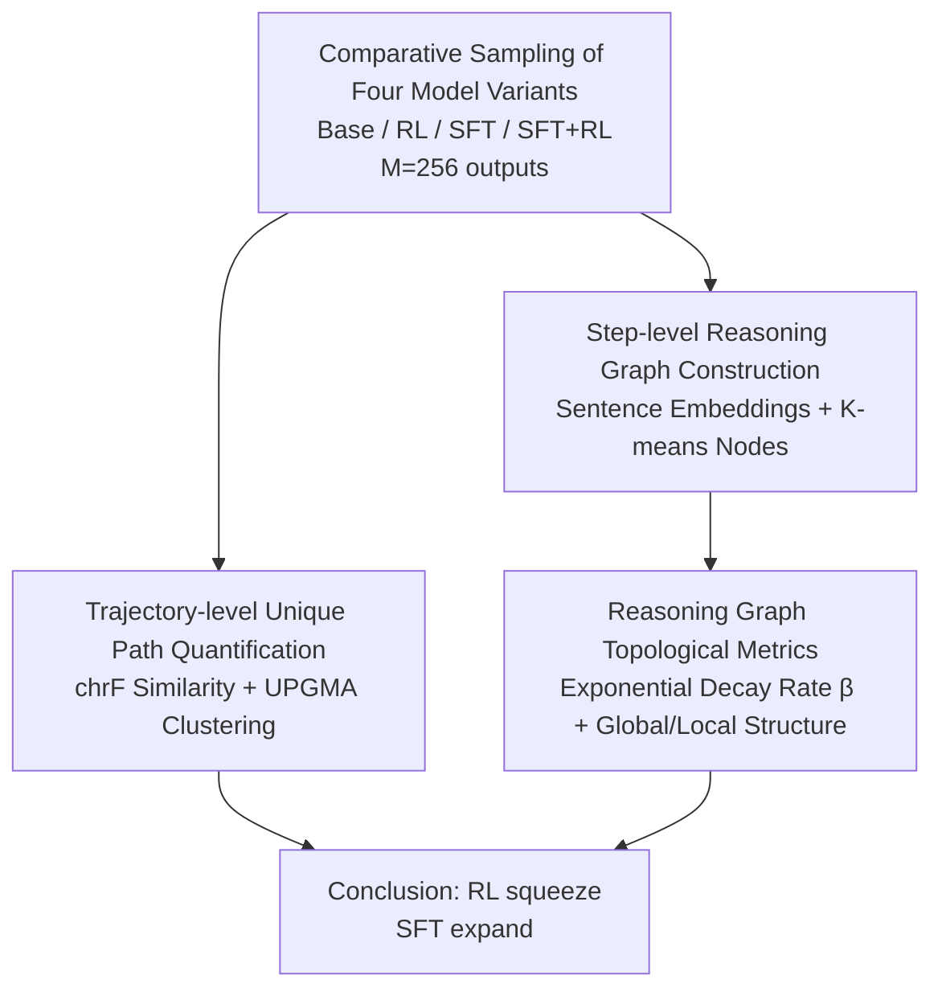

# RL Squeezes, SFT Expands: A Comparative Study of Reasoning LLMs

**Conference**: ICLR 2026  
**OpenReview**: [https://openreview.net/forum?id=N2lMNqJsBw](https://openreview.net/forum?id=N2lMNqJsBw)  
**Code**: https://github.com/kohseim/rl_squeezes_sft_expands (Available)  
**Area**: Reinforcement Learning / LLM Reasoning  
**Keywords**: RLVR, SFT Distillation, Reasoning Path, Reasoning Graph, Two-stage Training

## TL;DR
Transcending the "accuracy-only" perspective, this paper proposes an analysis framework to quantify reasoning processes at both **trajectory-level** and **step-level (reasoning graph)** granularities. By systematically comparing the distinct shaping effects of RL and SFT on reasoning LLMs, it concludes that RL "squeezes" while SFT "expands" the reasoning space, providing a mechanistic explanation for why the "SFT followed by RL" two-stage training paradigm is effective.

## Background & Motivation

**Background**: Since OpenAI-o1 and DeepSeek-R1, post-training to enhance reasoning capabilities has primarily followed two routes: SFT (imitation learning on reasoning trajectories generated by strong teacher models to maximize log-likelihood) and RL (maximizing expected returns via verifiable rewards (RLVR), often using policy gradient methods like GRPO). Current SOTA models (e.g., ProRL, AceReason) almost exclusively follow a two-stage recipe: "DeepSeek-R1 distilled checkpoint (SFT) → followed by RL."

**Limitations of Prior Work**: Although two-stage training has repeatedly proven effective in practice, what RL and SFT respectively "actually change in the reasoning process" remains a black box. Existing research (Yue et al. 2025) identified a seemingly contradictory phenomenon: as the number of samples $k$ increases, the Pass@$k$ of the Base model eventually overtakes the RL model trained via RLVR. This suggests that RL does not teach the model new capabilities but merely "activates" existing ones within the Base model. However, such conclusions remain confined to **answer accuracy**, without investigating the underlying reasoning processes.

**Key Challenge**: Various SFT+RL recipes are developed through "trial-and-error" without understanding the respective roles of RL (reinforcement) and SFT (imitation). Relying solely on accuracy comparison fails to explain "why the sequence must be SFT first, then RL," nor can it guide data construction or more efficient training.

**Goal**: To answer "How do RL and SFT actually shape the reasoning process beyond accuracy?" which is decomposed into two quantifiable sub-questions: (1) How does the diversity of full reasoning outputs (trajectories) change? (2) How does the functional distribution of internal steps (nodes) within the reasoning process change?

**Key Insight**: The authors explicitly model the reasoning process as a measurable object. At the trajectory level, they use the number of clusters to characterize "unique reasoning paths." At the step level, reasoning outputs are segmented into sentences, embedded, and clustered to construct a "reasoning graph," using topological indicators from complex networks to characterize the structure and functional distribution of reasoning.

**Core Idea**: By using "reasoning path count + reasoning graph topology" as metrics to measure the effects of RL/SFT, the authors discover a complementary mechanism of **RL Squeeze and SFT Expand** at both trajectory and step levels, providing a mechanistic explanation for two-stage training.

## Method

### Overall Architecture

This paper does not propose a new model but introduces a **comparative analysis framework**. The subjects of analysis are four model variants under the same family and scale: Base (post-pretraining), RL (Base with RLVR), SFT (Base with distillation), and SFT+RL (RL following SFT), covering 1.5B, 7B, and 14B scales across math (AIME24/25, AMC23) and code (HumanEval) domains. After sampling $M=256$ outputs per problem, the framework proceeds along two parallel granularities: **Trajectory-level** treats the entire thought output as a path to count "unique correct/incorrect paths," and **Step-level** segments outputs into sentences, embeddings, and shared clusters across models to construct a directed reasoning graph, characterized by decay rates and topological metrics. Both analyses converge on the same conclusion: RL squeeze, SFT expand.

### Key Designs

**1. Four-variant comparison: Disentangling the roles of RL and SFT**

To isolate the effects of RL and SFT, the authors fix the model family, scale, and evaluation sets to construct four variants: Base refers to the model after pre-training, RL refers to RLVR performed directly on Base (e.g., Qwen2.5-Math-Oat-Zero, SimpleRL-Zoo), SFT refers to distillation from Base (DeepSeek-R1-Distill series), and SFT+RL refers to RL after SFT (Nemotron-Research-Reasoning, AceReason-Nemotron). Thus, the "Base→RL" edge reflects the effect of RL alone, "Base→SFT" reflects SFT alone, and "SFT→SFT+RL" reflects the effect of adding RL to an already distilled model. The authors acknowledge a limitation: training data for different variants is not strictly aligned; hence, the focus is on **principled algorithmic differences** between RL and SFT rather than strict causality under controlled variables—supported by replication across scales and domains.

**2. Trajectory-level unique path quantification: Differentiating diversity in "Correct" vs "Incorrect" paths**

To solve the puzzle of why Base's Pass@$k$ overtakes RL, the authors count "unique reasoning trajectories." For $M$ sampled outputs per problem, trajectories are split into correct and incorrect sets based on verifiable rewards. Similarity between trajectories is measured using the character-level n-gram metric chrF (more robust than word-level BLEU to morphological changes like "add" vs "adding"), symmetrized as $s_{i,j}=\big(\text{chrF}_\beta(\pi_i,\pi_j)+\text{chrF}_\beta(\pi_j,\pi_i)\big)/2$, with distance $d_{i,j}=1-s_{i,j}$. Since chrF is not an Euclidean embedding metric, UPGMA (Unweighted Pair Group Method with Arithmetic Mean) hierarchical clustering is used instead of Ward’s method. Dendrograms are pruned at a similarity threshold of 60 to obtain cluster counts for correct/incorrect categories. More clusters indicate the model possesses more "unique solutions/errors." This design transforms abstract "diversity" into countable clusters to observe which process increases or decreases them.

**3. Step-level reasoning graph construction: Mapping thought chains to a directed graph with shared nodes**

To look **inside** the reasoning process, the authors segment each output $\pi^l_m$ into a sentence sequence $(r^l_{m,1},\dots,r^l_{m,T})$, embedding each sentence with BGE-large-en-v1.5 ($d=1024$). The key design involves **pooling all sentence embeddings from all four model variants into a shared space for K-means clustering** ($K=2000$), where each cluster is a node $v_k$. This ensures the reasoning graphs of all four models exist on the same node definitions, allowing direct horizontal comparison. Each output becomes a path on the graph; consecutive identical clusters are merged to avoid self-loops, and directed edges $(v_i\to v_j)$ are drawn between adjacent different clusters, with edge weights representing centroid Euclidean distance $d(v_i,v_j)=\lVert c_i-c_j\rVert_2$ and transition frequencies. The final weakly connected reasoning graph for model $l$ is $G^l=\bigcup_{m} G^l_m$.

**4. Reasoning graph topological metrics: Quantifying "Functional Concentration vs. Dispersion" using β**

Using the reasoning graph, the authors quantify structure via complex network indicators. The core metrics are the ranked distribution curves of **node visit frequency, degree, and betweenness centrality**, which approximately follow an exponential law $X(R)\propto e^{-\lambda R}$ (where $R$ is rank). The decay rate $\beta=\lambda/\log 10$ is estimated via linear regression $\log_{10}X(R)=\alpha-\beta R+\epsilon_R$. A larger $\beta$ indicates that a few top-ranked nodes account for the majority of visits/connections/mediation—i.e., "function is concentrated in a few steps." A smaller $\beta$ suggests function is spread across many steps. Additionally, global topological metrics (edge density, normalized clustering coefficient, assortativity, modularity, Freeman centralization, etc.) and local metrics (graphlet proportions for 4-node subgraphs G3–G8) characterize the structure. These metrics turn "squeeze/expand" from intuition into numbers: RL increases $\beta$ by approximately 2.5x, while SFT reduces $\beta$ to about one-third.

## Key Experimental Results

### Main Results: Changes in Unique Trajectory Path Counts

Representative values for (Correct Clusters, Incorrect Clusters) for the 1.5B model on AIME24/25 and AMC23:

| Model Variant (1.5B, AIME24) | Correct Clusters | Incorrect Clusters | Phenomenon |
|--------|------|------|------|
| Base | 22.2 | 82.2 | Diverse but highly error-prone |
| RL (Base→RL) | 22.5 | 22.6 | Incorrect trajectories are heavily squeezed |
| SFT (Base→SFT) | Increases | 46.1 | Correct solutions increase; errors remain |
| SFT+RL | — | Further decreased | SFT adds correctness, RL squeezes errors |

Findings: Whether starting from Base or SFT, RL significantly reduces incorrect trajectories (explaining Pass@1 gains via probability mass redistribution) but also reduces correct trajectories (explaining why Base overtakes RL at large $k$). SFT increases correct trajectories (teaching new solutions) but retains significant incorrect trajectories (thus SFT alone does not guarantee Pass@1). Consistent results were found in the HumanEval (7B) code domain.

### Key Findings: Reasoning Graph Decay and Topology

| Metric | Base→RL | Base→SFT | Interpretation |
|------|---------|----------|------|
| Exponential decay $\beta$ (Freq/Deg/Centrality) | Increases (~2.5×) | Decreases (~÷3) | RL concentrates function; SFT disperses it |
| Modularity | Decreases | Decreases | Both break down Base community structures |
| Global Efficiency / Algebraic Connectivity | RL: High via hubs | SFT: Robust/reachable | Positively correlates with Pass@1/Pass@k |
| Freeman Centralization | Increases | Lower | RL forms hub-dominated graphs |
| 4-node graphlets (G7/G8 cycles) | Increases | Also Increases | Both introduce local loops (backtracking/verification) |

- **RL and SFT are complementary mechanisms**: RL squeezes (especially incorrect trajectories and graph functions into hubs), while SFT expands (adding correct solutions and spreading function across steps). This explains why "SFT first, then RL" maximizes Pass@1.
- **Local structure alone cannot explain performance**: RL, SFT, and SFT+RL have similar 4-node graphlet proportions, yet their performance varies greatly—indicating **global topology** (hub concentration vs. global connectivity) is key.
- **Graph metrics correlate with accuracy**: Global efficiency and algebraic connectivity correlate positively with Pass@1/Pass@k, while modularity correlates negatively, suggesting these structural quantities reflect the capability to explore solution spaces effectively.

## Highlights & Insights
- **Quantifying the "Reasoning Process"**: By using trajectory clusters and graph topology, the authors transform the formerly black-box reasoning process into measurable structural indicators. This "reasoning graph" methodology is transferable to analyzing any post-training method.
- **Shared Embedding Space Clustering**: Jointly clustering sentence embeddings from all four variants is the key trick for comparability, ensuring models share node definitions rather than living in disparate representation spaces.
- **A mechanistic answer to the Pass@k mystery**: The finding that RL squeezes both correct and incorrect trajectories explains why Base overtakes RL at large $k$—it's not that RL is ineffective, but that it sacrifices diversity for Pass@1.
- **Actionable training insights**: If RL concentrates function into a few hubs, then "applying RL only to functional steps" or "using graph metrics (hubs/centrality) as process-based rewards" could lead to more efficient training.

## Limitations & Future Work
- **Lack of strict data alignment**: The authors focus on algorithmic differences; changes in reasoning paths caused by distribution shifts in training data require further study.
- **Hyperparameters in graph construction**: Node definitions rely on K-means ($K=2000$); while robust across $K=1000/3000$ and different encoders, sentence segmentation still influences the graph.
- **High edge density**: Clustering leads to high edge density, requiring sparsification (e.g., top-10 edges) to estimate $\beta$. While conclusions are consistent, it indicates a measurement bias in the raw graph.
- **Domain limitations**: Experiments are limited to verifiable, competition-grade math and code; generalizability to open-ended generation tasks remains to be verified.

## Related Work & Insights
- **vs. Yue et al. (2025)**: While they used Pass@$k$ to show Base overtakes RL at the outcome level, this work provides a mechanistic explanation at the reasoning path level: RL squeezes both correct and incorrect diversity.
- **vs. Chu et al. (2025) "SFT memorizes, RL generalizes"**: This paper provides a structural explanation through "functional concentration (RL) vs. dispersion (SFT)," complementing their generalization perspective.
- **vs. Wang et al. (2025) Token-level Entropy**: They found RL raises entropy at "branching" tokens; this work observes at the step level that RL amplifies the functional difference between hub steps and others, echoing the same "centralization" trend.
- **Heuristics for SFT data**: Beyond counting "wait" tokens or cognitive behaviors, graph metrics (hubs, low modularity, high reachability) could serve as new criteria for data filtering or process rewards.

## Rating
- Novelty: ⭐⭐⭐⭐⭐ First to use dual-granularity "graph topology + trajectory clustering" to quantify RL/SFT differences.
- Experimental Thoroughness: ⭐⭐⭐⭐ Replicated across three scales and two domains; extensive ablations, though training data was not strictly aligned.
- Writing Quality: ⭐⭐⭐⭐ Clear "squeeze/expand" narrative; rich visualizations, though some graph metric definitions are dense.
- Value: ⭐⭐⭐⭐⭐ Provides mechanistic interpretation for two-stage training and points toward practical directions like step-level RL.

<!-- RELATED:START -->

## Related Papers

- [\[ICLR 2026\] Getting Your LLMs Ready for Reinforcement Learning with Lightweight SFT](getting_your_llms_ready_for_reinforcement_learning_with_lightweight_sft.md)
- [\[ICLR 2026\] RL Grokking Recipe: How Does RL Unlock and Transfer New Algorithms in LLMs?](rl_grokking_recipe_how_does_rl_unlock_and_transfer_new_algorithms_in_llms.md)
- [\[ICLR 2026\] QuestA: Expanding Reasoning Capacity in LLMs via Question Augmentation](questa_expanding_reasoning_capacity_in_llms_via_question_augmentation.md)
- [\[ACL 2026\] Bridging SFT and RL: Dynamic Policy Optimization for Robust Reasoning](../../ACL2026/reinforcement_learning/bridging_sft_and_rl_dynamic_policy_optimization_for_robust_reasoning.md)
- [\[ICLR 2026\] From f(x) and g(x) to f(g(x)): LLMs Learn New Skills in RL by Composing Old Ones](from_fx_and_gx_to_fgx_llms_learn_new_skills_in_rl_by_composing_old_ones.md)

<!-- RELATED:END -->
