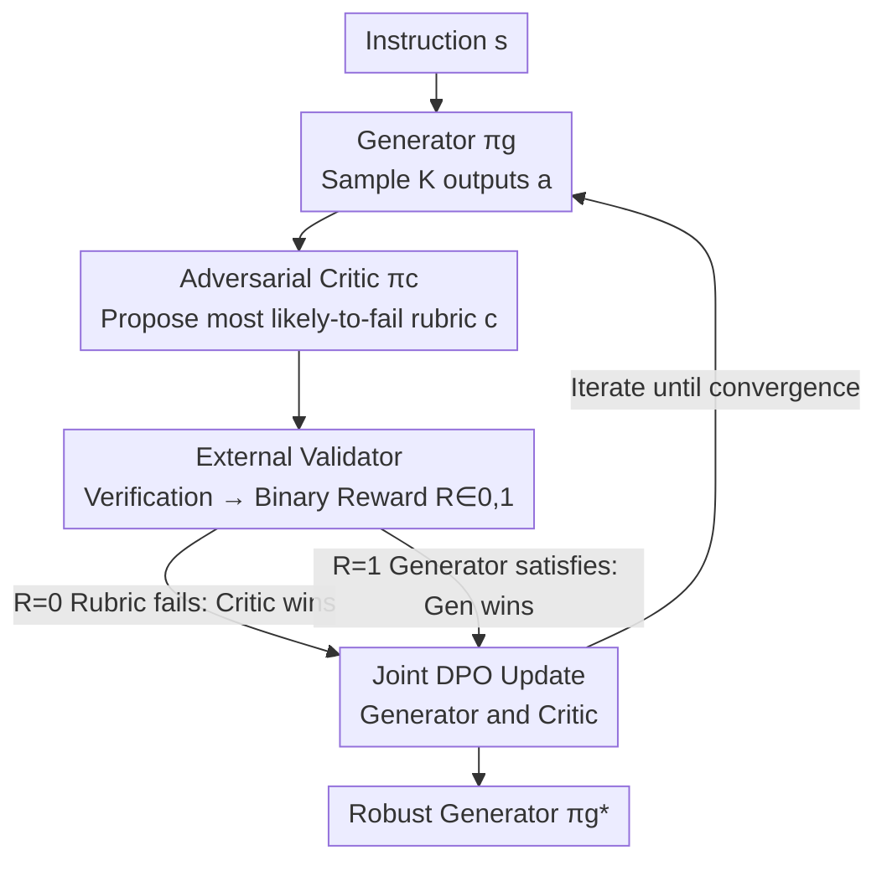

# RLAC: Reinforcement Learning with Adversarial Critic for Free-Form Generation Tasks

**Conference**: ICLR 2026  
**OpenReview**: [https://openreview.net/forum?id=dBmjnRR1bC](https://openreview.net/forum?id=dBmjnRR1bC)  
**Project Page**: [https://mianwu01.github.io/RLAC-website/](https://mianwu01.github.io/RLAC-website/)  
**Code**: See project page  
**Area**: Alignment RLHF / LLM Post-training / Reinforcement Learning  
**Keywords**: Free-form generation, Adversarial Critic, Dynamic rubric verification, DPO, Reward hacking

## TL;DR
RLAC reformulates free-form generation post-training, which requires satisfying numerous implicit rubrics, as a minimax game between a generator and a learnable Critic. Instead of enumerating all rubrics, the Critic selects the single most likely-to-fail rubric for external verification. This approach outperforms both exhaustive verification and reward models in biographical factuality and code generation, while reducing verification calls by up to 5.7×.

## Background & Motivation
**Background**: LLM post-training has evolved from SFT to RL. However, RL with verifiable rewards (e.g., PPO/GRPO) is primarily effective for tasks with "clear right-or-wrong" answers, such as matching mathematical solutions to reference answers.

**Limitations of Prior Work**: Free-form generation—such as writing biographies, generating complex code, or writing proofs—lacks a clean reward function. An output must simultaneously satisfy many task-specific judgement criteria (referred to as rubrics in this paper), such as "correct birth year of Newton" or "code handles null inputs." Two mainstream approaches have significant drawbacks: ① **Exhaustive Verification** (e.g., FactScore checking every atomic fact) is faithful but prohibitively expensive, as costs explode with output length and complex code has infinite edge cases. ② **Reward Models / LLM-as-judge** outsource the "merging of all rubrics" to a pre-trained scalar scorer, which is efficient but highly susceptible to reward hacking. The optimal combination of rubrics depends heavily on the specific prompt and the current model being optimized; fixed reward models lose accuracy once the policy drifts outside the training distribution.

**Key Challenge**: The number of rubrics is enormous or even unbounded, making "exhaustive enumeration and verification" computationally infeasible. Conversely, compressing all rubrics into a static scalar reward introduces bias and invites reward hacking. A fundamental tension exists between the **integrity** and **scalability** of verification.

**Goal**: Provide a scalable, verifiable reward signal tailored to the current policy for free-form generation tasks, without enumerating every rubric or relying on a fixed scalar reward model.

**Key Insight**: The authors observe that "an output satisfying all rubrics" is equivalent to "satisfying even the worst rubric"—i.e., taking the $\min$ over the set of rubrics. Since only the worst case matters, one does not need to traverse all rubrics; one only needs a mechanism to dynamically identify the "one most likely to fail."

**Core Idea**: Introduce a learnable adversarial Critic that proposes only the single rubric the generator is most likely to violate at each step. This rubric is verified by an external validator, turning post-training into a minimax game between the Generator and the Critic, both of which are updated alternately using DPO.

## Method

### Overall Architecture
RLAC addresses the problem of providing rewards for free-form generation without enumerating massive rubrics. It organizes training as a **two-player adversarial game**: given an instruction $s$, the generator $\pi_g$ samples several outputs. The adversarial Critic $\pi_c$ proposes **the single rubric most likely to fail** for each output (described in natural language, e.g., a specific factual claim or a test case). An external validator provides a binary judgment $R(s,a,c)\in\{0,1\}$ for this rubric, which serves as the reward signal for both the generator and the Critic. Both are updated alternately using DPO. Theoretically, the authors prove that the optimal generator of this min-max game aligns with the original goal of "satisfying all rubrics," while avoiding the cost of enumerating $C(s)$.

The pipeline is an online RL loop: the evaluation phase involves sampling generation + Critic proposing rubrics + validator scoring. The improvement phase uses DPO to update the generator (required) and the Critic (optional but critical). All three components—Generator, Critic, and Validator—are task-agnostic frameworks, with specific implementations swapped for different domains (e.g., FactScore for biographies, unit test execution for code).

### Key Designs

**1. min-max Reformulation: Turning "Satisfying All" into a "Withstanding the Worst" Game**

The original objective (Eq. 1) requires the generator's output to satisfy **all** rubrics $c\in C(s)$ associated with instruction $s$, i.e., maximizing $\prod_{c} R(s,a,c)$. Since $R$ is a 0/1 indicator function, "satisfying all" is equivalent to "satisfying the worst one"—taking the minimum over the set: $\mathbf{1}\{\forall c, R=1\}=\min_{c\in C(s)} \mathbf{1}\{R(s,a,c)=1\}$. The objective becomes $\max_\pi \mathbb{E}[\min_{c\in C(s)} R(s,a,c)]$. However, direct minimization over $C(s)$ still requires searching the entire rubric set. The key step is introducing a stochastic policy Critic $\pi_c(c\mid s,a)$ to **generate** the worst rubric, replacing the inner $\min$ with Critic optimization to obtain the minimax form:

$$\pi_g = \arg\max_{\pi}\ \min_{\pi_c}\ \mathbb{E}_{s}\,\mathbb{E}_{a\sim\pi}\,\mathbb{E}_{c\sim\pi_c}\big[R(s,a,c)\big].$$

Using conclusions from adversarial robust optimization (Madry et al., 2018), the solution $\pi_g$ to this equation is consistent with the original objective while completely bypassing the enumeration of all rubrics. This is the theoretical foundation allowing RLAC to scale to unbounded verification spaces (e.g., infinite test cases for code): it does not need traversal, only an opponent that can approximate the "worst rubric."

**2. Adversarial Critic: Using a Learnable Model to Dynamically Select the "Failure Point"**

The Critic $\pi_c$ is a fine-tuned pre-trained LLM that takes instruction $s$ and output $a$ as input to autoregressively generate a natural language rubric $c$ (e.g., "The statement about someone's birthplace is incorrect" or "This code does not handle empty lists"). Its reward is **strictly opposed** to the generator's: when the rubric it identifies is indeed violated by the generator ($R=0$), the Critic receives 1 and the generator receives 0; otherwise, the generator receives 1 and the Critic receives 0. This zero-sum feedback forces the Critic to continuously search for the generator's current weaknesses.

The essential difference from a "static Critic" or "fixed reward model" is **continuous adaptation**. A generator quickly learns to evade a fixed Critic's detection patterns—ablation shows a static Critic's detection rate plummeted from 42.3% to 33.9% within three rounds, as the generator learned to "dodge its fixed patterns" rather than actually improving. In contrast, the adversarial Critic adjusts as the generator evolves, maintaining a detection rate above 39% and applying persistent learning pressure. Furthermore, since rubrics are selected on-the-fly for **current on-policy outputs**, the reward signals are naturally tailored to the prompt and policy, suppressing reward hacking amplified by distributional drift.

**3. External Validator + Joint DPO Update: Implementing the Game as a Trainable RL Loop**

The minimax formula is instantiated using an external validator for ground truth and DPO for updates. The validator is an external tool (e.g., rule checker, FactScore, unit test executor) that simply answers whether a rubric is satisfied. Each training step: instructions $s$ are sampled, the generator produces $K$ candidates, the Critic proposes a rubric for each, and the validator gives binary rewards. Outputs with $R=1$ serve as positive examples $a^+$ and $R=0$ as negative examples $a^-$. The generator is updated via the DPO objective:

$$L(\pi_g;\pi_g^{\text{ref}})=-\mathbb{E}\Big[\log\sigma\big(\beta\log\tfrac{\pi_g(a^+|s)}{\pi_g^{\text{ref}}(a^+|s)}-\beta\log\tfrac{\pi_g(a^-|s)}{\pi_g^{\text{ref}}(a^-|s)}\big)\Big].$$

Symmetrically, for each $(s,a)$, $N$ rubrics are sampled. Those rejected by the validator (invalid or already satisfied) are negative examples $c^-$, while valid, unsatisfied ones are positive examples $c^+$. The Critic is updated using the same DPO format (Eq. 6). DPO is chosen for its simplicity and stability in optimizing from binary preference signals without tuning reward scaling or KL penalties; however, the framework is compatible with PPO/GRPO. Thus, "evaluation" (Critic finding weaknesses) and "improvement" (both sides updating via DPO) are unified into an online loop where the generator and Critic co-evolve.

### Loss & Training
The generator and Critic share the DPO objective (Eq. 5 / Eq. 6), each updating relative to its own reference policy $\pi^{\text{ref}}$, which is synchronized to the current policy after each round. For biographies: the generator produces 10 outputs per prompt, and the Critic proposes 4 rubrics per output. For code: $k=8$ outputs per prompt and $n=2$ rubrics per output, training only on a random 2000-problem subset of the 22K hard problems. Critic updates are marked as "optional" but ablation shows they are a key source of performance.

## Key Experimental Results

### Main Results

**Biographical Fact Generation (Enumerable but Expensive)** — Qwen3 series, using FactScore as the primary metric and tracking validator calls:

| Setup | Method | FactScore↑ | Verif. Calls↓ |
|------|------|-----------|-----------|
| Qwen3-8B / 8 sentences | Baseline | 0.653 | - |
| Qwen3-8B / 8 sentences | FactTune-FS (Exhaustive) | 0.867 | 438,949 |
| Qwen3-8B / 8 sentences | ArmoRM (Reward Model) | 0.723 | - |
| Qwen3-8B / 8 sentences | **RLAC** | **0.889** | **76,800** |
| Qwen3-8B / 4 sentences | FactTune-FS | 0.786 | 168,735 |
| Qwen3-8B / 4 sentences | **RLAC** | **0.796** | **38,400** |

RLAC achieves the highest factuality with the lowest verification cost: in the 8-sentence setup, it uses 5.7× fewer calls than FactTune-FS (77k vs 439k). **The more complex the task, the greater the savings.**

**Code Generation (Unbounded)** — Average Pass@1 across five benchmarks:

| Base Model | Method | Avg. Score↑ | Training Data Size |
|--------|------|--------|-----------|
| Qwen2.5-Coder-7B-Base | AceCoder-Rule (Exhaustive) | 52.3 | 22K |
| Qwen2.5-Coder-7B-Base | AceCoder-RM (Reward Model) | 49.1 | 22K |
| Qwen2.5-Coder-7B-Base | **RLAC** | **53.2** | 2K (9%) |
| Qwen2.5-Coder-7B-Instruct | AceCoder-Rule | 55.9 | 22K |
| Qwen2.5-Coder-7B-Instruct | **RLAC** | **56.6** | 2K (9%) |

RLAC achieves the highest average score using only 9% of the data. While AceCoder-Rule executed approximately 7.86 million test cases, RLAC required only 192,000, reducing verification costs by 97.5%. Note that the reward model AceCoder-RM lowered the HumanEval score from 91.5 to 89.0, a typical case of reward hacking.

### Ablation Study

| Configuration | FS | # Correct Facts | # Incorrect Facts | Description |
|------|-----|-----------|-----------|------|
| Base | 0.619 | 19.62 | 12.08 | Un-trained |
| Noisy Validator | 0.607 | 19.84 | 12.83 | Validator replaced with random labels → drops below baseline |
| Static Critic | 0.825 | 17.77 | 3.77 | Frozen Critic; inflated precision by "saying less" |
| Adversarial Critic | 0.817 | **21.58** | 4.84 | Truly increases correct facts and reduces errors |

### Key Findings
- **Reliable Validators are the Baseline**: Training collapses and FactScore drops below baseline when the validator is replaced with random labels, indicating that ground truth signals are indispensable.
- **Static Critic's High Score is an Illusion**: Its FactScore of 0.825 is achieved by "generating fewer facts" (correct facts dropped from 21.58 to 17.77). This is precision compression rather than genuine improvement. The adversarial Critic increases correct facts while decreasing errors.
- **Adversarial Pressure Enables Continuous Learning**: The static Critic's detection rate dropped from 42.3% to 33.9% (evaded by the generator), while the adversarial Critic maintained over 39%. In code tasks, the adversarial Critic provided +1.8% improvement compared to the static's +0.6%.
- **KL Divergence Reveals Exploration vs. Hacking**: RLAC's KL increases monotonically with FactScore (0.653→0.889), indicating effective exploration. ArmoRM's KL increased without factual gain, signifying reward hacking.
- **Two-Stage Training**: Early on, the Critic has not learned to pick obvious errors, and its "errors" are often trivial or themselves incorrect; FactScore briefly dipped from 0.653 to 0.641. After several rounds, the Critic learned to catch real errors, accelerating generator learning and eventually surpassing exhaustive methods.

## Highlights & Insights
- **The min→min-max Reformulation is the Masterstroke**: By strictly equating "satisfying all rubrics" with "withstanding the worst rubric," and using a learnable opponent to generate said rubric, the unbounded enumeration problem is transformed into an adversarial game with theoretical guarantees. This is an elegant transfer of adversarial robust optimization to LLM post-training.
- **Countering Reward Hacking with a "Dynamic Opponent"**: Reward hacking stems from fixed reward models failing to track policy drift. RLAC allows the reward source (Critic) and the optimizee (Generator) to evolve together on-policy, mechanically closing the space for hacking. This "learning referee" concept can be transferred to any RLHF scenario where static models are prone to hacking.
- **Verification Budget Spent Where it Matters**: Exhaustive methods repeatedly verify facts that are already correct. RLAC only verifies the "highest risk" point, thus flattening the growth of verification calls as task complexity increases—a high-value trait for expensive domains like fact-checking or formal proofs.

## Limitations & Future Work
- **Heavy Dependence on Reliable External Validators**: Ablation shows training collapses with noisy validators. Many free-form tasks (creative writing, subjective quality) lack reliable binary validators, making RLAC difficult to apply directly.
- **Single Rubric Limitation**: Picking only one "worst rubric" per step might slow convergence if the generator violates multiple independent rubrics simultaneously. The paper mitigates this with multi-sampling (K outputs × N rubrics) but does not fundamentally resolve it.
- **Noisy Code Validators**: The AceCode training data has incomplete test cases, which affects RLAC. The authors acknowledge this, noting that the Critic's continuous adaptation partially offsets the issue.
- **Two-Stage Cold Start**: The initial weakness of the Critic causes a temporary dip in FactScore, which is unfavorable for scenarios with tight training round budgets. Exploring better initialization for the Critic is a valuable direction.

## Related Work & Insights
- **vs. FactTune-FS (Exhaustive Verification)**: Both use external validators to improve factuality. However, FactTune-FS checks every atomic fact, while RLAC only checks the high-risk one selected by the Critic. RLAC saves 4–6× on verification calls for the same FactScore, with the advantage growing for longer tasks.
- **vs. ArmoRM / AceCoder-RM (Reward Models)**: Reward models replace verification with fixed scalar scorers. They are efficient but lead to reward hacking (KL increases without factuality gains). RLAC uses a dynamic adversarial Critic + real validator, aligning KL with quality and outperforming them using only 9% of the data.
- **vs. Standard RLHF/PPO**: RLAC does not train a single proxy reward nor rely solely on KL penalties for constraint. Instead, it delegates the "combination of rewards" to a context-aware opponent that is inherently prompt-specific and on-policy, avoiding the coverage gaps of proxy rewards.

## Rating
- Novelty: ⭐⭐⭐⭐⭐ Rigorous transfer of min-max adversarial robust optimization to LLM free-form generation post-training; theoretically and practically consistent.
- Experimental Thoroughness: ⭐⭐⭐⭐ Covers enumerable (biography) and unbounded (code) scenarios, multiple base models, and comprehensive training dynamics/KL/ablation, though lacking open tasks without reliable validators.
- Writing Quality: ⭐⭐⭐⭐⭐ Clear derivation from Eq. 1 to min-max; motivation, theory, algorithm, and experiments are seamlessly connected.
- Value: ⭐⭐⭐⭐⭐ Provides a scalable, hacking-resistant RL post-training paradigm for "expensive/unbounded verification" free-form generation with broad transferability.

<!-- RELATED:START -->

## Related Papers

- [\[ACL 2026\] UniCreative: Unifying Long-form Logic and Short-form Sparkle via Reference-Free Reinforcement Learning](../../ACL2026/reinforcement_learning/unicreative_unifying_long-form_logic_and_short-form_sparkle_via_reference-free_r.md)
- [\[ICLR 2026\] Safe Continuous-time Multi-Agent Reinforcement Learning via Epigraph Form](safe_continuous-time_multi-agent_reinforcement_learning_via_epigraph_form.md)
- [\[ICLR 2026\] Minimax Optimal Adversarial Reinforcement Learning](minimax_optimal_adversarial_reinforcement_learning.md)
- [\[ICLR 2026\] Flow Actor-Critic for Offline Reinforcement Learning (FAC)](flow_actor-critic_for_offline_reinforcement_learning.md)
- [\[ICLR 2026\] Learning to Generate Unit Test via Adversarial Reinforcement Learning](learning_to_generate_unit_test_via_adversarial_reinforcement_learning.md)

<!-- RELATED:END -->
