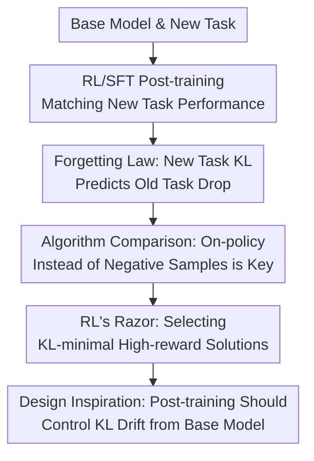

# RL's Razor: Why Online Reinforcement Learning Forgets Less

**Conference**: ICLR2026  
**OpenReview**: [https://openreview.net/forum?id=7HNRYT4V44](https://openreview.net/forum?id=7HNRYT4V44)  
**Code**: Not released  
**Area**: Reinforcement Learning / Continual Learning Theory  
**Keywords**: Online Reinforcement Learning, Catastrophic Forgetting, KL Divergence, Policy Gradient, Continual Learning  

## TL;DR
This paper discovers that the KL divergence between the base model and the fine-tuned model on the new task distribution can predict catastrophic forgetting. It explains why on-policy RL, compared to SFT, tends to find high-reward solutions closer to the original policy, thereby forgetting less when learning new tasks.

## Background & Motivation
**Background**: Foundation models are becoming universal backbones for language, vision, and robotic systems, often requiring post-training to acquire new capabilities after deployment. The two most common post-training paths are Supervised Fine-Tuning (SFT) and Reinforcement Learning (RL): the former mimics an external label distribution, while the latter updates the policy based on rewards from the model's own sampled outputs.

**Limitations of Prior Work**: Models often suffer from catastrophic forgetting when learning new tasks, where performance on original reasoning, QA, instruction following, coding, or robotic manipulation tasks declines as new task performance improves. Traditional continual learning methods often constrain forgetting through parameter changes, feature preservation, or distillation of old task outputs. However, the set of old tasks for foundation models is vast and lacks clear boundaries, making it difficult to directly use the "old task distribution" for actionable diagnosis.

**Key Challenge**: SFT and RL can sometimes achieve similar accuracy on new tasks, but their degree of damage to old capabilities differs significantly. If only the final new task score is considered, both appear to have "learned" the task; however, regarding old task retention, SFT often gains new capabilities by pulling the output distribution toward an external label distribution, whereas on-policy RL updates look more like reallocating probability mass among candidates that the original model was already willing to provide.

**Goal**: The authors aim to answer two questions: First, what variable truly determines the degree of forgetting, ideally measurable on the new task without relying on old task data; second, why RL usually forgets less than SFT for the same new task performance, and whether this advantage stems from negative samples in rewards, the optimization path, or the on-policy data itself.

**Key Insight**: The paper starts with the observation that "the same new task has many equivalent solutions." For instance, in ParityMNIST, predicting any even label for an even image is considered correct. In generative tasks, the same question can have many correct answers. If multiple output distributions can solve a new task, which distribution the training algorithm selects is critical: the further it is from the base model, the more likely it is to perturb the distribution structure originally supporting old capabilities.

**Core Idea**: The core view of "RL's Razor" is that among all policies capable of solving a new task, on-policy RL implicitly prefers the solution that is KL-minimal relative to the original policy; the degree of forgetting is primarily determined by the KL drift on the new task distribution.

## Method
### Overall Architecture
This paper does not propose a new RL algorithm but establishes an explanatory chain: first observing that RL forgets less than SFT on LLMs and robotic policies, then verifying that "forgetting is predicted by KL drift" in a controlled ParityMNIST setting, and finally explaining why on-policy updates favor low-KL solutions through algorithmic comparisons and theoretical analysis. The "Method" is more of a diagnostic framework: comparing new task performance, old task retention, KL drift, and training objectives within the same coordinate system.

### Key Designs
**1. Forgetting Law: Explaining Old Capability Decline with New Task KL Drift**

The most important variable identified is not the L1/L2 distance in parameter space, nor gradient sparsity or representation drift, but the difference in output distribution between the base policy $\pi_0$ and the fine-tuned policy $\pi$ on new task inputs $x \sim \tau$. The authors primarily use the form $E_{x\sim\tau}[KL(\pi_0 \| \pi)]$, while also reporting reverse KL, TV, and distributional L2 as candidate distances. The key point is not that old tasks are unimportant, but that the old task distribution is hard to define in foundation model scenarios; if new task KL is highly correlated with old task KL, then measuring KL only on the new task provides an actionable prediction of forgetting.

This finding unifies the SFT vs. RL difference: if the forgetting of both methods falls on the same "KL-forgetting" curve, then the algorithm name itself is not the root cause of forgetting; what truly determines whether old capabilities are preserved is how far the fine-tuned distribution is from the base model. A quadratic fit reaches $R^2=0.96$ in ParityMNIST, and a correlation of $R^2=0.71$ is observed in LLM experiments, indicating that this law holds from controlled toy settings to real medium-scale foundation models.

**2. RL's Razor: On-policy Updates Implicitly Select the Closest Feasible Solution to the Base Policy**

SFT targets a fixed external label distribution $\pi_\beta$, typically as $L_{SFT}(\pi)=-E_{x\sim D,y\sim \pi_\beta}[\log \pi(y|x)]$. If the label distribution is far from the base model, SFT pulls the model toward this distant target, even if other equally correct but closer distributions are available. The policy gradient objective of RL can be written as $L_{RL}(\pi)=-E_{x\sim D,y\sim \pi}[A(x,y)\log \pi(y|x)]$, where samples come from the current policy itself, and the update is a reweighting near the support of the current distribution.

This is what "Razor" refers to: when faced with many policies that could achieve high rewards, RL preferentially moves toward the one with the closer KL to the current policy, rather than being specified to an arbitrary solution by external labels like SFT. The paper provides a formal explanation on a finite set with binary rewards: rejection sampling from policy $p$ keeping only $R(y)=1$ samples yields a distribution $q_{RS}$ equivalent to the I-projection minimizing $DKL(q\|p)$ among all perfect-reward distributions; subsequently, policy gradient performs an M-projection on this reweighted distribution. If the policy family satisfies simplified convexity conditions, this alternating process converges to $\pi^\dagger=\arg\min_{\pi\in P^*\cap\Pi}DKL(\pi\|\pi_0)$.

**3. Causal Decomposition: Negative Samples are Not the Main Reason, On-policy Data Is**

The difference between RL and SFT might come from two sources: RL samples from its own policy and often gives negative advantage to low-reward samples; SFT uses offline positive examples without explicit negative samples. To decouple these factors, the authors constructed a four-quadrant comparison: GRPO is on-policy and uses negative samples, 1-0 REINFORCE is on-policy but only gives positive weight to correct samples, SFT is offline with only positive examples, and SimPO is offline but introduces positive/negative preference.

Science Q&A experiments show that 1-0 REINFORCE performs closer to GRPO, while SimPO is closer to SFT. In other words, the inclusion of negative samples does not explain why RL "forgets less"; the key is whether the data is sampled from the current model itself. This design is clean because it rules out the explanation that "RL is conservative because it has negative examples," supporting the on-policy KL-minimal bias claimed in this paper.

**4. Oracle SFT: Verifying the Problem Lies in the Target Distribution, Not the Algorithm Labels**

If KL is indeed the determinant of forgetting, then SFT should also forget less if fed with the KL-minimal correct distribution. In ParityMNIST, the authors construct an oracle SFT distribution using task structure: among all label distributions achieving 100% parity accuracy, select the one with the minimum KL to the pre-trained distribution $\pi_0$. After training SFT with this oracle distribution, the model preserves even more FashionMNIST capability than ordinary RL.

This step is crucial because it avoids stating the conclusion as "RL is inherently better." A more accurate statement is: RL's on-policy mechanism naturally finds low-KL solutions more easily; if the SFT supervision distribution is also designed to be low-KL, it can similarly preserve old capabilities. In other words, forgetting is not determined by the optimizer's name, but by the final learned output distribution.

### Mechanism
Using ParityMNIST as an example, the model input is an MNIST digit image, and the task is to predict any label with the same parity, rather than the specific digit. Suppose the true digit of an image is 8; then outputting 0, 2, 4, 6, or 8 is considered correct. Standard SFT might mandate that all even numbers be labeled as 0, or randomly select between 0 and 4; both labels make the new task correct but forcibly collapse the originally richer digit distribution.

RL behaves differently. If the base model originally gave 8 a higher probability, 6 and 4 some probability, and 0 a very low probability when seeing this image of 8, on-policy RL will mainly sample from these originally probable even candidates and suppress the odd-number probabilities via rewards. It does not need to pull all even images to label 0, so new task accuracy can rise while the output distribution retains more of the base model's structure. Oracle SFT is equivalent to knowing this "correct distribution closest to the base model" in advance and using it directly as the supervision label, further verifying that low-KL distributions are key to reduced forgetting.

### Loss & Training
The primary training objectives compared include SFT, GRPO, 1-0 REINFORCE, and SimPO, as well as variants with KL regularization. SFT uses cross-entropy to fit external label distributions: $L_{SFT}(\pi)=-E_{x\sim D,y\sim \pi_\beta}[\log \pi(y|x)]$. RL uses the policy gradient form: $L_{RL}(\pi)=-E_{x\sim D,y\sim \pi}[A(x,y)\log \pi(y|x)]$. GRPO in the main experiments uses single-step gradient updates, approximating REINFORCE with normalized rewards, without using KL penalty or clipping.

SimPO is used to test whether "negative samples are key" through offline positive/negative comparisons, with the loss form $L_{SIMPO}(\pi)=-E[\log \sigma(\log \pi(y_w|x)-\log \pi(y_l|x)-1)]$. KL regularization experiments compare RL+KL with SFT+KL: results show that KL regularization significantly enhances the inherent conservativeness of RL, but provides only marginal improvement for SFT because SFT is still pulled by a fixed external supervision distribution.

## Key Experimental Results

### Main Results
The main experiments cover three LLM tasks and one robotics task. LLMs use Qwen2.5-3B-Instruct, fine-tuned on mathematical reasoning, science QA, and tool use tasks. Robotics experiments use OpenVLA-7B, learning pick-and-place in SimplerEnv, measuring old capability retention with drawer open/close tasks. Old task evaluations include Hellaswag, TruthfulQA, MMLU, IFEval, Winogrande, HumanEval, and other manipulation tasks in the robot environment.

| Setting | New Task | Base Model / Env | Old Capability Eval | Main Conclusion |
|------|--------|---------------|------------|----------|
| LLM Math | Open-Reasoner-Zero Math | Qwen2.5-3B-Instruct | Hellaswag / TruthfulQA / MMLU / IFEval / Winogrande / HumanEval | RL scores on old tasks barely drop as new tasks improve; SFT shows most obvious drops in math. |
| LLM Science Q&A | SciKnowEval Chemistry L-3 | Qwen2.5-3B-Instruct | Same as above | SFT retains some capability at low accuracy, but forgetting accelerates sharply as high accuracy is reached. |
| LLM Tool Use | ToolAlpaca API Calls | Qwen2.5-3B-Instruct | Same as above | RL's Pareto frontier is above SFT, indicating more old capability retention for the same new task performance. |
| Robotics Pick-and-Place | Picking and moving cans | OpenVLA-7B / SimplerEnv | Drawer open/close etc. | RL forgets less than SFT also observed in robotics policies. |

Importantly, the authors do not just compare a single hyperparameter point but perform multiple sweeps for both SFT and RL across learning rates, batch sizes, schedulers, and epochs, then take the Pareto frontier on the "new task performance vs. old task performance" plane. This avoids misjudging a method as having severe forgetting due to insufficient tuning.

| Variable / Method | Experimental Setting | Quantitative Result | Description |
|-------------|----------|----------|------|
| New Task KL Predicts Forgetting | ParityMNIST, RL and multiple SFT label distributions | Quadratic fit $R^2=0.96\pm0.01$ | Both algorithms and different SFT label distributions fall on the same KL-forgetting curve. |
| New Task KL Predicts Forgetting | LLM Experiments | Quadratic fit $R^2=0.71$ | Correlation is weaker than toy setting, but residual mean is near 0, consistent with estimation noise. |
| reverse KL | ParityMNIST | $R^2=0.93\pm0.01$ | Also has strong predictive power, but forward KL is slightly stronger. |
| Total Variation | ParityMNIST | $R^2=0.80\pm0.01$ | Explains some forgetting, but weaker than KL. |
| Dist. L2 | ParityMNIST | $R^2=0.56\pm0.02$ | Significantly weaker than KL. |
| Param/Rep Metrics | ParityMNIST | Most between $R^2=0.34$ and $0.58$ | Parameter change, Fisher-weighted L2, spectral norm, and activation drift are not stable explanations. |

### Ablation Study
The ablation focuses on ruling out alternative explanations. The first group uses the algorithm four-quadrant to determine if RL's reduced forgetting comes from negative samples; the second adds explicit KL regularization; the third uses Oracle SFT and RL teacher distillation to test if the "final distribution" is more critical than the "training algorithm name."

| Configuration | Key Metric | Description |
|------|---------|------|
| GRPO | Lower KL, better old task retention for same accuracy | On-policy with negative samples; standard RL baseline. |
| 1-0 REINFORCE | Behavior close to GRPO | On-policy without negative samples; suggests negative samples are not necessary for RL's low forgetting. |
| SFT | Behavior close to SimPO, larger KL drift | Offline positive supervision mimics external dist.; tends toward solutions far from base model. |
| SimPO | Close to SFT | Offline with negative samples; still lacks RL's low-KL advantage. |
| Oracle SFT | Retains old capability better than RL in ParityMNIST | If the supervision distribution is KL-minimal, SFT can also forget less. |
| RL teacher distillation | SFT student matches RL teacher's trade-off | Shows the critical factor is the distilled output distribution, not just the path. |
| RL + KL reg. | Significantly improved Pareto frontier | Explicit KL regularization reinforces RL's natural low-KL bias. |
| SFT + KL reg. | Marginal improvement | If external labels are far from base, KL penalty struggles to fundamentally change the target. |

### Key Findings
- The core empirical law: irrespective of whether the model is obtained via RL or SFT, plotting old task scores against new task KL shows that forgetting roughly falls on the same curve. This translates "why RL forgets less" into "why RL achieves the same performance with smaller KL."
- Four-quadrant algorithm comparison shows on-policy is key. 1-0 REINFORCE closely matches GRPO without negative advantage penalties, while SimPO remains close to SFT despite having positive/negative comparisons.
- Parameter sparsity is not the explanation. The authors point out that low mantissa in bfloat16 makes small RL updates look like "no change"; switching to float32 maintains performance but the sparsity phenomenon disappears.
- Representation similarity results are consistent with the main conclusion: CKNNA similarity to the base model is ~0.94 for RL and ~0.56 for performance-matched SFT models, indicating SFT alters representative geometry more significantly.
- Model scaling does not automatically solve SFT forgetting. Qwen2.5 3B, 7B, and 14B all exhibit the fundamental trade-off: new task gains require sacrificing old tasks in Science Q&A.

## Highlights & Insights
- The most clever aspect of the paper is shifting catastrophic forgetting from "what happened on old tasks" to "how far the output distribution on the new task is from the base model." This changes the measurement of forgetting from unenumerable historical task sets to an estimable and controllable KL drift during fine-tuning.
- RL's Razor provides a clear algorithmic intuition: RL is not magically better at continual learning, but on-policy sampling allows it to move primarily near the base model's existing probability mass. This explanation is more concrete and actionable than "RL has negative samples" or "RL updates are sparse."
- Oracle SFT is a powerful sanity check. It proves SFT is not destined to forget; the problem is that standard supervision data usually specifies a single correct answer without caring if that answer distribution is close to the base model.
- Implications for post-training practice are direct: when evaluating a post-training method, one should look at not just the new task accuracy, but the KL drift required to reach it. A method that learns with low KL is likely more suitable for long-term online learning.
- This paper also provides a new explanation for common KL penalties in RLHF/RFT: they are not just for preventing reward hacking or stabilizing training, but also for protecting the foundation model's original capabilities.

## Limitations & Future Work
- The authors admit the underlying mechanism of "why KL drift on new tasks destroys old task performance" is not yet explained. KL is a strong predictor, but the representation interference or capacity occupation behind it requires further study.
- Theoretical analysis is built on simplified conditions like finite outputs, binary rewards, and convex or exponential policy families. Real LLM non-convex neural training, long-sequence generation, and complex rewards may deviate from these, making the theory an explanatory model rather than a complete convergence guarantee.
- LLM experiments were primarily on Qwen2.5-3B and some 7B/14B SFT scaling; a gap remains to frontier-scale models. The KL-forgetting relationship in larger models, more complex agent tasks, and long-duration continuous online learning remains to be verified.
- The paper did not deeply study online but off-policy algorithms. Many actual RL systems use replay buffers, offline preference data, or mixed sampling; these may fall between SFT and on-policy RL in terms of KL conservativeness.
- Old capability evaluation still relies on limited benchmarks. While more comprehensive than checking a single task, the true capability surface of foundation models is wider, and benchmark score drops might not fully equate to the loss of all old knowledge.
- A natural extension is designing "KL-aware SFT": not just adding a simple KL penalty, but explicitly selecting correct answer distributions close to the base model during label selection, response filtering, or distillation target construction.

## Related Work & Insights
- **vs Learning without Forgetting / EWC etc.**: These methods usually constrain parameters, features, or old task outputs. This paper points out that new task KL drift alone is highly predictive of forgetting. It doesn't replace all continual learning tricks but provides a unified diagnostic variable.
- **vs KL regularization in RLHF**: KL penalties were often viewed as engineering tools for stability or preventing overoptimization; this paper elevates it to a principle for preventing forgetting—post-training should favor KL-minimal improvement.
- **vs "SFT memorizes, RL generalizes" work**: These works emphasize RL's superior generalization on new tasks; this paper adds another dimension: while gaining new capabilities, RL's damage to old capabilities is also smaller, explained via KL.
- **vs Lai et al. regarding RL reducing forgetting via negative samples**: This paper explicitly decouples on-policy vs. negative sample factors using 1-0 REINFORCE and SimPO, concluding that on-policy nature is more critical.
- **Insights for Robotics Continual Learning**: Although the paper might be categorized under robotics in some contexts, robotics is just one verification domain. The transferable lesson is: when adapting to new environments or tasks, policy updates should favor low-KL successful behaviors rather than blindly mimicking a single expert trajectory.

## Rating
- Novelty: ⭐⭐⭐⭐⭐ Explaining RL's low forgetting through KL-minimal solutions is a precise angle, and Oracle SFT effectively rules out crude "RL is inherently better" claims.
- Experimental Thoroughness: ⭐⭐⭐⭐ Covers LLM, robotics, and controlled toy settings with convincing ablation designs; however, frontier-scale models and long-term online learning are not yet covered.
- Writing Quality: ⭐⭐⭐⭐⭐ The main line is very clear, moving from phenomenon to prediction law, then to mechanism decomposition and theoretical explanation.
- Value: ⭐⭐⭐⭐⭐ Directly enlightening for continual learning, RFT/RLHF, and post-training evaluation, especially for guiding low-forgetting post-training objectives and data distribution design.

<!-- RELATED:START -->

## Related Papers

- [\[ICLR 2026\] Less is More: Clustered Cross-Covariance Control for Offline RL](less_is_more_clustered_cross-covariance_control_for_offline_rl.md)
- [\[ICLR 2026\] REA-RL: Reflection-Aware Online Reinforcement Learning for Efficient Reasoning](rea-rl_reflection-aware_online_reinforcement_learning_for_efficient_reasoning.md)
- [\[ICLR 2026\] The Sample Complexity of Online Reinforcement Learning: A Multi-Model Perspective](the_sample_complexity_of_online_reinforcement_learning_a_multi-model_perspective.md)
- [\[ICLR 2026\] Learn More with Less: Uncertainty Consistency Guided Query Selection for RLVR](learn_more_with_less_uncertainty_consistency_guided_query_selection_for_rlvr.md)
- [\[ICLR 2026\] Stackelberg Coupling of Online Representation Learning and Reinforcement Learning](stackelberg_coupling_of_online_representation_learning_and_reinforcement_learnin.md)

<!-- RELATED:END -->
