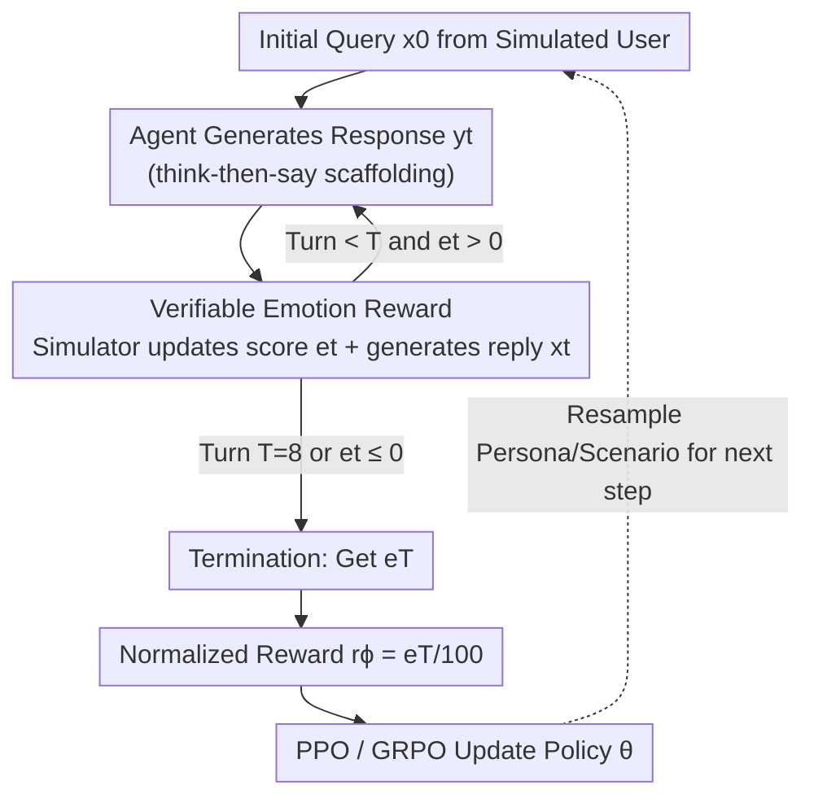

# RLVER: Reinforcement Learning with Verifiable Emotion Rewards for Empathetic Agents

**Conference**: ICLR 2026  
**OpenReview**: [https://openreview.net/forum?id=P7wBg0vPTh](https://openreview.net/forum?id=P7wBg0vPTh)  
**Code**: https://github.com/Tencent/DigitalHuman/tree/main/RLVER  
**Area**: Alignment RLHF / Reinforcement Learning / Empathetic Conversation  
**Keywords**: Verifiable rewards, emotion rewards, empathetic agents, user simulator, PPO/GRPO

## TL;DR
RLVER treats a "sentient user simulator" with self-consistent emotion updates as an RL environment, using the emotion scores provided by the simulated user at the end of multi-turn dialogues as verifiable rewards to train LLMs end-to-end for empathy. This approach allows Qwen2.5-7B-Instruct to improve from 13.3 to 79.2 on the Sentient Benchmark, approaching top-tier closed-source models with almost no loss in math or coding abilities.

## Background & Motivation
**Background**: Progress in LLMs has predominantly focused on the "rational half"—mathematical reasoning, code generation, and algorithmic planning. These tasks possess verifiable ground truths, allowing RLVR (Reinforcement Learning from Verifiable Rewards) to utilize "correctness" as a reward to help models acquire new skills from scratch. Conversely, improving a model's emotional intelligence (EQ) or empathy primarily relies on supervised fine-tuning (SFT) on annotated psychological counseling corpora or rule-based template generation.

**Limitations of Prior Work**: The supervised approach faces three critical issues: scarcity of annotated data, rigid dialogue structures, and poor generalization. Models merely imitate static "standard responses" and often respond awkwardly or off-topic in real-world scenarios where user emotions evolve during the conversation (e.g., comforting a friend who becomes increasingly distressed).

**Key Challenge**: The primary obstacle to applying RLVR to dialogue scenarios is that **empathy lacks a verifiable "standard answer."** The quality of a consolation depends on the user's current emotions, persona, and dialogue goals, representing a dynamic, subjective, long-term objective. Two elements are missing: (1) a stable, realistic, and scalable multi-turn dialogue rollout environment; (2) a consistent and verifiable reward design for the general capability of "emotional intelligence." Using neural reward models for scoring introduces risks of reward hacking and uninterpretable black boxes.

**Goal**: To create an environment capable of sustained multi-turn dialogue rollouts during training that stably outputs verifiable emotion rewards, allowing LLMs to directly optimize "long-term user satisfaction" via RL rather than imitating static ground truth.

**Key Insight**: The authors found that the existing SAGE (Sentient Agent as a Judge) evaluation framework provides a "self-consistent sentient user simulator." It deterministically reasons an emotion score in the range $[0, 100]$ based on persona, dialogue history, and goals. Since this score serves as an evaluation metric, it can also serve as a **training reward**.

**Core Idea**: Transform the SAGE evaluator into a "real-time training environment" and use the deterministic, verifiable emotion scores updated each round by the simulator as rewards. The empathy capability is then trained end-to-end via PPO/GRPO—a framework termed RLVER (RL with Verifiable Emotion Rewards).

## Method

### Overall Architecture
RLVER is a closed-loop RL system consisting of an "Agent $\leftrightarrow$ Sentient User Simulator." The agent under training (policy $\pi_\theta$) acts as a listener supporting a simulated user seeking help; the user simulator (a Sentient Agent based on SAGE) acts as the seeker. A dialogue session begins with an initial query $x_0$ from the simulator. After the agent generates a response $y_t$, the simulator performs two actions: **deterministically updates its emotion score $e_t$** (the reward signal) and **generates a reply $x_t$** consistent with its new emotional state to continue the dialogue. The session continues until the maximum number of turns $T$ (defaulted to 8) is reached or the emotion score falls below a minimum satisfaction threshold ($e_t \le 0$, representing total empathetic failure). Upon termination, the final emotion score $e_T$ is normalized into a scalar reward $r_\phi = e_T/100$ to update policy parameters $\theta$ via PPO or GRPO. This cycle is termed **Heart-in-the-Loop**.

### Key Designs

**1. Verifiable Emotion Rewards: Using a Self-Consistent Sentient Simulator as a Deterministic Reward Source**

This design addresses the pain point that empathy has no verifiable standard answer. RLVER does not train a neural reward model; instead, it reuses the Sentient Agent from SAGE as the reward engine. Each simulated user is instantiated with four elements: a detailed persona, dialogue background, explicit dialogue goals, and hidden intentions, ensuring diversity and realism. In each turn, the simulator executes multi-hop reasoning in two steps: simulating **emotional changes** using $f_{\text{emo}}$ (evaluating how the response feels, updating the numerical emotion score, and generating an "inner monologue" to justify the change) and generating a **coherent reply** using $f_{\text{reply}}$. The final reward is the normalized terminal emotion score:

$$r_\phi(h_T) = \frac{e_T}{100}, \quad e_T = S_{\text{emotion}}(h_T)$$

Where $h_T = \{x_0, y_0, \dots, y_T, x_T\}$ is the complete dialogue history. The key to this "verifiability" is that every change in the emotion score is **deterministically derived** through principled reasoning steps based on persona and context, rather than black-box scoring. This avoids the lack of transparency in learned reward models. Furthermore, the diversity of simulated user behavior (500 scenarios, 8 categories of goals) mitigates reward hacking caused by "homogeneous user preferences."

**2. Heart-in-the-Loop: Closed-loop Rollout with the Simulator as Environment and Reward**

In standard RLVR tasks, the environment and reward are separate. However, in empathetic dialogue, the **simulated user plays both roles**. At the start of each training step, the simulator engine $S$ instantiates a batch of Sentient Agents with sampled personas and intents. During rollout, the agent observes the history $h_{t-1}$ and samples an action $y_t \sim \pi_\theta(\cdot \mid h_{t-1})$. The simulator then produces the verifiable emotion score $e_t$ and a new reply $x_t$. This closed loop allows the agent to **co-evolve** with the simulator's emotional dynamics. Notably, the termination condition $e_t \le 0$ cuts off dialogues where social alignment failed, avoiding wasted exploration on invalid trajectories.

**3. think-then-say Scaffolding + PPO/GRPO Dual Algorithms**

To investigate how "thinking before speaking" contributes to high-order empathy, the authors utilized two templates: **think-then-say** (explicit reasoning before responding) and a direct response control template. For policy optimization, PPO (clipped surrogate loss) served as the primary algorithm, compared against GRPO (group-relative advantage), which is better suited for outcome-level sequence learning:

$$L_{\text{PPO}}(\theta) = \hat{\mathbb{E}}_t \left[ \min\left( r_t(\theta)\hat{A}_t,\ \text{clip}(r_t(\theta), 1-\epsilon, 1+\epsilon)\hat{A}_t \right) \right]$$

Experiments showed the "thinking" scaffolding made models better at "empathetic depth" and "core insight," while "non-thinking" focused more on "solution crafting." PPO pushed specific capabilities to a higher ceiling, while GRPO provided more balanced improvements.

### Loss & Training
- **Reward**: Terminal emotion score normalized to $[0, 1]$; the entire dialogue shares one outcome-level scalar reward $r_\phi = e_T/100$.
- **Optimizer**: PPO (primary) + GRPO (comparison), both on-policy.
- **Environment**: SAGE simulator with DeepSeek-V3-1226 as the default Sentient Agent; 500 supportive dialogue scenarios across 8 goal categories; max 8 turns.
- **Base Model**: Qwen2.5-7B-Instruct (not fine-tuned on emotional/empathy data to ensure gains are attributable to RLVER).

## Key Experimental Results

### Main Results
The base Qwen2.5-7B-Instruct scored only 13.3 on the Sentient Benchmark, with 76% of dialogues ending in failure. After RLVER training, performance increased significantly. The best "PPO + Thinking" model reached 79.2 (approx. 6x improvement), with the success rate rising from 2% to 42%. This performance is on par with the top-tier closed-source Gemini2.5-Pro (82.4) and exceeds Gemini2.5-Flash-Think (66.1) and OpenAI-o3 (62.7).

| Model | Sentient Score | Success Rate | Failure Rate | Chit Chat |
|------|------|------|------|------|
| Gemini2.5-Pro-0605 (Top Closed) | 82.4 | 55% | 4% | 83.3 |
| GPT-4o-0326 | 79.9 | 51% | 4% | 80.9 |
| OpenAI-o3-0416 | 62.7 | 32% | 14% | 83.0 |
| Qwen2.5-7B-Instruct (Base) | 13.3 | 2% | 76% | 37.8 |
| **RLVER PPO + Thinking** | **79.2** | 42% | 9% | 62.1 |
| RLVER PPO Non-Thinking | 61.7 | 24% | 23% | 53.4 |
| RLVER GRPO + Thinking | 72.0 | 34% | 10% | 53.0 |
| RLVER GRPO Non-Thinking | 68.3 | 26% | 10% | 49.2 |

General capabilities saw almost no degradation (best PPO model): Math500 77.8 $\to$ 76.6, LiveCodeBench 26.7 $\to$ 28.0, IFEval 70.4 $\to$ 68.6, indicating that specializing in empathy did not trigger catastrophic forgetting.

### Ablation Study
The training environment was switched from a "vanilla simulator" to a "challenging simulator" (stricter/more conservative) to examine the impact of environment difficulty:

| Configuration | thinking | non-thinking | Description |
|------|------|------|------|
| Vanilla Simulator | 79.2 | 61.7 | Moderate difficulty, best results |
| Challenging Simulator | 66.4 | 19.8 | Excessive difficulty led to collapse |
| Challenging (non-think) | — | 19.8 | Dropped from 61.7 to 19.8 |

The challenging simulator had a policy acceptance rate of only 33.1% (vs. 52.4% vanilla), providing signals that were too sparse.

### Key Findings
- **Harder Environment $\neq$ Better**: An overly strict simulator provides too little feedback during the exploration phase, which is particularly harmful to initially weak models; a moderate, well-calibrated environment supports broader exploration.
- **Thinking is More Robust**: In challenging environments, thinking models dropped only from 79.2 to 66.4, still showing improvement; non-thinking models collapsed, learning almost nothing.
- **PPO vs. GRPO Characteristics**: GRPO improvements are steadier; PPO amplifies specific strengths—Thinking+PPO has a higher ceiling in "Core Insight" and "Empathic Depth," while Non-thinking+PPO excels in "Solution Crafting."

## Highlights & Insights
- **Repurposing Evaluators as Training Environments**: SAGE was originally a "judge" for empathy. The authors recognized its deterministic scores are naturally verifiable, turning the judge into an RL environment—a "training by evaluation" strategy applicable to other subjective tasks.
- **Deterministic Reasoning over Neural Reward Models**: Empathy scoring is prone to black-box issues. By ensuring scores are derived via "explainable reasoning based on persona/goals," the authors ensure auditability and resistance to reward hacking.
- **The "Sweet Spot" of Environment Difficulty**: Contrary to the "harder is better" intuition in RL, this work demonstrates that for weak initial models, overly harsh environments stifle exploration signals.
- **think-then-say exceeds CoT**: Explicit reasoning was verified to catalyze high-order empathy (inferring unspoken needs) rather than just adding tokens.

## Limitations & Future Work
- **Reliance on Simulator Fidelity**: Rewards depend on the SAGE simulator. If the simulator's portrayal of human emotion is biased, the agent may learn to "please the simulator" rather than humans (sim-to-real gap).
- **Single Seeker Context**: Currently limited to one-on-one emotional support; future work should address multi-party dialogues and more complex settings.
- **Terminal Sparse Rewards**: Using only $e_T$ discards turn-by-turn signals; exploring how to use intermediate emotion trajectories for reward shaping is a potential direction.
- **Non-medical Substitute**: The system is for research and cannot replace professional psychological or medical consultation.

## Related Work & Insights
- **vs. Supervised Empathetic Dialogue (ESConv / SoulChat)**: These rely on SFT, leading to rigid imitation. RLVER optimizes long-term satisfaction via RL, providing a systematic analysis of the "logic vs. emotion" trade-off.
- **vs. Zero-RL (DeepSeek-R1 route)**: While Zero-RL has succeeded in domains with objective answers (math/code), RLVER extends this paradigm to the "dialogue" domain where objective answers are absent, by creating verifiable emotional reward proxies.
- **vs. LLM-as-a-Judge Rewards**: Simple LLM scoring is static; the Sentient Agent in RLVER is a dynamic judge with a persona and evolving emotional states.

## Rating
- Novelty: ⭐⭐⭐⭐⭐ First to introduce verifiable emotion rewards into RL for empathy training.
- Experimental Thoroughness: ⭐⭐⭐⭐ Extensive results and analysis, though limited to 7B base models and lacking human validation.
- Writing Quality: ⭐⭐⭐⭐⭐ Clear progression of motivation, framework, and counter-intuitive findings.
- Value: ⭐⭐⭐⭐⭐ Provides a reusable paradigm for "verifiable RL on subjective goals."

<!-- RELATED:START -->

## Related Papers

- [\[ICLR 2026\] RLVMR: Reinforcement Learning with Verifiable Meta-Reasoning Rewards for Robust Long-Horizon Agents](rlvmr_reinforcement_learning_with_verifiable_meta-reasoning_rewards_for_robust_l.md)
- [\[ICLR 2026\] LongRLVR: Long-Context Reinforcement Learning Requires Verifiable Context Rewards](longrlvr_long-context_reinforcement_learning_requires_verifiable_context_rewards.md)
- [\[ICLR 2026\] Rubrics as Rewards: Reinforcement Learning Beyond Verifiable Domains](rubrics_as_rewards_reinforcement_learning_beyond_verifiable_domains.md)
- [\[ICLR 2026\] From Verifiable Dot to Reward Chain: Harnessing Verifiable Reference-based Rewards for RL of Open-ended Generation](from_verifiable_dot_to_reward_chain_harnessing_verifiable_reference-based_reward.md)
- [\[ICLR 2026\] Reinforcement Learning with Verifiable Rewards Implicitly Incentivizes Correct Reasoning in Base LLMs](reinforcement_learning_with_verifiable_rewards_implicitly_incentivizes_correct_r.md)

<!-- RELATED:END -->
