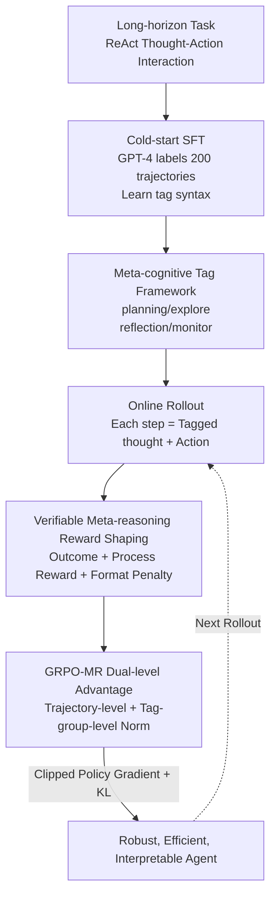

# RLVMR: Reinforcement Learning with Verifiable Meta-Reasoning Rewards for Robust Long-Horizon Agents

**Conference**: ICLR 2026  
**OpenReview**: [https://openreview.net/forum?id=cTbAevdwBE](https://openreview.net/forum?id=cTbAevdwBE)  
**Code**: None  
**Area**: Agent / Reinforcement Learning / LLM Reasoning  
**Keywords**: Long-horizon Agents, Process Rewards, Metacognition, GRPO, Verifiable Rewards

## TL;DR
To address the problem where end-to-end RL, which "only rewards final success," reinforces redundant and deviated reasoning paths, RLVMR enables agents to explicitly label cognitive steps using four tags—`<planning>/<explore>/<reflection>/<monitor>`. It issues verifiable dense rewards for these meta-reasoning behaviors via programmatic rules, optimized with GRPO-MR using dual-level advantages. A 7B model achieved an 83.6% success rate on the most difficult unseen task split (L2) of ALFWorld while significantly reducing invalid and repeated actions.

## Background & Motivation
**Background**: Training long-horizon agents with LLMs currently follows two mainstream routes. One involves SFT on expert trajectories to learn efficient behaviors; the other uses end-to-end RL from environmental feedback (e.g., GRPO) to achieve better generalization through exploration. Both operate under the ReAct (alternating thought-action) framework.

**Limitations of Prior Work**: The authors highlight a neglected phenomenon—**inefficient exploration**. SFT is efficient and accurate on seen tasks (7B model L0 success rate 63.3%, invalid action rate only 6.2%) but is extremely fragile. On unseen task categories (L2), the success rate drops to 37.5% and repetition rates double, suggesting it "mimics without learning to reason." GRPO generalizes better (L1 77.3%, L2 52.3%), but at the cost of indiscriminately reinforcing any successful trajectory, even those filled with redundant steps or infinite loops (7B model L2 repetition rate reaches 31.2%).

**Key Challenge**: Using only sparse, outcome-oriented rewards makes it impossible to distinguish between "success through solid reasoning" and "success by chance through fragile shortcuts." Importantly, simply scaling from 1.5B to 7B does not solve this—7B GRPO shows a higher success rate on L2 but an even higher repetition rate (31.2% vs 27.1%), indicating that larger capacity is utilized to "exploit loopholes" more effectively. The issue lies in the training objective rather than model scale.

**Goal**: To move beyond "outcome-only rewards" and push supervision signals down to the **reasoning process itself**, enabling agents not only to find solutions but to find them "logically."

**Key Insight**: The authors leverage metacognition theory—"thinking about thinking." The core observation is that high-level cognitive skills—planning, monitoring progress, exploring alternatives, and reflecting on errors—can be decomposed into discrete, **verifiable** steps embedded within the agent's reasoning flow.

**Core Idea**: Operationalize meta-reasoning behaviors using four explicit tags and issue dense verifiable rewards for "beneficial meta-reasoning" via programmatic rules. These are optimized alongside final outcome rewards using a critic-free policy gradient method, GRPO-MR.

## Method

### Overall Architecture
RLVMR addresses the deviation in reasoning caused by outcome-only rewards through two stages. **Stage 1 (Cold-start)**: A small batch (200) of successful trajectories is backfilled with meta-reasoning tags by a stronger teacher model (e.g., GPT-4). The target LLM then performs SFT to learn the tag syntax and ability to output structured meta-reasoning. **Stage 2 (RL)**: The agent performs online rollouts in ALFWorld/ScienceWorld environments. Each step generates both tagged thoughts and actions. A **reward shaping** mechanism scores meta-reasoning behaviors based on rules (e.g., rewards for exploring new states, correcting errors after reflection, penalties for format errors), overlaid with sparse outcome rewards. Finally, the **GRPO-MR** algorithm combines "trajectory-level performance" and "relative quality of same-tag meta-reasoning steps" into step-level advantages for policy updates using clipped policy gradients and KL regularization. These elements—the tag framework, reward shaping, and dual-level advantage optimization—push the agent toward "coherent reasoning and efficient action."

### Key Designs

**1. Meta-cognitive Tag Framework: Decomposing Reasoning into Verifiable Discrete Cognitive Steps**

This directly addresses the pain point where ReAct treats reasoning as a black box. RLVMR decouples monolithic reasoning into four XML-style tags, each corresponding to a metacognitive function: `<planning>` decomposes tasks into high-level steps; `<explore>` generates hypotheses or alternatives when facing uncertainty; `<reflection>` analyzes history and errors to provide corrective actions; `<monitor>` tracks progress against the plan to ensure alignment. Actions are wrapped in `<action>`. This turns abstract "reasoning quality" into structured objects that can be **programmatically recognized and rule-scored**. Under the MDP formulation, the policy $\pi_\theta$ generates thought $th_t$ and action $a_t$ at state $s_t$: $(th_t, a_t) \sim \pi_\theta(\cdot \mid s_t)$.

**2. Verifiable Meta-reasoning Reward Shaping: Issuing Dense Rewards for "Good Cognition" via Programmatic Rules**

To solve the "sparse outcome reward" problem, RLVMR designs a composite reward: **Outcome Reward** $R(\tau)$ is a binary signal (positive constant $r_s$ for success); **Meta-reasoning Reward** $r^{MR}_t$ is dense and step-based, with each category mapped to a programmatic rule. `<planning>` is rewarded only if the final trajectory succeeds ($r_{planning}$); `<explore>` is rewarded only if the action leads to a **new object or location** ($r_{explore}$); `<reflection>` is rewarded only if it **produces a corrective action** following a series of failures ($r_{reflection}$). A **Format Reward** $r^{format}_t$ deducts $-\lambda_{format}$ for structural violations. Total step reward is $r_t = r^{MR}_t + r^{format}_t$. These rewards are "verifiable" because they rely on **deterministic rules** (e.g., was a new state discovered?), making them resistant to reward hacking.

**3. GRPO-MR: Combining Overall Performance and Relative Quality of Reasoning Steps**

To prevent interference between different meta-reasoning reward scales, GRPO-MR calculates a **context-aware** step-level advantage without a critic. Level 1 is **Trajectory-level Relative Advantage**: $A^{traj}_k = \frac{R(\tau_k) - \mu_R}{\sigma_R}$ for $K$ trajectories to capture overall performance. Level 2 is **Meta-reasoning-level Relative Advantage**: Steps sharing the same tag within a batch are grouped and normalized as $A^{MR}_{t,tag} = \frac{r^{MR}_{t,tag} - \mu_{tag}}{\sigma_{tag}}$. This ensures meta-reasoning behaviors are only compared with "similar behaviors," aligning scales. The final advantage is:

$$A_t = \alpha \cdot A^{traj}_k + (1-\alpha) \cdot A^{MR}_{t,tag}$$

where $\alpha \in [0,1]$ balances global outcomes and local reasoning quality. The objective uses a clipped surrogate loss and KL regularization:

$$L_{final} = \mathbb{E}_t\big[\min(r_t(\theta)A_t,\ \mathrm{clip}(r_t(\theta), 1-\epsilon, 1+\epsilon)A_t)\big] - \lambda_{KL} D_{KL}(\pi_\theta \| \pi_{ref})$$

### Loss & Training
The Cold-start stage performs SFT on 200 annotated trajectories for 5 epochs ($1\times10^{-5}$ learning rate). The RL stage uses the veRL framework, sampling 8 trajectories per environment across 16 environments. Advantage weights $\alpha=0.5$, format penalty $-0.1$ (requires at least one meta-reasoning and one action tag), KL coefficient 0.01, and max 30 steps per episode. RLVMR trains for 100 epochs, achieving better results with fewer epochs than the 150-epoch RL baseline.

## Key Experimental Results

### Main Results
Evaluation on ALFWorld and ScienceWorld categorized by L0 (seen variant/category), L1 (unseen variant/seen category), and L2 (unseen variant/category). RLVMR achieves SOTA across three base models.

| Base / Method | ALFWorld L0 | ALFWorld L1 | ALFWorld L2 | ScienceWorld L2 (succ.) |
|------|------|------|------|------|
| Qwen2.5-7B + GRPO | 79.3 | 77.3 | 52.3 | 26.6 |
| Qwen2.5-7B + GiGPO (runner-up) | 89.5 | 90.2 | 67.2 | 25.8 |
| **Qwen2.5-7B + RLVMR** | **91.4** | **91.8** | **83.6** | **32.2** |
| Qwen2.5-1.5B + RLVMR | 89.1 | 87.9 | 56.3 | 26.5 |
| Llama3.1-8B + RLVMR | 92.2 | 91.0 | 83.2 | 38.7 |

On the most difficult ALFWorld L2 split, the 7B model reached 83.6%, a **16.4 percentage point** improvement over GiGPO (67.2%), outperforming much larger models like GPT-4o (68.8%) and DeepSeek-R1 (67.3%).

### Key Findings
- **Highest Gains on L2 (Unseen Category)**: RLVMR's gains are concentrated in the most difficult splits, confirming that "rewarding the process rather than memorizing answers" leads to more robust transfer.
- **Improved Training Stability and Efficiency**: Success rate curves converge faster and more steadily with shorter episode lengths (more direct solutions), whereas GRPO is less stable and more redundant.
- **Model Scaling Does Not Solve the Fundamental Problem**: Scaling from 1.5B to 7B increases success rates but also increases repetition rates; RLVMR addresses the training objective directly.

## Highlights & Insights
- **"Verifiability" is Essential**: The process rewards are based on deterministic rules rather than learned reward models, fundamentally avoiding reward hacking.
- **Tag-grouped Normalization**: By grouping advantages by tag, different meta-reasoning behaviors are compared only with their own kind, ensuring clean credit assignment.
- **Diagnosis Before Method**: The paper quantifies the "SFT fragility vs. GRPO inefficiency" trade-off before proposing the solution, creating a strong narrative.
- **Minimal Cold-start**: Only 200 trajectories are needed to learn the tag syntax, with core capabilities emergent through online interaction.

## Limitations & Future Work
- **Heuristic-dependent Rules**: The tag system and reward rules are manually defined and may require redesign for new domains.
- **Teacher Annotation Costs**: Cold-starting requires high-quality meta-reasoning labels from models like GPT-4.
- **Text-only Environments**: Experiments are limited to text-based environments (ALFWorld/ScienceWorld); future work includes multimodal environments and real-world robotics.

## Related Work & Insights
- **vs. GRPO**: GRPO removes the critic but only rewards outcomes, reinforcing redundant paths; RLVMR adds dense verifiable process rewards and tag-based group advantages.
- **vs. GiGPO**: GiGPO uses two-level credit assignment but remains outcome-oriented; RLVMR uses cognitive behaviors as the signal source.
- **vs. Reflexion**: Reflexion relies on prompt-level verbal reflection without parameter updates; RLVMR transforms reflection into a training signal to optimize the policy.

## Rating
- Novelty: ⭐⭐⭐⭐ Operationalizing metacognition as verifiable tags + GRPO-MR is novel and well-executed.
- Experimental Thoroughness: ⭐⭐⭐⭐ Comprehensive evaluation across multiple models and tasks.
- Writing Quality: ⭐⭐⭐⭐⭐ Clear diagnosis-to-solution narrative.
- Value: ⭐⭐⭐⭐ Provides a robust, anti-hacking paradigm for process-level supervision in long-horizon agents.

<!-- RELATED:START -->

## Related Papers

- [\[ICLR 2026\] LongRLVR: Long-Context Reinforcement Learning Requires Verifiable Context Rewards](longrlvr_long-context_reinforcement_learning_requires_verifiable_context_rewards.md)
- [\[ICLR 2026\] RLVER: Reinforcement Learning with Verifiable Emotion Rewards for Empathetic Agents](rlver_reinforcement_learning_with_verifiable_emotion_rewards_for_empathetic_agen.md)
- [\[ICLR 2026\] Reinforcement Learning with Verifiable Rewards Implicitly Incentivizes Correct Reasoning in Base LLMs](reinforcement_learning_with_verifiable_rewards_implicitly_incentivizes_correct_r.md)
- [\[ICLR 2026\] Rubrics as Rewards: Reinforcement Learning Beyond Verifiable Domains](rubrics_as_rewards_reinforcement_learning_beyond_verifiable_domains.md)
- [\[ICLR 2026\] From Verifiable Dot to Reward Chain: Harnessing Verifiable Reference-based Rewards for RL of Open-ended Generation](from_verifiable_dot_to_reward_chain_harnessing_verifiable_reference-based_reward.md)

<!-- RELATED:END -->
## Related Papers

- [\[ICLR 2026\] LongRLVR: Long-Context Reinforcement Learning Requires Verifiable Context Rewards](longrlvr_long-context_reinforcement_learning_requires_verifiable_context_rewards.md)
- [\[ICLR 2026\] RLVER: Reinforcement Learning with Verifiable Emotion Rewards for Empathetic Agents](rlver_reinforcement_learning_with_verifiable_emotion_rewards_for_empathetic_agen.md)
- [\[ICLR 2026\] From Verifiable Dot to Reward Chain: Harnessing Verifiable Reference-based Rewards for RL of Open-ended Generation](from_verifiable_dot_to_reward_chain_harnessing_verifiable_reference-based_reward.md)
- [\[ICLR 2026\] Reinforcement Learning with Verifiable Rewards Implicitly Incentivizes Correct Reasoning in Base LLMs](reinforcement_learning_with_verifiable_rewards_implicitly_incentivizes_correct_r.md)
- [\[ICLR 2026\] Rubrics as Rewards: Reinforcement Learning Beyond Verifiable Domains](rubrics_as_rewards_reinforcement_learning_beyond_verifiable_domains.md)

<!-- RELATED:END -->
