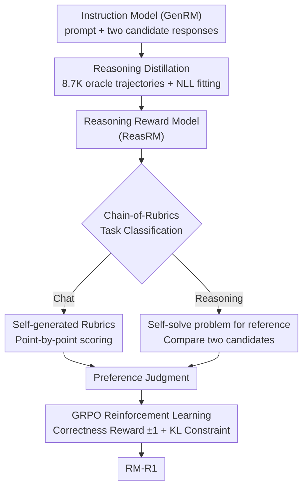

# RM-R1: Reward Modeling as Reasoning

**Conference**: ICLR 2026  
**arXiv**: [2505.02387](https://arxiv.org/abs/2505.02387)  
**Code**: [GitHub](https://github.com/RM-R1-UIUC/RM-R1)  
**Area**: Reinforcement Learning  
**Keywords**: Reward Model, Reasoning, Chain-of-Rubrics, Generative Reward Model, RLVR

## TL;DR

This work redefines reward modeling as a reasoning task and proposes the RM-R1 series of Reasoning Reward Models (ReasRM). Through reasoning distillation, RL training, and the Chain-of-Rubrics (CoR) mechanism, it outperforms 70B and GPT-4o models on three major reward model benchmarks by an average of 4.9%.

## Background & Motivation

The reward model (RM) is a core component for aligning LLMs in RLHF. Existing methods typically fall into two categories: (1) **ScalarRM**—training the RM as a classifier to output a scalar score, which is opaque and lacks a reasoning process; (2) **GenRM**—generating textual judgments, which provides some transparency but often involves shallow or unreliable reasoning, leading to performance inferior to ScalarRM.

The authors observe that accurate reward modeling inherently requires reasoning: inferring the judge's latent criteria, weighing multiple standards, and simulating potential consequences. The example in Figure 1 clearly demonstrates this—vanilla instruction models overfit surface patterns of data, whereas reasoning models can evaluate the deep impact of responses.

**Core Problem**: Can reward modeling be treated as a reasoning task?

This paper proposes **Reasoning Reward Models (ReasRM)**, a new category emphasizing longer, coherent reasoning chains during the judgment process. It designs a two-stage training pipeline (distillation + RL) and a category-specific Chain-of-Rubrics reasoning strategy.

## Method

### Overall Architecture

RM-R1 transforms "scoring" from a black-box scalar regression into a visible reasoning process. After receiving a prompt and two candidate responses, the model first determines the evaluation criteria and assesses how each response performs according to these criteria before finally providing a preference judgment. The entire pipeline is integrated through two stages: first, high-quality reasoning trajectories are distilled from a strong oracle model to instill the ability to "judge via reasoning" into the base model; then, GRPO reinforcement learning is applied, using "judgment correctness" as a verifiable reward to refine this capability from imitation to generalization. The two stages are linked by the Chain-of-Rubrics (CoR) structured reasoning protocol. During RL training (and inference), each step follows the CoR for rollouts—samples are first categorized as Chat or Reasoning, and then a preference judgment is derived through the corresponding reasoning path. GRPO updates the model based on correctness rewards.

### Key Designs

**1. Reasoning Distillation: Training the model on "how to think during evaluation"**

Using instruction models directly as Generative Reward Models (GenRM) often results in superficial and unreliable judgments, with performance sometimes trailing behind ScalarRMs. The issue is not insufficient model strength, but rather that the model has not seen what "evaluating with reasoning" looks like. In this stage, oracle models like o3 or Claude are used to synthesize a reasoning trajectory $r^{(i)}$ for each preference sample, which is then concatenated with the ground-truth label $l^{(i)}$ to form the distillation target $y_{\text{trace}}^{(i)} = r^{(i)} \oplus l^{(i)}$. The base model fits this using the standard NLL loss:

$$\mathcal{L}_{\text{distill}}(\theta) = -\sum_t \log r_\theta(y_t \mid x, y_{<t})$$

The key lies in the quality of demonstrations rather than data volume—with only about 8.7K distillation samples, the model learns structured patterns: "set criteria → evaluate point-by-point → conclude." This is significantly less than the 800K samples required by models like DeepSeek-Distilled. This step provides a starting point that already understands reasoning and formatting for subsequent RL.

**2. Chain-of-Rubrics (CoR): Switching evaluation logic by task type**

Human evaluators focus on different aspects depending on the context—chat responses are judged on politeness, safety, and helpfulness, while reasoning responses are judged on logic and accuracy. Evaluating all preferences with a single generic standard inevitable leads to compromises. CoR allows the model to categorize the current problem into Chat or Reasoning and follow the corresponding path: for Chat, it generates a rubric and assesses responses accordingly; for Reasoning, it solves the problem first to obtain a reference answer before comparing candidates. This ensures the reasoning process is not aimless but constrained to relevant dimensions by the task type.

**3. GRPO Reinforcement Learning: Refining distilled reasoning into generalization**

A risk of distillation is overfitting to specific expression patterns of the oracle, learning to "look like reasoning" without "actually judging." The second stage uses GRPO for reinforcement learning, where the reward signal is simply the correctness of the judgment—if the predicted preference label $\hat{l}$ matches the ground truth $l$, the reward is $+1$, otherwise $-1$:

$$\mathcal{R}(x, j \mid y_a, y_b) = \begin{cases} 1 & \text{if } \hat{l} = l \\ -1 & \text{otherwise} \end{cases}$$

Since format normalization was achieved during distillation, the authors intentionally avoid format rewards, allowing the model to explore reasoning paths freely under the sole objective of "judgment correctness." Through exploration rather than rote memorization, RL pushes the evaluation capability from imitating patterns to critical generalization on new samples.

### Loss & Training

The two stages serve distinct purposes: stage one uses standard NLL to instill reasoning trajectories and labels through distillation; stage two uses GRPO to optimize the expected reward with a KL constraint:

$$\max_\theta\ \mathbb{E}\big[\mathcal{R}(x, j)\big] - \beta\, D_{\text{KL}}\big(r_\theta \,\|\, r_{\text{ref}}\big)$$

Here, the reference model $r_{\text{ref}}$ is the model obtained from the distillation stage. The KL term prevents the policy from deviating too far. As noted, the reward consists only of binary correctness without format terms, as formatting becomes stable after distillation.

## Key Experimental Results

### Main Results (Average across three benchmarks)

| Model | RewardBench | RM-Bench | RMB | Average |
|------|------------|---------|-----|------|
| INF-ORM-70B (ScalarRM) | 95.1 | 70.9 | 70.5 | 78.8 |
| GPT-4o (GenRM) | 86.7 | 72.5 | 73.8 | 77.7 |
| Self-taught-eval-70B | 90.2 | 71.4 | 67.0 | 76.2 |
| **RM-R1-14B (Ours)** | **88.9** | **81.5** | **68.5** | **79.6** |
| **RM-R1-32B (Ours)** | **90.9** | **83.9** | **69.8** | **81.5** |

### Ablation Study (Qwen-2.5-Instruct-32B, RewardBench)

| Method | Chat | Chat Hard | Safety | Reasoning | Average |
|------|------|-----------|--------|-----------|------|
| Original Instruct | 95.8 | 74.3 | 86.8 | 86.3 | 85.8 |
| +Cold Start RL | 92.5 | 81.5 | 89.7 | 94.4 | 89.5 |
| +RL+Rubrics | 93.0 | 82.5 | 90.8 | 94.2 | 90.1 |
| +RL+Rubrics+QC | 92.3 | 82.6 | 91.6 | 96.3 | 90.8 |
| **RM-R1 (Full)** | **95.3** | **83.1** | **91.9** | **95.2** | **91.4** |

### Key Findings
- RM-R1 outperforms previous SOTA on RM-Bench by 8.7%, reaching 91.8% in Math and 74.1% in Code.
- Reasoning capability is vital for reward modeling—distillation provides the foundation, and RL further enhances generalization.
- Model scale shows good scaling effects—near-linear relative gains from 7B to 32B.
- Reasoning length scaling is also effective—longer reasoning chains lead to better judgment performance.

## Highlights & Insights

- **Deep integration of RM and Reasoning**: First to systematically introduce long-chain reasoning into reward modeling, establishing ReasRM as a new category.
- **High Data Efficiency**: Achieves competitiveness with only 8.7K distillation samples, far fewer than the 800K used by DeepSeek-Distilled.
- **Ingenious CoR Design**: Differentiating evaluation strategies for chat and reasoning reflects the actual cognitive process of human scoring.
- **SFT vs RL Insight**: Table 3 shows that reasoning training (RL) consistently outperforms SFT, even when using the same distillation data.

## Limitations & Future Work

- The CoR classification (Chat vs Reasoning) might be oversimplified; more fine-grained task classification could be superior.
- Dependency on oracle models (o3/Claude) for generating distillation data increases costs.
- Current reward design only uses binary correctness (±1); more granular reward signals might yield further improvements.

## Related Work & Insights

- DeepSeek-GRM series is a direct competitor but is not open-sourced and relies on more data.
- JudgeLRM is also a ReasRM but significantly lags in performance, highlighting the importance of the training scheme.
- **Insight**: In RM training, "how to reason" is more important than "how much data is seen."

## Rating
- **Novelty**: ⭐⭐⭐⭐ Introducing reasoning into RM is a strong direction, though the distillation + RL framework is relatively standard.
- **Experimental Thoroughness**: ⭐⭐⭐⭐⭐ Three major benchmarks, detailed ablations, scaling analysis, and case studies.
- **Writing Quality**: ⭐⭐⭐⭐ Clear structure; the motivation example in Figure 1 is highly persuasive.
- **Value**: ⭐⭐⭐⭐⭐ Establishes the ReasRM paradigm; open-source code and models advance the community.

<!-- RELATED:START -->

## Related Papers

- [\[ICLR 2026\] R4: Nested Reasoning-Retrieval for Reward Modeling in Role-Playing Agents](r4_nested_reasoning-retrieval_for_reward_modeling_in_role-playing_agents.md)
- [\[ICLR 2026\] R1-Reward: Training Multimodal Reward Model Through Stable Reinforcement Learning](r1-reward_training_multimodal_reward_model_through_stable_reinforcement_learning.md)
- [\[ICML 2026\] CAMEL: Confidence-Gated Reflection for Reward Modeling](../../ICML2026/reinforcement_learning/camel_confidence-gated_reflection_for_reward_modeling.md)
- [\[ICLR 2026\] UME-R1: Exploring Reasoning-Driven Generative Multimodal Embeddings](ume-r1_exploring_reasoning-driven_generative_multimodal_embeddings.md)
- [\[ICLR 2026\] Parallel-R1: Towards Parallel Thinking via Reinforcement Learning](parallel-r1_towards_parallel_thinking_via_reinforcement_learning.md)

<!-- RELATED:END -->
