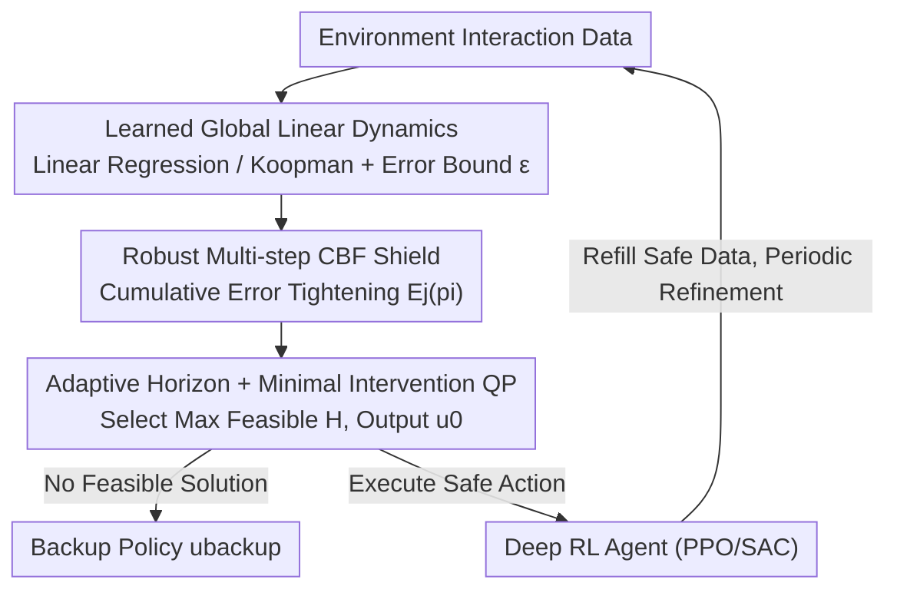

# RAMPS: Robust Adaptive Multi-step Predictive Shield

**Conference**: ICLR 2026  
**OpenReview**: [https://openreview.net/forum?id=2bbqHOWFTU](https://openreview.net/forum?id=2bbqHOWFTU)  
**Paper**: [Project Homepage](https://ambadkar.com/ramps)  
**Code**: None  
**Area**: Reinforcement Learning / Safe RL / Control Barrier Functions  
**Keywords**: Safe Exploration, Model Predictive Shielding, Control Barrier Functions, Koopman Operator, High-dimensional Control

## TL;DR
RAMPS employs a globally learned **linear** dynamics model (linear regression or deep Koopman operator) paired with a **robust multi-step Control Barrier Function (CBF)** shield. It scales formal shielding techniques—previously limited to systems with a dozen dimensions—to a 348-dimensional legged locomotion task, reducing safety violations by up to 90% during training while maintaining competitive task rewards.

## Background & Motivation
**Background**: Safe reinforcement learning (safe RL) requires policies to remain safe throughout the **entire training process**, not just after convergence. Model-predictive shielding is a promising approach—it attaches a "shield" alongside the agent that intervenes only when proposed actions threaten safety, making it compatible with any RL policy.

**Limitations of Prior Work**: Existing shields face a dilemma. **Neural shields** learn a safety critic from data; they are flexible but require massive experience and fail to prevent violations in early training. **Symbolic shields** provide formal guarantees from step one by analyzing environment models, but they rely on **explicitly partitioning the state space into local linear models**. This "patchwork" approach suffers from the curse of dimensionality, becoming computationally infeasible once state dimensions exceed 10—whereas modern deep RL excels in high-dimensional systems.

**Key Challenge**: Formal/symbolic methods offer strong guarantees but lack scalability; statistical/cost-based methods are scalable but allow many violations early in training. No bridge exists between them. Furthermore, a neglected issue in discrete-time stochastic systems is when control inputs have a **delayed** effect on safety constraints (relative degree $r > 1$). Standard one-step CBFs fail here because they lack immediate control over constrained variables, leading to "trap states"—states that appear safe in the short term but inevitably lead to future violations.

**Goal**: (1) Scale formal shields to high-dimensional nonlinear systems; (2) Provide reliable real-time intervention despite imperfect models and control delays.

**Key Insight**: The authors observe that the key is not to partition nonlinear dynamics into local linear patches, but to learn a **global linear representation**. This can be linear regression in the original state space or a Koopman linear operator after "lifting" the state into a high-dimensional feature space. As long as the dynamics are linear, polyhedral safety constraints can be efficiently **propagated multiple steps into the future**.

**Core Idea**: Replace "local linear model patches + one-step CBF" with a "single global linear model + robust multi-step CBF." Explicitly accumulate prediction errors within the CBF to form an "uncertainty tube," providing model-relative safety guarantees even on imperfect models.

## Method

### Overall Architecture
RAMPS consists of three components: (1) a learned **linear dynamics model** providing a single global representation of environment dynamics; (2) a **robust control barrier function shield** that uses this model to certify and correct unsafe actions online; and (3) a standard **deep RL agent** learning high-performance policies under the shield's protection. These collaborate in an iterative loop: the agent collects interaction data, which is used to train the linear model and a **worst-case error bound** $\varepsilon$. Together, these parameterize the CBF shield. Subsequently, the RL agent is trained where every action is verified and corrected by the shield if necessary. New safe data is fed back into the dataset to periodically refine the model and error bounds. A more accurate model leads to a less conservative shield, allowing freer exploration and better policies.

At each timestep, the shield takes the agent's proposed action $a_\pi$ as a target and solves a small-scale Quadratic Program (QP) over an **adaptively selected prediction horizon** $H$. It finds a safe control sequence that satisfies multi-step robust CBF constraints while staying closest to $a_\pi$, executing only the first action $u_0$.

### Key Designs

**1. Learned Global Linear Dynamics: Replacing Local Patches with a Single Linear Operator**

Addressing the "partitioning leads to curse of dimensionality" pain point of symbolic shields, RAMPS learns a **single global linear representation**. For simple systems, it uses linear regression in the original state space. For complex nonlinear systems, it "lifts" the state $z$ through a learned nonlinear embedding into a high-dimensional feature space where dynamics become simple linear transitions: $z_{k+1}=Az_k+Bu_k+c+w_k$, where $c$ is a learned constant drift and $w_k$ is the additive model error satisfying $\lVert w_k\rVert_\infty\le\varepsilon$ (using Deep Koopman Operators). This linear structure is the foundation for efficient multi-step propagation—allowing polyhedral safety constraints to be projected forward in time cheaply without repeated linearization or expensive nonlinear propagation.

**2. Robust Multi-step CBF and Cumulative Error Tightening: Addressing "Relative Degree Traps" and "Model Inaccuracy"**

This is the core theoretical contribution, addressing delayed control effects in discrete systems (relative degree $r>1$) and inherently imperfect learned models. The safety set is represented as a polyhedron $C=\bigcap_i\{z\mid p_i^\top z+b_i\le 0\}$. RAMPS requires safety conditions to hold for **every intermediate step $j\ge r_i$** within the horizon $H$. Nominal reachable states are written as $z_j(z,u)=A^j z+\sum_{k=0}^{j-1}A^{j-1-k}Bu_k+\sum_{k=0}^{j-1}A^k c$, with worst-case errors accumulated at each step to form **tightening terms**:

$$E_j(p_i)=\sum_{k=0}^{j-1}\varepsilon\lVert p_i^\top A^k\rVert_1.$$

Thus, for each valid step $j$ and face $i$, a robust CBF constraint is generated: $p_i^\top z_j(z,u)+b_i\le \lambda^j\,(p_i^\top z+b_i)-E_j(p_i)$, where $\lambda\in(0,1]$ is the decay rate. These constraints are linear with respect to the control sequence $u$, summarized as $Gu\le h$. The multi-step condition resolves delayed control issues that one-step CBFs cannot handle—for instance, in a pendulum, if the constraint is on angle $\theta$, $p^\top B=0$ (one step cannot affect $\theta$), but $p^\top AB \ne 0$, meaning control works after two steps. The $E_j(p_i)$ term acts as an "uncertainty tube" around the predicted trajectory; as long as the entire tube remains in the safety set, the shield remains effective despite model imperfections.

**3. Adaptive Prediction Horizon Selection and Minimal Intervention QP: Balancing Foresight and Conservatism**

A horizon $H$ that is too short fails to clear high relative degree traps, while one that is too long accumulates excessive model error. RAMPS does not fix $H$; instead, it performs a **bounded binary search** within $[H_{\min}, H_{\max}]$ at each timestep ($H_{\min}$ is the maximum relative degree of active constraints). It selects the largest feasible horizon $H^\ast$ and solves the QP:

$$\min_u \lVert u_0-a_\pi\rVert_2^2 \quad \text{s.t.}\quad Gu\le h,\ u_k\in U,$$

The goal is to keep the first action $u_0$ as close as possible to the agent's intent $a_\pi$, embodying "minimal intervention." Following the receding-horizon principle, only $u_0$ is executed. If no feasible horizon is found, a backup policy $u_{\text{backup}}$ is triggered. In experiments, the QP was feasible over 98% of the time.

### Loss & Training
The underlying RL agent is trained using PPO (on-policy) or SAC (off-policy); the shield is policy-agnostic. The error bound $\varepsilon$ is estimated from a held-out validation set $D_{\text{val}}$ as the maximum observed one-step prediction error (99th percentile). The QP is solved using OSQP with $H_{\max}=5$. Theoretically, Theorem 2 provides a high-probability bound for $\varepsilon$, while Corollary 1 links forward invariance in the finite horizon to the physical system with probability $P\ge 1-K\delta$.

## Key Experimental Results

### Main Results
Evaluated on Pendulum and Safety-Gymnasium (SafeHopper / SafeCheetah / SafeAnt / SafeHumanoid, up to 348D state and 17D action). The metric is **Cumulative Training Violations** (lower is better). L = Linear model, K = Koopman model; Failed indicates training collapse or inability to complete safe episodes.

| Algorithm | Pendulum | SafeHopper | SafeCheetah | SafeAnt | SafeHumanoid |
|------|----------|------------|-------------|---------|--------------|
| SauteRL | 91±22 | 703±78 | 183±25 | 1221±203 | 319±106 |
| CUP | 184±225 | 673±63 | 122±22 | 1883±221 | 172±90 |
| P3O | 173±166 | 620±6 | 185±8 | 1481±446 | 183±45 |
| SPICE + L | 495±128 | Failed | Failed | Failed | Failed |
| SPICE + K | 87±8 | 459±105 | 169±70 | Failed | Failed |
| RAMPS + L + PPO | 69±6 | 193±44 | 7±7 | 162±42 | 137±134 |
| RAMPS + K + PPO | 53±6 | 172±15 | 26±17 | 111±23 | 154±25 |
| RAMPS + K + SAC | **25±26** | **49±10** | 21±4 | 242±38 | **11±7** |

RAMPS variants show significantly fewer violations in high-dimensional tasks than all baselines. SPICE+L fails to scale, and SPICE+K fails on SafeAnt/Humanoid. RAMPS+K significantly outperforms SPICE+K using the same Koopman model, demonstrating that the advantage stems from the robust shield framework (explicit error modeling) rather than just model accuracy. Real-time performance is strong, with computation times per step ranging from 0.23 ms (Pendulum) to 0.40 ms (Ant).

### Ablation Study

| Configuration | Phenomenon | Explanation |
|------|------|------|
| Full RAMPS | Safe & High Reward | Successful synergy of all components |
| Without $E_j$ tightening | **Continuous violations, catastrophic failure** | Robustness is essential for safety |
| Horizon $H$ too short | Fails to resolve high relative degree traps | $H$ must be $\ge$ relative degree |
| Horizon $H$ too long | Large accumulated model error | Requires a trade-off |
| Decay $\lambda$ too high | QP becomes infeasible; safety/reward suffer | $\lambda$ must be loose enough for feasibility |
| Low confidence $\varepsilon$ | Unstable learning | High-confidence bounds are required |

### Key Findings
- **Explicit error robustness is the most critical component**: Removing the $E_j(p_i)$ tightening term leads to continuous violations regardless of hyperparameter tuning.
- **Model expressivity affects the safety-reward trade-off**: More expressive Koopman models have smaller error bounds, leading to less conservative shields and higher rewards.
- **Shield and RL algorithm are decoupled**: Works with PPO and SAC, though SAC is more stable in high dimensions (SafeHumanoid).
- **Scalability under multi-dimensional constraints**: On SafeHumanoid, RAMPS constrains a 21-dimensional safety set (3 coordinates + 18 joint velocities) with only 256 violations and 5000 reward, while CMDP baselines exceed 3000 violations with rewards around 500.

## Highlights & Insights
- **The synergy of "Global Linear + Multi-step Foresight" is brilliant**: Linear models make multi-step propagation feasible, and multi-step propagation gives the shield foresight. Neither is sufficient alone.
- **Connecting HOCBF to RL via relative degree analysis**: Introducing high-order CBF logic from control theory into discrete stochastic RL systems provides a clear explanation for why one-step shields are "tricked" by trap states.
- **Error tightening $E_j(p_i)$ is a transferable trick**: Accumulating data-driven error bounds into an "uncertainty tube" can be applied to any scenario requiring safe/robust planning on learned models (e.g., learned MPC).

## Limitations & Future Work
- **Guarantees are probabilistic and rely on stepwise feasibility**: Theorem 1 assumes the QP is feasible at every step, which cannot be analytically guaranteed over an infinite horizon, only empirically supported (>98%).
- **Dependence on the validity of $\varepsilon$**: If the deployment distribution differs significantly from the validation distribution, the error bounds may fail.
- **Expressivity ceiling of linear models**: In highly nonlinear dynamics, a single global linear operator may underfit even in Koopman space, leading to large error bounds and over-conservatism.

## Related Work & Insights
- **vs SPICE (Anderson et al., 2023)**: SPICE also uses learned dynamics for shielding but relies on simpler linear models; RAMPS's explicit error modeling makes it safe on imperfect models and more scalable.
- **vs Symbolic Shields (Anderson et al., 2020)**: These rely on state space partitioning for deterministic guarantees but are limited by the curse of dimensionality; RAMPS bypasses this with a global linear model.
- **vs CMDP/Cost-based methods (PPOSaute / P3O / CUP)**: These treat safety as a soft constraint, allowing many early violations; RAMPS enforces hard state constraints.

## Rating
- Novelty: ⭐⭐⭐⭐⭐ Scaled formal shielding to 348D for the first time by unifying global linear models with robust multi-step CBFs.
- Experimental Thoroughness: ⭐⭐⭐⭐ Extensive environments and ablations, though some details are in the appendix.
- Writing Quality: ⭐⭐⭐⭐ Good balance of theory and intuition.
- Value: ⭐⭐⭐⭐⭐ Provides a scalable, theoretically-grounded shield for safe RL deployment in high-dimensional systems.

<!-- RELATED:START -->

## Related Papers

- [\[ICLR 2026\] Predictive CVaR Q-Learning](predictive_cvar_q-learning.md)
- [\[ICLR 2026\] Robust Multi-Objective Controlled Decoding of Large Language Models](robust_multi-objective_controlled_decoding_of_large_language_models.md)
- [\[ICLR 2026\] AMPED: Adaptive Multi-objective Projection for balancing Exploration and skill Diversification](amped_adaptive_multi-objective_projection_for_balancing_exploration_and_skill_di.md)
- [\[ICLR 2026\] Distributionally Robust Cooperative Multi-agent Reinforcement Learning with Value Factorization](distributionally_robust_cooperative_multi-agent_reinforcement_learning_with_valu.md)
- [\[ICLR 2026\] Model Predictive Adversarial Imitation Learning for Planning from Observation](model_predictive_adversarial_imitation_learning_for_planning_from_observation.md)

<!-- RELATED:END -->
