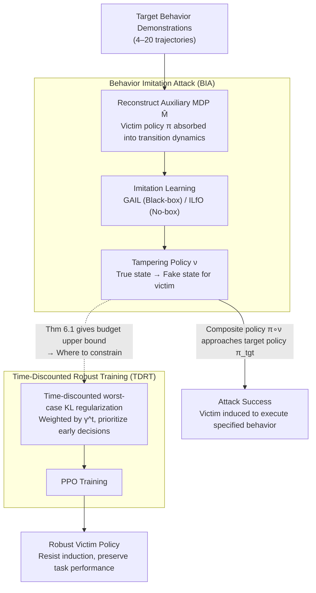

# Robust Deep Reinforcement Learning against Adversarial Behavior Manipulation

**Conference**: ICLR 2026  
**arXiv**: [2406.03862](https://arxiv.org/abs/2406.03862)  
**Code**: None  
**Area**: AI Safety / Reinforcement Learning  
**Keywords**: Behavior-targeted attack, Adversarial robustness, Imitation learning attack, Time-discounted defense, Policy smoothing  

## TL;DR
This paper investigates a new type of threat in RL—behavior-targeted attacks (where an adversary guides the victim to execute a specific target policy by tampering with observations). It proposes the BIA attack method, which does not require white-box access, and the TDRT defense method based on time discounting. TDRT maintains robustness against attacks while achieving 28.2% higher original task performance than existing defenses (SA-PPO).

## Background & Motivation

**Background**: Existing research on RL adversarial attacks mainly focuses on "reward minimization" attacks—making the victim perform as poorly as possible. Defense methods (such as ATLA, SA-PPO) are also designed primarily against these types of attacks.

**Limitations of Prior Work**: A more dangerous attack mode exists—behavior-targeted attacks. Here, the adversary does not intend to make the victim fail, but rather guides it to perform a specific behavior (e.g., diverting an autonomous vehicle to a specific store). Existing attacks of this type (PA-AD, Targeted PGD) require white-box access to the victim's policy, which is difficult to achieve in practice. Furthermore, no defense methods specifically target such attacks.

**Key Challenge**: How can behavior-targeted attacks be implemented without white-box access to the victim's policy? How can a defense be designed that resists behavioral attacks without excessively sacrificing original task performance?

**Key Insight**: Behavior-targeted attacks are remodeled as a cumulative reward maximization problem in an MDP (Theorem 5.1), allowing the victim's policy to be naturally embedded into the environment dynamics without requiring white-box access.

**Core Idea**: For the attack side—use MDP reconstruction to transform white-box requirements into black-box ones. For the defense side—use time-discounted weighted robust training to prioritize the protection of early decisions.

## Method

### Overall Architecture
This paper addresses two mirrored problems: how to "induce" a victim into performing a specific behavior without internal access to its policy, and conversely, how to train a policy that resists such induction without losing original task performance. On the attack side, Behavior Imitation Attack (BIA) constructs an auxiliary MDP, treats the victim as part of the environment, and uses standard imitation learning (GAIL/ILfO) to learn a tampering policy $\nu$ that makes the victim's actual behavior approximate the target behavior. On the defense side, Time-Discounted Robust Training (TDRT) adds a time-discounted weighted worst-case KL regularization to PPO training, prioritizing the stabilization of early decisions. Both sides are unified by the same theory: the attack feasibility analysis (Theorem 5.1) directly derives where the defense should be constrained (Theorem 6.1).

### Key Designs

**1. Behavior Imitation Attack (BIA): Replacing "White-box Gradients" with "Standard RL in a New MDP"**

Existing behavior-targeted attacks (PA-AD, Targeted PGD) require gradients of the victim policy, implying white-box access which is often unavailable. BIA learns a tampering policy $\nu: s \mapsto \hat{s}$ that maps the true state to a false state fed to the victim, so that the composite policy $\pi \circ \nu(a|s) = \sum_{\hat{s}} \nu(\hat{s}|s)\pi(a|\hat{s})$ matches the target policy $\pi_{\text{tgt}}$. The key step is Theorem 5.1: solving the distribution matching problem $\arg\min_\nu \mathcal{D}(\pi \circ \nu, \pi_{\text{tgt}})$ is equivalent to cumulative reward maximization in a specially constructed MDP $\hat{M}$, where the victim policy $\pi$ is absorbed into the transition dynamics of $\hat{M}$.

This transformation enables the black-box nature: the adversary no longer needs gradients of $\pi$; they only need to run standard RL or imitation learning within $\hat{M}$. Two algorithms are implemented—GAIL (black-box, requiring a few demonstrations) and ILfO (no-box, requiring only state trajectories). Experiments show that 4–20 demonstrations can achieve performance close to white-box attacks, with only a ~7% gap compared to PA-AD.

**2. Time-Discounted Robust Training (TDRT): Prioritizing Early Decisions instead of Uniform Smoothing**

With the attack characterized, the defense must determine "where and how strongly to constrain." Theorem 6.1 provides an upper bound on the adversary's gain:

$$\sum_{t=0}^{\infty} \frac{\gamma^t}{1-\gamma} \mathbb{E}_{s \sim d_\pi^t}\big[D_{\text{KL}}(\pi(\cdot|s) \,\|\, \pi \circ \nu(\cdot|s))\big]$$

This bound reveals two things: first, reducing the policy's sensitivity to state perturbations (suppressing the KL shift of the tampered policy) directly improves robustness; second, the $\gamma^t$ weight implies that shifts in early timesteps are more fatal than later ones—in sequential decision-making, early errors propagate and amplify. Accordingly, the TDRT training objective is:

$$J_{\text{def}}(\pi) = -J_{\text{RL}}(\pi) + \lambda \max_\nu \sum_{s_t \in B} \gamma^t D_{\text{KL}}(\pi(\cdot|s_t) \,\|\, \pi \circ \nu(\cdot|s_t))$$

This adds a worst-case KL regularization discounted by $\gamma^t$ to the regular RL objective. The difference from SA-PPO lies in this discounting: SA-PPO applies uniform policy smoothing across all timesteps, which yields similar robustness but at a cost of a 28.2% drop in task performance. TDRT concentrates the "smoothing budget" on early states, preserving more task capability for the same level of robustness. It also differs from adversarial training (ATLA/PA-ATLA), which simulates reward minimization attacks during training—a threat model mismatch that makes them ineffective against behavior-targeted attacks.

### Loss & Training
- **Attack Training**: Run standard GAIL (requires target behavior demonstrations) or ILfO (requires only state trajectories) in the constructed MDP $\hat{M}$.
- **Defense Training**: Superimpose the time-discounted worst-case KL divergence regularization term on the PPO objective. The hyperparameter $\lambda$ controls the trade-off between robustness and task performance.

## Key Experimental Results

### Main Results
Attack performance across 10 Meta-World task pairs (Attack Reward ↑ = More Successful):

| Attack Method | Requirement | Typical Attack Reward | Note |
| :--- | :--- | :--- | :--- |
| Random | None | 947 | Random perturbations are weak |
| PA-AD | White-box | 4255 | Requires policy gradients |
| BIA-ILfD | Black-box (20 demos) | 3962 | Close to white-box performance |
| BIA-ILfO | No-box | ~3900 | Close to ILfD in deterministic envs |

Defense performance (Best Attack Reward ↓ = More Robust):

| Defense Method | Typical Attack Reward ↓ | Original Task Performance |
| :--- | :--- | :--- |
| No Defense | 1556 | Baseline |
| ATLA-PPO | 1158 | Average |
| SA-PPO | 403 | Poor (-28.2%) |
| **TDRT-PPO** | **378** | **Good (Baseline level)** |

### Ablation Study

| Configuration | Key Finding |
| :--- | :--- |
| Time Discounting vs. Uniform | TDRT has equivalent robustness but 28.2% higher task performance |
| Number of Demos | Effective attacks possible with only 4 demonstrations |
| Adversarial Training (ATLA) | Ineffective against behavior-targeted attacks (designed for different threat models) |
| Difficulty | Attacks are harder when victim and target distributions differ significantly (e.g., window-open, door-lock) |

### Key Findings
- BIA achieves attack performance close to white-box methods with only 20 demonstrations, proving that behavior-targeted attacks are a feasible and dangerous real-world threat.
- Adversarial training (ATLA) is nearly ineffective against behavior-targeted attacks because it simulates reward minimization rather than behavior manipulation during training.
- The time discounting in TDRT is the key differentiator: SA-PPO's uniform smoothing achieves similar robustness at the cost of 28.2% task performance, whereas TDRT preserves task capability by focusing on early steps.
- Behavior-targeted attacks decrease in effectiveness when the victim and target behaviors differ significantly.

## Highlights & Insights
- **MDP Reconstruction (Theorem 5.1)**: Elegantly transforms white-box requirements into black-box ones by embedding the victim policy into the environment dynamics. This concept can be transferred to other security scenarios requiring white-to-black-box conversion.
- **"Early decisions are more important than later ones"**: This insight has broad applicability. In sequential decisions, early errors propagate. This inspires prioritizing the decision quality of early states in any robust RL training.
- **Unified Framework**: Studying attacks and defenses together, where the theoretical analysis of attacks (Theorem 5.1) directly guides the defense design (Theorem 6.1), forms a comprehensive closed loop.

## Limitations & Future Work
- Attack effectiveness is limited in high-dimensional observation spaces (e.g., image inputs).
- TDRT provides empirical robustness rather than certified robustness (no certified guarantee).
- Attacks are difficult when behavior distributions differ significantly, suggesting some scenarios may not require defense.
- Defense depends on the assumption of the adversary's KL divergence constraint.

## Related Work & Insights
- **vs. PA-AD (Zhang et al.)**: PA-AD requires white-box access; BIA achieves black-box/no-box attacks via MDP reconstruction with only a ~7% performance gap.
- **vs. SA-PPO**: SA-PPO smooths all timesteps uniformly; TDRT uses time discounting to focus on early steps—similar robustness but 28.2% higher task performance.
- **vs. ATLA/Adversarial Training**: Adversarial training assumes reward-minimizing attackers and is ineffective against behavior manipulation, exposing the "defense-threat model mismatch" problem.

## Rating
- Novelty: ⭐⭐⭐⭐⭐ MDP reconstruction and time-discounted defense are novel concepts.
- Experimental Thoroughness: ⭐⭐⭐⭐ 10 Meta-World task pairs and multiple baseline comparisons, though missing high-dimensional experiments.
- Writing Quality: ⭐⭐⭐⭐⭐ The logical chain from attack to theory to defense is very clear.
- Value: ⭐⭐⭐⭐⭐ Reveals a neglected but dangerous RL attack mode and provides an efficient defense.

<!-- RELATED:START -->

## Related Papers

- [\[ICLR 2026\] Dual-Robust Cross-Domain Offline Reinforcement Learning Against Dynamics Shifts](dual-robust_cross-domain_offline_reinforcement_learning_against_dynamics_shifts.md)
- [\[ICLR 2026\] Minimax Optimal Adversarial Reinforcement Learning](minimax_optimal_adversarial_reinforcement_learning.md)
- [\[NeurIPS 2025\] Robust Adversarial Reinforcement Learning in Stochastic Games via Sequence Modeling](../../NeurIPS2025/reinforcement_learning/robust_adversarial_reinforcement_learning_in_stochastic_games_via_sequence_model.md)
- [\[ICLR 2026\] Learning to Generate Unit Test via Adversarial Reinforcement Learning](learning_to_generate_unit_test_via_adversarial_reinforcement_learning.md)
- [\[ICLR 2026\] Understanding and Improving Hyperbolic Deep Reinforcement Learning](understanding_and_improving_hyperbolic_deep_reinforcement_learning.md)

<!-- RELATED:END -->
