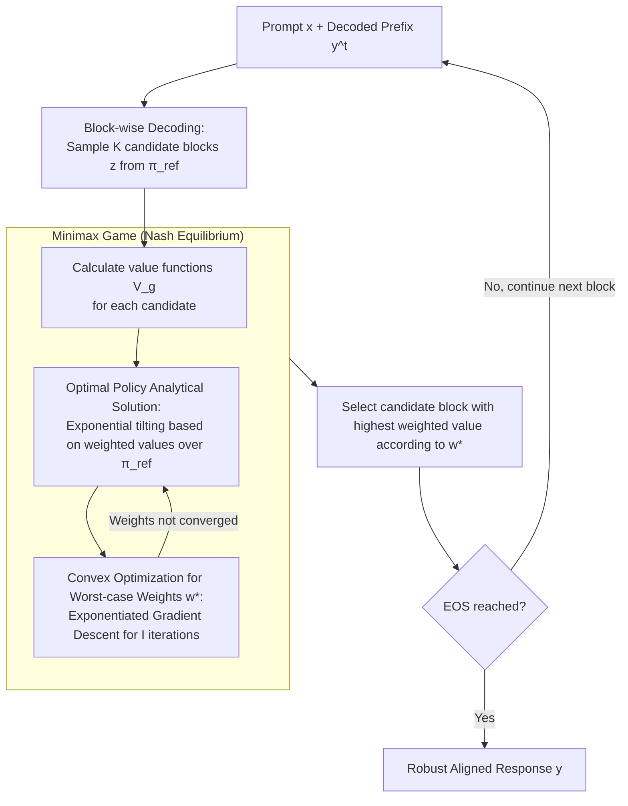

# Robust Multi-Objective Controlled Decoding of Large Language Models

**Conference**: ICLR 2026  
**arXiv**: [2503.08796](https://arxiv.org/abs/2503.08796)  
**Code**: [GitHub](https://github.com/williambankes/robust-multi-objective-decoding)  
**Area**: Reinforcement Learning  
**Keywords**: Multi-objective alignment, Inference-time alignment, Controlled decoding, Robust optimization, Minimax game

## TL;DR

This paper proposes RMOD (Robust Multi-Objective Decoding), an inference-time algorithm that dynamically calculates worst-case objective weights by solving the Nash equilibrium of a minimax game, achieving robust multi-objective alignment for LLMs without prior weight information.

## Background & Motivation

LLMs must simultaneously align with multiple objectives (e.g., helpfulness, harmlessness, safety, instruction following). Multi-objective alignment naturally raises a question: **How to balance multiple potentially conflicting objectives during inference?**

Existing methods typically require manual specification of objective weights, but weight selection faces several challenges:
- Shi et al. (2024) select weights via hyperparameter search on a validation set, which is susceptible to distribution shifts.
- Methods based on user personas or historical interactions require additional information often unavailable in practice.
- When safety is an objective, it cannot be ignored, yet it should not be overly conservative.

Core Motivation: **Achieve robust alignment by maximizing the worst-case objective without relying on any prior weight information**—ensuring that the weakest objective receives the most attention.

## Method

### Overall Architecture

RMOD aims to align multiple conflicting objectives during inference without knowing the specific weight for each. It treats the problem of "which objective to trust" as an optimization task rather than manually assigning weights. For each decoding step, it prepares a value function $V_g$ for each objective $g$ (measuring the quality of the current continuation relative to that objective) and solves for the Nash equilibrium of a minimax game:

$$\max_\pi \min_{w \in \Delta^{G-1}} \lambda \sum_g w_g V_g(x,y^t;\pi) - D_{KL}(\pi \| \pi_{\text{ref}})$$

The inner $\min_w$ selects the combination of objectives that is "hardest to satisfy" on the probability simplex $\Delta^{G-1}$, while the outer $\max_\pi$ selects the optimal continuation strategy for this worst-case weighting. The pipeline is implemented as block-wise decoding: at each step, a batch of candidate blocks is sampled from the reference policy, value functions are calculated, weights are updated iteratively within the minimax game, and the block with the highest weighted value is selected for output until EOS is reached.

The diagram below illustrates the loop within a single decoding step: the outer loop is the block-wise decoding implementation (sampling → scoring → selection → continuation), and the inner dashed box represents the minimax game solved via alternating between the "optimal policy analytical solution" and "convex optimization for worst-case weights."

### Key Designs

**1. Minimax Game Formalization: Letting the Opponent Determine Weights**

A pain point of existing methods is the need to specify objective weights a priori; if weights are biased, certain objectives (especially safety) may be neglected. RMOD models robust multi-objective alignment as a two-player zero-sum game between the policy $\pi$ and weights $w$: $\pi$ seeks to maximize the weighted objectives, while $w$ acts as an opponent focusing weights on the weakest objectives. Since the objective is linear in $w$ and concave in $\pi$, a Nash equilibrium exists. The minimax theorem allows swapping the max-min order, decomposing the problem into "solving for the optimal policy" and "optimizing the worst-case weights." This max-min structure ensures that the worst-case objective is optimized, preventing any single objective from being severely sacrificed.

**2. Analytical Solution for the Optimal Policy: Direct Computation Without Searching**

After decomposing the game, the inner problem becomes finding the optimal sampling strategy for a given weight $w$. Proposition 1 provides a closed-form solution:

$$\pi(z|[x,y^t];w) = \frac{\pi_{\text{ref}}(z|[x,y^t]) \exp\!\big(\lambda \sum_g w_g V_g(x,y^t;z)\big)}{Z(x,y^t,w)}$$

This is an exponential tilting of the reference policy $\pi_{\text{ref}}$ based on the weighted value function. This analytical solution avoids expensive policy searches for every weight set and aligns with the Boltzmann solution of standard KL-regularized RLHF, extending classic single-objective conclusions to weighted multi-objective scenarios.

**3. Convex Optimization for Worst-case Weights: Convergence to a LogSumExp Problem**

Substituting the analytical policy back, the outer problem of finding the worst-case weights simplifies to a convex optimization in the form of LogSumExp:

$$w^* = \arg\min_{w \in \Delta^{G-1}} \log \mathbb{E}_{z\sim\pi_\text{ref}}\Big[\exp\big(\textstyle\sum_g \lambda w_g V_g\big)\Big]$$

This is solved using exponentiated gradient descent iterations $w_{g,i+1} = w_{g,i} \cdot \exp(-\eta \cdot \text{gradient})$, which naturally maintains the weights on the simplex. Convexity guarantees convergence to the global optimum. Moreover, the dimension of this optimization is only $G$ (the number of objectives), independent of vocabulary size or sequence length, making it computationally inexpensive to solve at each step.

**4. Block-wise Decoding Implementation: Amortizing Value Function Evaluations**

Solving this game token-by-token would lead to an explosion in value function evaluations. RMOD instead partitions continuous decoding into blocks of length $B$. For each block, $K$ candidates are sampled from $\pi_{\text{ref}}$, value functions are calculated, weights are updated via $I$ iterations of convex optimization, and the best candidate block is selected. Larger blocks reduce evaluation overhead but stay closer to the reference policy, while smaller blocks offer finer control and higher win rates. $B$ serves as a tunable parameter between granularity and cost.

### Loss & Training

Value functions for each objective are trained using MSE regression: $\mathbb{E}[\sum_t(V_g(x,y^t;\theta) - r_g(x,y))^2]$, where labels are responses generated by the reference policy and their corresponding rewards $r_g$. RMOD is a purely inference-time algorithm; the game is solved entirely during the decoding stage without training any policy networks.

## Key Experimental Results

### Main Results (HH Dataset, Worst-case Reward)

| Method | Worst-case Reward | Worst-case Win Rate (WCWR) |
|------|------------|-------------------|
| CD-Helpful | High helpful, low harmless | Lower |
| CD-Harmless | High harmless, low helpful | Lower |
| CD-Uniform | Moderately balanced | 57.6% |
| MO-GRPO | Moderate | 54.6% |
| RS/MOD | Lower than Uniform | - |
| Distill-RMOD | - | 57.9% |
| **RMOD** | **Highest** | **59.1%** |

### Ablation Study

| Parameter | Key Metric | Description |
|------|---------|------|
| $\lambda=0.1$ (Low) | Near Uniform | Uniform weight distribution |
| $\lambda=0.5$ | Moderately Robust | Balanced trade-off |
| $\lambda=10$ (High) | Most concentrated on worst objective | Highly sparse weights |
| B=16 (Small block) | Highest win rate | Finer control |
| B=256 (Large block) | Win rate decreases | Closer to reference policy |
| Objectives=2-10 | RMOD consistently outperforms Uniform | Performance degrades as objectives increase |

### Key Findings
- RMOD outperforms all baselines by up to 20% in worst-case win rates.
- Latency increases by only 4.5% compared to standard CD, showing high computational efficiency.
- Distill-RMOD (SFT using RMOD-generated data) performs well even without inference-time decoding.
- LLM-as-Judge (GPT-4o) evaluation confirms the superiority of RMOD.

## Highlights & Insights

- **Theoretical Elegance**: Formalizes the problem as a convex-concave game with analytical solutions and convex optimization, providing strong theoretical guarantees.
- **High Practicality**: An inference-time algorithm that can switch alignment objectives on the fly with minimal latency overhead.
- **In-depth Weight Analysis**: Proves via KKT conditions that optimal weights tend to equalize the expected rewards across different objectives.
- **Distill-RMOD** provides a practical path to distill inference-time methods into standard policies.

## Limitations & Future Work

- Performance degrades as the number of objectives increases (>10); large-scale multi-objective scenarios require further research.
- Requires training independent value functions for each objective, which involves high preparation costs.
- The choice of $\lambda$ affects robustness preference (sparsity) and currently needs to be set manually.
- Currently only experimented on gemma-2-2b-it; effectiveness on larger models remains unverified.

## Related Work & Insights

- Mudgal et al. (2023) Controlled Decoding serves as the direct foundation; RMOD extends it to a robust version.
- Shi et al. (2024) MOD requires preset weights, while RMOD finds them automatically.
- Yoon et al. (2024) and Ramesh et al. (2024) consider robust alignment but not as inference-time methods.
- Insight: The combination of inference-time algorithms and robust optimization provides a flexible and guaranteed solution for multi-objective LLM alignment.

## Rating
- Novelty: ⭐⭐⭐⭐ Minimax inference-time alignment is a new combination, though components are mature.
- Experimental Thoroughness: ⭐⭐⭐⭐ Comprehensive across multiple datasets, ablations, LLM-as-Judge, and latency analysis.
- Writing Quality: ⭐⭐⭐⭐⭐ Clear theoretical derivations and intuitive problem motivation.
- Value: ⭐⭐⭐⭐ Provides a principled inference-time solution for multi-objective LLM alignment.

<!-- RELATED:START -->

## Related Papers

- [\[ICLR 2026\] On Predictability of Reinforcement Learning Dynamics for Large Language Models](on_predictability_of_reinforcement_learning_dynamics_for_large_language_models.md)
- [\[ICLR 2026\] VerifyBench: Benchmarking Reference-based Reward Systems for Large Language Models](verifybench_benchmarking_reference-based_reward_systems_for_large_language_model.md)
- [\[ICLR 2026\] Revolutionizing Reinforcement Learning Framework for Diffusion Large Language Models](revolutionizing_reinforcement_learning_framework_for_diffusion_large_language_mo.md)
- [\[ICLR 2026\] AWM: Accurate Weight-Matrix Fingerprint for Large Language Models](awm_accurate_weight-matrix_fingerprint_for_large_language_models.md)
- [\[ICLR 2026\] Using Reinforcement Learning to Train Large Language Models to Explain Human Decisions](using_reinforcement_learning_to_train_large_language_models_to_explain_human_dec.md)

<!-- RELATED:END -->
