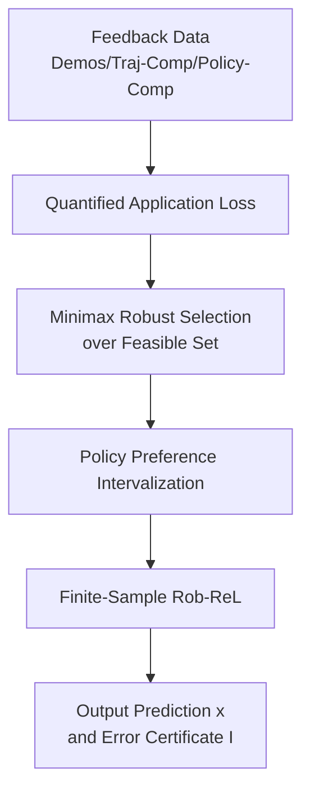

# Robustness in the Face of Partial Identifiability in Reward Learning

**Conference**: ICLR 2026  
**OpenReview**: [https://openreview.net/forum?id=e4xANXjA9W](https://openreview.net/forum?id=e4xANXjA9W)  
**Code**: https://github.com/filippolazzati/Rob-ReL  
**Area**: Reinforcement Learning / Reward Learning / Robustness  
**Keywords**: Reward Learning, Partial Identifiability, Inverse Reinforcement Learning, Robust Optimization, Preference Feedback

## TL;DR

This paper reformulates "partial identifiability" in reward learning from a qualitative risk into a measurable worst-case loss. It proposes Rob-ReL to output robust predictions and error certificates using a minimax approach in preference evaluation tasks.

## Background & Motivation

**Background**: Reward Learning (ReL) aims to recover the underlying target reward of humans or experts from feedback such as demonstrations, trajectory comparisons, or policy preferences. This reward is then used for planning, imitation learning, preference inference, or cross-environment transfer. IRL, PbRL, and RLHF can be viewed as different forms of feedback within this framework: the data itself does not directly provide reward values but indirectly leaks reward information through constraints like "the expert acts this way" or "trajectory A is better than trajectory B."

**Limitations of Prior Work**: Many types of feedback do not uniquely determine the target reward $r^\star$. The same set of demonstrations or comparisons may correspond to an entire feasible reward set $R_F$, where all rewards are consistent with observed feedback but may lead to different conclusions in downstream applications. Traditional methods often recover an arbitrary reward from $R_F$ and perform planning or prediction as if it were the true reward; if this reward is not equivalent to $r^\star$ in the target application, the system may output incorrect policies or faulty preference judgments.

**Key Challenge**: The problem is not just that the reward is "learned inaccurately," but whether the feedback itself is sufficiently informative for a specific application. If the application is merely imitating the expert, many different rewards may suffice; however, if the application involves transferring the reward to a new environment, comparing two policies, or estimating preference strength, the same feasible set could yield completely different answers. Existing work on identifiability mostly provides qualitative "identifiable / non-identifiable" judgments, failing to quantify the worst-case error.

**Goal**: The authors aim to achieve three things: first, describe feedback, feasible reward sets, and downstream applications in a unified language; second, define a computable metric to measure "how insufficient the feedback is for this specific application"; third, provide executable algorithms for at least one important class of reward learning problems and prove error bounds and complexity under finite samples.

**Key Insight**: The paper observes that in practical reward learning, the intended use of the learned reward is usually known beforehand. Since the application is known, pursuing a unique recovery of $r^\star$ is unnecessary. Instead, it is more reasonable to select an output that is most robust for the target application among all rewards consistent with the feedback, while reporting how much this output could be wrong in the worst case.

**Core Idea**: Replace "arbitrary recovery of a feasible reward" with "application loss + minimax over the feasible reward set," transforming partial identifiability into a quantifiable, optimizable, and certifiable robust reward learning problem.

## Method

### Overall Architecture

The paper first proposes a general ReL framework: feedback $F$ is interpreted as a set of constraints that the target reward must satisfy, forming a feasible set $R_F$; an application $g$ is interpreted as a set of deployable objects $X_g$ and a loss function $L_g(r,x)$. In this framework, partial identifiability no longer checks if $R_F$ contains only one reward, but whether there exists a deployment object $x$ that ensures low application loss for all $r \in R_F$.

Rob-ReL is an instantiation of this framework for the task of "evaluating the preference strength of two policies." Given demonstrations, trajectory comparisons, and policy comparison feedback, it first estimates policy occupancy distributions and necessary transition models, then computes the minimum and maximum values of the policy value difference $\langle d^{\pi_1}-d^{\pi_2}, r\rangle$ over the empirical feasible set. Finally, it outputs the midpoint of the interval as the prediction and the radius as the worst-case error certificate.

### Key Designs

**1. Quantitative Application Loss: From "Equivalence" to "Error Magnitude"**

When discussing partial identifiability, common practice asks whether rewards in the feasible set are exactly equivalent for an application. For planning tasks, if two rewards induce different optimal policies, it is flagged as a failure risk. This paper relaxes this to a loss function $L_g(r,x)$: the loss incurred by deploying $x$ in application $g$ if the true reward is $r$. Thus, applications can be planning, imitation, policy preference evaluation, trajectory preference evaluation, or direct reward learning.

The key to this reformulation is decoupling feedback from application. Feedback defines the feasible set $R_F=\cap_i R_{f_i}$, while the application defines the deployable objects $X_g$ and the loss $L_g$. When $R_F$ contains multiple rewards, the system does not force an answer to "which reward is true," but rather "what output is least likely to cause failure given all possibilities." This makes it more practical than qualitative frameworks, as it allows for approximate correctness.

**2. Minimax Robust Selection: Controlling Worst-Case Loss**

In a non-Bayesian setting, the algorithm lacks a prior distribution over rewards and only knows $r^\star \in R_F$. Thus, the authors adopt the natural worst-case criterion:

$$
x_{F,g} \in \arg\min_{x\in X_g}\max_{r\in R_F} L_g(r,x).
$$

This selection implies that regardless of which reward in the feasible set is true, the loss of deploying $x_{F,g}$ is minimized. The corresponding worst-case loss

$$
I_{F,g}=\min_{x\in X_g}\max_{r\in R_F}L_g(r,x)
$$

is termed the "uninformativeness" of feedback $F$ for application $g$. This is a numerical value that can be compared against application tolerance thresholds.

**3. Policy Preference Intervalization: Robust Prediction via Endpoints**

Rob-ReL focuses on evaluating the preference strength between two policies $\pi_1,\pi_2$, outputting a scalar $x$ to approximate $J^{\pi_1}(r;p)-J^{\pi_2}(r;p)$. Here the loss is absolute error:

$$
L_g(r,x)=\left|x-\langle d^{\pi_1}-d^{\pi_2},r\rangle\right|.
$$

Over the feasible set $R_F$, all possible preference strengths form an interval. The paper defines:

$$
M=\max_{r\in R_F}\langle d^{\pi_1}-d^{\pi_2},r\rangle, \quad
m=\min_{r\in R_F}\langle d^{\pi_1}-d^{\pi_2},r\rangle.
$$

The optimal robust output is the interval midpoint $x_{F,g}=(M+m)/2$, and the worst-case error is the radius $I_{F,g}=(M-m)/2$. This transforms the minimax absolute loss problem into two endpoint optimization problems.

**4. Finite-Sample Rob-ReL: Certificates via Primal-Dual Optimization**

In real scenarios, occupancy distributions and transition models are unknown. Rob-ReL estimates $d^{\pi_1}, d^{\pi_2}$ and occupancy distributions present in feedback from trajectories. For demonstration feedback requiring expert near-optimality constraints, the algorithm uses RF-Express for reward-free exploration to estimate the transition model; comparison constraints do not require additional transition models.

With the empirical feasible set $\widehat R_F$, the algorithm solves for empirical endpoints $\widehat M$ and $\widehat m$. Constraints include terms like $\max_\pi J^\pi(r;p_{D,i})$, so optimization is not simple linear programming. The authors construct a Lagrangian and use the primal-dual subgradient method (PDSM) to alternately update reward variables $r$ and multipliers $\lambda$. Theoretical results show that under Slater conditions, with polynomial samples and iterations, it holds with high probability that $L_g(r^\star,\widehat x_K)\le I_{F,g}+\epsilon$ and $|I_{F,g}-\widehat I_K|\le \epsilon$.

### Loss & Training

The core optimization follows the minimax objective, which for policy preference evaluation simplifies to finding endpoints $m$ and $M$. The empirical Lagrangian includes target items $\langle \widehat d^{\pi_1}-\widehat d^{\pi_2},r\rangle$ and constraints from demonstrations (e.g., $\max_\pi J^\pi(r;\widehat p_{D,i})-\langle \widehat d^{\pi_{D,i}},r\rangle-t_i$) and comparison feedback.

Optimization uses PDSM-MIN and PDSM-MAX. In each iteration, $r$ undergoes projected subgradient updates, and $\lambda$ undergoes projected dual updates. Optimal policy values in constraints are computed via dynamic programming. Theoretical analysis decomposes error into estimation error (controlled by concentration bounds) and iteration error (controlled by saddle-point convergence).

## Key Experimental Results

### Main Results

| Setting | Target Quantity | Ours | Reference / Ground Truth | Meaning |
|:---|:---|:---|:---|:---|
| Road Env Example | $\Delta J(r^\star)$ | $\widehat x=0.20$ | Truth $0.39$ | Prediction is at center of robust interval; error within radius |
| Road Env Example | Min endpoint $m$ | $\widehat m_K=-0.62$ | Close to approx ground truth | Lease biased case towards $\pi_1$ |
| Road Env Example | Max endpoint $M$ | $\widehat M_K=1.02$ | Close to approx ground truth | Most biased case towards $\pi_1$ |
| Road Env Example | Error Certificate $I$ | $\widehat I=0.82$ | Interval radius | Maximum error bound guaranteed by current feedback |

### Ablation Study

| Configuration | Key Metrics | Description |
|:---|:---|:---|
| Small state space, low feedback, low samples | err $x=0.07\pm0.04$, err $I=0.09\pm0.05$ | $S,A,H=3,3,5$; $m_D,m_{PC},m_{TC}=1,2,2$; $n,N=50,100$ |
| Small state space, low feedback, high samples | err $x=0.02\pm0.01$, err $I=0.02\pm0.02$ | Error significantly drops with $n,N=500,1000$ |
| Large state space, low feedback, low samples | err $x=0.13\pm0.07$, err $I=0.33\pm0.19$ | Large estimation error at $S=100,A=10,H=15$ |
| Large state space, low feedback, high samples | err $x=0.04\pm0.03$, err $I=0.06\pm0.05$ | Error becomes controlled with more samples |

### Key Findings

- The primary value of Rob-ReL is providing a worst-case error radius alongside the point prediction, reflecting feedback sufficiency.
- Estimation and iteration errors converge as sample sizes increase, consistent with theory.
- In large state spaces ($S=100$), reward-free exploration and occupancy estimation become the practical bottlenecks.
- The framework scales to high-dimensional reward spaces (e.g., 50 features), though exact ground truth endpoints become harder to compute for comparison.

## Highlights & Insights

- The shift from "is it bad" to "how bad" is a major contribution, providing application-specific risk certificates.
- The "uninformativeness" $I_{F,g}$ suggests that feedback utility is not uniform across applications.
- Robust selection as the Chebyshev center of the feasible set implies that the best deployable reward might not even be "consistent" with the feedback in some minimax senses.

## Limitations & Future Work

- Rob-ReL currently only provides algorithms for preference strength evaluation; the general framework for planning or other tasks requires more instantiation.
- Theoretical convergence relies on tabular MDP assumptions; linear MDP or functional extensions need further validation.
- The minimax criterion is sensitive to model misspecification; noisy human labels might lead to overly optimistic or pessimistic certificates.
- Future work could integrate these certificates into active learning to select feedback that specifically reduces $I_{F,g}$.

## Related Work & Insights

- **vs Traditional IRL/PbRL**: Standard methods lack deployment grounds under partial identifiability; this paper optimizes for downstream robustness directly.
- **vs Skalse et al. (2023)**: Moves from qualitative invariance to quantitative loss, allowing for "good enough" feedback.
- **vs Robust MDP**: Robust MDP assumes the uncertainty set is given; this paper constructs it from learned feedback.
- **vs Bayesian IRL**: Rob-ReL avoids prior distribution assumptions through minimax certificates, suitable for safe deployment.

## Rating

- Novelty: ⭐⭐⭐⭐☆ connects ReL identifiability with minimax robustness.
- Experimental Thoroughness: ⭐⭐⭐☆☆ excellent for mechanism verification but lacks large-scale real data.
- Writing Quality: ⭐⭐⭐⭐☆ clear structure and well-connected theory/intuition.
- Value: ⭐⭐⭐⭐☆ provides a theoretical baseline for "how to deploy when rewards are non-unique."

<!-- RELATED:START -->

## Related Papers

- [\[ICLR 2026\] On the Tension Between Optimality and Adversarial Robustness in Policy Optimization](on_the_tension_between_optimality_and_adversarial_robustness_in_policy_optimizat.md)
- [\[ICLR 2026\] Guided Policy Optimization under Partial Observability](guided_policy_optimization_under_partial_observability.md)
- [\[ICLR 2026\] R1-Reward: Training Multimodal Reward Model Through Stable Reinforcement Learning](r1-reward_training_multimodal_reward_model_through_stable_reinforcement_learning.md)
- [\[ICLR 2026\] R2PS: Worst-Case Robust Real-Time Pursuit Strategies under Partial Observability](r2ps_worst-case_robust_real-time_pursuit_strategies_under_partial_observability.md)
- [\[ICLR 2026\] A Reward-Free Viewpoint on Multi-Objective Reinforcement Learning](a_reward-free_viewpoint_on_multi-objective_reinforcement_learning.md)

<!-- RELATED:END -->
