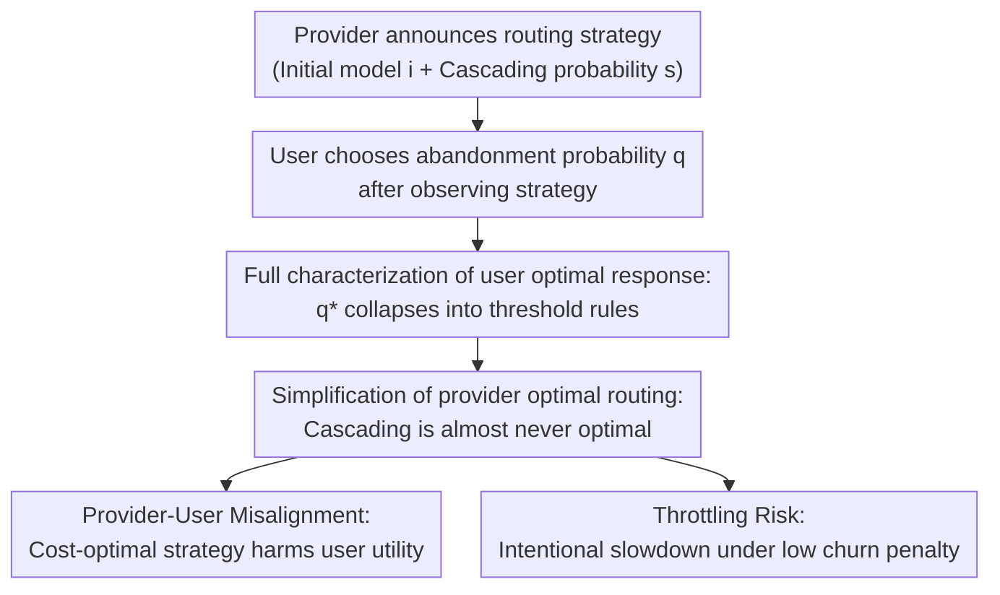

# Routing, Cascades, and User Choice for LLMs

**Conference**: ICLR 2026  
**arXiv**: [2602.09902](https://arxiv.org/abs/2602.09902)  
**Code**: None  
**Area**: Reinforcement Learning  
**Keywords**: LLM routing, cascading, Stackelberg game, user-provider misalignment, throttling

## TL;DR

LLM routing is modeled as a provider-user Stackelberg game. It is proved that optimal routing is almost always a static threshold rule without cascading. The study reveals systematic user-provider misalignment when quality/cost rankings are inconsistent, and shows that under low churn penalties, providers are incentivized to reduce costs through throttling latency, which harms user utility.

## Background & Motivation

**Background**: LLM providers balance quality, latency, and cost by distributing user tasks among heterogeneous models using routing and cascading strategies. GPT-5 has explicitly adopted routing to switch between "efficient models" and "deep reasoning models."

**Limitations of Prior Work**: Existing routing algorithms (Ding et al., 2024; Dekoninck et al., 2025) focus on estimating LLM performance and optimizing quality-latency-cost trade-offs, but treat user response behavior as an exogenous variable. However, the prompt-based interface of LLMs means users may repeatedly interact after a model failure, incurring repeated inference costs.

**Key Challenge**: Optimizing for single-query costs may be counterproductive at the user behavior level. Users may abandon tasks or even cancel subscriptions depending on the value of the task and the model's latency. Optimizing single-query costs might be "penny-wise but welfare-foolish."

**Goal**: To formalize a two-level Stackelberg game where the provider selects a routing strategy (initial model + cascading probability) and the user decides the abandonment probability based on the observed strategy. By fully characterizing the user's optimal response and simplifying the provider's problem, concise threshold rules are derived.

## Method

### Overall Architecture

The entire analysis revolves around a two-level Stackelberg game: the provider first announces a routing strategy $(i, s)$ (initial model $i$ plus cascading probability $s$), and the user chooses an abandonment probability $q$ after each failure to optimize their own objective. The scenario is simplified into a minimal analytical unit—a single provider holding a standard model $M_1$ and a reasoning model $M_2$, satisfying $t_1 < t_2$, $c_1 < c_2$, and $0 < p_1 < p_2 < 1$ (the reasoning model is slower and more expensive but has a higher success rate).

The pivot of the analysis is the user's single-pass net value $\xi_i := Vp_i - t_i$: if $\xi_i > 0$, the model is called value-dominated (worth the wait); if $\xi_i < 0$, it is latency-dominated (not worth the wait). User utility is the value of success minus cumulative latency $U_i(s, q) = V \cdot S_i(s, q) - L_i(s, q)$, and provider cost is the service overhead plus the penalty for user abandonment $J_i(s, q) = C_i(s, q) + P(1 - S_i(s, q))$, where $P$ measures how much a single churn hurts the provider. Subsequent design points involve solving the user's optimal response, substituting it back to simplify the provider's problem, and discussing the resulting systemic risks.

### Key Designs

**1. Characterization of User Optimal Response: Solving the Lower Game as Closed-Form Thresholds**

To analyze the provider's strategy, it is necessary to know how the user will react. The paper first fixes $(i, s)$ to solve for the optimal abandonment probability $q^*$ (Theorem 1–2). The conclusion is remarkably clean: as long as the task is routed to $M_2$, there is a pure threshold rule $q^* = \mathbb{1}\{\xi_2 < 0\}$. When routing to $M_1$, if $\xi_1$ and $\xi_2$ have the same sign, user behavior is completely static (always wait if both are value-dominated, always abandon if both are latency-dominated), and the routing strategy has no influence. The interesting case is when they have opposite signs: when $\xi_1 < 0 < \xi_2$, there exists a single threshold $s_0 = -\xi_1/(\xi_2/p_2 - \xi_1)$; if $s > s_0$, the user stays. When $\xi_1 > 0 > \xi_2$, two thresholds $s_L, s_H$ appear. This characterization is crucial because it collapses continuous behavior optimization into discrete threshold criteria.

**2. Simplification of Provider Optimal Routing: Proving Cascading is Almost Never Optimal**

With $q^*(s)$, the provider's objective reduces from a two-dimensional $(i, s)$ problem to a single-variable problem with closed-form solutions (Theorem 3–5). In the same-sign scenario (Theorem 3), the optimal strategy is always to route to a single model without cascading: pick the model with the higher cost-efficiency based on cost-of-pass $c_i/p_i$. In the differentiated scenario (Theorem 4–5), the conclusion remains robust—the optimal solution for nearly all parameter regions falls into one of three static points $(i^*, s^*) \in \{(1,0), (1,1), (2,0)\}$, with cascading being optimal only in an extremely narrow parameter band. This suggests that "small model then upgrade" pipelines are mostly wasteful under equilibrium.

**3. Provider-User Misalignment: Cost-Optimal Often Harms Users**

Comparing the optimal rankings of users and providers, the paper finds they often diverge (Proposition 1): when the provider selects a model based on cost-of-pass while the user prefers another based on utility, a strictly positive misalignment gap $\Delta_U > 0$ emerges. This indicates that misalignment is a structural product of equilibrium rather than an implementation bug.

**4. Throttling Risk: Intentional Slowdown Under Low Churn Penalties**

The provider may actively worsen service (Proposition 2): when the churn penalty is sufficiently low, i.e., $P \leq \min\{c_1/p_1, c_2/p_2\}$, the provider is motivated to artificially inflate latency to $\hat{t}_i > Vp_i$. This makes both models latency-dominated, inducing the user to abandon and thus saving service costs. This identifies that the only lever to resist throttling is to increase $P$, meaning users must have a high-cost "unsubscribe" option.

## Key Experimental Results

### Main Results: Regional Partitioning of Provider Optimal Strategies

| $\xi_1, \xi_2$ State | User Behavior | Provider Optimal Strategy | Is Cascading Effective? |
|-----------------------|---------------|---------------------------|-------------------------|
| Both value-dominated | Static Stay | Route by $c_i/p_i$, no cascade | Ineffective |
| Both latency-dominated| Static Abandon| Depends on $P$ vs $(c_2-c_1)/(p_2-p_1)$ | Ineffective |
| $\xi_1 < 0 < \xi_2$   | Cascade-dependent | Usually route to $M_1$ unless cost-of-pass gap is large | Only under specific conditions |
| $\xi_1 > 0 > \xi_2$   | Three-stage response | Mostly static, mixed in narrow interval | Extremely rare |

### Ablation Study: Throttling Gains

| Configuration | Effect | Condition |
|---------------|--------|-----------|
| $P < \min\{c_1/p_1, c_2/p_2\}$ | Throttling benefits provider | Low user churn penalty |
| $P > \min\{c_1/p_1, c_2/p_2\}$ | Throttling increases provider cost | High user churn penalty |
| Throttling gain area | Linear in $P$ | User unsubscribing prevents throttling |

### Key Findings

- Optimal routing reduces to simple threshold rules in most parameter regions; the value of cascading is extremely limited.
- User behavior is only influenced by routing strategies when the two models are differentiated in value signs.
- Misalignment is unavoidable when the user’s and provider’s model rankings differ.
- The key to preventing throttling is ensuring the cost of user abandonment (churn penalty) is high enough—users should have "unsubscription rights."

## Highlights & Insights

- Elevates the LLM routing problem from pure engineering optimization to a game-theoretic framework considering user reactions.
- Theoretical results provide high practical guidance: the conclusion that cascading is rarely optimal has direct implications for systems like GPT-5.
- Throttling analysis reveals the moral hazard of providers in LLM subscription models, carrying policy implications.
- The paper itself was completed with LLM assistance (detailed in Appendix A), constituting a self-consistent validation at a meta-level.

## Limitations & Future Work

- Analyzes only two models; actual deployments may involve routing across many more models.
- Assumes users can observe the provider’s cascading strategy and adopt a stationary abandonment strategy, whereas routing is often opaque.
- Success probability per pass is assumed to be i.i.d., ignoring the impact of user feedback on subsequent attempts.
- Focuses on subscription frameworks, not considering pay-per-call API pricing models.
- Lacks empirical validation of the theoretical predictions.

## Related Work & Insights

- **FrugalGPT** (Chen et al., 2023) and **RouteLLM** (Ong et al., 2025): Focus on routing algorithm design; this paper complements them with the user behavior dimension from a game-theoretic perspective.
- **Cost-of-Pass** (Mahmood 2024; Erol et al., 2025): This paper directly uses the cost-of-pass concept as a core metric for routing decisions.
- Insight for LLM subscription service design: Providers should allow users to opt-out of routing to prevent throttling.

## Rating

- Novelty: ⭐⭐⭐⭐ The game-theoretic perspective on LLM routing is highly novel and fills a gap in user behavior modeling.
- Experimental Thoroughness: ⭐⭐⭐ Primarily a theoretical work; contains proofs and visualizations but lacks empirical experiments.
- Writing Quality: ⭐⭐⭐⭐ Theoretical derivations are clear, and the summary guideline in Figure 1 is extremely practical.
- Value: ⭐⭐⭐⭐ Provides direct practical guidance for LLM service pricing and routing strategy design; throttling analysis is policy-relevant.

<!-- RELATED:START -->

## Related Papers

- [\[ICLR 2026\] The Choice of Divergence: A Neglected Key to Mitigating Diversity Collapse in Reinforcement Learning with Verifiable Reward](the_choice_of_divergence_a_neglected_key_to_mitigating_diversity_collapse_in_rei.md)
- [\[NeurIPS 2025\] Router-R1: Teaching LLMs Multi-Round Routing and Aggregation via Reinforcement Learning](../../NeurIPS2025/reinforcement_learning/router-r1_teaching_llms_multi-round_routing_and_aggregation_via_reinforcement_le.md)
- [\[ICLR 2026\] GEM: A Gym for Agentic LLMs](gem_a_gym_for_generalist_llms.md)
- [\[ICLR 2026\] P-GenRM: Personalized Generative Reward Model with Test-time User-based Scaling](p-genrm_personalized_generative_reward_model_with_test-time_user-based_scaling.md)
- [\[ICLR 2026\] Reasoning Boosts Opinion Alignment in LLMs](reasoning_boosts_opinion_alignment_in_llms.md)

<!-- RELATED:END -->
