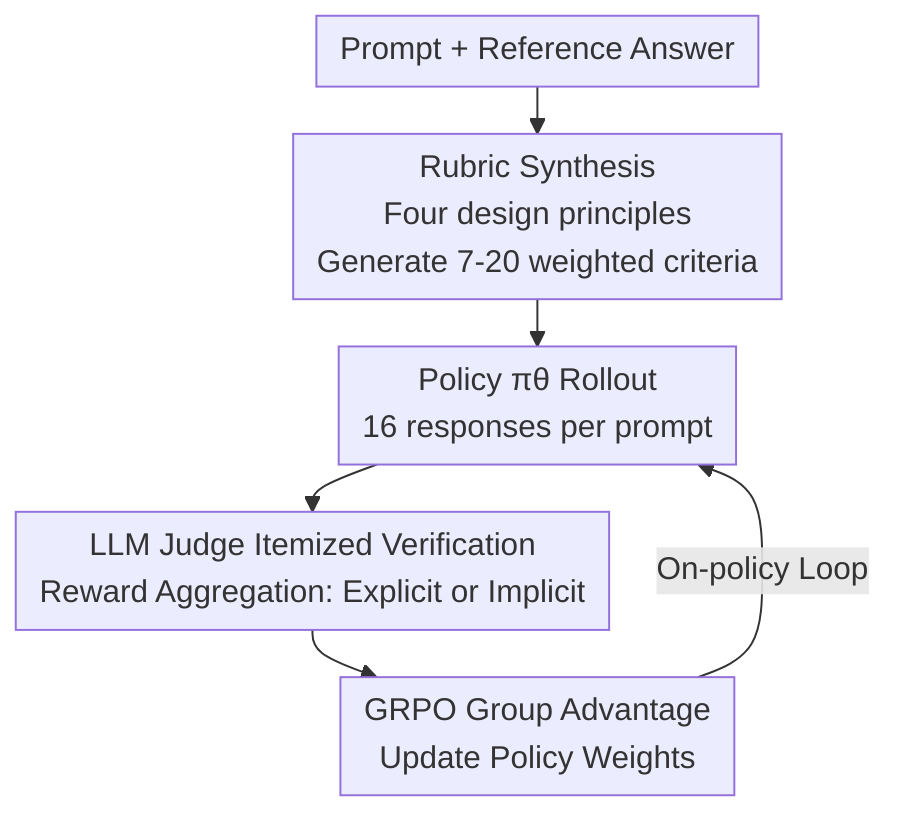

# Rubrics as Rewards: Reinforcement Learning Beyond Verifiable Domains

**Conference**: ICLR 2026  
**OpenReview**: [https://openreview.net/forum?id=c1bTcrDmt4](https://openreview.net/forum?id=c1bTcrDmt4)  
**Code**: Dataset open-sourced at https://huggingface.co/collections/ScaleAI/rar  
**Area**: Alignment RLHF / LLM Reasoning  
**Keywords**: rubric reward, RLVR, GRPO, on-policy RL, LLM-as-judge

## TL;DR
This paper introduces **Rubrics as Rewards (RaR)**, treating itemized rubric checklists as reward functions for on-policy reinforcement learning. This extends RL with Verifiable Rewards (RLVR)—previously limited to "verifiable" tasks like math or code—to real-world reasoning domains like medicine and science where no single standard answer exists. RaR achieves up to a 31% improvement over popular LLM-as-judge Likert baselines on HealthBench and a 7% improvement on GPQA-Diamond.

## Background & Motivation

**Background**: Reinforcement Learning with Verifiable Rewards (RLVR) has been highly successful in tasks such as mathematics and coding. These tasks provide clear binary signals where a scoring function or test case can automatically determine $\text{match}(y, \hat{y}) \in \{0,1\}$ without the need to train a reward model.

**Limitations of Prior Work**: Once moving beyond "verifiable" domains into real-world tasks like medical consultation or scientific reasoning, evaluation is no longer black-and-white but relies on multi-dimensional, fine-grained judgment. Existing alternative rewards have significant flaws: preference reward models (Preference RM) are prone to overfitting surface features (length, format, annotator bias) and require massive amounts of pairwise comparison data; directly asking an LLM for a 1–10 Likert score (Direct-Likert) provides coarse, uninterpretable signals where the judge often gives unstable holistic impression scores.

**Key Challenge**: Verifiable rewards are "simple but lack expressivity," while preference rankings are "expressive but noisy and expensive to maintain." Real-world tasks are caught in the middle, requiring a multi-dimensional standard of "what makes a good answer" without the prohibitive cost of preference labeling.

**Goal**: To find a "middle-ground" reward that decomposes "good answers" into interpretable sub-criteria like a rubric, while remaining automated and reusable for on-policy RL like a verifiable reward.

**Key Insight**: The authors observe that instance-specific rubrics (tailored for each prompt) have previously been used only for **evaluation benchmarks** (e.g., doctors using rubrics to score models in HealthBench). They have rarely been utilized as **training reward signals**. Transforming rubrics from "evaluation tools" into "reward functions" closes the loop between evaluation and training.

**Core Idea**: Replace "single preference/Likert scores" with "itemized rubric checklists" as RL rewards. Each prompt is assigned a set of weighted binary criteria; an LLM judge verifies each item to aggregate a scalar reward for Policy Optimization via GRPO.

## Method

### Overall Architecture

The RaR pipeline consists of two main stages: first, offline **synthesis of an instance-specific rubric** for each prompt; second, feeding this rubric to an LLM judge within the GRPO training loop to **verify criteria item-by-item and convert them into rewards**.

Formalized, given a prompt $x$, the policy $\pi_\theta$ samples a response $\hat{y}$. Each prompt is associated with a set of $k$ rubric criteria $\{(w_j, c_j)\}_{j=1}^k$, where $w_j$ is the weight of the criterion and $c_j:(x,\hat{y})\mapsto\{0,1\}$ is a binary function indicating whether the response satisfies that criterion. The final reward is aggregated from these criteria and sent to GRPO to calculate group-relative advantages and update the policy.

Notably, RaR is a **strict superset of RLVR**: when $k=1, w_1=1$, and $c_1$ degenerates into "exact match with the ground truth," RaR reverts to standard verifiable rewards $r_{\text{RLVR}}(x,\hat{y})=\text{match}(y,\hat{y})$. In other words, verifiable rewards are a special case of "single mandatory criterion" rewards, while rubric rewards generalize this to multi-dimensional, weighted scenarios accommodating both objective and subjective standards.

### Key Designs

**1. Using instance-specific rubrics as rewards based on four principles**

The foundation of RaR is "one specific rubric per prompt" rather than a generic checklist. To make synthetic rubrics viable as rewards, the authors define four desiderata: **Expert Anchoring** (reflecting factual steps and conclusions from domain experts), **Comprehensiveness** (covering accuracy, logic, style, and safety, including negative "pitfall" criteria), **Weighting** (differentiating importance across dimensions), and **Self-containment** (allowing each criterion to be judged independently). 

Due to the lack of human-annotated rubric data in medicine/science, the authors use strong LLMs (GPT-4o for medicine, o3-mini for science) as **proxies for expert supervision using reference answers** to automatically generate 7–20 self-contained criteria per prompt. Each criterion includes a numeric weight and a category label (Essential / Important / Optional / Pitfall), resulting in two public datasets: RaR-Medicine and RaR-Science (~20k prompts each).

**2. Two reward aggregation methods: Explicit Weighting vs. Implicit Delegation**

**Explicit Aggregation** requires the LLM judge to independently verify each $c_j$ and then calculates a normalized weighted sum:

$$r(x, \hat{y}) = \frac{\sum_{j=1}^{k} w_j \cdot c_j(x, \hat{y})}{\sum_{j=1}^{k} w_j}$$

Weights are mapped based on category labels $\{\text{Essential}:1.0, \text{Important}:0.7, \text{Optional}:0.3, \text{Pitfall}:0.9\}$. **Implicit Aggregation** provides all criteria and weights to the judge, allowing it to output a holistic scalar score $r_{\text{implicit}}(x,\hat{y}) = f_\phi(x, \hat{y}, \{d_j\}_{j=1}^k)$ normalized to $[0,1]$. Implicit aggregation was found to be the strongest overall.

**3. Integrating rubric rewards into on-policy training with GRPO**

The Group Relative Policy Optimization (GRPO) algorithm is used with Qwen2.5-7B as the base policy. For each prompt, $k=16$ responses are sampled. A `gpt-4o-mini` judge assigns rewards using the rubric, and weights are updated based on relative advantages within the group. This allows the same rubric to be consistently reused across new rollouts, acting as a "reusable instantiated reward function."

### Loss & Training
Base Policy: Qwen2.5-7B (plus 3B for robustness validation). Algorithm: GRPO, batch size 96, learning rate $5\times10^{-6}$, constant schedule + 10% linear warmup, 8×H100 nodes. Rollout: 16 responses per prompt. Judge: `gpt-4o-mini`.

## Key Experimental Results

### Main Results

Evaluations were conducted on HealthBench (rubric-scored, free generation) and GPQA-Diamond (multiple choice).

| Method | HealthBench Overall | GPQA-Diamond Mean Acc |
|------|--------------------|----------------------|
| Qwen2.5-7B (base) | 7.7 | 31.7 |
| Qwen2.5-7B-Instruct | 22.7 | 35.0 |
| Direct-Likert | 25.5 | 34.8 |
| Reference-Likert | 28.9 | 36.5 |
| RaR-Predefined (General rubric) | 12.5 | 31.7 |
| RaR-Explicit | 29.7 | 36.9 |
| **RaR-Implicit** | **31.2** | **37.6** |

RaR-Implicit shows a ~31% relative improvement over Direct-Likert on HealthBench and ~7% on GPQA. Notably, **RaR-Predefined (generic rubrics) performed worst**, proving that "instantiation" is the key factor.

### Ablation Study

Ablation on rubric generation and design on HealthBench-1k:

| Configuration | HealthBench-1k Overall | Description |
|------|----------------------|------|
| Expert-Answer-SFT | 20.4% | Direct SFT on expert answers |
| Simple-Likert | 23.9% | Single Likert score |
| Reference-Likert | 31.7% | Likert with reference answers |
| RaR-Implicit-Synthetic-NoRef | 32.0% | Synthetic rubric without ref |
| **RaR-Implicit-Synthetic** | **35.9%** | Synthetic rubric with ref |
| RaR-Implicit-Human | 34.8% | Human-authored rubric |

### Key Findings
- **Instantiated rubrics are essential**: Generic rubrics underperform even the instruct base model, whereas instantiated versions consistently outperform Reference-Likert.
- **Expert anchoring/Reference answers are crucial**: Synthetic rubrics with references significantly outperform those without.
- **Rubrics stabilize small judges**: Rubric-guided judgment significantly improves alignment with human preferences, especially for **smaller judges**, narrowing the gap with larger judges.
- **Marginal gains from weights/pitfalls**: Removing category weights or negative criteria resulted in minimal performance drops, likely due to the difficulty of synthesizing high-quality pitfalls.

## Highlights & Insights
- **Formalizing RLVR as a special case of rubric rewards** provides a unified perspective for verifiable and subjective rewards.
- **"Reference answer → Rubric expansion" is the core trick**: Decomposing a holistic reference into a checklist provides finer, more stable, and more interpretable signals than a single holistic score.
- **Implicit aggregation beats explicit weighting**: Delegating the trade-off logic to a strong judge is more robust than manual weight tuning.
- **Rubrics are a lifeline for smaller judges**: Checklist-based verification allows cheaper models to achieve alignment performance close to larger models.

## Limitations & Future Work
- **Dependence on reference quality**: If the reference answer is poor, the synthetic rubric will be poor.
- **Weak utility of pitfalls/weighting**: Synthetic pitfalls often fail to anticipate real failure modes.
- **Explicit vs. Implicit trade-off**: Explicit is more controllable but brittle; implicit is stronger but sacrifices fine-grained control.
- **Judge Bias**: Reward quality still depends on the judge LLM's inherent capabilities and biases.

## Related Work & Insights
- **vs. RLVR**: Traditional RLVR depends on exact matches; RaR generalizes this to multi-dimensional criteria.
- **vs. Preference RM**: RaR avoids high labeling costs and surface feature overfitting by using interpretable, reusable itemized supervision.
- **vs. Evaluation-only Rubrics**: This work is the first to transform rubrics into on-policy RL reward functions to close the training loop.

## Rating
- Novelty: ⭐⭐⭐⭐
- Experimental Thoroughness: ⭐⭐⭐⭐
- Writing Quality: ⭐⭐⭐⭐
- Value: ⭐⭐⭐⭐

<!-- RELATED:START -->

## Related Papers

- [\[ICLR 2026\] Reinforcement Learning with Verifiable Rewards Implicitly Incentivizes Correct Reasoning in Base LLMs](reinforcement_learning_with_verifiable_rewards_implicitly_incentivizes_correct_r.md)
- [\[ICLR 2026\] LongRLVR: Long-Context Reinforcement Learning Requires Verifiable Context Rewards](longrlvr_long-context_reinforcement_learning_requires_verifiable_context_rewards.md)
- [\[ICLR 2026\] From Verifiable Dot to Reward Chain: Harnessing Verifiable Reference-based Rewards for RL of Open-ended Generation](from_verifiable_dot_to_reward_chain_harnessing_verifiable_reference-based_reward.md)
- [\[ICLR 2026\] References Improve LLM Alignment in Non-Verifiable Domains](references_improve_llm_alignment_in_non-verifiable_domains.md)
- [\[ICLR 2026\] Lookahead Tree-Based Rollouts for Enhanced Trajectory-Level Exploration in Reinforcement Learning with Verifiable Rewards](lookahead_tree-based_rollouts_for_enhanced_trajectory-level_exploration_in_reinf.md)

<!-- RELATED:END -->
