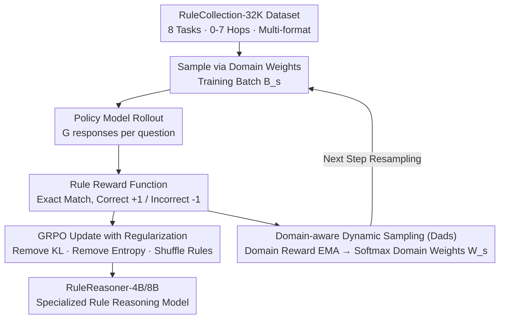

# RuleReasoner: Reinforced Rule-based Reasoning via Domain-aware Dynamic Sampling

- **Conference**: ICLR2026
- **arXiv**: [2506.08672](https://arxiv.org/abs/2506.08672)
- **Code**: To be released
- **Area**: LLM Reasoning / Reinforcement Learning
- **Keywords**: rule-based reasoning, RLVR, dynamic sampling, GRPO, domain reweighting, OOD generalization

## TL;DR

RuleReasoner constructs a diverse rule reasoning dataset, RuleCollection-32K, and proposes a Domain-aware Dynamic Sampling (Dads) strategy. By training 8B models under the RLVR framework, it outperforms OpenAI-o1 by 4.1% on in-domain reasoning tasks and 10.4% on out-of-domain tasks, while improving training efficiency by ~1.4×.

## Background & Motivation

**Background**: Rule-based reasoning is a fundamental AI capability, covering fields such as law, mathematics, and medical diagnosis. Large Reasoning Models (LRM) have acquired Long Chain-of-Thought capabilities through Reinforcement Learning (RL) but still face challenges like diverse rule formats, complex types, and combinatorial explosion in real-world scenarios.

**Limitations of Prior Work**: (1) Traditional methods rely on scaling model size or distilling from stronger models, which is costly and unsustainable; (2) As context windows expand, models exhibit the "lost in the middle" phenomenon, making it difficult to focus on relevant rules and facts; (3) Existing RLVR methods use coarse sampling strategies for multi-domain training data—static mixing leads to domain imbalance, over-optimizing easy domains while under-optimizing difficult ones.

**Key Challenge**: The success of RLVR in mathematical/code reasoning has not yet migrated to the rule reasoning domain—there is a lack of high-quality, diverse training data, and the data scheduling problem in multi-domain training is under-explored.

**Goal**: Train a small (4B/8B) specialized reasoning model that surpasses frontier LRMs (o1, R1) in rule reasoning while improving training efficiency.

**Key Insight**: Simultaneously improve RLVR from two dimensions: **data** and **sampling strategy**. (1) Construct RuleCollection-32K covering 8 types of rule reasoning tasks; (2) Design Dads, a dynamic domain sampling algorithm based on historical rewards, to automatically schedule the proportion of each domain in training batches.

**Core Idea**: Replace static data mixing with Domain-aware Dynamic Sampling (Dads)—calculate the "under-optimization degree" for each domain at each training step based on historical rewards, and dynamically increase the sampling weight of under-optimized domains to achieve adaptive online data scheduling.

## Method

### Overall Architecture

RuleReasoner aims to enable small 4B/8B models to surpass frontier large models like o1 and R1 in rule reasoning without relying on scale or distillation. It focuses improvements on "data" and "sampling scheduling"—it prepares RuleCollection-32K with broad coverage and allows the training process to decide which domain to focus on at each step.

The pipeline integrates a dynamic scheduler into standard RLVR: at each training step, a batch is sampled from the dataset based on current domain weights. The policy model generates rollouts for each question, scored by a rule-based reward function with exact matching. Results are fed into GRPO for policy updates and aggregated into average rewards for each domain. New domain weights are calculated via Exponential Moving Average (EMA) and tempered softmax for the next batch. The policy update incorporates three de-memorization measures (removing KL, removing entropy, and shuffling rule order) to force the model to learn rules rather than memorize the dataset.

### Key Designs

**1. RuleCollection-32K Dataset: Expanding Rule Reasoning Diversity via Five Principles**

The failure to transfer RLVR's success in math/code to rule reasoning is largely due to a lack of diverse training data. RuleCollection-32K was built on five principles: **Varied Depth** (0–7 hop reasoning for curriculum-like complexity); **Formats** (explicit rules/constraints and implicit principles/context); **Reasoning Types** (deductive, inductive, and analytical); **Contextual Dependency** (rules must be adaptively applied to specific problems); and **Evaluation Robustness** (prioritizing Boolean/Multiple-choice for exact scoring). It includes 8 tasks: Clutrr (Inductive), ProntoQA/ProofWriter (Deductive), FOLIO/LogicNLI (First-order logic), and AR-LSAT/Logical Deduction/LogiQA (Others). This deliberate variation in format and difficulty provides the foundation for Dads to function.

**2. Domain-aware Dynamic Sampling (Dads): Reallocating Compute from Converged to Under-optimized Domains**

Static data mixing ignores training dynamics—simple domains like ProntoQA converge quickly, and continued sampling is wasteful, while difficult domains like AR-LSAT remain under-developed. Dads resolves this mismatch.

It maintains an Exponential Moving Average (EMA) reward $\widetilde{r}_{s,d_i}$ for each domain $d_i$:

$$\widetilde{r}_{s,d_i} = \alpha \widetilde{r}_{s-1,d_i} + (1-\alpha) \bar{r}_{s,d_i}$$

The "under-optimization degree" is defined as the gap from the maximum score $v_{s,d_i} = 1 - \widetilde{r}_{s,d_i}$. Sampling weights for the next step are calculated via a tempered softmax:

$$w_{s,d_i} = \frac{\exp(v_{s,d_i}/\tau) + \epsilon}{\sum_{j=1}^n [\exp(v_{s,d_j}/\tau) + \epsilon]}$$

where $\alpha=0.5$ provides smoothing, $\tau=0.5$ controls weight sharpness, and $\epsilon=0.1$ ensures a minimum sampling probability. This **online scheduler** automatically shifts compute to difficult domains (e.g., AR-LSAT receiving nearly 20% of the batch compute in later stages). Unlike AdaRFT, it requires no human priors; it is purely adaptive and more efficient than DAPO as it samples **before** rollouts.

**3. Training Regularization: Three De-memorization Measures**

To prevent the model from identifying specific datasets or memorizing rule patterns, three measures are added to the GRPO update. First, **removing the entropy reward**, as entropy explosion can occur without cold-start bootstrapping. Second, **removing the KL divergence term**: since the rule reward function uses exact matching and eliminates distribution shift concerns, removing KL saves compute and encourages exploration. Third, **shuffling rule order** within each training sample to prevent positional memorization. These measures force the rewards to stem from actual rule reasoning.

### Loss & Training

A **rule reward function** based on exact matching is used:

$$\mathcal{R}_{\text{EM}}(\hat{y}, y) = \begin{cases} 1 & \text{is\_equivalent}(\hat{y}, y) \\ -1 & \text{otherwise} \end{cases}$$

The policy is optimized using the GRPO objective, removing the KL term and entropy reward, retaining only the clipped policy gradient. A strictly online policy is followed—gradients are updated once per rollout.

## Key Experimental Results

### Main Results: In-domain 8-Task Pass@1 Comparison

| Method | Clutrr | ProntoQA | ProofWriter | FOLIO | LogicNLI | AR-LSAT | Log.Ded. | LogiQA | **Avg** |
| :--- | :--- | :--- | :--- | :--- | :--- | :--- | :--- | :--- | :--- |
| OpenAI o1 | 52.2 | 91.0 | 91.0 | 77.0 | 60.0 | 98.0 | 88.0 | 82.1 | 79.9 |
| Claude-3.7 | 65.7 | 92.8 | 90.0 | 74.7 | 58.0 | 76.2 | 97.0 | 81.5 | 79.5 |
| DeepSeek-R1 | 71.6 | 40.0 | 27.0 | 72.7 | 49.0 | 89.7 | 98.3 | 85.0 | 66.7 |
| DAPO | 86.5 | 96.0 | 94.8 | 80.9 | 65.8 | 40.0 | 95.3 | 74.6 | 79.2 |
| AdaRFT | 92.5 | 96.0 | 97.4 | 81.8 | 64.4 | 44.6 | 96.6 | 80.5 | 81.7 |
| **RuleReasoner-8B** | **95.5** | **96.4** | **97.0** | **84.7** | 70.4 | 46.8 | 98.3 | 83.5 | **84.0** |

> RuleReasoner-8B outperforms OpenAI-o1 (79.9%) by 4.1 percentage points with an average accuracy of 84.0%, achieving the lowest performance variance across domains.

### Ablation Study: Out-of-Domain (OOD) Generalization

| Method | BBH | BBEH | ProverQA | **OOD Avg** |
| :--- | :--- | :--- | :--- | :--- |
| Qwen3-8B (base) | 22.9 | 13.0 | 15.3 | — |
| SFT w/ Long CoT | 31.3 | 28.0 | 43.8 | 34.4 |
| GRPO | 35.5 | 24.3 | 34.1 | 31.3 |
| DAPO | 39.8 | 27.3 | 42.8 | 36.6 |
| OpenAI o1 | 46.4 | 33.5 | 52.5 | 44.1 |
| **RuleReasoner-8B** | **52.3** | **45.8** | **65.4** | **54.5** |
| **RuleReasoner-4B** | — | — | — | **54.5** (Δ+7.3 vs o1) |

> RuleReasoner-8B exceeds o1 by 10.4 percentage points on average across three OOD benchmarks. Even the 4B version reaches an average of 78.3% on the three benchmarks.

### Key Findings

1. **Dads outperforms static curriculum learning**: Compared to data-balance RL (79.1%) and easy-to-hard RL (80.4%), Dads (84.0%) is 3-5 percentage points higher on ID tasks—online scheduling significantly outperforms static ordering.
2. **Training Efficiency**: RuleReasoner reaches DAPO's OOD performance ~72 steps earlier (approx. 1.4× speedup) without extra rollout costs.
3. **SFT vs RLVR**: SFT is close to RLVR on ID tasks (81.9 vs 84.0) but fails on OOD tasks (34.4 vs 54.5), confirming that **RL enables generalization whereas SFT favors memorization**.
4. **Emergence of Meta-introspection**: Post-training, the model demonstrates self-verification and logical consistency checks, allowing for self-correction even on unseen rules.

## Highlights & Insights

- The design of Dads is elegant and simple: it uses only historical rewards to estimate domain weights without proxy models or human priors, serving as a general data-scheduling plugin for RLVR.
- An 8B model surpassing frontier models like o1/R1 suggests that **specialized data + intelligent scheduling** is more important than model scale in rule reasoning scenarios.
- The construction principles of RuleCollection-32K (depth variation, multi-format, contextual dependency) are valuable for other reasoning datasets.
- DeepSeek-R1's failure in certain tasks (ProntoQA 40.0%, ProofWriter 27.0%) highlights the fragility of general reasoning models in structured rule reasoning.

## Limitations

- Training data is limited to currently available rule reasoning tasks and may not cover all rule formats and complexities in natural language.
- Rule filtering quality is limited; noisy or redundant rules may affect reasoning quality.
- Not verified on models >8B; larger models might benefit more but are restricted by compute.
- Evaluation is primarily based on exact matching, which may under-evaluate rule application scenarios requiring free-text output.

## Related Work & Insights

- **Logic-RL** (Xie et al., 2025): RLVR for logical reasoning, but classified as "rule-free" reasoning, unlike the "given rules" setting here.
- **DAPO** (Yu et al., 2025): Improves RLVR efficiency through over-sampling and filtering but lacks fine-grained domain scheduling.
- **AdaRFT** (Shi et al., 2025): Uses curriculum sampling but relies on human priors or model success rate estimates; Dads is fully adaptive.
- **GRPO** (Shao et al., 2024): The base policy optimization algorithm upon which RuleReasoner adds domain-aware sampling.
- **Insight**: The "Domain-aware Dynamic Sampling" approach can be extended to any multi-domain RLVR training scenario, such as mathematical reasoning or code generation.

## Rating

⭐⭐⭐⭐ (4/5)

- **Novelty**: ⭐⭐⭐⭐ — Dads is a strong, general method for RLVR data scheduling, though softmax reweighting itself is not a brand-new paradigm.
- **Experiments**: ⭐⭐⭐⭐⭐ — Comprehensive baselines (o1, R1, SFT, RLVR variants), detailed ablations, and average results reported over 5 runs with standard deviations.
- **Utility**: ⭐⭐⭐⭐ — Simple and efficient method, directly integrable into existing RLVR pipelines.
- **Writing**: ⭐⭐⭐⭐ — Clear algorithm pseudocode, though heavy use of tables makes some sections dense.

<!-- RELATED:START -->

## Related Papers

- [\[ICLR 2026\] Unveiling the Cognitive Compass: Theory-of-Mind-Guided Multimodal Emotion Reasoning](unveiling_the_cognitive_compass_theory-of-mind-guided_multimodal_emotion_reasoni.md)
- [\[ICLR 2026\] SPIRAL: Self-Play on Zero-Sum Games Incentivizes Reasoning via Multi-Agent Multi-Turn Reinforcement Learning](spiral_self-play_on_zero-sum_games_incentivizes_reasoning_via_multi-agent_multi-.md)
- [\[ICLR 2026\] Shop-R1: Rewarding LLMs to Simulate Human Behavior in Online Shopping via Reinforcement Learning](shop-r1_rewarding_llms_to_simulate_human_behavior_in_online_shopping_via_reinfor.md)
- [\[ICLR 2026\] Solving Parameter-Robust Avoid Problems with Unknown Feasibility using Reinforcement Learning](solving_parameter-robust_avoid_problems_with_unknown_feasibility_using_reinforce.md)
- [\[ICLR 2026\] Unsupervised Learning of Efficient Exploration: Pre-training Adaptive Policies via Self-Imposed Goals](unsupervised_learning_of_efficient_exploration_pre-training_adaptive_policies_vi.md)

<!-- RELATED:END -->
