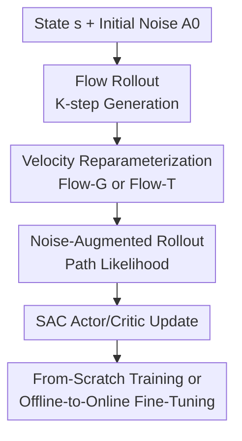

# SAC Flow: Sample-Efficient Reinforcement Learning of Flow-Based Policies via Velocity-Reparameterized Sequential Modeling

**Conference**: ICLR2026  
**OpenReview**: [https://openreview.net/forum?id=zZvWj4JrYj](https://openreview.net/forum?id=zZvWj4JrYj)  
**Code**: https://anonymous.4open.science/r/SAC-FLOW  
**Area**: Reinforcement Learning  
**Keywords**: Flow-based policies, Soft Actor-Critic, Off-policy Reinforcement Learning, Sequential modeling, Robot manipulation

## TL;DR
SAC Flow treats the multi-step sampling process of flow-based policies as a residual RNN. By utilizing GRU/Transformer-style velocity networks and noise-augmented rollouts, it enables stable end-to-end training of high-expressivity flow policies via SAC, achieving superior sample efficiency in continuous control and offline-to-online manipulation tasks.

## Background & Motivation
**Background**: Standard policies in continuous control are typically Gaussian actors, which are simple to train and easily integrated into algorithms like SAC, TD3, or PPO, but have limited expressivity. Robot manipulation, action chunking, and multi-modal decision-making often require outputting entire action sequences, where multiple valid action modes may exist for the same state—distributions that unimodal Gaussians struggle to describe. Diffusion and flow-based policies have been introduced to address this: the former offers strong expressivity but is computationally intensive, while the latter, based on flow matching, requires fewer sampling steps and more easily learns complex distributions from demonstrations.

**Limitations of Prior Work**: Flow-based policies have performed well in imitation learning, but applying off-policy RL for direct fine-tuning faces two challenges. First, actions are not produced in a single forward pass but start from noise $A_{t_0}$ and undergo $K$ Euler updates to reach $A_{t_K}$; updating the actor requires backpropagating Q-function gradients through the entire sampling chain. Second, SAC requires the policy likelihood for entropy regularization, whereas deterministic flow rollouts lack an easily computable explicit density. Existing methods circumvent these by either distilling the flow into a simpler one-step actor or using surrogate objectives to avoid backpropagation through the full rollout. While stable, these approaches decouple the optimization objective from the high-expressivity generator.

**Key Challenge**: The authors argue that the root of instability is not SAC itself, but the computational structure of standard flow rollouts. The Euler update:

$$
A_{t_{i+1}} = A_{t_i} + \Delta t_i v_\theta(t_i, A_{t_i}, s)
$$

is formally a residual recurrent network where the intermediate action $A_{t_i}$ is the hidden state and the velocity network provides the residual update. When off-policy actor gradients backpropagate from the final action to the initial noise, they encounter long Jacobian products similar to vanilla RNNs, leading to gradient explosion or vanishing. Flow policies need multi-step sampling for expressivity, yet these steps cause training instability.

**Goal**: The paper aims to solve "how to train flow policies with sample-efficient off-policy RL like standard actors without sacrificing expressivity." This is decomposed into three sub-problems: reparameterizing the velocity network to stabilize $K$-step backpropagation; constructing a usable likelihood/entropy term for SAC; and covering both from-scratch online training and offline-to-online fine-tuning.

**Key Insight**: The authors' entry point is direct: since flow rollouts resemble RNNs, utilize stable structures proven in sequential modeling. Large-scale sequential models use gates (GRU) or pre-norm residual blocks (Transformer) to stabilize information flow; applying these mechanisms to velocity parameterization structurally mitigates the gradient pathologies of flow rollouts instead of bypassing the original flow at the algorithmic level.

**Core Idea**: Transform the flow-based policy's velocity field from a plain MLP into a "velocity-reparameterized sequential model," and combine it with noise-augmented rollouts to compute path likelihoods, allowing SAC to optimize flow policies end-to-end.

## Method

### Overall Architecture
The SAC Flow workflow comprises three layers: the base layer is a rectified flow policy integrating from Gaussian noise to the final action; the middle layer replaces the velocity network with Flow-G or Flow-T to stabilize multi-step backpropagation; the outer layer embeds this flow actor into SAC, using noise-augmented rollouts to obtain path log-probabilities for entropy regularization. For dense-reward MuJoCo tasks, the algorithm trains from scratch; for sparse-reward manipulation, it undergoes flow-matching pre-training on expert data followed by online fine-tuning with behavioral proximity regularization.

Implementation-wise, Flow-G and Flow-T are drop-in replacements for the velocity field $v_\theta$: the outer Euler integration, tanh squashing, replay buffer, critic targets, and SAC update loop remain unchanged. Thus, the focus is not on a new RL objective, but on making flow actors a policy class that SAC can optimize stably.

### Key Designs
**1. Flow Rollout as a Sequential Model: Locating the Instability**

Standard flow policies start from $A_{t_0}\sim \mathcal{N}(0,I)$ and compute $A_{t_{i+1}}=A_{t_i}+\Delta t_i v_\theta(t_i,A_{t_i},s)$, with $a=\tanh(A_{t_K})$. The authors note this is algebraically equivalent to hidden-state transitions in a residual RNN. The gradient of the actor loss with respect to $A_{t_0}$ involves:

$$
\nabla_{A_{t_0}} L = \nabla_{A_{t_K}} L \prod_{i=0}^{K-1}\left(I + \Delta t_i \frac{\partial v_\theta(t_i,A_{t_i},s)}{\partial A_{t_i}}\right).
$$

This product explains why naive SAC Flow fails: if the singular values of these Jacobians deviate from 1, gradients explode or vanish exponentially with sampling steps. This turns the empirical observation of flow policy instability into a structural diagnosis.

**2. Flow-G: Gated Velocity Updates**

Flow-G replaces the MLP with a gate network and a candidate network. Given $[s; A_{t_i}; t_i]$, the gate $g_i=\sigma(f_z([s;A_{t_i};t_i]))$ determines the update magnitude, and the update is:

$$
A_{t_{i+1}} = A_{t_i} + \Delta t_i g_i \odot (\hat v_i - A_{t_i}).
$$

This mimics the GRU mechanism within the flow velocity. If a dimension needs stable propagation, the gate approaches 0, making the Jacobian an identity mapping; if rapid change is needed, the gate opens. Flow-G provides a "valve" for gradients and updates, making $K$-step BPTT significantly more stable.

**3. Flow-T: State-Conditioned Transformer Decoder**

Flow-T uses a pre-norm residual Transformer decoder. It projects the current action-time pair $(A_{t_i}, t_i)$ into embeddings and encodes the state $s$ as global memory. Each decoder block performs position-independent self-transformation on the token and queries the state embedding via cross-attention to project the velocity. Unlike causal Transformers, Flow-T evaluates each step independently using the current $A_{t_i}$ and the same state context, utilizing residual connections and FFN blocks for stable deep propagation.

**4. Noise-Augmented Rollout: Estimating Path Likelihood**

SAC requires policy log-probabilities. Computing the exact marginal density of a deterministic flow rollout is difficult. SAC Flow adds isotropic Gaussian noise and a compensating drift during rollout, keeping the final marginal distribution unchanged while making each transition a Gaussian:

$$
A_{t_{i+1}} \mid A_{t_i},s \sim \mathcal{N}(A_{t_i}+b_\theta(t_i,A_{t_i},s)\Delta t_i,\sigma_i^2 I).
$$

The joint density of the path $A=(A_{t_0},\ldots,A_{t_K})$, denoted $p_c(A\mid s)$, is used as a surrogate for entropy. This introduces a slight bias to the critic but ensures stable, computable off-policy training.

### Loss & Training
In from-scratch training, SAC Flow maintains the SAC structure. The actor loss is:

$$
L_{actor}(\theta)=\mathbb{E}_{s,A\sim \pi_\theta}\left[\alpha \log p_c(A\mid s)-Q_\phi(s,\tanh(A_{t_K}))\right],
$$

while the critic target includes the entropy surrogate of the next state's flow path. Offline-to-online training adds a behavioral proximity term $\lambda\|a_h-a\|$ to the actor loss. Training starts with flow-matching pre-training on expert data, followed by online interaction where $\lambda$ is gradually decayed to allow the policy to surpass the demonstrations while remaining anchored to the data distribution during initial exploration.

## Key Experimental Results

### Main Results
Evaluation was conducted across MuJoCo (from-scratch), OGBench (sparse-reward offline-to-online), and Robomimic (human demonstrations).

| Setting | Dataset / Task | Baseline | Metric | SAC Flow Results |
|------|---------------|----------|----------|---------------|
| From-scratch | MuJoCo (Hopper, Ant, etc.) | QSM, DIME, FlowRL, SAC | Episodic return | Flow-G/T achieved comparable or better performance (up to ~130% gain over strong baselines in some tasks). |
| Offline-to-Online (Sparse) | OGBench cube tasks | ReinFlow, FQL, QC-FQL | Success rate | Flow-T converged rapidly, especially on complex cube-triple/quadruple (up to ~60% gain). |
| Offline-to-Online (Demo) | Robomimic (Can, Square) | ReinFlow, FQL, QC-FQL | Success rate | Flow-G/T performed comparably to QC-FQL and outperformed ReinFlow at 1M steps. |

### Ablation Study
- **Velocity Parameterization**: Naive SAC Flow with MLP velocity exhibited gradient norms ~10x higher than Flow-G/T, leading to instability; Flow-G/T remained stable.
- **Sampling Steps $K$**: Flow-G/T are highly robust to the number of sampling steps, whereas vanilla flows degrade as $K$ increases.
- **RL Algorithm**: Replacing SAC with TD3 showed that Flow-G/T still outperformed vanilla flow architectures, confirming the benefit is architectural rather than algorithm-specific.

### Key Findings
- The core evidence is the diagnosis: "naive flow + off-policy RL fails, Flow-G/T stabilizes."
- Flow-T is generally the strongest version, particularly for complex manipulation; Flow-G is more lightweight and interpretable.
- The use of noise-augmented rollouts provides a realistic trade-off between bias and stability in off-policy flow training.

## Highlights & Insights
- Viewing the flow rollout as a residual RNN is a clean and powerful insight that translates a generative modeling problem into a well-understood sequential stability problem.
- Unlike methods that distill flows into one-step actors, SAC Flow preserves and directly optimizes the high-expressiveness flow actor.
- The framework is modular; Flow-G and Flow-T can be integrated into other off-policy algorithms (like TD3 or Offline RL).

## Limitations & Future Work
- **Real-world Validation**: Currently evaluated in simulation; real-robot factors like latency and visual observation noise require further study.
- **Computational Overhead**: Flow-T involves Transformer decoding at each velocity evaluation; despite small $K$, the latency needs more detailed analysis for real-time control.
- **Hyperparameter Sensitivity**: The behavioral proximity weight $\lambda$ is crucial for offline-to-online success; automated tuning mechanisms are a potential future direction.

## Related Work & Insights
- **Comparison with FlowRL**: While FlowRL uses Wasserstein-2 constraints, SAC Flow addresses the structural stability of the velocity network itself.
- **Comparison with QC-FQL**: QC-FQL uses surrogate one-step actors; SAC Flow fine-tunes the original flow policy directly for better expressivity retention.
- **Heuristic**: If a policy's sampling process is a differentiable multi-step chain, treat it as a deep/recurrent network and fix the gradient propagation structure before adjusting the RL objective.

## Rating
- **Novelty**: ⭐⭐⭐⭐⭐ (Excellent insight into the RNN-like nature of flow rollouts).
- **Experimental Thoroughness**: ⭐⭐⭐⭐ (Broad coverage, though real-robot data is missing).
- **Writing Quality**: ⭐⭐⭐⭐ (Clear logic and comprehensive appendices).
- **Value**: ⭐⭐⭐⭐⭐ (Highly relevant for combining high-expressivity models with sample-efficient RL).

[1] Lipman et al., "Flow Matching for Generative Modeling", ICLR 2023.  
[2] Haarnoja et al., "Soft Actor-Critic: Off-Policy Maximum Entropy Deep Reinforcement Learning with a Stochastic Actor", ICML 2018.  
[3] Chi et al., "Diffusion Policy: Visuomotor Policy Learning via Action Diffusion", RSS 2023.

## Related Papers

- [\[ICLR 2026\] Mean Flow Policy with Instantaneous Velocity Constraint for One-step Action Generation](mean_flow_policy_with_instantaneous_velocity_constraint_for_one-step_action_gene.md)
- [\[ICML 2026\] Reverse Flow Matching: A Unified Framework for Online Reinforcement Learning with Diffusion and Flow Policies](../../ICML2026/reinforcement_learning/reverse_flow_matching_a_unified_framework_for_online_reinforcement_learning_with.md)
- [\[ICLR 2026\] GoldenStart: Q-Guided Priors and Entropy Control for Distilling Flow Policies](goldenstart_q-guided_priors_and_entropy_control_for_distilling_flow_policies.md)
- [\[ICLR 2026\] Reinforcement Learning via Value Gradient Flow](reinforcement_learning_via_value_gradient_flow.md)
- [\[ICLR 2026\] Bridging Successor Measure and Online Policy Learning with Flow Matching-Based Representations](bridging_successor_measure_and_online_policy_learning_with_flow_matching-based_r.md)

<!-- RELATED:END -->

<!-- RELATED:START -->

## Related Papers

- [\[ICLR 2026\] Reinforcement Learning via Value Gradient Flow](reinforcement_learning_via_value_gradient_flow.md)
- [\[ICLR 2026\] Sample Efficient Offline RL via T-Symmetry Enforced Latent State-Stitching](sample_efficient_offline_rl_via_t-symmetry_enforced_latent_state-stitching.md)
- [\[ICLR 2026\] Unsupervised Learning of Efficient Exploration: Pre-training Adaptive Policies via Self-Imposed Goals](unsupervised_learning_of_efficient_exploration_pre-training_adaptive_policies_vi.md)
- [\[ICLR 2026\] The Sample Complexity of Online Reinforcement Learning: A Multi-Model Perspective](the_sample_complexity_of_online_reinforcement_learning_a_multi-model_perspective.md)
- [\[ICLR 2026\] Divide, Harmonize, Then Conquer It: Shooting Multi-Commodity Flow Problems with Multimodal Language Models](divide_harmonize_then_conquer_it_shooting_multi-commodity_flow_problems_with_mul.md)

<!-- RELATED:END -->
