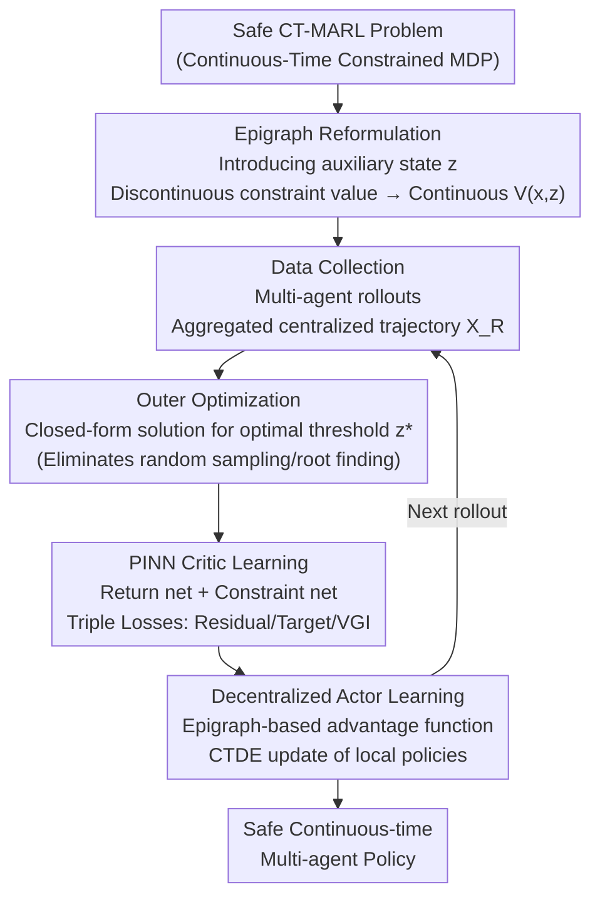

# Safe Continuous-time Multi-Agent Reinforcement Learning via Epigraph Form

**Conference**: ICLR 2026  
**arXiv**: [2602.17078](https://arxiv.org/abs/2602.17078)  
**Code**: [GitHub Link](https://github.com/xuefeng-wang/EPI)  
**Area**: Reinforcement Learning  
**Keywords**: Continuous-time RL, Multi-agent, Safety constraints, HJB equation, Epigraph reformulation

## TL;DR

This work proposes the first continuous-time multi-agent RL framework that explicitly handles state constraints. By employing an epigraph form, discontinuous constraint value functions are transformed into continuous representations. Combined with an improved PINN actor-critic method, the framework achieves safe and stable continuous-time multi-agent control.

## Background & Motivation

Most algorithms for Multi-Agent Reinforcement Learning (MARL) are based on discrete-time MDPs and Bellman equations, assuming fixed decision-making intervals. However, many real-world scenarios (autonomous driving, financial trading, robotic collaboration) are inherently continuous-time control problems. Discrete-time discretization can lead to performance degradation and training instability under high-frequency or non-uniform time intervals.

Existing continuous-time MARL methods are based on the Hamilton-Jacobi-Bellman (HJB) equations and approximate value functions using Physics-Informed Neural Networks (PINNs). However, they **rarely consider safety constraints** (such as collision penalties) because state constraints introduce discontinuities in the value function, making it difficult for HJB-PINNs to approximate accurately.

**Key Challenge**: Safe MARL requires handling constraints, but constraints cause value function discontinuity, whereas PINNs can only approximate smooth functions. Ours addresses this contradiction by using **Epigraph reformulation** to transform discontinuous values into continuous representations.

## Method

### Overall Architecture

EPI addresses the breakdown of PINN approximation when "continuous-time, multi-agent, and safety constraints" coincide. It first formalizes safe CT-MARL as a Continuous-Time Constrained MDP (CT-CMDP), aiming to minimize cumulative costs while ensuring state constraints (e.g., collision avoidance) are consistently satisfied. The difficulty lies in the fact that constraints make the value function discontinuous, while HJB-PINNs can only approximate smooth functions. The breakthrough of EPI is to use Epigraph reformulation by introducing an auxiliary state $z$, lifting the discontinuous constraint value function into a continuous auxiliary value function $V(x,z)$, which allows for stable PINN approximation. Around this representation, it builds an inner-outer optimization actor-critic training loop: in each round, rollouts from various agents are aggregated into centralized trajectories. The outer layer solves for the optimal threshold $z^*$ in closed form on the trajectory, while the inner layer uses a PINN to train the critic (comprising a return network and a constraint network) to approximate $V(x,z^*)$. The actor then learns a decentralized policy based on local observations under the CTDE (Centralized Training, Decentralized Execution) framework. The updated policy drives the next round of rollouts.

### Key Designs

**1. Epigraph Reformulation: Lifting Discontinuous Constraint Values to Continuous Auxiliary Functions**

This is the theoretical pivot of the paper, directly addressing the "constraints → value discontinuity → PINN failure" bottleneck. An auxiliary state $z(t)$ is introduced to define an auxiliary value function that unifies the objective cost and constraints:

$$V(x,z) = \min_{u} \max\Big\{\max_\tau c(x(\tau)),\; \int_t^\infty \gamma^{\tau-t} l(x(\tau),u(\tau))\,d\tau - z\Big\}$$

The outer $\max$ combines the "most severe constraint violation on the trajectory $\max_\tau c$" with the "cumulative cost relative to threshold $z$." Lemma 3.1 proves that the original constrained value can be recovered from this auxiliary function: $v(x) = \min\{z \in \mathbb{R} \mid V(x,z) \leq 0\}$. In other words, solving for the constrained value becomes finding the zero-level set of $V$ along the $z$-axis. The critical benefit is found in Theorem 3.3—$V(x,z)$ is continuous (corresponding to the existence and uniqueness of the viscosity solution to the epigraph HJB PDE), whereas the original constraint value function is discontinuous. Continuity is the prerequisite for PINN approximation.

**2. Improved Outer Optimization: Directly Solving for $z^*$ During Training**

Once $V(x,z)$ is established, the appropriate $z$ must be determined. Previous methods (e.g., EPPO) randomly sample $z$ during training, which injects non-stationary noise and undermines policy update stability, requiring an expensive root-finding process during execution. EPI improves this by designing the return and constraint networks to depend only on $x$, not $z$. Consequently, the optimal threshold can be solved in closed form:

$$z^* = \min\{z \mid \max\{V_\phi^{\text{cons}}(x),\, V_\psi^{\text{ret}}(x) - z\} \leq 0\}$$

Feeding this $z^*$ directly during training removes the source of instability from sampling noise. During execution, since the networks do not depend on $z$, root-finding is eliminated, saving online overhead.

**3. PINN-based Critic: Complementary Triple Losses**

The critic must accurately learn $V(x,z)$ over an infinite horizon without boundary conditions. Relying solely on the HJB residual is insufficient, so EPI uses three complementary losses. The residual loss $\mathcal{L}_{\text{Residual}} = (\max\{c(x)-\tilde{V},\, \min_u \mathcal{H}\})^2$ penalizes violations of the HJB PDE, providing structural constraints. The target loss $\mathcal{L}_{\text{Target}} = (V_{\text{tgt}} - \tilde{V})^2$ uses trajectory-based numerical targets as anchors to prevent value function drift caused by missing boundary conditions in the infinite horizon. Value Gradient Iteration (VGI) constrains the consistency of $\nabla_x V$, ensuring the value gradient is learned accurately. This is particularly crucial because the actor's advantage function directly uses $\nabla_x V$; inaccurate gradients would lead to harmful policy updates, making the residual loss arguably less critical than VGI.

**4. Decentralized Actor Learning: CTDE Updates via Epigraph Advantage Functions**

The actor follows the Centralized Training, Decentralized Execution (CTDE) paradigm, where each agent acts based solely on local observations. Its update signal is the advantage function in epigraph form:

$$A(x_t,z_t^*,u_t) = \max\{c(x_t)-V,\; \nabla_x V \cdot f(x,u) - \partial_z V \cdot l(x,u) + \ln\gamma \cdot V\}$$

Here, the $\max$ operator couples the constraint term and cost term into a single objective. Since the true dynamics and cost functions are unknown, EPI substitutes them with learned dynamics network $f_\xi$ and cost network $l_\phi$, calculating the expression in a model-based sense to drive policy updates.

### Loss & Training

The total Critic loss is a weighted sum of three terms: $\mathcal{L}_{\text{Critic}} = \lambda_{\text{res}}\mathcal{L}_{\text{Residual}} + \lambda_{\text{tgt}}\mathcal{L}_{\text{Target}} + \lambda_{\text{vgi}}\mathcal{L}_{\text{VGI}}$. The actor loss is $\mathcal{L}_{\text{actor}} = \mathbb{E}[A_\theta(x,z^*,u)]$. The three weights are determined via grid search.

## Key Experimental Results

### Main Results (Continuous-time Safe MPE + MuJoCo)

| Method | Direction | Constraint and Cost Advantage |
| :--- | :--- | :--- |
| MACPO | Trust Region Constraint | Excessively Conservative |
| MAPPO-Lag | Lagrangian Relaxation | Balance Instability |
| SAC-Lag | Off-policy + Lagrangian | Poor Constraint Satisfaction |
| EPPO | Random sampling of z | Stuck in Sub-optimal |
| CBF | Control Barrier Functions | Conservative but Reasonable |
| **EPI (Ours)** | **$z^*$ Direct Optimization** | **Cost and Constraints near Optimal** |

### Ablation Study

| Configuration | Key Indicator | Explanation |
| :--- | :--- | :--- |
| Full EPI | Optimal | Triple loss + $z^*$ optimization |
| Remove Target Loss | Significant Degradation | Value drift in unbounded problems |
| Remove VGI Loss | Severe Degradation | Inaccurate gradient → harmful policy updates |
| Remove Residual Loss | Slight Impact | PDE structure less critical when VGI is present |
| Overweighting any loss (×20) | Degradation | Balanced weights are optimal |

### Key Findings
- EPPO fails to converge to optimal solutions due to random sampling of $z$.
- Target and VGI losses are vital for infinite-horizon problems; the residual loss is relatively secondary.
- EPI consistently achieves the lowest costs and constraint violations in MPE scenarios like Formation, Line, and Target.
- Ours also outperforms baselines in MuJoCo tasks (HalfCheetah, Ant).

## Highlights & Insights

- **First to introduce safety constraints to CT-MARL**: Fills the gap in safe continuous-time multi-agent RL.
- **Ingenuity of Epigraph Reformulation**: The discontinuous-to-continuous value transformation makes PINN-based methods viable.
- **$z^*$ Direct Optimization**: Eliminates the noise sources and execution overhead of previous methods.
- **Theoretical Guarantees** (Theorem 3.3): Proves the existence and uniqueness of the viscosity solution for the epigraph HJB PDE.

## Limitations & Future Work

- Requires learning dynamics and cost networks ($f_\xi, l_\phi$), increasing model complexity.
- Value function loss weights $(\lambda_{\text{res}}, \lambda_{\text{tgt}}, \lambda_{\text{vgi}})$ are determined by grid search; adaptive schemes could be considered.
- Current experimental environments involve limited scale (2-6 agents); scalability to large-scale agents remains to be verified.
- PINN methods may face training difficulties in extremely high-dimensional state spaces.

## Related Work & Insights

- Wang et al. (2025) first systematically studied CT-MARL but ignored safety constraints; EPI directly addresses this omission.
- Zhang et al. (2025b)'s EPPO introduced epigraphs but used random sampling for $z$; EPI's refinement is more stable.
- So and Fan (2023) used epigraph forms for single-agent safe control; the current work extends this to multi-agent RL.
- **Insight**: The key to PDE-based RL methods is not the residual loss, but the accuracy of the value gradient.

## Rating
- Novelty: ⭐⭐⭐⭐⭐ First unified treatment of safety constraints + continuous time + multi-agent.
- Experimental Thoroughness: ⭐⭐⭐⭐ Dual benchmarks (MPE and MuJoCo) with detailed ablation, though agent scale is limited.
- Writing Quality: ⭐⭐⭐⭐ Rigorous theoretical derivation and clear framework diagrams.
- Value: ⭐⭐⭐⭐ New direction for safe CT-MARL with balanced theoretical and methodological contributions.

<!-- RELATED:START -->

## Related Papers

- [\[ICLR 2026\] Continuous-Time Value Iteration for Multi-Agent Reinforcement Learning](continuous-time_value_iteration_for_multi-agent_reinforcement_learning.md)
- [\[ICLR 2026\] Sample-efficient and Scalable Exploration in Continuous-Time RL](sample-efficient_and_scalable_exploration_in_continuous-time_rl.md)
- [\[ICLR 2026\] From Ticks to Flows: Dynamics of Neural Reinforcement Learning in Continuous Environments](from_ticks_to_flows_dynamics_of_neural_reinforcement_learning_in_continuous_envi.md)
- [\[ICLR 2026\] RLAC: Reinforcement Learning with Adversarial Critic for Free-Form Generation Tasks](rlac_reinforcement_learning_with_adversarial_critic_for_free-form_generation_tas.md)
- [\[ICLR 2026\] Distributionally Robust Cooperative Multi-agent Reinforcement Learning with Value Factorization](distributionally_robust_cooperative_multi-agent_reinforcement_learning_with_valu.md)

<!-- RELATED:END -->
