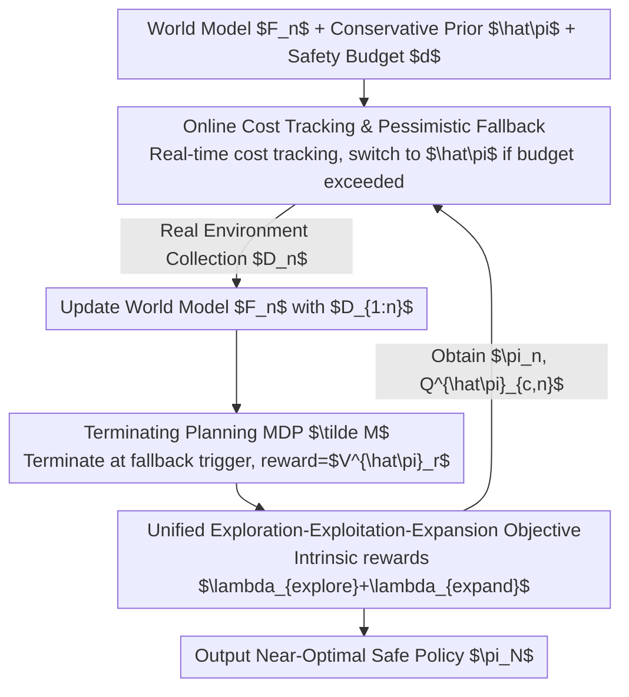

# Safe Exploration via Policy Priors

**Conference**: ICLR 2026  
**OpenReview**: [https://openreview.net/forum?id=JC8xYAADHL](https://openreview.net/forum?id=JC8xYAADHL)  
**Code**: None  
**Area**: Reinforcement Learning / Safe Exploration / Model-based RL  
**Keywords**: Safe Exploration, Policy Priors, Optimism-Pessimism, Cumulative Regret, Constrained Markov Decision Processes

## TL;DR
Ours proposes SOOPER, a model-based safe exploration algorithm: it utilizes a "suboptimal but conservative" prior policy as a safety guardrail. During online interaction, the agent pessimistically falls back to it to ensure safety; during simulation, it aggressively explores the world model with optimism. By reframing the constrained task into an unconstrained "terminating planning MDP"—where trajectories terminate upon fallback—the method achieves sublinear cumulative regret while maintaining safety throughout the learning process, validated on real racing hardware.

## Background & Motivation
**Background**: Safe Reinforcement Learning (safe RL) aims for agents to remain safe not just after training, but throughout the **entire learning process**. Existing work is generally divided into two camps: one provides strict safety/optimality guarantees (e.g., Safe Bayesian Optimization, Lyapunov stability, MPC backup policies), while the other leverages scalable tools of deep RL (trust region, primal-dual, interior-point, etc.) to handle high-dimensional tasks.

**Limitations of Prior Work**: Guaranteed methods often handle only low-dimensional/tabular/parameter-light problems and struggle with complex continuous control. Scalable methods typically **cannot guarantee safety during the learning phase**, or only provide weak "simple regret" guarantees (near-optimal at training end), where performance during exploration can be arbitrarily poor. Specifically, methods like SAILR, which terminate upon backup policy trigger, rely on optimality guarantees where "fallback probability vanishes over time" without providing formal conditions for this property.

**Key Challenge**: Prior knowledge is critical for safe exploration—without it, identifying danger requires harmful trial and error. However, previous work primarily treats the prior policy as a "safety fallback" without using it to **guide exploration toward promising regions**. Safety sets are restricted by pessimistic estimates; since the optimal policy $\pi^*_c$ may lie outside the initial safe set, the set must be actively "expanded."

**Goal**: To use a conservative prior policy $\hat\pi$ (from offline data or simulators) to ensure constraint satisfaction throughout learning while provably converging to a near-optimal policy, unifying "exploration, exploitation, and expansion" into a solvable objective.

**Key Insight**: Treat "forced fallback to the prior" as **early termination** of a trajectory. Early termination acts as a penalty—the agent is incentivized to find strategies that "safely achieve higher rewards without needing to fall back."

**Core Idea**: Rewrite the Constrained MDP (CMDP) as an unconstrained MDP using "pessimistic fallback + optimistic simulation exploration + terminating planning MDP," enabling the direct application of standard deep RL while providing the first cumulative regret bound for this setting.

## Method

### Overall Architecture
SOOPER (Safe Online Optimism for Pessimistic Expansion in RL) is a model-based actor-critic algorithm. Each episode cycles through two modes: **(i) Safe data collection in the real environment**—executing the learned policy $\pi_n$ while tracking cumulative costs in real-time. If a move is predicted to violate the budget, it **pessimistically falls back** to the conservative prior $\hat\pi$ to ensure safety. **(ii) Optimistic exploration in simulation**—updating a probabilistic world model $F_n$ with historical data and performing rollouts on a "planning MDP" $\tilde M$ to explore unknown dynamics. In $\tilde M$, any state-action that would trigger a fallback in real deployment is treated as a **terminal state**, yielding a terminal reward equal to the pessimistic value of the prior $V^{\hat\pi}_r$. This incentivizes the agent to learn trajectories that outperform the prior without falling back. The process uses a unified objective with intrinsic rewards for exploration/expansion.

### Key Designs

**1. Online Cost Tracking and Pessimistic Fallback: Guarding the safety baseline with a computable cost upper bound**

The fundamental difficulty of safety is that the constraint $J_c(\pi,f)\le d$ must hold for the **unknown** true dynamics $f$ without violation. SOOPER defines the **pessimistic cost value** of the prior policy as $\bar V^{\hat\pi}_c(s)=\max_{\tilde f\in F_n}\mathbb{E}_{\hat\pi}[\sum_t \gamma^t c(s_t,a_t)]$, taking the worst-case model within the credible set $F_n$. This bounds the true cost with $1-\delta$ probability. To avoid the intractable maximization over $F_n$, ours relaxes this by **adding an uncertainty penalty** to the cost function: $Q^{\hat\pi}_{c,n}(s,a)=\mathbb{E}_{\hat\pi}[\sum_t\gamma^t(c(s_t,a_t)+\lambda_{pessimism}\|\sigma_n(s_t,a_t)\|)]$, where $\sigma_n$ is the epistemic uncertainty. This enables the use of TD learning.

During online execution (Algorithm 1), the agent tracks realized costs $c_{<t}=\sum_{\tau<t}\gamma^\tau c(s_\tau,a_\tau)$ and uses switching rule $\bar\pi_n$: if $\Phi(s_t,a_t,c_{<t},Q^{\hat\pi}_{c,n}):=c_{<t}+\gamma^t Q^{\hat\pi}_{c,n}(s_t,a_t)<d$, execute $\pi_n$; otherwise, fall back to $\hat\pi$. Theorem 1 proves this ensures **every episode** satisfies constraints. This allows the exploration of states the prior would avoid until the pessimistic estimate signals danger.

**2. Terminating Planning MDP: Rewriting CMDP as an unconstrained MDP**

CMDPs typically require complex Lagrangian min-max solvers. SOOPER constructs a planning MDP $\tilde M$: any state-action triggering a fallback ($\Phi\ge d$) transitions to a **terminal state** $s^\dagger$. The terminal reward is set to $\tilde r(s_t,a_t)=V^{\hat\pi}_r(s_t)$ (the **pessimistic reward value** of the prior, $V^{\hat\pi}_r(s)=\min_{\tilde f\in F_n}\mathbb{E}_{\hat\pi}[\sum_t\gamma^t r]$). 

This design ensures that termination locks subsequent rewards to what the prior would conservatively achieve. If the agent finds a path that **avoids fallback and achieves higher reward**, it is strictly better than termination. "Avoiding fallback" thus becomes an endogenous incentive. Because $\tilde M$ is **unconstrained**, ours applies standard regret analysis for unconstrained MDPs, forming the basis for the cumulative regret bound.

**3. Unified Exploration-Exploitation-Expansion: Driving three goals with one intrinsic reward**

Pessimism can make the initial safe set $\Pi^n_{<d}$ too small to contain the optimal policy $\pi^*_c$, requiring **expansion**. Prior works often use a two-stage route: first expanding with reward-free sampling, then exploring. SOOPER unifies these into one objective (Eq. 9): maximize $\mathbb{E}_\pi[\sum_t\gamma^t\tilde r(s_t,a_t)+(\gamma^t\lambda_{explore}+\sqrt{\gamma^t\lambda_{expand}})\|\sigma_n(s_t,a_t)\|]$ on the planning MDP. The bonuses $\lambda_{explore}$ and $\lambda_{expand}$ (both derived in closed form) encourage exploration and expansion respectively. Theorem 2 proves that $R(N)\le \mathcal{O}(\Gamma_N^{7/2}\log(N)/\sqrt N)$ grows sublinearly while $J_c(\bar\pi_n,f)\le d$ throughout, ensuring performance during the learning process.

### Loss & Training
The practical "Deep Version" (Algorithm 2) follows an MBPO-style model-based actor-critic: it learns dynamics via a probabilistic neural ensemble, using the standard deviation as an estimate of $\sigma_n$. The agent generates rollouts in the world model and performs actor-critic updates on Eq. (5) and Eq. (9).

## Key Experimental Results

### Main Results
Evaluations were conducted on RWRL, SafetyGym, and RaceCar, comparing SOOPER against SAILR (SOTA safe exploration), CRPO, and Primal-Dual (CMDP solvers without safety guarantees during learning).

| Task | SOOPER Safe Throughout? | Performance vs. Prior | Baseline Comparison |
|------|------|------|------|
| PointGoal2 | Yes | ~1.50–1.65× | Equal or better than safe-constrained baselines |
| RaceCar | Yes | ~1.2–1.3× | Superior or equal |
| CartpoleSwingup (incl. Visual) | Yes | ~0.9–1.0× | Near-optimal |
| HumanoidWalk | Yes | ~1.3–1.4× | Superior or equal |
| WalkerWalk | Yes | Significant gain | Superior or equal |

**Key Findings**: SOOPER satisfies constraints in **all** episodes across all tasks. Among algorithms satisfying constraints, SOOPER maintains equal or superior performance. Baselines like CRPO/Primal-Dual frequently violate constraints during learning.

### Ablation Study

| Scenario | Key Result | Description |
|------|---------|------|
| Dynamics Mismatch Transfer | Safe throughout + Gain | Prior trained on shifted dynamics $\mu_0$, then fine-tuned on true dynamics |
| Visual Control (64×64 pixels) | Constraint met + Near-optimal | Dynamics model learned on DrQ pre-trained visual embeddings |
| Offline-to-Online | Outperforms all baselines | Prior trained on 2M offline transitions via MOPO, then fine-tuned online |
| Real Hardware Racecar (60Hz) | Safe throughout, Reward ≈ 2× Prior | Successfully handled high-frequency control and mocap latency |

## Highlights & Insights
- **"Termination = Penalty" Transformation**: Modeling forced fallback as trajectory termination with a locked reward converts the CMDP into an unconstrained MDP. This allows reuse of standard deep RL and makes "outperforming the prior" an endogenous incentive.
- **Pessimism/Optimism Division**: Uses pessimism for **safety** (worst-case model/uncertainty penalty) and optimism for **reward** (intrinsic exploration reward). This reflects the principle that performance can be tested, but safety cannot be risked.
- **Transferable Trick**: Replacing the explicit maximization over a credible set with an uncertainty penalty term provides a computable pessimistic cost bound, transferable to other safe constraint tasks requiring worst-case estimation.
- **Unified Intrinsic Reward**: Integrating safe set expansion into the task learning objective avoids the computational waste of separate reward-free pre-exploration phases.

## Limitations & Future Work
- Theory relies on regularity assumptions: Gaussian (relaxable to sub-Gaussian) noise, Lipschitz continuity, and access to a **constraint-satisfying pessimistic prior** (Assumption 4). Prior quality affects the starting safe set size and final performance.
- Current setting is **episodic** (resetting to a new initial state); non-episodic (single trajectory, no reset) settings remain an open challenge.
- Constraints are budget-based for the whole trajectory; high-probability constraints for **specific states** are not yet supported.
- Robustness depends on the world model being "well-calibrated"; implementation uses post-hoc recalibration to mitigate this.

## Related Work & Insights
- **vs. SAILR (Wagener et al. 2021)**: Both use "backup/termination" to rewrite safety. SAILR’s simple regret depends on a vanishing reset probability without formal proof. SOOPER provides a stronger cumulative regret bound and locks termination rewards to the prior's pessimistic value.
- **vs. ActSafe (As et al. 2025b)**: ActSafe uses reward-free exploration for simple regret, potentially performing poorly during exploration; SOOPER uses a unified objective for cumulative regret.
- **vs. Provable Safety (Bayesian Opt / Lyapunov / MPC)**: These provide strong guarantees but struggle to scale beyond low-dimensional or discretized states; SOOPER scales to continuous control and visual input via MBPO-style deep RL.
- **vs. Scalable solvers (CRPO / Primal-Dual)**: These ignore exploration and violate constraints during learning; SOOPER achieves both active exploration and learning-phase safety.

## Rating
- Novelty: ⭐⭐⭐⭐⭐ "Terminating planning MDP + Pessimistic fallback" provides the first cumulative regret bound for this setting with a self-consistent logic.
- Experimental Thoroughness: ⭐⭐⭐⭐⭐ Covers RWRL/SafetyGym, visual control, offline-to-online, and real hardware validation.
- Writing Quality: ⭐⭐⭐⭐ Theoretical intuition is clear, though the density of theorems and parameters ($\lambda$) requires background.
- Value: ⭐⭐⭐⭐⭐ Simultaneously achieves safety throughout learning, performance guarantees, and scalability to real hardware.

<!-- RELATED:START -->

## Related Papers

- [\[ICLR 2026\] SHAPO: Sharpness-Aware Policy Optimization for Safe Exploration](shapo_sharpness-aware_policy_optimization_for_safe_exploration.md)
- [\[ICLR 2026\] Off-Policy Safe Reinforcement Learning with Constrained Optimistic Exploration](off-policy_safe_reinforcement_learning_with_cost-constrained_optimistic_explorat.md)
- [\[ICLR 2026\] APC-RL: Exceeding Data-Driven Behavior Priors with Adaptive Policy Composition](apc-rl_exceeding_data-driven_behavior_priors_with_adaptive_policy_composition.md)
- [\[ICLR 2026\] Deep SPI: Safe Policy Improvement via World Models](deep_spi_safe_policy_improvement_via_world_models.md)
- [\[ICLR 2026\] Controllable Exploration in Hybrid-Policy RLVR for Multi-Modal Reasoning](controllable_exploration_in_hybrid-policy_rlvr_for_multi-modal_reasoning.md)

<!-- RELATED:END -->
