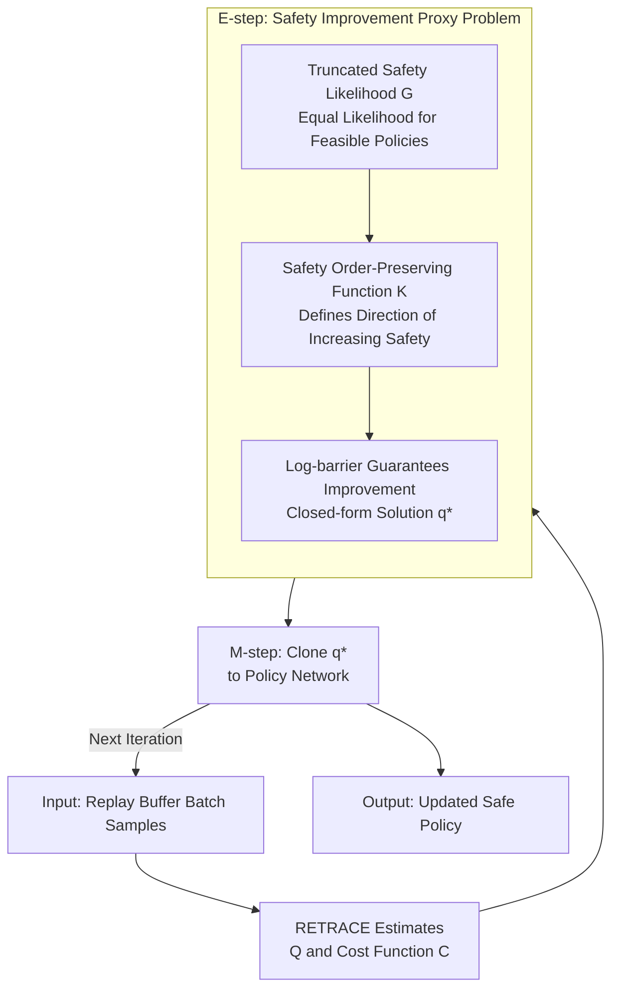

# SafeMPO: Constrained Reinforcement Learning via Probabilistic Incremental Improvement

**Conference**: ICLR 2026  
**OpenReview**: [https://openreview.net/forum?id=1m0EU6QXj6](https://openreview.net/forum?id=1m0EU6QXj6)  
**Area**: Reinforcement Learning / Safe Reinforcement Learning  
**Keywords**: Constrained Markov Decision Process, Safe Reinforcement Learning, MPO, Incremental Improvement, Log-barrier

## TL;DR
SafeMPO models "safety" as an inferrable probabilistic event, shifting constrained reinforcement learning from "hard-projecting the policy into the feasible region" to "guaranteeing each step is safer than the last." By leveraging the EM framework of MPO and the log-barrier construction from interior point methods, it formulates a non-parametric proxy problem with geometric convergence guarantees. With only one hyperparameter that does not affect asymptotic behavior, its performance is competitive with or superior to highly tuned constrained RL baselines.

## Background & Motivation

**Background**: The mainstream framework for explicitly incorporating safety into training objectives is the Constrained Markov Decision Process (CMDP), which aims to maximize the expected return $R(\pi)$ while requiring various expected costs to satisfy $C_i(\pi) \le B_i$. Common solvers (CPO, CUP, PCPO, CRPO, etc.) share a general strategy: once a policy is detected to be out of bounds, a "recovery step" using projection or cost descent is employed to pull the policy back into the feasible set.

**Limitations of Prior Work**: This "greedy recovery/projection" can fail when the feasible region is difficult to find or when the nearest feasible policy itself is poor. The paper uses a ball-throwing robot example: an initial policy might only throw the ball to a middle platform (R:0, C:0) or deep pits on either side (C:1), never reaching the high-reward platform on the left (R:1, C:0). Greedy projection could lock the policy into the "hit the middle pillar" behavior—safe but zero-reward—because it prematurely prunes exploration toward potential safe regions. This scenario is common under stochastic environments and policies—if the sampling probability of high-reward safe regions is low, they "disappear" from the sampling distribution and are never optimized.

**Key Challenge**: When using a KL ball $\mathrm{KL}(\pi_{k+1}\|\pi_k)<\varepsilon$ to constrain update magnitude, the intersection of the feasible policy set and the $\varepsilon$-ball may be empty. CVPO attempts to solve a non-parametric proxy problem directly but cannot guarantee the existence of a safe policy within the KL ball, necessitating a slow decay of the cost upper bound $B$ from a large $B_{\max}$. If it decays too fast, the problem becomes infeasible; if too slow, it requires massive iterations. This decay schedule is extremely difficult to tune and highly dependent on environment and constraint details.

**Key Insight**: Rather than requiring the policy to be "projected into the safe set" at every step (an absolute operation prone to approximation errors), it is more effective to require the relative goal that $\pi_{k+1}$ be **safer** than $\pi_k$. The authors formalize this as a constrained Bayesian optimization problem, pursuing a monotonic increase in the "likelihood of trajectory safety $p(S=1)$." The Bayesian perspective is inherently more robust to approximation errors and local optima.

**Core Idea**: Within the MPO "inference as policy optimization" framework, a "policy safety" event $S$ is introduced, transforming constraint satisfaction into inference on the joint distribution $p(O=1, S=1)$. Then, log-barriers from interior point methods are used to enforce strictly increasing safety at each step, thereby obtaining a geometric convergence guarantee toward the feasible set.

## Method

### Overall Architecture

SafeMPO is built upon Maximum a Posteriori Policy Optimization (MPO). MPO treats policy updates as an inference problem: assuming the "trajectory optimality" event $p(O=1|\tau)\propto\exp(\sum_t r_t/\alpha)$ follows a Boltzmann distribution, the optimization of the ELBO is split into EM steps. The E-step samples from a replay buffer and solves a non-parametric proxy problem to obtain an optimal distribution $q$; the M-step clones $q$ into the policy neural network (minimizing $\mathrm{KL}(q\|\pi)$). The advantage of this structure is that, from the perspective of neural network optimization, RL is reduced to supervised learning "matching a known target distribution," where the target distribution no longer depends on non-stationary reward signals.

SafeMPO incorporates "safety" into the E-step's non-parametric proxy problem. A single update proceeds as follows: first, RETRACE is used to estimate $Q(a,s)$ and the cost function $C(a,s)$. The E-step places the "truncated safety likelihood" and the "safety order-preserving improvement constraint" into a convex proxy problem with log-barriers, solving for the non-parametric optimum $q^\star$ in closed form. The M-step then clones $q^\star$ into the policy network. The entire "exploration $\to$ optimization" process alternates, with each step theoretically guaranteed to contract toward the feasible set.

### Key Designs

**1. Truncated Safety Likelihood: Making All Feasible Policies "Equally Safe"**

The fundamental difference between a constraint and an optimization objective is that an objective is always "the more the better," whereas a constraint, once satisfied, should be "indifferent to improvement." Accordingly, the authors model safety as a **truncated** exponential distribution: costs exceeding the budget ($C(a,s)\ge B$) are penalized exponentially, otherwise, the likelihood is constant at 1:

$$p(S=1|\tau) \propto \begin{cases}\exp\!\left(-\frac{C(a,s)-B}{\beta}\right) & C(a,s)\ge B\\ 1 & \text{otherwise}\end{cases}$$

The corresponding cost log-likelihood is $G(a,s)=\log p(S=1|\tau)=-\max\!\big(\frac{C(a,s)-B}{\beta},\,0\big)$. This truncation is critical: it assigns equal safety likelihood to all policies within the feasible set, matching the semantics of constraint satisfaction—being feasible is sufficient. This differs from treating cost as a regular reward to be infinitely minimized (which would sacrifice returns). The authors also emphasize (Remark 1) that the proof only relies on "safer policies having higher likelihood"; thus, any function monotonically decreasing in the $C_i(\pi)\le B_i$ interval could be used. The truncated exponential was chosen to mirror MPO's reward likelihood.

**2. Safety Order-Preserving Function: Defining "Becoming Safer" via Relative Improvement**

To express the condition that "$q$ is at least as safe as $\pi$," the authors introduce the **safety order-preserving function** $K(q,\pi)$: $K>0$ when $\mathbb{E}_q[G]>\mathbb{E}_\pi[G]$, $K=0$ when they are equal, and $K<0$ when worse. Intuitively, $K$ provides a "direction toward the feasible set" and allows costs at individual states to rise as long as the overall cost decreases, providing more freedom for exploration. The simplest choice is the Linear Safety Function (LSF) $K(q,\pi)=\int qG-\int \pi G$.

However, the authors present a **negative result** (Theorem 1 + Corollary 2): simply adding the naive constraint $\mathbb{E}_q[G]\ge\mathbb{E}_\pi[G]$ into the E-step is insufficient—the optimal $q$ either maintains the same safety as $\pi$ or ignores the constraint entirely, reverting to unconstrained MPO. Thus, it is **not** a contraction mapping for the safety likelihood $G$. In other words, "being no worse than the previous step" does not guarantee "strictly getting better" and can lead to getting stuck. This negative result is the pain point the next design addresses.

**3. Log-Barrier E-step for Guaranteed Improvement: Forcing Strict Entry into the Feasible Region**

The root cause of the failure of the naive improvement constraint is that it does not force $q$ into the **interior** of the feasible set. The authors borrow the log-barrier function from interior point methods, adding a term $\kappa\log(x/\kappa)$ to the objective and writing the improvement constraint as $K(q,\pi)\ge x$:

$$\max_q\ \mathbb{E}_{(a,s)\sim q}[Q(a,s)]+\kappa\log\frac{x}{\kappa}\quad \text{s.t. } \mathrm{KL}(q\|\pi)\le\varepsilon,\ K(q,\pi)\ge x,\ \textstyle\int q=1$$

Since $\log x=-\infty$ when $x\le 0$, any strictly positive improvement $x>0$ is infinitely preferred. Thus, **each iteration is constructively guaranteed to strictly increase the safety margin**, yielding geometric convergence rates for the LSF (Theorem 4). The brilliance lies in the fact that the final optimal point and the per-step improvement **do not depend** on the value of $\kappa$; $\kappa$ only adjusts the local trade-off between "maximizing reward vs. improving constraints" within a single step—$\kappa\to\infty$ reduces to hard projection, while $\kappa\to 0$ reduces to original MPO. Consequently, the authors fix $\kappa=10$ throughout and do not tune it, which is ideal for real-world scenarios where good hyperparameters are unknown. Solving this only requires convex optimization over 2 dual variables $\lambda,\nu$ (the number of variables grows with the number of constraints, not samples), and the optimal $q^\star$ has a closed-form solution:

$$q^\star(a,s)=\tfrac{1}{Z}\,\pi(a,s)\exp\!\Big(\tfrac{Q(a,s)+\lambda G(a,s)}{\nu}\Big)$$

Furthermore, the authors prove easily verifiable conditions for strong duality (Theorem 2/3): as long as $G$ is not constant almost everywhere, $\pi$ has full support, and $K$ is concave. A natural corollary is that if $G$ is constant in the current batch (e.g., all samples are already safe), the algorithm automatically reverts to a standard MPO step; otherwise, it executes a safety improvement step.

**4. M-step Cloning: Supervised Injection of Non-parametric Optimal $q^\star$**

The $q^\star$ obtained from the E-step is a non-parametric distribution over a batch of samples and must be "cloned" into the neural network policy. Following MPO, the policy $\pi(a,s)=\pi(a|s)\mu(s)$ and $q(a,s)=q(a|s)\mu(s)$ are decomposed ($\mu(s)$ is the stationary distribution estimated from the replay buffer). **Decoupled KL constraints** (separate trust regions $\varepsilon_\mu,\varepsilon_\Sigma$ for mean and covariance) are used as priors:

$$L(q,\alpha_1,\alpha_2)=\mathbb{E}_{\mu(s)}\big[\mathbb{E}_{q^\star}[\log\pi(a|s)]\big]+\alpha_1(\varepsilon_\mu-C_\mu)+\alpha_2(\varepsilon_\Sigma-C_\Sigma)$$

This step does not depend on any non-stationary targets; it merely copies information from the safety-optimal distribution found in the E-step into the network, ensuring training stability. The framework is also compatible with V-MPO style updates (higher single-step efficiency but restricted to on-policy data), though this paper uses traditional off-policy MPO estimators.

### Loss & Training

Both $Q(a,s)$ and cost $C(a,s)$ are estimated using RETRACE (high empirical performance and convergence under weak assumptions). The batch update workflow (Algorithm 1): Sample a batch → Update $Q,C$ via RETRACE → Solve the dual form over $\lambda\in[0,M_\lambda)$ and $\nu\in[0,\infty)$ → Calculate $q^\star(a|s)$ in closed form → Perform $N$ inner iterations of gradient descent on $\pi$ using the decoupled KL objective while $alpha_1, \alpha_2$ increase. In experiments, 20 batches are sampled per update with size 1024, $N=8$, $\kappa=10$ is fixed, cost budget $B=25$, and the dual variable is constrained to $\lambda\in[-10^6,10^6]$.

## Key Experimental Results

SafeMPO was compared against highly tuned SOTA baselines provided by Omnisafe across three tasks in `safety-gymnasium`. All methods were run for 10 million steps with a budget $B=25$. Task difficulty increases: SafetyPointGoal (point agent navigation, easiest) < SafetyCarGoal (differential drive car avoiding static obstacles) < SafetyCarButton (car avoiding static+dynamic obstacles to press target buttons, hardest).

### Main Results

| Task | Method | Return ↑ | Cost ↓ |
|------|------|--------|--------|
| SafetyCarGoal | CPO | 25.52 ± 2.65 | 43.32 ± 14.35 |
| SafetyCarGoal | RCPO | 18.71 ± 2.72 | **23.10** ± 12.57 |
| SafetyCarGoal | **SafeMPO** | 21.43 ± 5.10 | 32.23 ± **7.43** |
| SafetyCarButton | FOCOPS | 0.21 ± 2.27 | 31.78 ± 47.03 |
| SafetyCarButton | CPPOPID | −1.36 ± 0.68 | **14.62** ± 9.40 |
| SafetyCarButton | **SafeMPO** | **0.67** ± 0.61 | 30.87 ± **4.47** |
| SafetyPointGoal | CPO | **20.46** ± 1.38 | 28.84 ± 7.76 |
| SafetyPointGoal | **SafeMPO** | 13.09 ± 2.79 | 32.92 ± **3.43** |

Key Observations: SafeMPO reached or approached SOTA in CarGoal and CarButton. CarButton is the most difficult environment; SafeMPO achieved nearly **3x** the return of FOCOPS while maintaining slightly lower cost. CPPOPID, the only method fully satisfying the constraint, did so by "learning to leave the simulation area" to obtain negative rewards. PointGoal was the relatively weakest environment for SafeMPO, though it still performed near SOTA level. **The most prominent consistent advantage is variance**: SafeMPO almost always had the lowest cost variance across independent runs (e.g., CarButton cost std 4.47 vs. dozens or hundreds for baselines), which the authors attribute to the absence of "edge cases" caused by projection/recovery steps.

### Ablation Study (Lowering Budget B)

During discussion, the authors noted that costs for all variants stabilized at approximately 30, slightly above the budget of 25. They suspected the truncated likelihood only penalizes out-of-bounds states and "shifts" the cost of "nearly safe" states, causing the boundary to drift due to sampling variance. They re-ran SafetyCarGoal with the budget artificially lowered to $B=20$:

| Configuration | Task | Return | Cost |
|------|------|------|------|
| SafeMPO @B=25 | SafetyCarGoal | 21.43 ± 5.10 | 32.23 ± 7.43 |
| SafeMPO @B=20 | SafetyCarGoal | 20.24 ± 2.24 | **25.68** ± 2.97 |
| SafeMPO @B=20 | SafetyPointGoal | 18.36 ± 3.41 | **23.00** ± 1.56 |
| SafeMPO @B=20 | SafetyCarButton | 0.94 ± 0.12 | 33.37 ± 2.46 |

### Key Findings
- After lowering the budget to $B=20$, both CarGoal and PointGoal returned **feasible** policies (cost < 25) with SOTA-level rewards. This validates the hypothesis that the framework is capable of hitting better thresholds but was limited by the specific design of the likelihood $G$—a tighter boundary performing better suggests the limitation is in the likelihood $G$ rather than the framework itself.
- CarButton still failed to find a feasible policy even at $B=20$, but this was unsurprising—no method except the cheating CPPOPID was feasible in this environment.
- The most stable characteristic across tasks is the **low run-to-run variance**, which is SafeMPO's most reproducible advantage over all baselines.

## Highlights & Insights
- **Translating "Constraints" into "Truncated Probabilistic Events"**: Using truncated exponentials to make all feasible policies equally safe accurately captures the fundamental difference between constraint satisfaction and objective optimization—satisfaction is binary, not "more is better." This is the pivot point of the methodology and could be replaced by any monotonic function (like CVaR), ensuring high transferability.
- **Honest Narrative by Disproving the Naive Approach**: The authors first prove that a naive "no worse than the last step" constraint is not a contraction mapping (leading to stagnation), before fixing it with a log-barrier. This "failure → diagnostic → patch" progression is more convincing than simply presenting the final conclusion.
- **Log-barrier weight $\kappa$ does not affect asymptotic behavior**: $\kappa$ only tunes local trade-offs per step; the final optimum and convergence are independent of it. Thus, $\kappa=10$ can be fixed without tuning. A "single hyperparameter that doesn't change asymptotic behavior" is a rare engineering advantage in CRL, as good dual/budget values are usually unknown in real scenarios.
- **RL Reduction to Supervised Cloning**: By adopting MPO's EM structure, the non-stationary RL objectives are isolated in the E-step, while the M-step performs stable supervised learning to match a target distribution—this is the structural source of its low variance.

## Limitations & Future Work
- **High Steady-State Cost (~30 > Budget 25)**: The truncated likelihood only penalizes out-of-bounds states, which can "absorb" the cost of nearly safe states. Combined with sampling variance, this leads to boundary drift. The authors leave better safety likelihood functions (e.g., CVaR) for future work.
- **Infeasibility in Hardest Environments**: CarButton remains infeasible even with a lowered budget; the safety guarantees of the method in high-difficulty, dynamic obstacle scenarios still have gaps.
- **Small Experimental Scale**: Tested only on three tasks in `safety-gymnasium` with single constraints. Performance in multi-constraint, higher-dimensional, or real-world robot scenarios remains unknown (though theory suggests multi-constraint handling is efficient as dual variables grow linearly).
- **100% Safety is Theoretically Unattainable**: The authors admit that no CRL method can be 100% safe in unknown environments (unseen states cannot be judged). A good method should keep action probabilities non-zero under finite exploration and only let them vanish in the infinite data limit—which is exactly how Theorem 4 behaves.
- **Future Directions**: Implementing better safety likelihoods $G$; using V-MPO style updates for higher single-step efficiency; and rewriting standard MDPs as CMDPs with improvement constraints to guarantee monotonic policy improvement by construction.

## Related Work & Insights
- **vs. MPO (Abdolmaleki et al. 2018)**: MPO is the parent algorithm, handling only unconstrained RL inference. SafeMPO naturally extends MPO to CMDP by adding the safety event $S$ to the joint distribution and embedding truncated likelihoods and improvement constraints into the E-step.
- **vs. CPO / CUP / PCPO (Projection/Recovery types)**: These rely on hard-projecting or cost-descending the policy back into the feasible set, which can prematurely kill exploration of potentially safe regions due to sampling errors. SafeMPO avoids "over-committing" to any single cost estimate, seeking only relative improvement to preserve exploration.
- **vs. CVPO (Liu et al. 2022)**: CVPO also solves a non-parametric proxy problem but cannot guarantee the availability of a safe policy within the KL ball, requiring a difficult-to-tune decay of $B$. SafeMPO bypasses this via log-barrier incremental improvements, where the hyperparameter $\kappa$ does not affect the asymptotic solution.
- **vs. RCPO / CPPOPID (Lagrangian/PID types)**: These combine reward and cost into a single value function or use PIDs to tune $\lambda$. Their update speed is limited by exploration noise, and CPPOPID's PID values often imply environment priors. SafeMPO achieves more consistent low-variance performance without such priors.

## Rating
- Novelty: ⭐⭐⭐⭐⭐ Reframing constrained RL from "projection to the feasible set" to "probabilistic incremental improvement" with log-barrier convergence proofs is a fresh and self-consistent perspective.
- Experimental Thoroughness: ⭐⭐⭐ Theoretically sound, but validated only on three `safety-gymnasium` tasks with single constraints; small scale, and the hardest environment remains unsolved.
- Writing Quality: ⭐⭐⭐⭐⭐ The narrative of disproving the naive solution before providing the fix is clear, honest, and connects theory to motivation naturally.
- Value: ⭐⭐⭐⭐ The fact that the single hyperparameter does not affect asymptotic behavior, combined with low operational variance, makes it practically attractive for real-world safe RL deployments.

<!-- RELATED:START -->

## Related Papers

- [\[ICLR 2026\] Safe Exploration via Policy Priors](safe_exploration_via_policy_priors.md)
- [\[ICLR 2026\] Solving General-Utility Markov Decision Processes in the Single-Trial Regime with Online Planning](solving_general-utility_markov_decision_processes_in_the_single-trial_regime_wit.md)
- [\[ICLR 2026\] Accelerated Learning with Linear Temporal Logic using Differentiable Simulation](accelerated_learning_with_linear_temporal_logic_using_differentiable_simulation.md)
- [\[ICLR 2026\] RLP: Reinforcement as a Pretraining Objective](rlp_reinforcement_as_a_pretraining_objective.md)
- [\[ICLR 2026\] PoLi-RL: A Point-to-List Reinforcement Learning Framework for Conditional Semantic Textual Similarity](poli-rl_a_point-to-list_reinforcement_learning_framework_for_conditional_semanti.md)

<!-- RELATED:END -->
