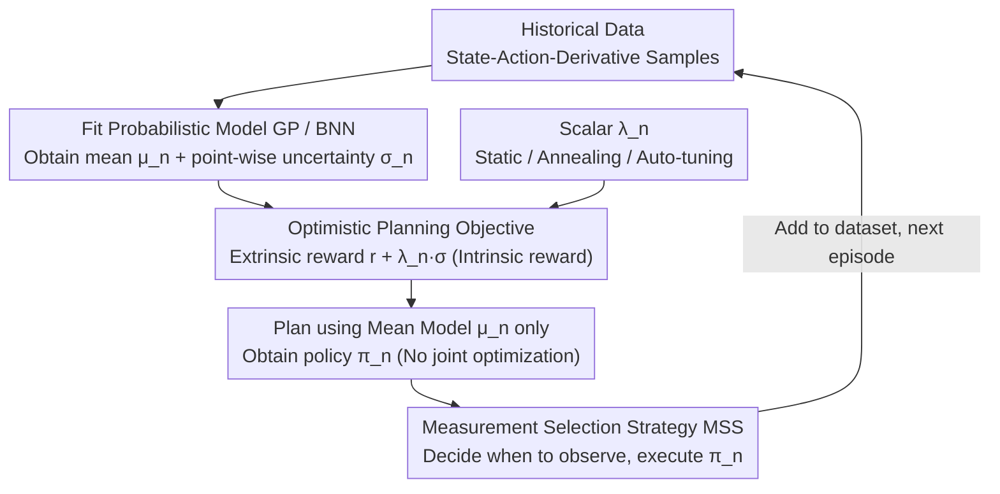

# Sample-efficient and Scalable Exploration in Continuous-Time RL

## Meta Info
- **Conference**: ICLR 2026
- **arXiv**: [2510.24482](https://arxiv.org/abs/2510.24482)
- **Code**: [https://go.klem.nz/combrl](https://go.klem.nz/combrl)
- **Area**: Reinforcement Learning
- **Keywords**: continuous-time RL, model-based RL, optimistic exploration, epistemic uncertainty, Gaussian processes, Bayesian neural networks

## TL;DR
The authors propose the COMBRL algorithm, which achieves scalable and sample-efficient exploration in continuous-time model-based RL with sublinear regret guarantees by maximizing the weighted sum of extrinsic rewards and model epistemic uncertainty.

## Background & Motivation
- Most RL algorithms assume discrete-time dynamics, but real-world control systems (robotics, biological processes) are naturally described by ODEs. Discretization may obscure critical temporal behaviors and limit control flexibility.
- Prior continuous-time MBRL methods (e.g., OCORL) implement optimistic exploration by jointly optimizing policies and plausible dynamics, which is computationally expensive. It requires coupled optimization over the set of plausible dynamics, increasing the input dimension from $d_u$ to $d_u + d_x$, making it unscalable to high-dimensional systems.
- Previous methods rely on extrinsic reward signals, failing to handle scenarios such as unsupervised RL or system identification.
- **Core Problem**: How to design an exploration mechanism within the continuous-time ODE framework that is scalable, sample-efficient, and theoretically guaranteed?

## Method

### Overall Architecture
COMBRL (Continuous-time Optimistic Model-Based RL) addresses exploration in continuous-time ODE systems to be both "scalable and sample-efficient." It divides the control process into episodes, with each repeating a closed-loop cycle: first, fitting the unknown dynamics $\bm{f}^*$ using a probabilistic model (GP or BNN) to obtain the mean prediction $\bm{\mu}_n(\bm{z})$ and point-wise epistemic uncertainty $\bm{\sigma}_n(\bm{z})$; then, planning the next policy by targeting the sum of "extrinsic reward + uncertainty" to collect new data for the model. The key lies in the fact that, while methods like OCORL require coupled optimization over an entire set of plausible dynamics for "optimism" (which is costly and causes dimension expansion), COMBRL collapses "optimism" into a scalar-weighted objective. This reduces planning to standard optimal control with a single reward function, allowing extension to high-dimensional systems using neural networks and covering both supervised and unsupervised exploration through a single hyperparameter.

### Key Designs

**1. Optimistic Planning Objective: Integrating Exploration Motivation into Reward**

In continuous time, it is not possible to encourage exploration by adding noise to state transitions step-by-step as in discrete MBRL. Instead, COMBRL selects the policy in each episode $n$ using a weighted integral objective:

$$\bm{\pi}_n = \arg\max_{\bm{\pi} \in \Pi} \int_0^T \frac{r(\bm{x}'(s), \bm{u}(s)) + \lambda_n \|\bm{\sigma}_{n-1}(\bm{x}'(s), \bm{u}(s))\|}{1 + \lambda_n}\, ds$$

The first part of the numerator is the extrinsic reward $r$, and the second part is the epistemic uncertainty $\|\bm{\sigma}_{n-1}\|$ at that state-action pair, acting as an intrinsic reward that pushes the policy toward regions where the model is uncertain. The scalar $\lambda_n$ adjusts the ratio between the two, while the denominator $1+\lambda_n$ normalizes the objective. Consequently, exploration no longer relies on a joint search over dynamic sets but becomes a standard optimal control problem for a **single, known** reward function, compatible with any off-the-shelf continuous-time planner.

**2. Single Scalar $\lambda_n$ Unifying Supervised and Unsupervised Exploration**

The same $\lambda_n$ continuously toggles the agent's behavior: $\lambda_n = 0$ degenerates to greedy exploitation of extrinsic rewards; $0 < \lambda_n < \infty$ balances exploitation and exploration; and $\lambda_n \to \infty$ discards extrinsic rewards entirely for pure unsupervised system identification. Since the exploration motivation is integrated into the same objective, this spectrum can be traversed without changing the algorithm. The paper provides three scheduling methods for $\lambda_n$: static (grid search), annealing ($\lambda_n \propto \lambda_0 (1 - n/N)$, emphasizing exploration early on), and auto-tuning based on mutual information gain. Experiments show that auto-tuning approaches the performance of best-tuned hyperparameters, saving significant manual effort.

**3. Mean Model instead of Joint Optimization: Scalability through No Dimension Expansion**

To achieve optimism, OCORL requires joint optimization over the set of plausible dynamics $\mathcal{M}_{n-1} \cap \mathcal{F}$ and the policy, using reparameterization tricks that increase the planning input dimension from $d_u$ to $d_u + d_x$, which is computationally prohibitive in high-dimensional systems. COMBRL argues this step is unnecessary: since uncertainty is already included as an intrinsic reward, any model from $\mathcal{M}_{n-1} \cap \mathcal{F}$ can be used for planning. In practice, the mean model $\bm{\mu}_n$ is used directly. This eliminates dimension expansion, making the method agnostic to model types (GP, BNN) and planners, with computational costs roughly $1/3$ of OCORL.

**4. Measurement Selection Strategy (MSS) and Dual Theoretical Guarantees**

While discrete RL assumes observations at every step, continuous-time systems must decide **when** to sample and control within $[0,T]$. COMBRL adopts the Measurement Selection Strategy (MSS) $S = (S_n)_{n \geq 1}$ from Treven et al. (2023) to formalize this. The paper provides two guarantees. For the supervised case (Theorem 1): under assumptions of Lipschitz continuity, sub-Gaussian noise, and well-calibrated models, the cumulative regret $R_N \leq \mathcal{O}\big(\sqrt{\mathcal{I}_N^3(\bm{f}^*, S) \cdot N}\big)$, where $\mathcal{I}_N$ is the model complexity (information gain). For an RBF kernel with equidistant MSS, $\mathcal{I}_N$ grows at a rate of $\text{polylog}(N)$, resulting in sublinear $R_N$ and convergence to the optimal policy. For the unsupervised case (Theorem 2, $\lambda_n \to \infty$): the maximum epistemic uncertainty decays at a rate of $\mathcal{O}(\sqrt{\mathcal{I}_N^3 / N})$. Both bounds explicitly depend on MSS $S$, indicating that the timing of observations is as critical to learning efficiency as the policy itself.

## Key Experimental Results

### Main Results: Learning performance under GP dynamics

| Environment | Method | Asymptotic Performance | Computation Time Ratio |
|------|------|----------|-----------|
| Pendulum | Mean (λ=0) | Suboptimal | 1× |
| Pendulum | PETS | Medium | ~1× |
| Pendulum | OCORL | Optimal Level | ~3× |
| Pendulum | **Ours** | **Optimal Level** | **~1×** |
| MountainCar | Mean (λ=0) | Suboptimal | 1× |
| MountainCar | **Ours** | **Optimal** | ~1× |

> Ours (COMBRL) matches or exceeds OCORL performance while requiring only ~1/3 of the computational cost.

### Ablation Study: Effect of Intrinsic Reward

| Environment | Mean (λ=0) | PETS | Ours (auto λ) | Gain |
|------|-----------|------|-----------------|---------|
| Reacher (easy) | ~Baseline | Medium | Optimal | Significant |
| Finger (spin) | ~Baseline | Medium | Optimal | Significant |
| Cartpole (balance) | ~Baseline | Close | Optimal | Medium |
| Hopper (stand) | ~Baseline | Medium | Optimal | Significant |

> Ours achieves the largest gains in sparse-reward or under-actuated tasks, with consistent improvements in high-dimensional domains. Auto-tuning of $\lambda_n$ is effective.

### Key Findings
1. Ours (COMBRL) consistently outperforms greedy baselines and PETS across all tested environments.
2. Performance is comparable to OCORL, but with only ~1/3 of the computational overhead.
3. Models learned unsupervised can transfer to unseen downstream tasks.
4. Auto-tuned $\lambda_n$ performs close to the best manually-tuned hyperparameters.

## Highlights & Insights
- **Unified Framework**: A single scalar $\lambda_n$ elegantly unifies supervised and unsupervised RL settings.
- **Scalability**: By avoiding optimization over the plausible dynamics set, neural network models like BNNs can be utilized.
- **Theoretical Completeness**: Provides both supervised regret bounds and unsupervised sample complexity bounds.
- **Explicit Dependence on MSS**: For the first time, the impact of the measurement strategy on continuous-time RL performance is clarified.

## Limitations & Future Work
- Theoretical analysis relies on RKHS smoothness and well-calibrated model assumptions, which BNNs might not fully satisfy in practice.
- Experiments are conducted in medium-dimensional tasks (up to DMC environments); performance in ultra-high dimensions (e.g., pixel inputs) needs verification.
- The optimal selection strategy for $\lambda_n$ requires further exploration, as current auto-tuning methods have limited theoretical guarantees.

## Related Work & Insights
- **Continuous-time MBRL**: OCORL (Treven et al., 2023) provides theoretical guarantees but is not scalable; Yildiz et al. (2021) uses a greedy approach without exploration.
- **Intrinsic Motivation/Unsupervised RL**: Sekar et al. (2020), Pathak et al. (2019), and Sukhija et al. (2023) all focus on discrete time.
- **Discrete-time Counterparts**: Sukhija et al. (2025b) study discrete-time versions, while COMBRL addresses the distinct theoretical and experimental requirements of continuous time.

## Rating
- Novelty: ⭐⭐⭐⭐ — Unifies reward+uncertainty optimistic exploration in continuous time for both supervised/unsupervised scenarios.
- Theoretical Depth: ⭐⭐⭐⭐ — Dual guarantees for sublinear regret and sample complexity.
- Experimental Thoroughness: ⭐⭐⭐⭐ — Comprehensive comparisons across environments, ablations, and auto-tuning validation.
- Value: ⭐⭐⭐⭐ — Computationally efficient and applicable to continuous-time physical control systems.

<!-- RELATED:START -->

## Related Papers

- [\[ICLR 2026\] Unsupervised Learning of Efficient Exploration: Pre-training Adaptive Policies via Self-Imposed Goals](unsupervised_learning_of_efficient_exploration_pre-training_adaptive_policies_vi.md)
- [\[ICLR 2026\] Virne: A Comprehensive Benchmark for RL-based Network Resource Allocation in NFV](virne_a_comprehensive_benchmark_for_rl-based_network_resource_allocation_in_nfv.md)
- [\[ICLR 2026\] SPIRAL: Self-Play on Zero-Sum Games Incentivizes Reasoning via Multi-Agent Multi-Turn Reinforcement Learning](spiral_self-play_on_zero-sum_games_incentivizes_reasoning_via_multi-agent_multi-.md)
- [\[ICLR 2026\] Solving Parameter-Robust Avoid Problems with Unknown Feasibility using Reinforcement Learning](solving_parameter-robust_avoid_problems_with_unknown_feasibility_using_reinforce.md)
- [\[ICLR 2026\] SPELL: Self-Play Reinforcement Learning for Evolving Long-Context Language Models](spell_self-play_reinforcement_learning_for_evolving_long-context_language_models.md)

<!-- RELATED:END -->
