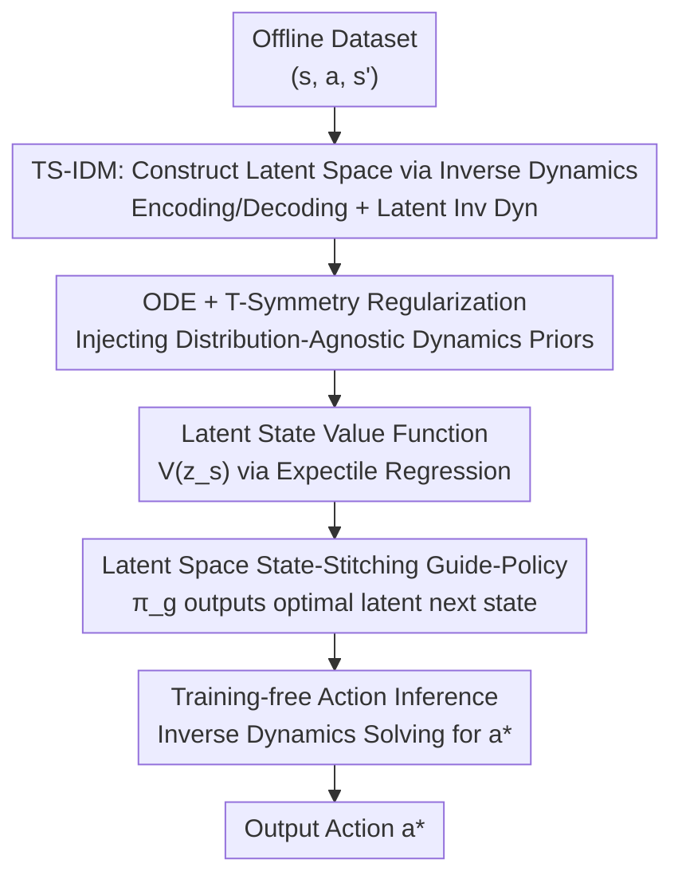

# Sample Efficient Offline RL via T-Symmetry Enforced Latent State-Stitching

**Conference**: ICLR 2026  
**OpenReview**: [https://openreview.net/forum?id=FVLiw2g0n3](https://openreview.net/forum?id=FVLiw2g0n3)  
**Area**: Reinforcement Learning / Offline RL  
**Keywords**: Offline RL, Sample Efficiency, Time-Reversal Symmetry, State Stitching, Representation Learning

## TL;DR
TELS performs the entire policy optimization of offline RL within a compact latent space constrained by "time-reversal symmetry" (T-symmetry) for state stitching. By learning out-of-distribution (OOD) friendly latent representations through a T-symmetry enforced inverse dynamics model (TS-IDM), it completely bypasses traditional action-level conservative constraints. It significantly outperforms methods like TSRL, POR, and IQL on small-sample D4RL tasks (0.5%–10% data) and real-world industrial control environments.

## Background & Motivation
**Background**: Offline RL learns policies directly from pre-collected datasets, making it suitable for real-world tasks without high-fidelity simulators or where online interaction is prohibited. However, it is naturally prone to overestimating values when evaluating OOD samples, which is amplified by bootstrap updates. Consequently, mainstream approaches adopt "pessimism": adding explicit or implicit policy constraints to prevent selecting OOD actions (TD3+BC, BCQ), penalizing values of unseen samples (CQL), or learning only from in-sample data (IQL).

**Limitations of Prior Work**: While these **action-level constraints** stabilize value and policy learning, they lead to severe over-conservatism, sacrificing OOD generalization. As a result, most offline RL methods only perform well when the data volume is sufficiently large (e.g., approximately 1 million samples for simple D4RL tasks with reasonable state-action coverage). This contrasts sharply with real-world scenarios (industrial control, robotics, healthcare) where data is scarce and collection costs are high.

**Key Challenge**: The fewer the samples, the larger the OOD regions in the state-action space, necessitating stronger OOD generalization. However, "achieving stability through action-level conservative constraints" essentially conflicts with "achieving small-sample performance through OOD generalization"—as greater conservatism hinders learning optimal trajectories outside sparse data regions.

**Key Insight**: The authors note that previous paths for improving generalization have drawbacks: ① Methods like DOGE leverage value function interpolation to allow OOD action usage but rely on dataset geometric smoothness and only apply to continuous actions; ② Methods like POR perform reward maximization in the **state space** (i.e., "state stitching") to avoid action-level constraints but still require reasonable data coverage; ③ Learning compact robust latent representations (e.g., contrastive learning) mostly stays at a statistical level and underutilizes underlying dynamics. TSRL proved that extracting **fundamental symmetries** of dynamics (T-symmetry, where physical laws are invariant under time-reversal) can maximize OOD generalization without being bound by data distribution. Unfortunately, TSRL still grafts T-symmetry representations onto backbones with action-level constraints like TD3+BC/CQL, failing to escape over-conservatism.

**Core Idea**: Perform "state stitching" within a coherent latent space enforced by T-symmetry. Use a T-symmetry inverse dynamics model to learn OOD-generalizable latent representations, learn a reward-maximizing guide-policy in the latent space to output the optimal latent next state, and then use inverse dynamics to solve for the action. This avoids action-level constraints entirely, getting rid of conservatism.

## Method

### Overall Architecture
TELS takes an offline dataset $\mathcal{D}=\{(s,a,s')\}$ and aims to learn a policy with strong OOD generalization from minimal samples. It splits the pipeline into two stages: first, it trains a **T-symmetry enforced inverse dynamics model (TS-IDM)** offline to map raw states to a latent space $z_s=\phi_s(s)$ constrained by both ODE and T-symmetry. Then, it moves the entire policy optimization process into this latent space: it learns a latent state value function $V(z_s)$, a T-symmetry regularized guide-policy $\pi_g$ that outputs the reward-maximizing latent next state, and finally uses the inverse dynamics module of TS-IDM to solve for the final action **without additional training**. The TS-IDM consists of several 2-layer MLPs and is very lightweight (training takes ~20 mins in PyTorch, ~5 mins in JAX).

The key is that the entire policy optimization **involves no action input**, naturally bypassing action-level conservative constraints. Meanwhile, T-symmetry—a physical prior independent of data distribution—ensures that even if the guide-policy outputs fall into OOD regions, the latent representation still provides generalizable information.

### Key Designs

**1. TS-IDM: Mapping States to Latent Space via Inverse Dynamics**

Addressing the issue that existing latent representations remain statistical without internalizing dynamics, TELS constructs an **inverse dynamics** style model. From an I/O perspective, TS-IDM acts like an inverse dynamics model taking $(s,s')$ and outputting predicted $a$. Internally, it includes a state encoder $\phi_s(s)=z_s$, a decoder $\psi_s(z_s)=\hat s$, a latent inverse dynamics module $h_\text{inv}(z_s,z_{s'})=z_a$, and an action decoder $\psi_a(z_a)=\hat a$. Reconstruction loss ensures both state and action recoverability:

$$\ell_\text{rec}(s,a,s')=\|\psi_s(\phi_s(s))-s\|_2^2+\|\psi_a(h_\text{inv}(z_s,z_{s'}))-a\|_2^2.$$

Using inverse dynamics to shape the latent space ensures the representation **implicitly encodes underlying environmental dynamics** rather than just capturing statistical correlations like contrastive learning.

**2. ODE + T-Symmetry Regularization: Injecting Distribution-Agnostic Priors (Core Innovation)**

This is the primary upgrade over TSRL. TELS embeds a pair of latent ODE forward/reverse dynamics predictors $h_\text{fwd}(z_s,z_a)=\dot z_s$ and $h_\text{rvs}(z_{s'},z_a)=-\dot z_s$ in the latent space. Using the chain rule $\dot z_s=\nabla_s\phi_s(s)\cdot\dot s$ (where $\dot s\approx s'-s$), it applies the ODE constraint $\ell_\text{dyn}$ to the encoder. **The key difference** is that TELS also requires the **decoder** $\psi_s$ to satisfy the same ODE form ($\ell_\text{ode}$); otherwise, the learned dynamics would be inconsistent with the underlying ODE structure. Finally, T-symmetry consistency couples forward and reverse dynamics:

$$\ell_\text{T-sym}(z_s,z_a)=\|h_\text{fwd}(z_s,z_a)+h_\text{rvs}(z_s+h_\text{fwd}(z_s,z_a),z_a)\|_2^2.$$

The TS-IDM training objective is $\mathcal{L}_\text{TS-IDM}=\sum_{\mathcal D}[\ell_\text{rec}+\beta(\ell_\text{dyn}+\ell_\text{ode}+\ell_\text{T-sym})]$. All dynamics terms **share a single** $\beta$ to maintain consistent scale. T-symmetry is effective because it captures "essential and invariant" properties of dynamical systems—this prior is **independent of data distribution**, keeping representations reasonable even in OOD regions.

**3. Latent Space State-Stitching Guide-Policy: Bypassing Action Constraints**

TELS moves the POR-style "guide-policy + execute-policy" decomposition into the latent space. It first learns the **latent state value function** $V(z_s)$ using IQL-style expectile regression: $\min_V \mathbb E_{\mathcal D}[L_2^\tau(r+\gamma\bar V(\phi_s(s'))-V(\phi_s(s)))]$. Then, a guide-policy $\pi_g$ is learned for state stitching, outputting a latent next state that is reachable and has high value. Notably, $\ell_\text{T-sym}$ from Point 2 is used as a **regularization term** in the guide-policy objective to prevent it from outputting dynamics-violating next states. For deterministic policies:

$$\max_{\pi_g}\mathbb E_{\mathcal D}\big[\lambda_\alpha V(\pi_g(z_s))-\eta\|\psi_s(\pi_g(z_s))-s'\|_2^2-\ell_\text{T-sym}(z_s,h_\text{inv}(z_s,\pi_g(z_s)))\big].$$

This combination ensures the policy learning **only occurs at the latent state level**, avoiding over-conservatism.

**4. Training-free Action Inference: Solving via Inverse Dynamics**

The guide-policy only identifies "where to go" in the latent space. TELS repurposes TS-IDM as the execute-policy: it passes the optimal latent next state $z_{s'}^*$ into the latent inverse dynamics module to replace $z_{s'}$, then decodes the action: $a^*=\psi_a(h_\text{inv}(z_s,z_{s'}^*))$. This stage **requires no extra training**, ensuring consistency and parameter efficiency.

### Loss & Training
Two-stage training: ① Train TS-IDM using $\mathcal{L}_\text{TS-IDM}=\sum_{\mathcal D}[\ell_\text{rec}+\beta(\ell_\text{dyn}+\ell_\text{ode}+\ell_\text{T-sym})]$ until convergence. ② Freeze encoder $\phi_s$, learn $V(z_s)$ in latent space, then optimize the guide-policy. Action inference is training-free.

## Key Experimental Results

### Main Results
Normalized scores on reduced D4RL (5k~100k samples, ~0.5%~10% of original), 5 seeds:

| Task (Samples) | POR | TSRL (Prev. SOTA) | TELS (Ours) |
|--------|------|------|------|
| Hopper-me 10k (0.5%) | 37.9 | 50.9 | **100.9** |
| Walker2d-me 10k (0.5%) | 20.1 | 46.4 | **87.4** |
| Walker2d-mr 10k (3.3%) | 14.8 | 26.0 | **54.8** |
| Antmaze-m-d 100k (10%) | 0.0 | 0.0 | **47.2** |
| Antmaze-m-p 100k (10%) | 0.0 | 0.0 | **62.9** |
| Antmaze-l-p 100k (10%) | 0.0 | 0.0 | **47.3** |
| Door-human 5k (100%) | 0.1 | 0.5 | **11.8** |

TELS leads across all tasks. POR vs. TELS is particularly telling: despite similar workflows, POR fails entirely (0.0) on the hardest Antmaze tasks without T-symmetry representations and regularization.

Real-world Industrial Control (Data center cooling testbed, 43k samples, 105-dim state-action space):

| Metric | CQL | IQL | TSRL | TELS (Ours) |
|------|-----|-----|------|------|
| ACLF Energy (Lower is better) | 10.3% | 40.89% | 27.16% | **20.17%** |
| Thermal Violation Rate | 40.99% | 0.00% | 0.00% | **0.00%** |

While CQL has lower ACLF, it incurs a 40.99% safety violation; TELS achieves the best energy efficiency among safe policies.

### Ablation Study
Stepwise addition of TS-IDM sub-modules (10k dataset, me tasks):

| Configuration | Hopper-me | Halfcheetah-me | Walker2d-me | Note |
|------|------|------|------|------|
| $\phi/\psi+h_\text{inv}$ | 17.2 | 29.7 | 24.5 | Basic AE inv-dyn; poor representation |
| ↑ + $h_\text{fwd},h_\text{rvs}$ | 35.5 | 31.3 | 33.6 | Latent ODE dynamics; moderate Gain |
| ↑ + $\ell_\text{ode}$ | 61.4 | 31.2 | 58.5 | Decoder ODE constraint; significant Gain |
| ↑ + $\ell_\text{T-sym}$ (Full) | **100.9** | **40.7** | **87.4** | T-symmetry consistency; largest contribution |

### Key Findings
- **T-symmetry consistency $\ell_\text{T-sym}$ is the strongest factor**: It provides the biggest performance leap (e.g., 61.4 $\rightarrow$ 100.9 in Hopper).
- **Representation versatility**: Replacing TELS's TS-IDM with AE/VAE/SimCLR significantly degrades performance, whereas plugging TS-IDM into IQL/TD3+BC improves them.
- **Robustness to extreme OOD**: In Antmaze, TELS successfully stitches trajectories even when 70%–100% of crucial path samples are removed, while IQL and POR fail.

## Highlights & Insights
- **Multi-purpose TS-IDM**: A single small model acts as the representation learner, ODE dynamics engine, and action inference module, requiring zero additional training for the execution policy.
- **Physical symmetry as a distribution-agnostic prior**: T-symmetry doesn't depend on data distribution, providing the necessary prior for small-sample/OOD scenarios.
- **Constraint Space determines Conservatism**: Moving state stitching into the T-symmetry latent space and removing action inputs is the key to bypassing over-conservatism.

## Limitations & Future Work
- The method assumes the system approximately satisfies T-symmetry (time-reversal invariance); it may be less effective for strongly irreversible or highly stochastic/dissipative systems.
- The guide-policy requires manual selection between deterministic and stochastic versions per task.
- The first-order difference $\dot s\approx s'-s$ may introduce bias in high-frequency or noisy environments.

## Related Work & Insights
- **vs. TSRL**: TELS upgrades the representation by adding decoder ODE constraints and moves the policy optimization into the latent space to avoid action-level conservative constraints.
- **vs. POR**: TELS uses a T-symmetry latent space instead of the raw state space, enabling successful stitching in sparse Antmaze tasks where POR fails.
- **vs. Diffusion (IDQL)**: Diffusion models are powerful but heavy and data-hungry; TELS's minimal MLP architecture is more efficient for small samples.

## Rating
- **Novelty**: ⭐⭐⭐⭐⭐ Integrates T-symmetry as a unified constraint across representation/policy/evaluation and performs action-free state stitching.
- **Experimental Thoroughness**: ⭐⭐⭐⭐⭐ Thorough coverage of small-sample D4RL, industrial control, and extreme OOD stress tests.
- **Writing Quality**: ⭐⭐⭐⭐ Logic is clear, though dense ODE/T-symmetry derivations require careful reading.
- **Value**: ⭐⭐⭐⭐⭐ Highly practical for real-world deployment due to small model size, fast training, and sample efficiency.

<!-- RELATED:START -->

## Related Papers

- [\[ICLR 2026\] Sample-efficient and Scalable Exploration in Continuous-Time RL](sample-efficient_and_scalable_exploration_in_continuous-time_rl.md)
- [\[ICLR 2026\] WIMLE: Uncertainty-Aware World Models with IMLE for Sample-Efficient Continuous Control](wimle_uncertainty-aware_world_models_with_imle_for_sample-efficient_continuous_c.md)
- [\[ICLR 2026\] Scalable Offline Model-Based RL with Action Chunks](scalable_offline_model-based_rl_with_action_chunks.md)
- [\[ICLR 2026\] OPRIDE: Efficient Offline Preference Reinforcement Learning via In-Dataset Exploration](opride_efficient_offline_preference-based_reinforcement_learning_via_in-dataset_.md)
- [\[ICLR 2026\] ReFORM: Reflected Flows for On-support Offline RL via Noise Manipulation](reform_reflected_flows_for_on-support_offline_rl_via_noise_manipulation.md)

<!-- RELATED:END -->
