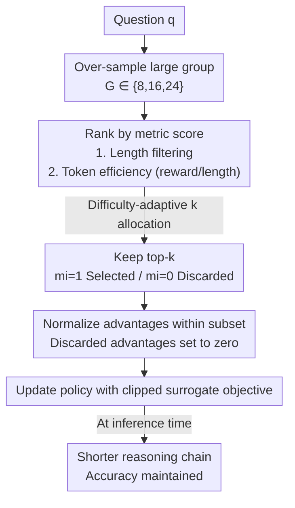

# Sample More to Think Less: Group Filtered Policy Optimization for Concise Reasoning

**Conference**: ICLR 2026  
**OpenReview**: [https://openreview.net/forum?id=UKOqoULbZS](https://openreview.net/forum?id=UKOqoULbZS)  
**Code**: None  
**Area**: Reinforcement Learning / LLM Reasoning  
**Keywords**: RLVR, GRPO, Concise Reasoning, Rejection Sampling, Reasoning Length

## TL;DR
To address the "length inflation" problem where reasoning chains become excessively long after RLVR (GRPO) training, this paper proposes GFPO. It samples a larger set of candidates during training and calculates policy gradients using only the top-k responses filtered by length or token efficiency. By trading "more sampling during training" for "less thinking during inference," GFPO reduces length inflation in Phi-4-reasoning by up to 85% without compromising accuracy.

## Background & Motivation

**Background**: RLVR (Reinforcement Learning from Verifiable Rewards), represented by GRPO and PPO, is currently the mainstream approach for enhancing LLM reasoning capabilities. It encourages models to "think longer," achieving SOTA results on challenging tasks like AIME and IMO. The intuition behind test-time scaling is that longer chains imply more thorough thinking and higher accuracy.

**Limitations of Prior Work**: However, "longer $\neq$ better." Existing research has found that long responses do not necessarily correlate with correctness; sometimes shorter responses are more accurate—DeepSeek-R1 is nearly 5× longer than Claude 3.7 Sonnet on AIME 25, yet accuracy has not increased. Worse, GRPO training itself creates length inflation: Phi-4-reasoning-plus responses surged from 4k to 14k tokens within 100 GRPO steps, with many extra tokens being "filler" that lacks substantial progress.

**Key Challenge**: By comparing "correct vs. incorrect" responses for the same AIME 25 problems, the authors found that in 72% of cases, **longer responses were actually more likely to be wrong**. This indicates that verbosity is not just a byproduct of hard problems but an independent failure mode. While token-level normalization methods like Dr. GRPO and DAPO penalize "long incorrect" outputs, they simultaneously **amplify rewards for "long correct" outputs**. For models already SFT-ed into a step-by-step reasoning style, this encourages continued verbosity without solving the root cause.

**Goal**: To train "efficient reasoning" models—preserving GRPO's accuracy while significantly shortening reasoning chains. This requires embedding "conciseness" into training without destroying "correctness."

**Key Insight**: Instead of laboriously encoding conciseness into a scalar reward (multi-objective reward engineering is difficult to tune, especially when balancing correctness), it is better to use **data filtering as implicit reward shaping**. Analogous to self-improvement methods like STaR that use selective sampling to amplify specific behaviors, the authors filter out "unwanted responses" before calculating advantages.

**Core Idea**: During training, the sampling group size is increased (G↑). Candidates are ranked by target metrics (length or token efficiency), and **policy gradients are calculated only for the top-k responses, with others set to zero advantage**. Over-sampling allows the model to see more "short yet correct" candidates; learning only from these pushes the model toward conciseness.

## Method

### Overall Architecture

GFPO (Group Filtered Policy Optimization) is a lightweight modification of GRPO. The core intervention occurs only at the **advantage estimation** layer, allowing it to be directly applied to any GRPO variant like DAPO or Dr. GRPO.

Recalling GRPO: For a question $q$, a group of responses $\{o_1,\dots,o_G\}$ is sampled. The group average reward serves as the baseline to normalize each response's reward into an advantage $\hat{A}_{i,t}$, and the policy is updated using a clipped surrogate objective. All responses participate in training **equally**.

GFPO introduces two changes: (1) **Sampling a larger group** $G\in\{8,16,24\}$ to expand the candidate pool, making rare but ideal "short and correct" responses more likely to appear; (2) Inserting a **filtering step** before advantage calculation—ranking each response by a user-specified metric and selecting the top-k to form a retained subset $S\subseteq G$, defining a binary mask $m_i=\mathbb{I}\{i\in S\}$. Only selected responses contribute to the gradient; discarded advantages are multiplied by $m_i=0$, yielding zero contribution. Advantage normalization is performed only within subset $S$ using the mean and standard deviation of $S$, ensuring the highest rewards are selected from those already satisfying the conciseness property.

The workflow is as follows:

The GFPO objective function incorporates this mask directly into the advantage term:

$$\hat{A}^{(m)}_{i,t} = \frac{R(q,o_i) - \frac{1}{k}\sum_{j\in S} R(q,o_j)}{\sqrt{\frac{1}{k}\sum_{j\in S}\left(R(q,o_j) - \frac{1}{k}\sum_{p\in S} R(q,o_p)\right)^2}} \, m_i$$

This is then substituted into the standard GRPO clipped loss (including KL penalty $\beta D_{KL}$ and entropy regularization $\gamma$). Note that the total sampled group $G$ increases but the retained number $k\le 8$ remains constant, ensuring the gradient scale is comparable to the GRPO baseline for a fair comparison.

### Key Designs

**1. Over-sampling + Rejection Sampling Filtering: Data Filtering as Implicit Reward Shaping**

This is the foundation of GFPO, directly addressing the "length inflation" pain point. The authors performed a key control experiment: if filtering occurs only within small groups (Shortest 6/8, keeping the shortest 6 out of 8) without expanding sampling, length barely decreases (1.8–11.5%, and Omni-MATH even increased by 5.5%). This indicates **filtering in small groups is ineffective because there are not enough "shorter" candidates to choose from**. Once the group is expanded (Shortest 8/16, keeping the shortest 8 out of 16), excess length immediately drops by 24–37% without significant accuracy loss.

Mechanistically, filtering is implemented via $S, m = \text{REJECTIONSAMPLE}(G, k, \text{metric}, \text{order})$: calculating metric scores, ranking, and taking the top-k. Setting advantages of discarded responses to zero ensures the policy gradient moves only towards "selected ideal responses." Why is this better than modifying rewards? Because optimizing "conciseness + correctness" via scalar rewards makes weighting difficult. Data filtering is a **flexible, stackable** implicit shaping method—isolating desired responses first, then calculating relative advantages within the subset using original rewards, decoupling the two attributes without complex reward engineering.

**2. Retained Ratio $k/G$ is the Real Knob for Length Control**

The authors found that the degree of shortening is determined not by the absolute values of $k$ or $G$, but by the **retained ratio** $k/G$. Lowering this ratio (either by decreasing $k$ or increasing $G$) consistently shortens the reasoning chain: 4/16 and 6/24, both with a 25% ratio, result in nearly identical length reductions, proving $k/G$ is the key variable. Sampling from even larger groups (6/24 vs 4/16) brings only marginal additional gains. The strongest reductions occur in the 25–33% ratio range. The value of this finding is providing practitioners with a clear, single tunable knob rather than blind tuning across $k$ and $G$. However, gains saturate; dropping from 8/24 to 4/24 shows minimal improvement, suggesting that aggressively lowering the ratio eventually plateaus.

**3. Token Efficiency Metric: Retaining Long Chains only when "Worth the Cost"**

Filtering purely by length (shortest-k) plateaus because it relies only on the KL penalty to implicitly suppress late-stage token probabilities. To break this ceiling, the authors use **token efficiency = reward/length** ($R_i/|o_i|$) for ranking. This prefers "high-value" responses—typically short correct chains, plus occasional "long but sufficiently high-reward" correct chains. In this subset, short correct chains receive the strongest positive gradients, long correct chains are moderately penalized, and long incorrect chains are heavily pruned. This provides more direct length control than shortest-k. At $k=8, G=16$, the token efficiency version achieved the largest reduction (84.6% on AIME 24), at the cost of only minor and non-significant accuracy drops. Its brilliance lies in "on-demand permit": allowing a long chain to exist if it yields proportionally higher rewards, unlike the one-size-fits-all approach of shortest-k.

**4. Difficulty-Adaptive GFPO: Shifting Exploration Budget to Hard Problems**

A fixed retention ratio treats all problems equally, but easy problems do not require as much exploration, while hard problems need more room for long-chain exploration. Difficulty-adaptive GFPO dynamically adjusts the retained $k$ per problem: using a lightweight t-digest to track historical reward quantiles, it assigns problems to four difficulty buckets—very hard / hard / medium / easy—based on the current group's average reward (lower means harder). It keeps 8, 8, 6, and 4 shortest responses out of 16 respectively (average $k=6.5$, corresponding to Shortest 6/16 baseline). A warmup period uses $k=8$ to avoid unstable estimates. This increases filtering intensity on easy problems and allows exploration on hard ones. To the authors' knowledge, this is the **first RLVR method to adaptively adjust group size based on problem difficulty**. It reduces length more than the fixed Shortest 6/16 across AIME 25/24, GPQA, and LiveCodeBench, while matching GRPO's accuracy (27%) on the hardest AIME 25 segment.

### Loss & Training

The full objective is the GFPO objective $J_{GFPO}(\theta)$: DAPO's token-level loss aggregation + masked advantage $\hat{A}^{(m)}_{i,t}$ + clipped surrogate term + KL penalty ($\beta=0.001$) + entropy regularization ($\gamma=0.001$). Rewards follow the GRPO baseline: length-aware binary accuracy reward $R_{acc}$ (using cosine scaling to penalize long correct responses) plus 5-gram repetition penalty $R_{rep}$, where $R=w_{acc}\text{LENGTHSCALE}(R_{acc})+w_{rep}R_{rep}\in[-1,1]$. GPT-4o is used as a fallback when accuracy extraction fails. The 14B model was trained on 32 H100 GPUs using verl, with a global batch of 64, 100 steps, 32k context, and Adam lr $1\times10^{-7}$. Besides pass@1 and raw length $L$, **Excess Length Reduction** ELR $= \frac{L_{GRPO}-L_{GFPO}}{L_{GRPO}-L_{SFT}}$ is defined to measure how much of the inflation introduced by GRPO relative to SFT is eliminated by GFPO.

## Key Experimental Results

### Main Results

Pass@1, average length, and average length inflation reduction (% Len Inf↓) for variants on Phi-4-reasoning (14B):

| Method | Avg. Acc | Avg. Length | Avg. Length Inflation Reduction |
|------|---------|---------|-----------------|
| SFT | 69.2 | 9.5k | N/A |
| GRPO (baseline) | 72.1 | 13k | 0.0 |
| Dr. GRPO | 70.1 | 11.5k | 47.2 |
| Shortest 8/16 | 73.4 | 12k | 29.7 |
| Shortest 4/24 | 72.3 | 11k | 58.2 |
| Shortest 8/24 | 71.7 | 11.1k | 54.1 |
| **Token Efficiency (8/16)** | 71.7 | **10.2k** | **79.5** |
| Adaptive Difficulty | 72.9 | 11.4k | 46.0 |

The Token Efficiency version achieved the strongest conciseness with 79.5% average length inflation reduction, while accuracy showed no significant difference from GRPO (Wilcoxon signed-rank test). On individual datasets, Token Efficiency reached 84.6% reduction on AIME 24, 70.9% on AIME 25, 79.7% on GPQA, 82.6% on Omni-MATH, and 79.7% on LiveCodeBench. On the OOD LiveCodeBench (code, unseen during training), GRPO increased length without gaining accuracy, whereas GFPO shortened chains while sometimes improving accuracy (e.g., 8/16, 4/24). GFPO comprehensively outperformed Dr. GRPO, with 1–3% higher accuracy and 10–70% more length inflation reduction.

### Ablation Study

| Configuration | Observation | Explanation |
|------|------|------|
| Shortest 6/8 (No expansion) | Length reduced only 1.8–11.5%, Omni-MATH +5.5% | Filtering in small groups is ineffective; expansion is required |
| Shortest 8/16 → 8/24 (Expansion) | Extra 20–30% reduction | Expanding G significantly amplifies gains |
| 4/16 vs 6/24 (25% ratio) | Almost identical reduction | Proves $k/G$ is the real knob |
| 8/24 → 4/24 (Reducing ratio further) | Marginal improvement only | Gains saturate; excessively low ratios plateau |
| Cross-model (R1-Distill Qwen/Llama 7B/8B/14B) | Consistent inflation reduction, stable accuracy | Qwen-14B reduced by 61.9%/44.9%/22.8% |

### Key Findings

- **Over-sampling is the prerequisite, retention ratio is the knob**: Pure filtering without expanding the group is nearly useless. After expansion, lower $k/G$ leads to shorter lengths, with the optimal range being 25–33%, though it plateaus if too low.
- **Token efficiency vs. difficulty adaptation are complementary**: Token efficiency reduces length most aggressively on easy problems (over 120% ELR, even shorter than SFT) but automatically relaxes on hard ones. Difficulty adaptation does the opposite—reducing 38% on easy tasks and 60% on very hard ones, specifically suppressing "long-tail overthinking."
- **At fixed difficulty, "longer is less accurate" is real**: Even after controlling for difficulty, accuracy decreases as length increases. Hard problems have a "sweet spot" at 12k–16k; GFPO is both shorter and more accurate in the longest quantile (Hard 67% vs GRPO 52%).
- **Training-for-inference trade-off pays off**: Token Efficiency increased training time by only 7% (approx. 3.2 hours) but achieved an end-to-end latency reduction of about 29% (315.1s → 225.0s). Hard problems respond ~90 seconds faster, eliminating three-quarters of the latency overhead introduced by GRPO relative to SFT.

## Highlights & Insights
- **The "train-test trade-off" of trading training-time sampling for inference-time efficiency is spot-on**: Investing 7% more compute at training once results in a permanent ~30% latency reduction for every inference. Since training is a one-time cost and inference is recurring, this is highly deployment-friendly.
- **Data filtering = Implicit reward shaping** is a transferable paradigm: rather than forcing "conciseness/diversity/factuality" into scalar rewards and tuning weights, it is better to filter responses by attribute first, then calculate relative advantages within the subset. Decoupling "what to select" from "how much to reward" can be applied to any GRPO variant.
- **The $k/G$ retention ratio as a single interpretable knob** is clever: it collapses the search space from two dimensions ($k, G$) to one. The experiment showing identical reductions for 4/16 and 6/24 provides clean causal evidence.
- **Difficulty-adaptive group size** is the first RLVR approach to dynamically tune $k$ by difficulty, spending the limited exploration budget where long chains are most needed. This logic can transfer to any RL framework involving group sampling and selective learning.

## Limitations & Future Work
- Experiments focused on math/STEM reasoning (72k math problems for training) + code OOD. Scaling to open-domain dialogue or long-form writing where "conciseness" is poorly defined remains unverified.
- Difficulty-adaptive GFPO occasionally filters out useful long responses in "hard" buckets, leading to slight accuracy drops that require larger groups (e.g., 8/24) to remedy, indicating ongoing tension between filtering and "retaining necessary long chains."
- Token efficiency $R_i/|o_i|$ depends on consistent rewards; if the reward model has high noise (e.g., verifier errors), ranking by "value for money" might amplify incorrect preferences.
- Expanding groups increases sampling overhead. Although the paper argues training costs are acceptable, sampling costs for larger models or longer contexts may increase, putting an upper limit on the scalability of $G$.

## Related Work & Insights
- **vs GRPO**: GRPO treats all responses in a group equally when calculating advantages. GFPO only calculates advantages for the top-k subset and sets others to zero. Both operate at the advantage layer and are fully compatible. GFPO specifically curbs length inflation by injecting a conciseness preference through "over-sampling + filtering."
- **vs Dr. GRPO / DAPO**: These use token-level normalization to suppress long incorrect outputs but simultaneously amplify rewards for long correct ones. For models already SFT-ed for long-chain reasoning, this inadvertently encourages verbosity. GFPO explicitly favors "concise high-quality" samples, achieving higher accuracy (+1–3%), more reduction (10–70% higher), and more stable training (avoiding Dr. GRPO's spikes in KL/gradient norm/entropy).
- **vs STaR-like self-improvement**: Both use selective sampling to amplify specific behaviors, but GFPO embeds this into RLVR advantage estimation and extends it to adaptive filtering based on token efficiency and problem difficulty.

## Rating
- Novelty: ⭐⭐⭐⭐ While "over-sampling + filtering" on GRPO seems simple, the use of data filtering as implicit reward shaping and the first difficulty-adaptive group size design is clear and effective.
- Experimental Thoroughness: ⭐⭐⭐⭐⭐ Comprehensive evidence across 5 benchmarks, 3 model families (7B–14B), including OOD, difficulty stratification, length-accuracy decoupling, and train-inference latency trade-offs.
- Writing Quality: ⭐⭐⭐⭐ Convincing motivation experiments (72% of long responses are wrong), with clear explanations for the $k/G$ knob and metric designs.
- Value: ⭐⭐⭐⭐⭐ Directly addresses the real-world pain point of deploying RLVR reasoning models. Trading 7% training cost for a 30% inference speedup is of high practical value.

<!-- RELATED:START -->

## Related Papers

- [\[ICLR 2026\] Group Verification-based Policy Optimization for Interactive Coding Agents](group_verification-based_policy_optimization_for_interactive_coding_agents.md)
- [\[ICLR 2026\] Revisiting Group Relative Policy Optimization: Insights into On-Policy and Off-Policy Training](revisiting_group_relative_policy_optimization_insights_into_on-policy_and_off-po.md)
- [\[ICLR 2026\] Single-stream Policy Optimization](single-stream_policy_optimization.md)
- [\[ICLR 2026\] Less is More: Clustered Cross-Covariance Control for Offline RL](less_is_more_clustered_cross-covariance_control_for_offline_rl.md)
- [\[ACL 2026\] LENS: Less Noise, More Voice — Reinforcement Learning for Reasoning via Instruction Purification](../../ACL2026/reinforcement_learning/less_noise_more_voice_reinforcement_learning_for_reasoning_via_instruction_purif.md)

<!-- RELATED:END -->
