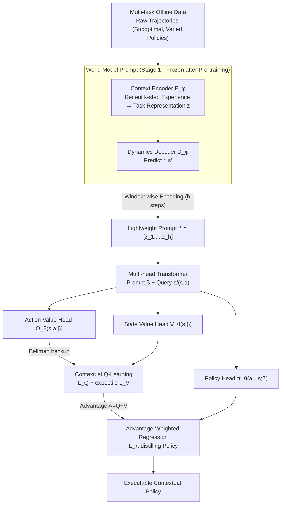

# Scalable In-Context Q-Learning

**Conference**: ICLR 2026  
**arXiv**: [2506.01299](https://arxiv.org/abs/2506.01299)  
**Code**: [GitHub](https://github.com/NJU-RL/SICQL)  
**Area**: Reinforcement Learning/In-Context Learning  
**Keywords**: In-Context RL, Q-learning, World Model, Dynamic Programming, Efficient Prompting

## TL;DR

S-ICQL is proposed, integrating dynamic programming (Q-learning) and world models into the supervised ICRL framework. It employs a multi-head Transformer to simultaneously predict policies and contextual value functions. A pre-trained world model constructs lightweight and accurate prompts, and advantage-weighted regression is used to extract the policy, consistently outperforming all baselines when learning from suboptimal data in both discrete and continuous environments.

## Background & Motivation

**Background**: In-context RL (ICRL) extends the in-context learning capabilities of language models to decision-making tasks by pre-training Transformers on multi-task offline data, allowing for adaptation to new tasks at test time through prompting without parameter updates. Existing approaches primarily follow two branches: Algorithm Distillation (AD, which uses learning history as context for autoregressive action prediction) and Decision-Pretrained Transformer (DPT, which predicts optimal actions based on interaction sequences).

**Limitations of Prior Work**:

- **Inherent limitations of supervised pre-training**: AD and DPT are essentially imitation learning and cannot exceed the quality of the collected data, lacking stitching capability (the ability to combine suboptimal trajectory segments into globally optimal behavior).
- **AD requires long-horizon context**: It needs the complete learning history as a prompt and inherits gradient update rules from suboptimal behaviors.
- **DPT requires oracle optimal action labels**: This is often infeasible in practical scenarios.
- **Original trajectories as prompts are inefficient**: Token counts are high and redundant, with behavior policies and task information entangled, leading to biased task inference.

**Key Challenge**: The essence of RL lies in reward maximization through dynamic programming updates of value functions. However, existing ICRL methods remain stuck in the supervised learning paradigm, sacrificing RL's core advantages. How can the potential to learn from suboptimal data be unlocked by introducing dynamic programming while maintaining the scalability and stability of supervised pre-training?

**Goal**: Leveraging two fundamental properties of RL—(1) the stitching capability of dynamic programming (Bellman backup) and (2) the precise representation of environment dynamics by world models—this work designs a scalable ICRL framework to achieve both efficient reward maximization and accurate task generalization.

## Method

### Overall Architecture

S-ICQL aims to address the fundamental imitation learning nature of supervised ICRL (AD, DPT). Recognizing that these methods are bounded by data quality and rely on lengthy raw trajectories as prompts, the paper integrates dynamic programming and world models. The framework operates in two stages: first, **pre-training a world model** to compress raw trajectories into lightweight prompts $\beta$ based on dynamics, stripping away task-irrelevant behavior policy information. Second, feeding $\beta$ into a **multi-head Transformer** that simultaneously outputs the policy $\pi_\theta(a|s;\beta)$, state value $V_\theta(s;\beta)$, and action value $Q_\theta(s,a;\beta)$. These are optimized end-to-end using **Bellman backup + expectile** for value functions and **advantage-weighted regression** to distill value into policy. The setting is multi-task offline RL where tasks $M^i = \langle \mathcal{S}, \mathcal{A}, \mathcal{T}^i, \mathcal{R}^i, \gamma \rangle \sim P(M)$ share state-action spaces but differ in rewards or dynamics, and offline data $\mathcal{D}^i$ is collected by arbitrary, potentially suboptimal behavior policies.

### Key Designs

**1. World Model Prompt: Decoupling task information from behavior policies**

Using raw trajectories as prompts is problematic because behavior policies and task information are entangled, and tokens are redundant. Environment dynamics $p(s', r | s, a)$ completely characterize a decision task and are naturally independent of the behavior policy, making dynamics-based encoding more accurate and compact. S-ICQL pre-trains a universal world model with a context encoder $E_\phi$ and a dynamics decoder $D_\varphi$: the encoder compresses recent $k$-step experience $\eta_t^i = (s_{t-k}, a_{t-k}, r_{t-k}, \ldots, s_t, a_t)^i$ into a task representation $z_t^i = E_\phi(\eta_t^i)$, while the decoder predicts rewards and next states $[\hat{r}_t, \hat{s}_{t+1}] = D_\varphi(s_t, a_t; z_t^i)$. The objective minimizes prediction error:

$$\mathcal{L}(\phi, \varphi) = \mathbb{E}_{\eta_t^i \sim M^i} \left[ \| [r_t, s_{t+1}] - D_\varphi(s_t, a_t; z_t^i) \|_2^2 \mid z_t^i = E_\phi(\eta_t^i) \right]$$

After pre-training, the world model is frozen, and an $h$-step trajectory is encoded window-wise into the prompt $\beta^i := [z_1^i, \ldots, z_h^i]$. This prompt is both shorter and focused purely on task information compared to AD.

**2. Contextual Q-Learning: Enabling stitching capability via Bellman backup**

Since imitation-based ICRL is limited by data quality, it cannot perform stitching—combining the best parts of suboptimal trajectories. S-ICQL performs contextual Q-learning conditioned on the prompt $\beta$. The action-value function minimizes the Bellman error:

$$\mathcal{L}_Q(\theta) = \mathbb{E}_{(s_t^i, a_t^i, s_{t+1}^i) \sim \mathcal{D}^i} \left[ \left( r(s_t^i, a_t^i) + \gamma V_\theta(s_{t+1}^i; \beta^i) - Q_\theta(s_t^i, a_t^i; \beta^i) \right)^2 \right]$$

To avoid out-of-distribution actions in the offline setting, the state-value function uses expectile regression to fit the upper-tail quantiles of $Q$: $\mathcal{L}_V(\theta) = \mathbb{E}_{(s_t^i, a_t^i) \sim \mathcal{D}^i} [ L_2^\omega ( Q_{\hat{\theta}}(s_t^i, a_t^i; \beta^i) - V_\theta(s_t^i; \beta^i) ) ]$, where $L_2^\omega(u) = |\omega - \mathbb{1}(u < 0)| \cdot u^2$ assigns a higher weight $\omega \in (0.5, 1)$ to samples where $Q > V$, pushing $V$ toward $\max_a Q(s, a)$.

**3. Advantage-Weighted Regression: Distilling value functions into executable policies**

To output actions, S-ICQL uses advantage-weighted regression to distill value information into the policy head:

$$\mathcal{L}_\pi(\theta) = -\mathbb{E}_{(s_t^i, a_t^i) \sim \mathcal{D}^i} \left[ \exp\!\left( \frac{1}{\lambda} \left( Q_{\hat{\theta}}(s_t^i, a_t^i; \beta^i) - V_\theta(s_t^i; \beta^i) \right) \right) \cdot \log \pi_\theta(a_t^i | s_t^i; \beta^i) \right]$$

Actions with higher advantage $A = Q - V$ are weighted more heavily, allowing the policy to maximize $Q$ within the data distribution. All three losses are combined into a total objective $\mathcal{L}(\theta) = \mathsf{c}_1 \mathcal{L}_\pi(\theta) + \mathsf{c}_2 \mathcal{L}_Q(\theta) + \mathsf{c}_3 \mathcal{L}_V(\theta)$ with $(\mathsf{c}_1:\mathsf{c}_2:\mathsf{c}_3) = (1:1:1)$, optimized end-to-end.

## Key Experimental Results

### Main Results: Few-shot Evaluation on Mixed Datasets

| Method | DarkRoom | Push | Reach | Cheetah-Vel | Walker-Param | Ant-Dir |
|:-----|:---------|:-----|:------|:------------|:-------------|:--------|
| DPT | 22.12 | 362.74 | 736.72 | -78.35 | 257.11 | 591.31 |
| AD | 42.72 | 604.50 | 738.96 | -67.37 | 424.82 | 215.01 |
| IDT | 40.70 | 621.58 | 790.68 | -59.46 | 343.01 | 631.83 |
| DICP | 59.76 | 487.28 | 706.46 | -66.53 | 403.90 | 745.05 |
| DIT | 30.90 | 633.58 | 758.92 | -74.50 | 253.94 | 723.49 |
| IC-IQL | 60.12 | 646.08 | 773.33 | -56.53 | 391.38 | 713.26 |
| **Ours** | **66.05** | **653.04** | **806.97** | **-35.48** | **466.72** | **813.34** |

Ours achieves the best performance across all 6 environments. In complex environments like Cheetah-Vel and Ant-Dir, the gains are significant, reducing Cheetah-Vel error by 37% and improving Ant-Dir from 745.05 to 813.34.

### Ablation Study: Contribution Analysis

| Configuration | Reach | Cheetah-Vel | Ant-Dir |
|:---------|:------|:------------|:--------|
| w/o\_cq (DPT baseline) | 736.72 | -78.35 | 591.31 |
| w/o\_c (No World Model) | 792.09 | -56.19 | 693.87 |
| w/o\_q (No Q-Learning) | 752.41 | -63.66 | 784.07 |
| **Ours (Full)** | **806.97** | **-35.48** | **813.34** |

Both the world model and Q-learning contribute significantly. Removing either leads to performance degradation. In Ant-Dir, Q-learning shows a larger contribution (+29 Gain), highlighting the importance of stitching in complex tasks.

### Key Findings: OOD Generalization

| Method | Cheetah-Vel (OOD) | Ant-Dir (OOD) |
|:-----|:-----------------|:-------------|
| DPT | -137.26 | 205.29 |
| IC-IQL | -101.89 | 540.20 |
| **Ours** | **-83.45** | **664.95** |

On Out-Of-Distribution (OOD) tasks, Ours maintains a significant lead, outperforming the runner-up IC-IQL by approximately 23% on Ant-Dir, validating the generalization benefits of the world model.

## Highlights & Insights

**Rating**: ⭐⭐⭐⭐⭐

**Highlights**:

- Innovatively integrates dynamic programming (Q-learning stitching) and world models into ICRL, overcoming the fundamental limitation of supervised pre-training where performance is capped by data quality.
- Elegant multi-head Transformer architecture—adding two lightweight heads allows simultaneous policy and value prediction with negligible parameter overhead.
- The world model-driven prompting is both efficient and theoretically grounded, as environment dynamics are independent of behavior policies.
- Comprehensive experiments across 6 standard benchmarks, 2 complex environments, OOD generalization, and stitching verification against 7 competitive baselines.

**Limitations & Future Work**:

- Prompt length is tied to sampling trajectory length, which may become excessive in long-horizon interaction problems.
- The world model requires an additional pre-training phase, increasing the complexity of the training pipeline.
- Evaluation is limited to standard RL benchmarks and has not yet addressed complex real-world decision scenarios like sim-to-real robot manipulation.

<!-- RELATED:START -->

## Related Papers

- [\[ICLR 2026\] Vintix II: Decision Pre-Trained Transformer is a Scalable In-Context Reinforcement Learner](vintix_ii_decision_pre-trained_transformer_is_a_scalable_in-context_reinforcemen.md)
- [\[ICLR 2026\] Context and Diversity Matter: The Emergence of In-Context Learning in World Models](context_and_diversity_matter_the_emergence_of_in-context_learning_in_world_model.md)
- [\[ICLR 2026\] LongRLVR: Long-Context Reinforcement Learning Requires Verifiable Context Rewards](longrlvr_long-context_reinforcement_learning_requires_verifiable_context_rewards.md)
- [\[ICLR 2026\] In-Context Compositional Q-Learning for Offline Reinforcement Learning](in-context_compositional_q-learning_for_offline_reinforcement_learning.md)
- [\[ICML 2026\] Safe In-Context Reinforcement Learning](../../ICML2026/reinforcement_learning/safe_in-context_reinforcement_learning.md)

<!-- RELATED:END -->
