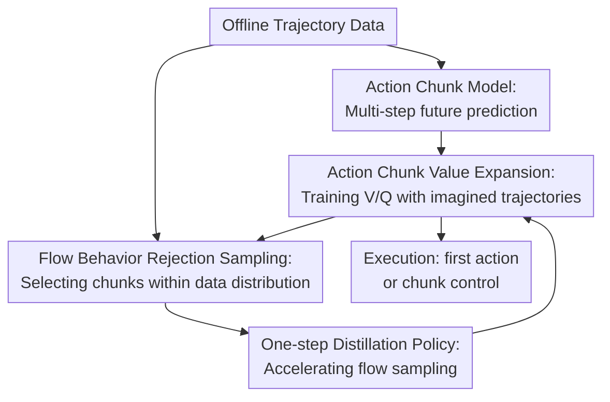

# Scalable Offline Model-Based RL with Action Chunks

**Conference**: ICLR 2026  
**OpenReview**: [https://openreview.net/forum?id=WXGb9unEHo](https://openreview.net/forum?id=WXGb9unEHo)  
**Paper**: [Project Page](https://kwanyoungpark.github.io/MAC/)  
**Code**: https://github.com/kwanyoungpark/MAC  
**Area**: Reinforcement Learning / Offline Model-Based Reinforcement Learning  
**Keywords**: Offline RL, Model-Based RL, Action Chunks, Value Expansion, Flow Matching  

## TL;DR
MAC utilizes action chunk models to compress multiple single-step model calls in long-horizon offline MBRL into fewer multi-step predictions. By employing rejection sampling from a flow-based behavioral policy to select conservative and high-value action chunks, it significantly outperforms existing offline MBRL methods on 100M-scale OGBench long-horizon manipulation tasks.

## Background & Motivation

**Background**: Offline reinforcement learning aims to train executable policies solely from existing data without environment interaction. Historically, two main paradigms exist: model-free offline RL, which performs value learning or behavioral regularization directly on the dataset; and model-based offline RL, which first learns dynamics models and then uses imagined trajectories for planning, data augmentation, or value estimation. This work focuses on model-based value expansion, as it combines generative modeling with on-policy value learning, theoretically aligning with training paradigms that have demonstrated scalability in long-horizon tasks.

**Limitations of Prior Work**: Standard offline model-free methods are often hindered by off-policy TD learning in long-horizon tasks: each Bellman update only considers short local intervals, leading to bias accumulation along long decision chains. While model-based RL could theoretically mitigate this via multi-step rollouts, learned single-step dynamics models must be called recursively, causing small single-step errors to explode into entirely incorrect future states after dozens or hundreds of steps.

**Key Challenge**: In model-based value expansion, the rollout length $n$ plays two conflicting roles. With large $n$, the target $\sum_{i=0}^{n-1}\gamma^i r_{t+i}+\gamma^n \bar V(s_{t+n})$ relies less on bootstrapping, resulting in lower value target bias. However, using a single-step model $p(s_{t+1}\mid s_t,a_t)$ requires $n$ recursive predictions, making model error more likely to explode. In essence, value learning demands long rollouts, while dynamics prediction demands short ones.

**Goal**: The authors aim to answer a specific question: Can offline model-based RL become a scalable solution for complex, long-horizon tasks with million- to billion-scale datasets? To achieve this, a method must satisfy three requirements: allow long rollouts for value learning to reduce short-sighted bootstrapping; minimize compounding errors from recursive model calls; and avoid exploitation of model errors by keeping the policy within the data distribution.

**Key Insight**: Observations suggest that many long-horizon control tasks do not necessitate step-by-step future modeling. By treating $n$ consecutive actions as an action chunk $a_{t:t+n-1}$, a model can directly predict the state $s_{t+n}$ after $n$ steps. Thus, a 100-step environment rollout requires only 10 model calls. Since action chunk distributions are high-dimensional and multi-modal, making them difficult for single Gaussian policies to fit, the authors introduce flow matching to train a behavioral action chunk policy, followed by rejection sampling to select action chunks within the behavioral distribution.

**Core Idea**: Replacing "single-step models + direct policy optimization" with "action chunk models + flow behavior policy rejection sampling" suppresses both compounding error and out-of-distribution (OOD) action exploitation in long-horizon offline MBRL.

## Method

### Overall Architecture

MAC (Model-Based RL with Action Chunks) reorganizes an offline RL dataset into action chunk samples: each training sample contains the current state $s_t$, an action chunk $a_{t:t+n-1}$ of length $n$, the discounted cumulative reward $r_t=\sum_{i=0}^{n-1}\gamma^i r_{t+i}$, and the state $s_{t+n}$ after $n$ steps. On these samples, the algorithm simultaneously trains an action chunk dynamics model, an action chunk reward model, a flow-based behavioral action chunk policy, and a value function. It then uses the models to generate on-policy imagined trajectories to update the value function.

The execution policy is not a directly learned unconstrained actor. Instead, it samples multiple candidate action chunks from the behavioral flow policy and selects the one with the highest value according to the action chunk $Q$-function. This selection process keeps the policy close to the offline data distribution while maximizing returns within that distribution.

### Key Designs

**1. Action Chunk Model: Reducing compounding error via multi-step future prediction**

Standard model-based RL typically learns $p(s_{t+1}\mid s_t,a_t)$. To obtain the state after 100 steps, the model output must be recursively fed back 100 times. MAC instead learns action chunk dynamics $p_\psi(s_{t+n}\mid s_t,a_{t:t+n-1})$. The input is a whole sequence of actions, and the output is the future state after $n$ steps. With a default $n=10$, a 100-step environment rollout requires only $H=10$ model calls. This design decouples "long-horizon value targets" from "minimal recursive depth." Experiments show that for $n$ from 1 to 25, the action chunk model significantly suppresses MSE divergence compared to single-step models.

**2. Flow Behavior Rejection Sampling: Maximizing value within data-supported action chunks**

While action chunks stabilize dynamics, they complicate policy modeling. Chunks of length $n$ reside in $A^n$, where sequences are often highly multi-modal (e.g., at the same state, one could move an object left or right). Gaussian actors often average these modes, producing OOD chunks. MAC trains a behavioral cloning policy $\pi_\theta(a_{t:t+n-1}\mid s_t)$ using flow matching. During policy extraction, instead of gradient ascent, it samples $M$ candidates and selects the one with the highest $Q$-value: $\pi(s_t)\overset d=\arg\max_{a^{(i)}\sim\pi_\beta(\cdot\mid s_t)}Q(s_t,a^{(i)})$. This restricts optimization to the behavioral distribution, eliminating the need for manually tuned uncertainty penalties like those in MOPO or MOBILE.

**3. One-step Distillation Policy: Enabling flow rejection sampling for training rollouts**

Pure flow sampling is computationally expensive. If each chunk requires $N$ candidates and each candidate uses $F$ flow steps, a single rejection sampling needs $NF$ network queries. For $N=8, F=10$, this is 80 queries per chunk. To mitigate this during training, a one-step MLP policy $\pi_\omega(s_t,z)$ is trained to distill the flow policy output: $L_{distill}=\mathbb E\|\pi_\omega(s_t,z)-[\pi_\theta(s_t,z)]_\times\|_2^2$. This reduces training and inference costs to $N$ queries while preserving the expressive power of multi-step flow.

**4. Action Chunk Value Expansion: Training V/Q with on-policy imagined trajectories**

MAC does not use the action chunk model solely for MPC or sequence modeling. It maintains an actor-critic structure: starting from data states, it generates action chunk imagined trajectories of length $H$ using the current rejection sampling policy, dynamics model, and reward model. These are used to train on-policy values. The value target covers $nH$ environment steps, regressing $V_\phi(\hat s_{t+kn})$ to cumulative rewards plus terminal bootstrapping. The $Q_\phi(s_t,a_t)$ is then trained to predict rewards plus $\gamma^n V_\phi(\hat s_{t+n})$, specifically serving as the ranker for rejection sampling.

### Mechanism Example

In a `cube-octuple` manipulation task requiring multiple object movements, a single-step model would recurse from $s_t$ to $s_{t+100}$, amplifying contact errors at each step. MAC segments data into chunks of $n=10$. At $s_t$, the flow policy generates 32 candidate 10-step sequences; the $Q$-function selects the one with the highest predicted long-term value. The dynamics model predicts $s_{t+10}$ and the cumulative reward directly. Repeating this $H=10$ times yields a trajectory of 100 environment steps with a recursion depth of only 10. Value functions see returns at a 100-step scale, while policy candidates remain grounded in behavioral data.

### Loss & Training

Dynamics and reward models are trained via supervised learning: $L_{dyn}=\mathbb E\|p_\psi(s_t,a_t)-s_{t+n}\|_2^2$ and $L_{rew}=\mathbb E\|r_\psi(s_t,a_t)-r_t\|_2^2$. In goal-conditioned tasks, a success prediction network parameterizes reward and terminal signals. 

Value functions are trained on imagined trajectories regenerated each epoch. Default hyperparameters remain largely fixed across tasks: chunk size $n=10$, rollout length $H=10$, discount $\gamma=0.999$, 10 flow steps, and $N_{test}=32$ for rejection sampling.

## Key Experimental Results

### Main Results

Evaluations on OGBench long-horizon goal-conditioned tasks (100M transitions). The hardest tasks require up to 3000 environment steps.

| Environment | Strongest Model-Free Ref. | Strongest Prev. Model-Based | Ours (MAC) | Conclusion |
|------|----------------------|--------------------|-----|----------|
| humanoidmaze-medium-navigate | n-SAC+BC 98 ±2 | MOPO 27 ±5 | 36 ±2 | Best among MB methods, but behind MF |
| humanoidmaze-giant-navigate | n-SAC+BC 82 ±5 | All Prev. MB 0 ±0 | 0 ±0 | Contact-rich locomotion remains a challenge |
| cube-double-play | SHARSA 95 ±3 | FMPC 37 ±13 | 100 ±1 | Significantly outperforms MF and prev. MB |
| cube-octuple-play | SHARSA 19 ±3 | All Prev. MB 0 ±0 | 30 ±6 | Chunking advantage is clearest in long manipulation |
| puzzle-3x3-play | SHARSA 100 ±0 | MOPO 19 ±2 | 100 ±0 | Reaches perfect score, matching top MF |
| puzzle-4x5-play | SHARSA 91 ±4 | LEQ 1 ±3 | 99 ±3 | Outperforms all existing methods on hardest puzzle |

In reward-based tasks, MAC demonstrates strong general applicability, achieving the highest success rates in 4 out of 5 environments.

### Ablation Study

| Configuration | Task/Metric | Result |说明 |
|-------------|------------|------|------|
| Chunk length $n=1$ | cube-octuple | ~0 success | Long-horizon tasks are unsolvable without chunking |
| Chunk length $n=10$ | cube-octuple | Significant Gain | Optimal balance between error reduction and learnability |
| Chunk length $n=25$ | cube-octuple | Performance drop | Excessive chunk size hinders policy and Q estimation |
| MAC (Gaussian) | Multiple tasks | Near 0 success | Gaussian policy cannot capture multi-modal chunks |
| MAC (FQL) | Multiple tasks | Decent but lower | Gradient-based extraction is inferior to rejection sampling |
| MAC (Full) | Multiple tasks | Best performance | Both flow expressivity and rejection sampling are key |

### Key Findings

- **Action chunks effectively reduce error accumulation**. MSE for length-100 rollouts is significantly lower than single-step models.
- **Chunk size follows a "Goldilocks" principle**. $n=10$ is stable; $n=25$ suffers from the curse of dimensionality in the action space.
- **Flow rejection sampling is fundamental**. Gaussian policies fail on multi-modal manipulation tasks, proving that expressivity and distribution constraints are both required.
- **Contact-rich locomotion is still difficult**. MAC fails on `humanoidmaze-giant`, likely due to the inherent difficulty of modeling discontinuous contact dynamics.
- **Scalability comes with manageable costs**. MAC is 1.2x to 2.2x slower than methods like MOPO but remains milliseconds in inference due to distillation.

## Highlights & Insights

- **Decoupling "Environment Horizon" from "Model Recursion Depth"**. MAC allows value learning to benefit from long-horizon returns while keeping dynamic predictions stable through fewer recursive steps.
- **Implicit Conservatism**. Unlike methods that rely on sensitive uncertainty penalty coefficients, MAC achieves safety by sampling from the behavioral flow distribution.
- **Purposeful Flow Matching**. Flow matching is utilized here to handle the high dimensionality and multi-modality inherent in action sequences (chunks), rather than just for increased complexity.
- **Natural Integration of AC and Rejection Sampling**. Using the $Q$-function as a ranker for behavioral candidates effectively turns the value function into a "distribution-constrained selector."

## Limitations & Future Work

- **Discontinuous Dynamics**. Failure in complex locomotion environments suggests that while chunking reduces recursion, it doesn't solve the problem of predicting fundamentally difficult dynamics.
- **Dimensionality vs. Horizon**. As $n$ grows, the action space explosion eventually hinders $Q$-estimation. Adaptive chunk sizing for different control frequencies remains an open question.
- **Behavioral Dependency**. The method relies on the behavior policy's ability to propose viable segments; performance may be capped by the quality of the offline dataset.
- **Stochasticity**. The current deterministic action chunk model might fail in highly stochastic or partially observable environments.

## Related Work & Insights

- **vs. MOPO / MOBILE**: These rely on single-step models and strict uncertainty penalties. MAC replaces these with action chunks and behavioral flow constraints.
- **vs. LEQ**: While LEQ also focuses on conservative value estimation, MAC's on-policy value expansion with chunked rollouts proves more effective in manipulation tasks where LEQ often struggles.
- **vs. F-MPC**: F-MPC focuses on planning; MAC integrates chunks into a full actor-critic loop for iterative improvement.
- **vs. Sequence Modeling (Diffuser)**: MAC does not generate entire trajectories but bridges RL and generative modeling by using chunked transitions within a value-based framework.

## Rating

- Novelty: ⭐⭐⭐⭐☆ Combines action chunks and flow rejection sampling into a distinct and scalable MBRL recipe.
- Experimental Thoroughness: ⭐⭐⭐⭐⭐ Comprehensive evaluation across long-horizon OGBench tasks, D4RL, and extensive ablations.
- Writing Quality: ⭐⭐⭐⭐⭐ Clearly identifies the tension in rollout length and addresses it logically.
- Value: ⭐⭐⭐⭐☆ Highly relevant for long-horizon robot manipulation, though requires further investigation for high-frequency locomotion.

<!-- RELATED:START -->

## Related Papers

- [\[ICLR 2026\] BA-MCTS: Bayes Adaptive Monte Carlo Tree Search for Offline Model-based RL](bayes_adaptive_monte_carlo_tree_search_for_offline_model-based_reinforcement_lea.md)
- [\[ICLR 2026\] DEAS: DEtached value learning with Action Sequence for Scalable Offline RL](deas_detached_value_learning_with_action_sequence_for_scalable_offline_rl.md)
- [\[ICLR 2026\] Learning to Reason as Action Abstractions with Scalable Mid-Training RL](learning_to_reason_as_action_abstractions_with_scalable_mid-training_rl.md)
- [\[ICLR 2026\] ROMI: Model-based Offline RL via Robust Value-Aware Model Learning with Implicitly Differentiable Adaptive Weighting](model-based_offline_rl_via_robust_value-aware_model_learning_with_implicitly_dif.md)
- [\[ICLR 2026\] ReFORM: Reflected Flows for On-support Offline RL via Noise Manipulation](reform_reflected_flows_for_on-support_offline_rl_via_noise_manipulation.md)

<!-- RELATED:END -->
