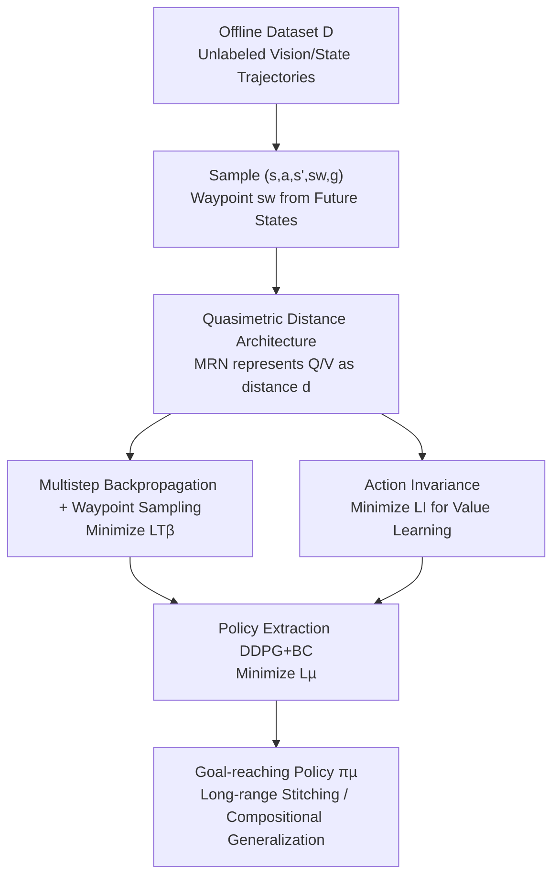

# Multistep Quasimetric Learning for Scalable Goal-Conditioned Reinforcement Learning

**Conference**: ICLR 2026  
**OpenReview**: [https://openreview.net/forum?id=UElh7vzgKX](https://openreview.net/forum?id=UElh7vzgKX)  
**Paper**: [Project Page](https://mqe-paper.github.io)  
**Code**: https://mqe-paper.github.io (Project page contains code)  
**Area**: Reinforcement Learning / Goal-Conditioned RL / Offline RL / Robotic Manipulation  
**Keywords**: Goal-Conditioned Reinforcement Learning, Quasimetric Learning, Multistep Returns, Temporal Distance, Long-range Generalization

## TL;DR
This paper proposes MQE (Multistep Quasimetric Estimation), which integrates multistep Monte Carlo returns into a quasimetric distance architecture. It learns a goal-conditioned Q-function that satisfies the triangle inequality end-to-end. This enables non-hierarchical, planner-free "stitching" and compositional generalization for the first time in offline GCRL tasks spanning up to 4000 steps and real-world multi-stage robotic arm manipulation.

## Background & Motivation

**Background**: The core of Goal-Conditioned Reinforcement Learning (GCRL) is estimating the "temporal distance" between two observations—how many steps it takes to reach a goal from the current state. In offline settings, two main paradigms exist: one uses Temporal Difference (TD) for **local updates** (GCIQL, QRL, nSAC+BC), which theoretically approaches the optimal $Q^*$; the other uses Monte Carlo (MC)/contrastive learning for **global updates** (CRL, CMD, TMD), treating future states as goals to propagate value over multiple steps.

**Limitations of Prior Work**: Both paradigms have significant drawbacks. TD methods suffer from accumulated compounding errors in long-range tasks, collapsing as the horizon extends. MC/contrastive methods are more stable in practice but only recover $Q^\beta$ under the behavior policy rather than the optimal value; furthermore, distance parameterizations in contrastive learning lack global geometric constraints, making compositional stitching difficult. Consequently, offline RL scales well for short-range tasks but fails in long-range tasks requiring complex reasoning.

**Key Challenge**: There exists a trade-off between local updates (TD, optimal but divergent over long horizons) and global updates (MC, stable over long horizons but limited to behavior policies). No existing method manages to capture the benefits of both—rapid global value propagation while maintaining local consistency and global geometric structure.

**Goal**: Design an offline GCRL method that performs both local and global value propagation within a **single value function** to (i) significantly enhance horizon generalization and stitching behavior; (ii) stably extract strong goal-reaching policies from noisy data; and (iii) be robust enough for direct deployment on real robots without additional design.

**Key Insight**: The authors observe that quasimetric architectures naturally satisfy the triangle inequality $d(s_0,g)\le d(s_0,s_w)+d(s_w,g)$, representing the optimal substructure of "decomposing hard problems into easier ones." Meanwhile, multistep returns can propagate values further in a single step. By incorporating multistep returns into the regression target of the quasimetric distance, "local consistency + global geometric constraints" can be enforced simultaneously.

**Core Idea**: Parameterize Q/V using quasimetric distances and extend single-step TD regression to "multistep regression towards arbitrary intermediate waypoints," marking the first combination of multistep MC returns with quasimetric structures—MQE.

## Method

### Overall Architecture

MQE is an offline GCRL algorithm whose pipeline learns only **one** critic (quasimetric network $d$) and **one** goal-reaching policy $\pi_\mu$, without any hierarchical structure or high-level planner. It represents the goal-conditioned Q/V as the distance from "state/state-action pairs to the goal":

$$Q_g(s,a)=V_g(g)\,e^{-d((s,a),g)},\qquad V_g(s)=V_g(g)\,e^{-d(s,g)}.$$

Smaller distances correspond to larger Q-values. The distance $d$ is parameterized by a Metric Residual Network (MRN), ensuring three quasimetric properties (non-negativity, reflexivity $d(x,x)=0$, and the triangle inequality). During training, each batch samples $\{s_i,a_i,s'_i,s^w_i,g_i\}$, where $s^w$ is a "waypoint" sampled from the future of the trajectory. Three losses update the networks: multistep backpropagation $\mathcal{L}_{T_\beta}$ propagates value over long ranges, action invariance $\mathcal{L}_I$ enforces value learning (collapsing Q into V), and the policy loss $\mathcal{L}_\mu$ (DDPG+BC) distills the learned distance into an executable policy.

### Key Designs

**1. Quasimetric Architecture: Global Constraints via Triangle Inequality**

GCRL relies on stitching (combining short tasks into long ones), which fundamentally depends on a global structure: the distance from start to goal should not exceed the sum of distances through any intermediate point. Standard MLP critics or dot-product/norm parameterizations in contrastive learning do not guarantee this, making long-range compositionality impossible. Ours uses MRN to parameterize $d$: splitting representations into $N$ parts, where each part is the sum of an asymmetric component (ReLU then max) and a symmetric component ($\ell_2$ norm):

$$d_{\text{MRN}}(x,y)\triangleq\frac{1}{N}\sum_{k=1}^{N}\max_{m}\max(0,x_{kM+m}-y_{kM+m})+\lVert x_{kM+m}-y_{kM+m}\rVert_2$$

This parameterization is a universal approximator for any quasimetric when $M$ is sufficiently large. Crucially, the triangle inequality is **hardcoded into the network architecture** rather than fitted from data. Thus, the learned distance support "decomposing difficult tasks into easier ones" as a geometric foundation for stitching and horizon generalization.

**2. Multistep Backpropagation + Waypoint Sampling: Extending TD to Arbitrary Intermediate Waypoints**

Single-step TD errors compound over long horizons, while pure MC only recovers behavior policy values. Ours provides the insight that the regression target $e^{-d((s,a),g)}\leftarrow \gamma\,e^{-d(s',g)}$ (denoted as $\mathcal{T}$) does not need to use only the "next state" $s'$—this invariance can be generalized to **any waypoint** $s^w$ between the current state and the goal. Waypoints are sampled as:

$$s^w_t \leftarrow s_{t+k'},\quad k'\sim\min(\text{Geom}(1-\lambda),K)\ \text{w.p.}\ 1-p,\quad k'=1\ \text{w.p.}\ p$$

Thus, single-step regression becomes a multistep target $\mathcal{T}_\beta$: $e^{-d((s,a),g)}\leftarrow \gamma^{k'} e^{-d(s^w_t,g)}$. The mixed Bernoulli + Geometric distribution allows for "far waypoints" to propagate value quickly (geometric term) while retaining $k'=1$ to maintain local consistency (Bernoulli term, corresponding to $p$). The loss uses a LINEX-style Bregman divergence $D_T(d,d')\triangleq\exp(d-d')-d'$, preventing gradient vanishing when distance values are close. When $p=1$, $\mathcal{T}_\beta$ reduces to single-step $\mathcal{T}$. Ablations show that using only $\mathcal{T}$ fails, indicating multistep propagation is the core performance driver.

**3. Action Invariance: Smoothing Loss to Learn Value without Hyperparameters**

An optimal critic should satisfy $V^*_g(s)=\max_a Q^*_g(s,a)$, which in our distance construction is equivalent to $d(s,(s,a))=0$ (action invariance). Since the network does not satisfy this initially, gradient descent is used to explicitly enforce $d(\psi(s),\varphi(s,a))\to 0$. Direct L1/L2 regression can cause the network to collapse to trivial solutions $\varphi(s,a)=\psi(s)=0$ without learning meaningful distances (TMD introduces a hyperparameter $\zeta$ to scale gradients for this). Ours adopts:

$$\mathcal{L}_I=\sum_{i,j}\big(e^{-d(\psi(s_i),\varphi(s_i,a_j))}-1\big)^2$$

The loss magnitude adaptively scales with the degree of violation: gradients are mild for small violations and strong for large ones, stabilizing training dynamics and **eliminating the need for tuned multipliers**. This function similarly to the value loss in IQL/TMD (equivalent to expectile regression with $\tau\approx1$) but is more stable.

**4. Policy Extraction: Mapping Minimum Distance to Maximum Q via DDPG+BC**

Once the distance is learned, it must be translated into an executable policy. Since $Q_g(s,a)=V_g(g)e^{-d((s,a),g)}$, minimizing distance is equivalent to maximizing Q. Ours employs a behavior-regularized deterministic policy gradient:

$$\mathcal{L}_\mu=\mathbb{E}\Big[\sum_{i,j}d\big((s_i,\pi(s_i,g_j)),g_j\big)-\alpha\log \pi(a_i\mid s_i,g_i)\Big]$$

The first term minimizes quasimetric distance (= maximize Q), while the second is a BC regularizer to prevent distribution shift. The coefficient $\alpha$ is tuned per environment. Entirely learning one critic and one policy makes this significantly simpler to implement than hierarchical RL (e.g., HIQL) and allows for direct real-robot deployment.

### Loss & Training

The total objective follows Algorithm 1: in each step, sample a batch $\{s_i,a_i,s'_i,s^w_i,g_i\}$, then (4) update the quasimetric network using $\mathcal{L}_{T_\beta}$ for multistep backpropagation, (5) apply the action invariance constraint $\mathcal{L}_I$, and (6) update the policy using $\mathcal{L}_\mu$ with DDPG+BC. Iterating $T$ times returns $\pi_\mu$. Theoretically (Theorem 1), under tabular settings and the assumption that the behavior policy $\pi_\beta$ has full support over state-action pairs, minimizing $\mathcal{L}_{T_\beta}+\mathcal{L}_I$ followed by projection into the quasimetric space via a path relaxation operator $P(d)(x,z)=\min_y[d(x,y)+d(y,z)]$ guarantees $V^\pi_g(s)\ge V^{\pi_\beta}_g(s)$, achieving policy improvement over the behavior policy.

## Key Experimental Results

### Main Results

Simulation used OGBench: 13 state environments + 5 pixel environments ($64\times64\times3$), with 5 tasks each, totaling 95 tasks; and a custom "colossal" maze 50% larger than "giant," requiring ~4000 steps. Real-world experiments used BridgeData (WidowX250, 6DoF, 5Hz).

| Evaluation | Setting | MQE Performance | Baselines |
|------|------|---------|---------|
| OGBench 90+ Aggregate Success Rate | State + Pixel | Substantially leads all baselines | TMD/CMD/CRL/QRL/GCIQL/HIQL/nSAC+BC |
| humanoidmaze-giant-stitch | Long-range stitching | ~10× improvement over previous best | HIQL, nSAC+BC (with explicit horizon reduction) |
| Antmaze horizon generalization | Trained on 4m, tested on Colossal (1000% horizon) | Only method with non-zero success on Colossal | TMD/CRL/HIQL drop to zero |
| Visual Manipulation | Pixel-based manipulation | Only scenario where it lags | HIQL is superior |
| BridgeData composition PnP | Sequence of 1→4 objects | Maintains high task progress as complexity increases | GCBC/GCIQL/TRA degrade with task count |
| Hardest tasks (4× PnP, Open drawer + Place) | Multi-stage with dependencies | Only method besides TRA with non-zero success | GCBC/GCIQL drop to zero |

### Ablation Study

Conducted on humanoidmaze-giant-stitch (Success %):

| Configuration | Success Rate | Description |
|------|--------|------|
| Full MQE (incl. $\mathcal{L}_I$, $k'\sim$ Eq. (8)) | 26.5 (±1.3) | Full Model |
| Without $\mathcal{L}_I$ | 7.9 (±0.7) | Action invariance contributes most (drop of ~18.6) |
| Replace $\mathcal{L}_I$ with expectile $\kappa=0.7$ | 11.3 (±1.1) | Expectile value learning significantly worse |
| Replace $\mathcal{L}_I$ with expectile $\kappa=0.9$ | 8.8 (±0.7) | Same as above |
| Waypoint $k'\sim\text{Geom}(1-\lambda)$ | 22.1 (±1.1) | Removing Bernoulli mixture slightly decreases performance |
| Waypoint $k'\sim\text{Unif}[1,K]$ | 18.9 (±0.9) | Uniform sampling is worse |
| Waypoint $k'\sim\text{Unif}[1,50]$ | 17.8 (±1.3) | Fixed interval uniform is worse |
| Fixed $k'=50$ | 1.7 (±0.5) | Only far waypoints, collapse |
| Fixed $k'=1$ (Pure single-step $\mathcal{T}$) | 0 (±0.0) | Pure single-step fails completely |

### Key Findings

- **Action invariance $\mathcal{L}_I$ is the most critical component**: Removing it causes success rates to drop from 26.5 to 7.9. Replacing it with IQL-style expectile loss also yields poor results (8.8~11.3), validating that the smooth adaptive loss is superior to fixed expectile regression.
- **Waypoints must be both "far and near"**: Purely far waypoints ($k'=50$) barely learn, and purely single-step ($k'=1$) results in zero success. Geometric distributions outperform uniform ones, which the authors attribute to the geometric distribution of the goals themselves.
- **Hyperparameters $\lambda$ and $p$ should be relatively high**: High $\lambda$ ensures waypoints are far enough for rapid value propagation; high $p$ ensures local consistency is respected. However, if $p$ is too high, it reverts to pure single-step $\mathcal{T}$, highlighting that multistep propagation is indispensable.

## Highlights & Insights
- MQE unifies "multistep MC returns" and "quasimetric triangle inequalities" into a single distance regression objective. It is the first work to successfully apply multistep returns to a quasimetric architecture and demonstrate success on real robots. It elegantly "stitches" two historically opposing paradigms (local TD vs. global MC) through waypoint sampling.
- Being non-hierarchical and free of high-level planners, MQE performs end-to-end 4-stage PnP and "open drawer then place" tasks on BridgeData—tasks previously only achievable by explicit hierarchy or planning methods. This is highly attractive for engineering simplicity.
- The smooth adaptive design of $\mathcal{L}_I$ is a transferable trick: it is useful in any scenario requiring "soft equality constraints between two representations while avoiding trivial collapse," as it eliminates the need to tune multiplier hyperparameters.
- The use of LINEX/Bregman loss prevents gradient vanishing as distances converge, acting as a hidden driver for refining long-range value functions.

## Limitations & Future Work
- Waypoint sampling is based on heuristics (Geometric + Bernoulli mixture). Environments outside the evaluated range may require re-searching for optimal sampling strategies, introducing computational overhead. The authors admit to not providing a theoretically optimal solution for waypoint sampling.
- The only area of lag is visual manipulation (where HIQL is better), suggesting that quasimetric representation learning for pixel inputs still has shortcomings.
- Theoretical guarantees (Theorem 1) only hold in tabular settings with full support assumptions; guarantees under high-dimensional stochastic continuous control remain an open problem.
- Future work: Investigate the theoretical link between waypoint sampling and successor distances, examine the impact on different policy classes like action-chunking, and extend the method to offline-to-online or pure online RL.

## Related Work & Insights
- **vs QRL (Wang et al., 2023)**: QRL uses a quasimetric architecture but only performs single-step TD updates; MQE introduces multistep returns into the same architecture, significantly improving long-range stitching.
- **vs CMD / TMD (Myers et al., 2024/2025c)**: These use contrastive MC updates to recover behavior policy distances $Q^\beta$; MQE learns Bellman optimal $Q$ under behavioral dynamics bias, bringing measurable gains in long-range goal reaching. TMD also requires an extra hyperparameter $\zeta$ to stabilize gradients, while MQE uses an adaptive $\mathcal{L}_I$.
- **vs HIQL (Park et al., 2024b)**: HIQL relies on explicit policy horizon reduction (hierarchy) for long-range tasks. MQE, despite being non-hierarchical, outperforms it by ~10× on humanoidmaze-giant-stitch, lagging only in pixel manipulation.
- **vs nSAC+BC**: Both use multistep ideas, but nSAC+BC uses a fixed step count and lacks global geometric constraints. MQE uses variable step counts and provides global structure via the quasimetric triangle inequality.

## Rating
- Novelty: ⭐⭐⭐⭐⭐ First work to combine multistep returns with quasimetric architectures and succeed on real robots, unifying TD/MC paradigms.
- Experimental Thoroughness: ⭐⭐⭐⭐⭐ 95 simulation tasks + real-world multi-stage manipulation + detailed ablations, covering horizons up to 4000 steps.
- Writing Quality: ⭐⭐⭐⭐ Clear logic and solid motivation, though formulas are dense and the intuitive explanation for waypoint sampling is somewhat brief.
- Value: ⭐⭐⭐⭐⭐ Achieves compositional stitching without hierarchy, providing direct utility for offline GCRL and real-world robot learning.

<!-- RELATED:START -->

## Related Papers

- [\[ICLR 2026\] Goal Reaching with Eikonal-Constrained Hierarchical Quasimetric Reinforcement Learning](goal_reaching_with_eikonal-constrained_hierarchical_quasimetric_reinforcement_le.md)
- [\[ICML 2026\] Direction-Conditioned Policies via Compositional Subgoal Scoring for Online Goal-Conditioned Reinforcement Learning](../../ICML2026/reinforcement_learning/direction-conditioned_policies_via_compositional_subgoal_scoring_for_online_goal.md)
- [\[ICLR 2026\] Occupancy Reward Shaping: Improving Credit Assignment for Offline Goal-Conditioned Reinforcement Learning](occupancy_reward_shaping_improving_credit_assignment_for_offline_goal-conditione.md)
- [\[ICLR 2026\] Dual Goal Representations](dual_goal_representations.md)
- [\[ICML 2026\] Latent Representation Alignment for Offline Goal-Conditioned Reinforcement Learning](../../ICML2026/reinforcement_learning/latent_representation_alignment_for_offline_goal-conditioned_reinforcement_learn.md)

<!-- RELATED:END -->
