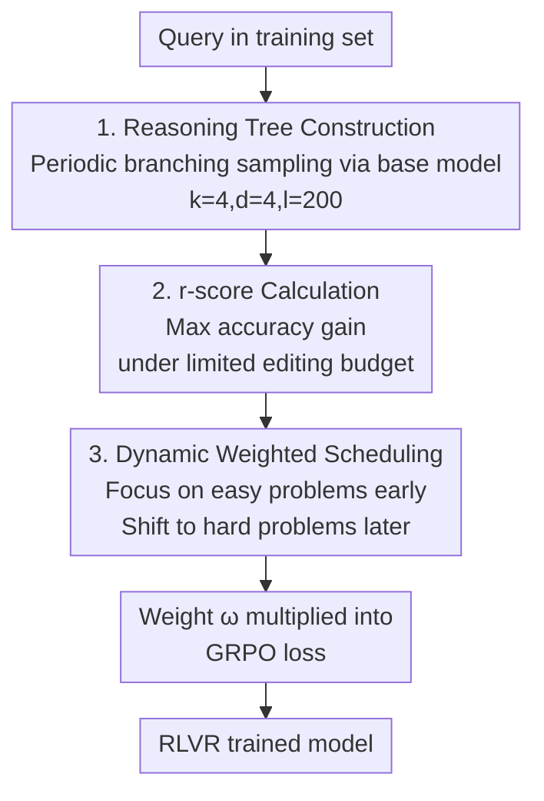

# Scheduling Your LLM Reinforcement Learning with Reasoning Trees

**Conference**: ICLR 2026  
**OpenReview**: [https://openreview.net/forum?id=V4zln7XiJj](https://openreview.net/forum?id=V4zln7XiJj)  
**Code**: https://github.com/zz-haooo/Re-Schedule  
**Area**: LLM Reasoning / Reinforcement Learning / Curriculum Learning  
**Keywords**: RLVR, Reasoning Tree, Data Scheduling, Curriculum Learning, GRPO

## TL;DR
This paper proposes using "reasoning tree structure" rather than "answer accuracy" to measure the true learning difficulty of a problem for LLMs. It defines a new metric, Reasoning Score (r-score), and designs "Re-Schedule," a curriculum-based data scheduling algorithm, which improves average accuracy on six mathematical reasoning benchmarks by up to 3.2%.

## Background & Motivation
**Background**: RLVR (Reinforcement Learning with Verifiable Rewards, such as GRPO) has become the mainstream paradigm for enhancing LLM mathematical reasoning. Under this paradigm, all possible solution paths for a problem can be modeled as a "Reasoning Tree"—where the root is the question, each node represents an intermediate reasoning step, and each path from root to leaf represents a complete solution trajectory. The essence of RLVR is to perform "node editing" on this tree: rewarding correct paths and punishing incorrect ones to adjust token probabilities at each node, thereby gradually pruning low-quality branches.

**Limitations of Prior Work**: Scheduling training data (data scheduling) in RLVR can further improve data efficiency. However, existing methods (ACC curriculum, LPPO, Seed-GRPO, DELT, etc.) almost exclusively use "path-based" metrics—primarily final answer accuracy (ACC)—to rank problem difficulty, subsequently training from easy to hard. The issue is that accuracy does not accurately measure "learning difficulty."

**Key Challenge**: Low accuracy does not necessarily mean a problem is hard to learn, and high accuracy does not mean a problem is easy to optimize. The authors illustrate this mismatch with two types of samples (Figure 2 in the paper): "Potential Samples" have low initial accuracy (~1.4%) but simple reasoning tree structures with concentrated errors; they can reach 70%+ accuracy with just a few key node edits. Conversely, "Stagnant Samples" have high initial accuracy (70%+) but their correct paths are scattered across different subtrees in a "diffuse" structure, requiring many node edits and showing stagnated growth. Accuracy-based scheduling misidentifies "Potential Samples" as hard and deprioritizes them in favor of truly hard-to-learn "Stagnant Samples," leading to inefficient training.

**Goal**: To move away from path metrics and directly quantify the true learning difficulty of a problem from its reasoning tree **structure**, and schedule the curriculum accordingly.

**Key Insight**: RL training can be viewed as an optimization problem of "maximizing accuracy gain under a limited node editing budget." If a problem requires editing only a few nodes to yield a significant score increase, it is structurally simple and easy to learn.

**Core Idea**: Use "maximum accuracy gain under a fixed editing budget" to define r-score as a more fundamental measure of difficulty, and implement it as a dynamic weighted curriculum from easy (high r-score) to hard (low r-score).

## Method

### Overall Architecture
Re-Schedule is a data scheduling module implemented on top of standard GRPO. The pipeline consists of three steps: **Offline construction of an approximate reasoning tree for each problem → Simulation of "node editing" on the tree to calculate r-score → Conversion of r-score into dynamic sample weights that change with training steps and are applied to the GRPO loss**. The first two steps are offline one-time prep (using only the base model for sampling without gradients), while the third step operates continuously during RLVR training. Early training focuses on simple problems with high r-scores to stabilize training, while later weights shift toward hard problems with low r-scores to improve generalization.

### Key Designs

**1. Reasoning Tree Construction: Approximating search space with a fixed k-ary tree**

The complete reasoning tree is uncomputable due to combinatorial explosion. This paper builds a "fixed-structure" approximate tree for each problem offline, characterized by three parameters: branching factor $k$, maximum depth $d$, and token interval $l$ (default $k=4, d=4, l=200$). Construction uses "periodic branching sampling": starting from the root (question), a branch is triggered at the beginning and every $l$ tokens thereafter, splitting the current path into $k$ independent sub-paths until depth $d$ is reached. Prefix calculation is reused via KV-Cache to reduce costs. After construction, each leaf node (complete solution) is labeled 0/1 based on correctness. The quality of any intermediate node $n_i$ is defined as the average accuracy of all its leaf descendants $L(n_i)$: $\text{ACC}(S)=\frac{\sum_{n_j\in S}\mathbb{I}(n_j\text{ correct})}{|S|}$. This annotated tree serves as the foundation for calculating r-score.

**2. r-score Calculation: Quantifying structural learnability via "max gain under fixed budget"**

The core idea of r-score is that easy-to-learn problems should significantly improve performance by correcting only a few key nodes. For any non-leaf node $n_i$, its single-point r-score is defined as the "accuracy gain achieved by selecting its best sub-branch and pruning the others":

$$R(n_i)=\max_{n_{child}\in C(n_i)}\text{ACC}\big(N_{leaf}\setminus L(n_i)\cup L(n_{child})\big)-\text{ACC}(N_{leaf}).$$

Intuitively, this step evaluates the subtree structure from $n_i$: the simpler the structure (concentrated correct paths), the greater the gain from pruning low-quality branches, and the higher the $R(n_i)$. The total r-score $R(q)$ for a problem is the maximum sum of single-point gains from $M$ non-conflicting nodes under a budget of "at most $M$ node edits":

$$R(q)=\max_{N^*\subseteq N,\,|N^*|=M}\sum_{n_i\in N^*}R(n_i).$$

$R(q)$ being high implies that "correcting just a few key reasoning steps leads to major improvements," indicating a simple structure and high learning efficiency. This explains the mismatch: problems with concentrated errors have high r-scores, while diffuse ones have low r-scores—even if their initial accuracies suggest otherwise.

**3. Dynamic Weighted Scheduling: Turning r-score into an easy-to-hard temporal curriculum**

A difficulty score alone is insufficient; training only on easy problems sacrifices data diversity. This paper converts r-score into adaptive weights dependent on training step $t$ and score $R(q)$. First, an intermediate value that flips over time is calculated:

$$\alpha(R(q),t)=(1-\gamma(t))\,R(q)+\gamma(t)\,(1-R(q)),$$

Then, it is mapped to a weight range based on its rank in the dataset: $\omega=\text{rank}(\alpha)\%\cdot\omega_{max}+(1-\text{rank}(\alpha)\%)\cdot\omega_{min}$. The scheduling function $\gamma(t)$ progresses with training (linear $\gamma(t)=t/T$ or sigmoid $\gamma(t)=\sigma(t/T-0.5)$). Early on, small $\gamma$ means $\alpha$ is dominated by $R(q)$, giving high r-score (easy) problems more weight. Later, as $\gamma$ increases, weight shifts toward low r-score (hard) problems, forcing the model to tackle difficult cases and alleviating catastrophic forgetting. This $\omega$ is multiplied into the per-query objective of GRPO ($J_{schedule}=\mathbb{E}[\omega(q,t)\cdot J_{GRPO}(q)]$); it modifies only the contribution weight of each problem, not the GRPO algorithm itself.

### Loss & Training
The base algorithm is standard GRPO, with the addition of per-query weights $\omega(q,t)$. Training data is DAPO-Math-17k (integer-answer math problems), excluding KL divergence and entropy regularization terms. Batch size 512, top-p=1.0, temperature 1.0, total epochs $T=10$. The default weight range is $\omega_{min}=0.5,\ \omega_{max}=2.0$. Two scheduling schemes, linear and sigmoid, are provided.

## Key Experimental Results

### Main Results
On Qwen2.5-Math-7B, Re-Schedule(sigmoid) achieved a new SOTA with 48.5% average accuracy, outperforming the strongest baseline ACC(sigmoid) by 1.9% and standard GRPO by 4.2%. Similar leads were observed on Qwen2.5-7B with 44.5%.

| Model (Qwen2.5-Math-7B) | AIME24 | AIME25 | AMC23 | MATH500 | Minerva | Olympiad | Avg. |
|------|------|------|------|------|------|------|------|
| Base (No RL) | 13.8 | 5.3 | 44.6 | 39.6 | 9.9 | 13.8 | 21.2 |
| GRPO | 28.0 | 14.3 | 66.2 | 78.6 | 37.5 | 40.9 | 44.3 |
| OPO | 32.2 | 13.4 | 71.5 | 82.2 | 38.6 | 41.0 | 46.5 |
| ACC(sigmoid) | 31.5 | 15.6 | 70.9 | 80.8 | 38.6 | 42.2 | 46.6 |
| LPPO | 32.8 | 14.9 | 63.3 | 79.2 | 39.0 | 40.6 | 45.0 |
| Seed-GRPO | 30.7 | 14.0 | 71.0 | 80.0 | 38.2 | 38.5 | 45.4 |
| **Re-Schedule (linear)** | 34.2 | 15.6 | 72.4 | 81.2 | 36.4 | 42.5 | 47.1 |
| **Re-Schedule (sigmoid)** | **35.2** | **16.0** | 72.3 | **82.2** | **42.3** | **44.4** | **48.5** |

### Ablation Study

| Configuration | Key Settings | Avg. | Description |
|------|---------|------|------|
| Tree Structure | $k=4, d=4$ (Default) | 48.3 | Optimal |
| Tree Structure | $k=3, d=5$ | 46.9 | Too deep, -1.4 drop |
| Tree Structure | $k=5, d=3$ | 47.0 | Too wide, -1.3 drop |
| Weight Range | $\omega_{min}=0.5,\omega_{max}=2.0$ (Default) | 48.5 | Optimal |
| Weight Range | $\omega_{max}=1.5$ (Narrow) | 46.9 | Insufficient differentiation, -1.6 drop |
| Weight Range | $\omega_{min}=0.2$ (Extreme) | 46.4 | Hard problems suppressed too long, -2.1 drop |

Cost-Benefit Tradeoff: Larger trees provide better approximations but are more expensive. Default $k=d=4$ increases time by 48.54% for a +4.0 gain; $k=4,d=3$ offers higher efficiency with only +14.35% overhead for a +3.2 gain.

### Key Findings
- **r-score identifies "worth learning early" problems better than accuracy**: Training on the top-1/3 subset selected by r-score quickly surpassed the ACC subset and random selection (GRPO) in both training and testing, proving it captures true learning signals.
- **Training indeed "optimizes reasoning trees"**: The authors defined Minimum Corrective Nodes (MCN, the fewest node modifications required to reach target accuracy). MCN consistently decreased as training progressed, supporting the core hypothesis that "RL training = reasoning tree node editing."
- **Weight range needs to be wide but not extreme**: Narrow ranges fail to differentiate difficulty, while extreme ranges suppress hard problems for too long; both lead to performance drops.
- **Sigmoid scheduling generally outperforms linear**: The sigmoid scheme yielded higher average scores across both models.

## Highlights & Insights
- **Revising "Difficulty" from Result to Structure**: Changing the metric from accuracy to reasoning tree structural learnability is highly insightful. This perspective can shift to any RLVR task where the solution space is inherently tree-like, such as code generation or Agent multi-step decision-making.
- **Clever Definition of r-score**: "Max gain under limited budget" directly corresponds to "how well RL can learn this problem in limited steps," making it more representative of optimization dynamics than proxies like accuracy or uncertainty.
- **MCN Provides Mechanistic Evidence**: Not just comparing final scores, but proving the training process optimizes the tree by showing the reduction in required error corrections.
- **Plug-and-Play**: It does not modify the GRPO algorithm itself, adding only an offline scoring step and a weight function, making it easy to integrate into existing RLVR pipelines.

## Limitations & Future Work
- **Significant Offline Overhead for Tree Construction**: Default settings add ~48.54% time. While KV-Cache and cheaper configurations mitigate this, it remains a burden for massive datasets. Additionally, r-score is calculated once from the base model; if the policy drifts significantly during training, the offline approximation may lose accuracy.
- **Fixed k-ary Tree is a Coarse Approximation**: The mechanical triggering of branches at fixed token intervals might not align with semantic decision points. The impact of this approximation error lacks deep theoretical analysis.
- **Narrow Task Scope**: Experiments focused solely on integer-answer mathematical reasoning. Its validity in non-mathematical or non-verifiable tasks remains unverified.
- **Future Directions**: Exploring online updates for reasoning trees, using semantic rather than fixed token intervals for branching, and fusing r-score with gradient or uncertainty-based metrics.

## Related Work & Insights
- **vs. ACC Curriculum**: Both share isomorphic weight functions, but ACC uses accuracy $\text{ACC}(q)$ for difficulty, while Ours uses structural r-score $R(q)$. Ours consistently leads across benchmarks (48.5 vs 46.6), showing structural info outperforms endpoint accuracy.
- **vs. LPPO / Seed-GRPO**: LPPO uses accuracy gradients and Seed-GRPO uses semantic uncertainty as proxies. These are "path-based flat proxies"; Ours is more principled by quantifying the tree-like learnability of the solution space.
- **vs. LIMR (Static Selection)**: LIMR filters a fixed subset once; Ours is a dynamic curriculum that adjusts weights during training, emphasizing different difficulties at different stages.
- **vs. Standard GRPO**: GRPO is the backbone. Re-Schedule simply adds scheduling weights without altering the underlying policy optimization, allowing it to be layered with other GRPO improvements.

## Rating
- Novelty: ⭐⭐⭐⭐⭐ Redefining data difficulty from "path accuracy" to "reasoning tree structural learnability" is refreshing and backed by mechanistic evidence.
- Experimental Thoroughness: ⭐⭐⭐⭐ Solid results across two models and six benchmarks with extensive ablations, though limited to verifiable math tasks.
- Writing Quality: ⭐⭐⭐⭐ Concepts like the q1/q2 mismatch and MCN are explained clearly, though notations are dense.
- Value: ⭐⭐⭐⭐ Plug-and-play, stable gains, and provides a transferable structural framework for RLVR data scheduling.

<!-- RELATED:START -->

## Related Papers

- [\[ICLR 2026\] Getting Your LLMs Ready for Reinforcement Learning with Lightweight SFT](getting_your_llms_ready_for_reinforcement_learning_with_lightweight_sft.md)
- [\[ICLR 2026\] Prompt Curriculum Learning for Efficient LLM Post-Training](prompt_curriculum_learning_for_efficient_llm_post-training.md)
- [\[ICLR 2026\] R-Zero: Self-Evolving Reasoning LLM from Zero Data](r-zero_self-evolving_reasoning_llm_from_zero_data.md)
- [\[ICLR 2026\] J1: Incentivizing Thinking in LLM-as-a-Judge via Reinforcement Learning](j1_incentivizing_thinking_in_llm-as-a-judge_via_reinforcement_learning.md)
- [\[ICLR 2026\] Reinforcement Learning with Verifiable Rewards Implicitly Incentivizes Correct Reasoning in Base LLMs](reinforcement_learning_with_verifiable_rewards_implicitly_incentivizes_correct_r.md)

<!-- RELATED:END -->
## Related Papers

- [\[ICLR 2026\] Getting Your LLMs Ready for Reinforcement Learning with Lightweight SFT](getting_your_llms_ready_for_reinforcement_learning_with_lightweight_sft.md)
- [\[ICLR 2026\] Prompt Curriculum Learning for Efficient LLM Post-Training](prompt_curriculum_learning_for_efficient_llm_post-training.md)
- [\[ICLR 2026\] R-Zero: Self-Evolving Reasoning LLM from Zero Data](r-zero_self-evolving_reasoning_llm_from_zero_data.md)
- [\[ICLR 2026\] J1: Incentivizing Thinking in LLM-as-a-Judge via Reinforcement Learning](j1_incentivizing_thinking_in_llm-as-a-judge_via_reinforcement_learning.md)
- [\[ICLR 2026\] Reinforcement Learning with Verifiable Rewards Implicitly Incentivizes Correct Reasoning in Base LLMs](reinforcement_learning_with_verifiable_rewards_implicitly_incentivizes_correct_r.md)

<!-- RELATED:END -->
