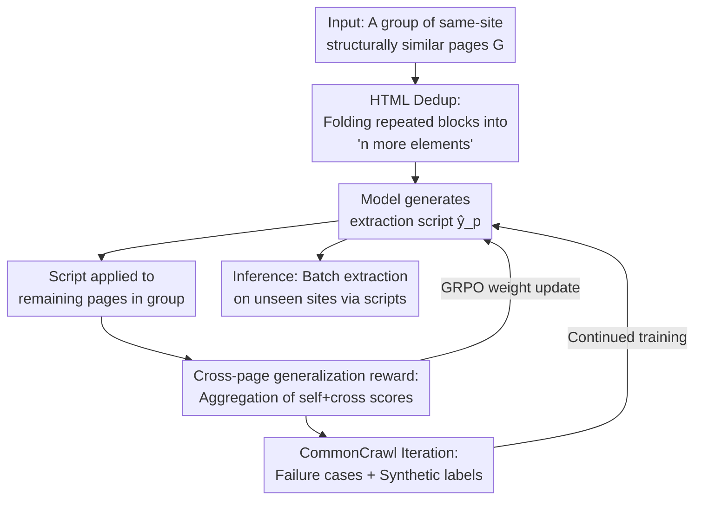

# SCRIBES: Web-scale Scripted Semi-structured Data Extraction with Reinforcement Learning

**Conference**: ICLR 2026  
**OpenReview**: [https://openreview.net/forum?id=gQSnEIA3Z3](https://openreview.net/forum?id=gQSnEIA3Z3)  
**Code**: https://github.com/facebookresearch/SCRIBES (To be released)  
**Area**: Reinforcement Learning / Information Extraction / LLM Efficiency  
**Keywords**: Scripted extraction, semi-structured data, RLVR, layout similarity reward, CommonCrawl

## TL;DR
Instead of letting LLMs parse webpages page-by-page, SCRIBES uses Reinforcement Learning to train a model that generates a **reusable extraction script** (BeautifulSoup code) after seeing a single webpage. By leveraging the property that "webpages from the same site share similar layouts," it designs cross-page rewards to ensure scripts generalize to entire groups of structurally similar pages. Script quality outperforms strong agentic baselines by 13%+, downstream QA performance improves by 4%+ on GPT-4o, and extraction costs decrease linearly with the number of similar pages.

## Background & Motivation
**Background**: Substantial factual data on the web is hidden in semi-structured content like HTML tables, lists, and infoboxes. Converting these into structured triples (subject-predicate-object) for knowledge extraction has traditionally followed two paths: traditional Information Extraction (IE) methods (wrapper induction, graph mining, layout rules, DNNs) or recent LLM-based page-by-page parsing/KG construction.

**Limitations of Prior Work**: Traditional IE methods are brittle, failing to generalize to unseen sites or schemas and requiring manual template design. Page-by-page LLM methods, while high-quality, require **one LLM call per webpage**, leading to explosive computational costs at web scale where page counts reach billions.

**Key Challenge**: A fundamental conflict between effectiveness and efficiency. High performance requires LLMs to ingest HTML page-by-page, which is unaffordable at web scale. Efficiency requires scripts/rules, but scripts are difficult to generalize, and **manual annotation of these extraction scripts is extremely difficult**—even expert annotators struggle to write scripts that generalize across pages, making supervised fine-tuning (SFT) impractical.

**Key Insight**: The authors observe a structural regularity ignored by existing methods—**webpages under the same domain often share highly similar layouts** (e.g., every drug page in a pharmaceutical database shares the same table structure, only values differ). If a model can write a script for one page, that script should naturally apply to other pages in the same group. This provides a verifiable signal **without manual script annotations**: if a script runs successfully and extracts accurately on other pages in the same group, it receives a reward.

**Core Idea**: Train models to generate extraction scripts using RLVR (Reinforcement Learning from Verifiable Rewards), where **rewards are derived from "cross-page generalization quality" rather than "matching a ground-truth script."** Iterative self-training with CommonCrawl "wild" webpages and LLM-synthesized labels is then used to expand coverage to web scale.

## Method

### Overall Architecture
SCRIBES addresses the problem of generating an extraction script that applies to a whole group of structurally similar pages, replacing "one LLM call per page" with "one model call to extract a group." The pipeline consists of three components: deduplicating and compressing long HTML into the context window, training the model to generate scripts via GRPO (rewards aggregated from performance across multiple pages in a group), and expanding coverage via iterative self-training on CommonCrawl data with synthesized labels.

Webpages are organized into "same-site, same-group" sets (a group $G=\{p_1,\dots,p_n\}$ consists of structurally similar pages). During training, the model only sees **one representative page** from the group as input to generate a script $\hat{y}_p=\text{LM}(p)$. This script is executed on the **remaining pages** in the group. Extracted triples are compared against labels to calculate rewards, and weights are updated using GRPO. At inference, the model generates scripts for new, unseen sites to perform batch extraction.

### Key Designs

**1. HTML Dedup: Compressing Ultra-long Pages into Context**

Raw HTML for semi-structured pages is often extremely long, exceeding the context window of many LLMs. The authors use a simple but effective method: **folding repeated HTML blocks** into a compact representation like "`n more ... elements`" (e.g., if a table has 50 identical `<tr>` structures, only a few are kept with a note). This significantly reduces context length, allowing the model to see the full structural skeleton. Ablations confirm dedup significantly improves performance; hence it is default for all SCRIBES models and baselines—serving both localized token saving and global structural awareness.

**2. Cross-page Generalization Reward: Using Layout Similarity as Supervision**

This is the core design, targeting the difficulty of script annotation. The authors define a score for script $\hat{y}_p$ executed on page $q$ as $r(p\to q)=S(\hat{y}_p(q), y^\star_q)\in[0,1]$, where $S$ aligns predicted and gold triples via bipartite matching to calculate fuzzy F1. The reward for training sample $p$ is the average score across the **entire group**:

$$r_{\text{SCRIBES}}(p)=\frac{1}{|G(p)|}\sum_{q\in G(p)}r(p\to q)=\frac{1}{|G(p)|}r_{self}(p)+\frac{|G(p)|-1}{|G(p)|}\sum_{q\neq p}r_{cross}(p,q)$$

where $r_{self}(p)=r(p\to p)$ is the score on the source page and $r_{cross}(p,q)$ is the score on other pages. Notably, the self-score only contributes $\frac{1}{|G(p)|}$ of the weight; **the majority of the reward comes from the cross-score**. This explicitly tells the model: overfitting to the current page earns few points; the script must withstand structural variations (e.g., varying table sizes or values) in the rest of the group.

**3. Iterative Self-training with Failure-Case CC: Expanding Coverage on Unlabeled Web Data**

Labeled data (192 pages, 34 groups) is insufficient to cover diverse web layouts. The authors sample wild pages from CommonCrawl using a filtering pipeline (blacklist -> language -> domain grouping -> group size $\ge 30$ -> LLM classifier for semi-structured content). Since gold labels are missing, **LLM-based extraction** serves as the synthetic ground truth. To prevent noise from these imperfect labels, two strategies are used: starting from a checkpoint pre-trained on gold data to establish a strong prior, and **training only on failure cases**—specifically, pages where the current model fails to extract any triples ($F_1 = 0$).

### Loss & Training
Training utilizes GRPO (Group Relative Policy Optimization) to optimize the $r_{\text{SCRIBES}}(p)$ reward. The base models are the Qwen2.5-Instruct series (14B / 32B). During training, $S$ uses triple-level fuzzy F1 ($F_1^{fuzzy}$); for evaluation, Llama-3.3-70B-Instruct is used as an LLM-as-judge to calculate $P^{LM}/R^{LM}/F_1^{LM}$ for reproducibility.

## Key Experimental Results

### Main Results
Evaluation is conducted on SemiBench (Sun et al., 2025) with 56 groups. Metrics are split: All (average across all pages), Example (the script's source page), and Holdout (other pages in the group).

| Model / Method | All $F_1^{LM}$ | Example $F_1^{LM}$ | Holdout $F_1^{LM}$ |
|------|------|------|------|
| Q-14B agentic-3-iter 2-shot (Baseline) | 8.0 | 12.6 | 5.7 |
| GPT-4o agentic-3-iter 2-shot (Baseline) | 24.4 | 31.2 | 21.1 |
| GO-120B agentic-3-iter 2-shot (SOTA Baseline) | 34.3 | 36.6 | 33.3 |
| **SCRIBES Q-14B** | 19.9 | 26.7 | 16.7 |
| **SCRIBES Q-14B (+CC)** | 21.8 | 30.0 | 17.7 |
| **SCRIBES Q-32B** | 28.1 | 30.3 | 26.8 |
| **SCRIBES Q-32B (+CC)** | **33.2** | 34.6 | **32.4** |

The best SCRIBES Q-32B model outperforms the few-shot agentic baseline of the same model size by **13.8%** in $F_1^{LM}$ and is comparable to GO-120B (a massive 120B model).

### Ablation Study

| Configuration | All $F_1^{LM}$ | Holdout $F_1^{LM}$ | Description |
|------|------|------|------|
| Q-14B (SCRIBES Full Reward) | 19.9 | 16.7 | Full cross-page reward |
| Q-14B (Self-score only, Eq.3) | 15.7 | 9.5 | Holdout drops by 7.2%, proving cross-page reward is the source of generalization |
| Q-32B (Annotated only) | 28.1 | 26.8 | No CC data |
| Q-32B (+ Full CC) | 29.7 | 28.1 | Including all wild data |
| Q-32B (+ Failure-Case CC) | **33.2** | **32.4** | Failure cases outperform full CC by 3.5% |

### Key Findings
- **Cross-page reward is the true driver of generalization**: Models trained only on self-score actually perform 1.2% better on the Example page but drop 7.2% on Holdout pages, indicating they write brittle scripts overfitted to a single page.
- **Annotated-first, then noise, with failure focus**: Training directly on CC or mixing it 1:1 with gold labels does not yield gains. One must build a prior with gold labels first, then expand via noisy synthetic rewards.
- **Efficiency scales linearly with group size**: The cost of dedup HTML is $\sim 1/3.7$ of flattened HTML. Once a site has $\ge 4$ similar pages, the script method becomes more efficient. Speedup scales linearly with similar page count $k$.
- **Downstream QA Gain**: SCRIBES triples improve GPT-4o QA performance by 4%+. However, IE accuracy gains do not always translate to QA gains for smaller models (Q-3B/Q-7B).

## Highlights & Insights
- **Turning "Hard to Annotate" into "Easy to Verify"**: Script annotation is hard for humans, but verifying if a script works across a group is naturally automated—this is a brilliant application of RLVR in IE.
- **Weighting Reward for Generalization**: By setting self-score weight to $1/|G|$ and letting cross-score dominate, the goal of generalization is hard-coded into the reward without complex regularizers.
- **Amortized LLM Cost**: The core efficiency dividend comes from "one inference to rule them all." This is transferable to any scenario with repetitive templates (products, PDFs, rule generation).

## Limitations & Future Work
- **Struggle with Complex Structures**: Performance remains low on nested lists and free-format pages (All $F_1$ only 33.2 for the best model).
- **Noisy Synthetic Labels**: LLM extraction on CC only has $\sim 40\%$ F1, limiting the quality ceiling for wild data training.
- **Dependency on Layout Similarity**: The method relies on the "same-site layout similarity" assumption. It will fail on sites with high layout drift or unique per-page designs.

## Related Work & Insights
- **vs Traditional IE**: Unlike wrapper induction that learns fixed templates, SCRIBES learns to write full executable programs that handle structural skeletons directly via RL.
- **vs Page-by-page LLM Extraction**: SCRIBES avoids the prohibitive cost of web-scale LLM inference by amortizing the cost of a single script generation across an entire group.

## Rating
- Novelty: ⭐⭐⭐⭐⭐ Translating layout similarity into an RLVR cross-page reward is a highly effective and novel framing.
- Experimental Thoroughness: ⭐⭐⭐⭐ Extensive ablations on model scale, rewards, and CC strategies, though absolute scores are still low on complex pages.
- Writing Quality: ⭐⭐⭐⭐ Clear presentation of design motivation and reward formulas.
- Value: ⭐⭐⭐⭐⭐ Significant engineering value for reducing costs in large-scale knowledge extraction.

<!-- RELATED:START -->

## Related Papers

- [\[NeurIPS 2025\] DeepDiver: Adaptive Search Intensity Scaling via Open-Web Reinforcement Learning](../../NeurIPS2025/reinforcement_learning/deepdiver_adaptive_search_intensity_scaling_via_open-web_reinforcement_learning.md)
- [\[ICLR 2026\] Sparse but Critical: A Token-Level Analysis of Distributional Shifts in RLVR Fine-Tuning of LLMs](sparse_but_critical_a_token-level_analysis_of_distributional_shifts_in_rlvr_fine.md)
- [\[ICLR 2026\] SSVPO：面向语言模型 RL 训练的有效步级信用分配](ssvpo_effective_step-level_credit_assignment_for_rl_training_of_language_models.md)
- [\[ICLR 2026\] Scheduling Your LLM Reinforcement Learning with Reasoning Trees](scheduling_your_llm_reinforcement_learning_with_reasoning_trees.md)
- [\[ICLR 2026\] Rubrics as Rewards: Reinforcement Learning Beyond Verifiable Domains](rubrics_as_rewards_reinforcement_learning_beyond_verifiable_domains.md)

<!-- RELATED:END -->
