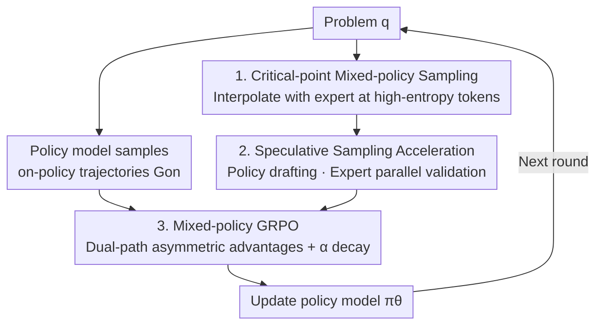

# Selective Expert Guidance for Effective and Diverse Exploration in Reinforcement Learning of LLMs

**Conference**: ICLR 2026  
**OpenReview**: [https://openreview.net/forum?id=axlFycAkoL](https://openreview.net/forum?id=axlFycAkoL)  
**Code**: https://github.com/Jiangzs1028/MENTOR (Available)  
**Area**: Reinforcement Learning / LLM Reasoning / RLVR  
**Keywords**: RLVR, Exploration Diversity, Expert Guidance, Entropy Collapse, Mixed Policy

## TL;DR
Addressing the issues of ineffective exploration and entropy collapse in RLVR training for weak models, this paper proposes MENTOR. It injects expert distributions for mixed-policy sampling only at "critical decision points" (high-entropy tokens) and utilizes a Mixed-policy GRPO with asymmetric advantages. This allows the model to absorb the essence of expert reasoning rather than superficial imitation, consistently improving base model scores by 3–4 points and increasing pass@32 by an average of 9.2% across six mathematical benchmarks.

## Background & Motivation

**Background**: RLVR (Reinforcement Learning with Verifiable Rewards) has become a mainstream method for enhancing LLM reasoning. By replacing human feedback with automatically verifiable signals such as mathematical proof or program execution, models are encouraged to generate Chain of Thought (CoT). Models like o1, DeepSeek-R1, and Kimi-1.5 have achieved significant progress through this approach. A common implementation is GRPO, which samples a group of solutions for the same problem and estimates advantages via group-relative reward normalization, eliminating the need for an additional value model.

**Limitations of Prior Work**: The gains from RLVR depend heavily on the base model's capabilities. When base parameters are limited or problems are too difficult, two issues arise: first, **ineffective exploration**, where the model fails to sample any correct trajectories, resulting in zero rewards and zero normalized advantages $\hat A_{i,t}$, stalling training; second, **lack of diverse exploration**, where even if correct solutions are found, the limited variety causes the model to converge to a narrow set of solutions, leading to rapid entropy collapse and entrapment in local optima.

**Key Challenge**: Existing remedies involve **imitating expert trajectories** (e.g., LUFFY mixes full expert rollouts into the sampling group; QuestA provides half-expert prefixes as prompts). While this reduces ineffective exploration, it forces the model to **strictly follow fixed expert trajectories**. This restricts the exploration space and accelerates entropy collapse. Furthermore, gradient imbalance causes the model to overfit to the expert's style, especially when the expert's reasoning style differs significantly from the policy model. Token re-weighting barely addresses the symptoms; as long as full fixed trajectories are imitated, the exploration space remains fundamentally constrained. In short, there is a trade-off between effectiveness and diversity; imitating full paths wins the former but loses the latter.

**Goal**: To introduce expert knowledge while ensuring effectiveness without sacrificing diversity, enabling "high-quality exploration" even for weak base models. The authors theoretically decompose high-quality exploration into two conditions: sampling **at least one** optimal trajectory (effectiveness) and sampling **multiple distinct** optimal trajectories (diversity, proven by Theorem 2.1: the entropy upper bound decreases as expected reward increases, at a rate inversely proportional to the size of the optimal trajectory set $K$).

**Key Insight**: The authors observe that token contributions in a reasoning trajectory are unequal. A few high-entropy tokens determine "critical decision forks," while the rest are deterministic follows. These following tokens often reflect stylistic differences between models and have little impact on the final result. Full expert trajectories are saturated with such low-impact tokens, which interfere with the model's ability to learn the true critical decisions.

**Core Idea**: The expert should only provide guidance at **critical decision points** rather than covering the entire path. By interpolating the expert distribution into the sampling distribution only at high-entropy tokens—while following the model's own policy elsewhere—one can increase the probability of correct solutions while maintaining an exponentially large exploration space to avoid collapsing to a single expert solution.

## Method

### Overall Architecture

MENTOR (Mixed-policy Expert Navigation for Token-level Optimization of Reasoning) addresses "how to use the expert only where necessary." It splits training into two rollout paths: the policy model generates on-policy trajectories $G_{on}$ for self-improvement, while a "mixed policy" generates $G_{mix}$ by borrowing the expert distribution at high-entropy tokens to break capability boundaries. Both groups are fed into a modified GRPO: standard group-normalized advantages for the on-policy part, and "asymmetric advantages" (rewarding only above-average outcomes and ignoring failures) for the mixed-policy part. The expert weight $\alpha$ decays during training, transitioning the model from "expert-guided exploration" to "self-driven exploration." To avoid slowing down training with expert forward passes at every step, the authors use a modified speculative sampling to accelerate rollouts.

### Key Designs

**1. Critical-point Mixed-policy Sampling: Expert guidance only at high-entropy tokens**

To solve the problem of full imitation restricting exploration, MENTOR defines a token-level mixed distribution at each decoding step, interpolating its own policy $\pi_\theta$ with the expert distribution $\pi^*$ (from a stronger or domain-adapted model):

$$\pi_{mix}(\cdot \mid q, y_{<t}) = (1 - w_t)\,\pi_\theta(\cdot \mid q, y_{<t}) + w_t\,\pi^*(\cdot \mid q, y_{<t})$$

The weight $w_t = \min(1, H_t/\gamma_p)$ is determined by the policy entropy $H_t = -\sum_y \pi_\theta(y\mid q,y_{<t})\log \pi_\theta(y\mid q,y_{<t})$, where $\gamma_p$ is the $p$-th percentile of token entropy within the batch. Higher entropy (uncertain decision forks) leads to stronger expert guidance, while low-entropy positions (deterministic follows) maintain the model's own distribution. Effectiveness comes from the expert increasing the success probability at uncertain points; diversity is preserved because the expert only intervenes at few positions, leaving the exploration space large.

**2. Speculative Sampling Acceleration: Reducing expert forward passes**

Standard mixed sampling requires running both models at every step. However, $\pi_{mix}$ only deviates from $\pi_\theta$ at few tokens. This "positional sparsity" fits speculative sampling perfectly. The policy model $\pi_\theta$ drafts $K$ candidate tokens and records their distributions. The expert then performs a **parallel** forward pass for these $K$ steps to construct $\pi_{mix}$, accepting each candidate with probability:

$$\min\!\left(1, \frac{\pi_{mix}(\tilde y_t \mid q, \tilde y_{<t})}{\pi_\theta(\tilde y_t \mid q, \tilde y_{<t})}\right)$$

If rejected, the system resamples from the residual distribution $(\pi_{mix} - \pi_\theta)^+$ and restarts. Since most tokens align with the policy, acceptance rates are high, significantly accelerating the process while remaining unbiased toward Eq.(8).

**3. Mixed-policy GRPO: Dual-rule advantages**

Directly using $G_{mix}$ in standard GRPO is problematic: mixed trajectories might have lower rewards due to expert style differences. Standard normalization would punish these as "failures," suppressing exploration. MENTOR designs asymmetric advantages: on-policy trajectories retain standard group normalization:

$$\hat A_{i,t}(\tau) = \frac{R_i - \mathrm{mean}(\{R_j\}_{\tau_j \in G_{on}})}{\mathrm{std}(\{R_j\}_{\tau_j \in G_{on}})},\quad \tau \in G_{on}$$

Mixed-policy trajectories only reward "positive excess above the on-policy mean" and ignore failures:

$$\hat A_{i,t}(\tau) = \alpha \cdot \frac{\left[\,R_i - \mathrm{mean}(\{R_j\}_{\tau_j \in G_{on}})\,\right]^+}{R_{range}},\quad \tau \in G_{mix}$$

where $[x]^+ = \max(x,0)$ ensures only superior exploration is encouraged. $\alpha$ is a coefficient that **decays over time**, smoothing the transition from expert-guided to self-driven exploration.

### Loss & Training

The total objective extends standard GRPO to the union $G_{on}\cup G_{mix}$ (total $N_1+N_2$ trajectories), weighted by their respective $\hat A_{i,t}$:

$$J_{mixed}(\theta) = \frac{1}{\sum_{i}|\tau_i|}\sum_{i=1}^{N_1+N_2}\sum_{t=1}^{|\tau_i|}\min\!\Big(r_{i,t}(\theta)\hat A_{i,t},\ \mathrm{clip}(r_{i,t}(\theta),1-\varepsilon,1+\varepsilon)\hat A_{i,t}\Big)$$

Training utilizes the MATH dataset (difficulty 3–5, 8,889 filtered samples) for Qwen2.5 and a simplified set from OpenR1-MATH-220K for LLaMA3.1. The scheduled decay of $\alpha$ is a core training trick.

## Key Experimental Results

### Main Results

Evaluated on Qwen2.5-7B/3B-Base and LLaMA3.1-8B-Base. Compared to On-policy RL, MENTOR improved average scores by 3.2%, 4.3%, and 3.9% respectively.

| Model | Metric | On-policy RL | LUFFY | QuestA | MENTOR |
|------|------|------|------|------|------|
| Qwen2.5-7B | MATH | 76.8 | 77.0 | 78.8 | **81.4** |
| Qwen2.5-7B | AIME24 | 14.2 | 12.9 | 14.6 | **18.3** |
| Qwen2.5-7B | AIME25 | 9.1 | 10.4 | 13.3 | **16.5** |
| Qwen2.5-7B | AMC | 46.0 | 46.4 | 47.4 | **53.1** |
| Qwen2.5-7B | Avg | 42.8 | 42.8 | 44.1 | **46.7** |
| Qwen2.5-3B | Avg | 31.0 | 31.1 | 31.8 | **35.3** |
| LLaMA3.1-8B | Avg | 20.6 | 21.5 | 19.0 | **23.8** |

### Ablation Study

| Config | Key Metric | Description |
|------|---------|------|
| On-policy RL | Pass@32 stagnates | Refines behavior within original bounds; diversity decreases |
| LUFFY / QuestA | Pass@32 slight gain | External experts expand boundaries, but over-imitation limits diversity |
| MENTOR | Pass@32 Avg +9.2% | Balances guidance and self-driven exploration; significantly enhances diversity |
| QuestA on LLaMA3.1-8B | -1.6 | Weak models fail without follow-up guidance; prompts disrupt exploration |

### Key Findings
- **Entropy Dynamics**: On-policy RL exhibits rapid entropy collapse. MENTOR slows this collapse through selective guidance, with final entropy converging at a higher level, confirming the expansion of the optimal trajectory support set.
- **Length Dynamics**: Response length initially increases as the model absorbs expert reasoning forks, then decreases as $\alpha$ decays and the model distinguishes between useful (verify) and redundant (wait) tokens.
- **Selective Absorption**: MENTOR selectively retains valuable expert tokens (e.g., "verify", "check") while discarding redundant ones (e.g., "okay", "wait"), unlike LUFFY which imitates indiscriminately.
- **Point-wise vs. Path-wise**: Full imitation fails to utilize expert knowledge fully and leads to overfitting, whereas selective guidance yields higher final scores.

## Highlights & Insights
- **Token Contribution Inequality**: Translating "high-entropy = critical forks" into an entropy-gated interpolation $w_t$ is more fundamental than token re-weighting, as it modifies the sampling distribution itself.
- **Reversed Speculative Sampling**: Repurposing speculative sampling (normally small model drafts, large model validates) for policy-expert interaction accelerates training while remaining unbiased.
- **Asymmetric Advantage Paradigm**: Rewarding only positive excess for guided samples and annealing guidance intensity is a transferable paradigm for any "bootstrapped" RL task.

## Limitations & Future Work
- Dependency on a **stronger expert model with the same vocabulary** can be a bottleneck.
- Verification is limited to mathematical reasoning; future work includes multimodal reasoning and more efficient guidance.
- Sensitivity to hyperparameters like $\gamma_p$ and $\alpha$ decay schedules requires further exploration for new tasks.

## Related Work & Insights
- **vs. LUFFY**: LUFFY imitates full trajectories, which restricts exploration and copies redundancies. MENTOR guides only at critical points, achieving better diversity and pass@k.
- **vs. QuestA**: QuestA relies on model capacity for prefix-based completion. MENTOR's continuous guidance is more robust for weak models.
- **vs. Self-search**: Methods like ToT are limited by the model's own distribution. MENTOR introduces external expertise to break through those limits.

## Rating
- Novelty: ⭐⭐⭐⭐⭐ 
- Experimental Thoroughness: ⭐⭐⭐⭐ 
- Writing Quality: ⭐⭐⭐⭐ 
- Value: ⭐⭐⭐⭐⭐ 

<!-- RELATED:START -->

## Related Papers

- [\[ACL 2026\] EvoCoT: Overcoming the Exploration Bottleneck in Reinforcement Learning for LLMs](../../ACL2026/reinforcement_learning/evocot_overcoming_the_exploration_bottleneck_in_reinforcement_learning.md)
- [\[ICLR 2026\] Trajectory Generation with Conservative Value Guidance for Offline Reinforcement Learning](trajectory_generation_with_conservative_value_guidance_for_offline_reinforcement.md)
- [\[ICLR 2026\] Controllable Exploration in Hybrid-Policy RLVR for Multi-Modal Reasoning](controllable_exploration_in_hybrid-policy_rlvr_for_multi-modal_reasoning.md)
- [\[ICLR 2026\] MIRA: Memory-Integrated Reinforcement Learning Agent with Limited LLM Guidance](mira_memory-integrated_reinforcement_learning_agent_with_limited_llm_guidance.md)
- [\[ACL 2026\] DPEPO: Diverse Parallel Exploration Policy Optimization for LLM-based Agents](../../ACL2026/reinforcement_learning/dpepo_diverse_parallel_exploration_policy_optimization_for_llm-based_agents.md)

<!-- RELATED:END -->
