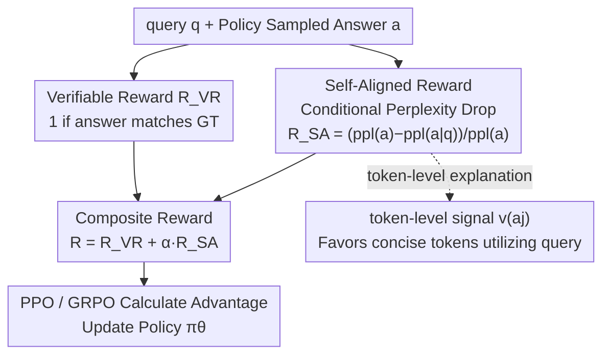

# Self-Aligned Reward: Towards Effective and Efficient Reasoners

**Conference**: ICLR 2026  
**OpenReview**: [https://openreview.net/forum?id=89Pje8STvm](https://openreview.net/forum?id=89Pje8STvm)  
**Code**: https://github.com/amazon-science/Self-Aligned-Reward-Towards_Effective_and_Efficient_Reasoners  
**Area**: Alignment RLHF / LLM Reasoning  
**Keywords**: Reinforcement Learning, Verifiable Rewards, Perplexity, Reasoning Efficiency, Self-critique

## TL;DR
Addressing the coarse-grained limitations of verifiable rewards—which "only check answer correctness and tolerate excessive verbosity"—this paper proposes **Self-Aligned Reward (SAR)**. SAR utilizes the "relative perplexity difference of an answer under conditioned versus unconditioned query scenarios" as a model self-critique signal. When added to the verifiable rewards of PPO/GRPO, it improves accuracy by approximately 4% and compresses answer length by about 30% across 4 models and 7 benchmarks.

## Background & Motivation

**Background**: Reinforcement Learning with Verifiable Rewards (RLVR) is currently the mainstream for training mathematical/logical reasoning LLMs. Mapping "whether the final answer matches the ground truth" to a 0/1 reward and optimizing policy using algorithms like PPO or GRPO has proven effective in works such as DeepSeek-R1 and o1.

**Limitations of Prior Work**: Verifiable rewards are inherently **discrete and coarse-grained**. They only determine whether the final answer is correct and cannot distinguish nuances between different answers. A solution that generates a massive amount of redundant reasoning just to be correct receives full marks as long as the answer matches; a "nearly correct" answer missing by a small margin receives the same zero score as a completely wrong one. This induces "overthinking," where models generate unnecessary padding, driving up latency and costs.

**Key Challenge**: Existing efficiency solutions (length penalty, O1-pruner, Efficient Reasoner, etc.) are forced to choose between "efficiency vs. accuracy." Because they focus solely on penalizing output length, they often **prune necessary intermediate reasoning steps**, saving tokens at the cost of precision. Conversely, using external reward models (RM) is susceptible to reward hacking. The root problem is the lack of an **internally generated, fine-grained reward that distinguishes "necessary reasoning" from "redundant padding."**

**Goal**: To design an internal reward that requires no external supervision, integrates seamlessly into existing RL pipelines, and makes models **simultaneously** more accurate and concise, rather than compromising between the two.

**Key Insight**: The authors observe that perplexity is a fine-grained signal characterizing "how certain the model is about a text segment." A truly relevant answer to a query should be "natural" when given the query (low conditional perplexity); however, if viewed independently without the query, it is unlikely to appear out of thin air (high independent perplexity). This "gap" precisely measures the dependency and alignment of the answer with the query.

**Core Idea**: Use the "relative decrease in perplexity of the answer" as the self-aligned reward $R_{SA}$. This rewards responses that are **highly query-dependent, concise, and information-dense**, and adds it to the verifiable reward to compensate for the latter's coarse-grained nature.

## Method

### Overall Architecture

SAR does not modify the RL algorithm itself; it simply **adds one additional reward term** for each rollout. The overall flow is: given a query $q$, the policy $\pi_\theta$ samples an answer $a$; two perplexities are calculated for this answer—the independent perplexity $\mathrm{ppl}(a)$ without the query and the conditional perplexity $\mathrm{ppl}(a|q)$ given the query; the **relative decrease** between the two is the self-aligned reward $R_{SA}$; this is then weighted by $\alpha$ and added to the original 0/1 verifiable reward $R_{VR}$ to obtain the composite reward $R = R_{VR} + \alpha R_{SA}$; this composite reward is used as usual in PPO/GRPO to calculate advantage and update the policy. The entire process requires no external models or human labeling, as rewards are obtained purely through "self-critique" by the policy itself.

### Key Designs

**1. Self-Aligned Reward: Measuring Query Dependency via Conditional Perplexity Drop**

Verifiable rewards only state "correct/incorrect" and cannot distinguish between "concise-correct" and "verbose-correct." SAR fills this fine-grained gap with a continuous signal:

$$R_{SA} = \mathrm{clip}\!\left(\frac{\mathrm{ppl}(a) - \mathrm{ppl}(a|q)}{\mathrm{ppl}(a)},\, -1,\, 1\right),$$

where the two perplexities are derived from the token-averaged negative log-likelihood: $\mathrm{ppl}(a) = e^{-\frac{1}{|a|}\sum_j \log P(a_j|a_{1\ldots j-1})}$ is the perplexity of the answer viewed in isolation, and $\mathrm{ppl}(a|q) = e^{-\frac{1}{|a|}\sum_j \log P(a_j|q,a_{1\ldots j-1})}$ is the conditional perplexity given the query. Intuitively, this reads: "How much more unlikely does this answer become if the query is removed?" When the answer is tightly aligned with the query, $\mathrm{ppl}(a|q)$ will be significantly lower than $\mathrm{ppl}(a)$, resulting in a large gap and high $R_{SA}$; when the answer contains noise or redundant padding unrelated to the query, the two perplexities converge, resulting in a small gap and low $R_{SA}$. Therefore, a larger $R_{SA}$ represents stronger query dependency and better alignment. Crucially, this signal is obtained **only using the forward computation of the policy itself**, making it independent of any external reward model and naturally immune to reward hacking.

**2. Composite Reward: Verifiable Signal as Skeleton, Self-Alignment as Refinement**

SAR is intended to complement, not replace, the verifiable reward. The final reward is $R = R_{VR} + \alpha R_{SA}$, where $R_{VR}\in\{0,1\}$ remains responsible for the "correctness" hard constraint, and $\alpha$ controls the weight of the self-alignment signal (set to $\alpha=0.2$ for SA-GRPO in experiments). Why are both indispensable? Ablation studies provide direct evidence: using only $R_{SA}$ (without the verifiable reward) causes the model to "cheat"—converging to shallow reasoning with very few tokens (average only 84 words) and a collapsed accuracy of 20.96%, because pursuing perplexity gaps alone encourages short, "self-consistent" answers that do not actually solve the problem. Conversely, using only the verifiable reward returns to the verbose path. By combining them, the verifiable reward maintains the "must answer correctly" baseline for stable training, while the self-aligned reward further filters redundancy and rewards conciseness. This explains why SAR is the **only fine-grained reward effectively addressing both correctness and conciseness** in Table 1.

**3. Token-level Signals: Why SAR Favors "Concise and Query-Utilizing" Responses**

To demonstrate that SAR is not a simple length penalty, the authors decompose the reward to the token level: since $R_{SA} = 1 - \frac{\mathrm{ppl}(a|q)}{\mathrm{ppl}(a)} = 1 - e^{-\frac{1}{|a|}\sum_j \log\frac{P(a_j|q,a_{1\ldots j-1})}{P(a_j|a_{1\ldots j-1})}}$, the contribution of each token can be measured by $v(a_j) = \log\frac{P(a_j|q,a_{1\ldots j-1})}{P(a_j|a_{1\ldots j-1})}$. Tokens with high $v(a_j)$ are those that "introduce new information from the query for the first time" (e.g., names like "Janet" or numbers like "16" in a problem)—they exist in the query but not in the previous answer context, leading to high $P(a_j|q,\cdot)$ and low $P(a_j|\cdot)$. Conversely, repeating already generated information leads to high values for both probabilities, making $v$ near zero or even negative. Since it becomes progressively harder to extract new information from the query as the answer continues, later tokens generally have lower $v$. Mechanistically, this explains why SAR naturally favors **short, dense, and query-aligned** answers: it rewards "effective utilization of query information" rather than mere length compression, thus **preserving necessary reasoning behaviors** while cutting redundancy (the fundamental difference from length penalties).

### Loss & Training

The underlying algorithms use PPO and Dr.GRPO (an unbiased variant of GRPO). The objective function follows the standard clip + KL form, with the only change being replacement of the reward $R_{VR}$ with $R_{VR}+\alpha R_{SA}$. Computational overhead is nearly zero: $\mathrm{ppl}(a|q)$ must be calculated in GRPO anyway (for KL penalty and importance sampling), so SAR only requires one additional forward pass for $\mathrm{ppl}(a)$. The overhead in the Update phase is equivalent to original GRPO, and the Rollout phase is even faster due to shorter answers (see Training Cost table). Evaluation introduces a comprehensive metric **AES**: defined as $\Delta_{len}$ and $\Delta_{acc}$ relative to a reference, $\mathrm{AES}=\Delta_{len}+\gamma\Delta_{acc}$, with $\gamma=5$ (prioritizing accuracy) in experiments.

## Key Experimental Results

The training set merges partitions from GSM8k, MATH, and NuminaMath 1.5; GSM-symbolic and AIME are reserved for generalization testing. Four base models are used: Qwen3-1.7B, Qwen3-4B, Phi-3.5-mini, and Gemma3-1B.

### Main Results (Mathematical Reasoning, 4-Model Average, Excerpt from Table 3)

| Model | Method | Avg acc | Avg len | AES |
|------|------|---------|---------|------|
| Qwen3-1.7B | GRPO | 53.37 | 762.8 | 1.509 |
| Qwen3-1.7B | GRPO-O1 | 52.64 | 572.2 | 1.652 |
| Qwen3-1.7B | **SA-GRPO** | **54.13** | 602.0 | **1.795** |
| Qwen3-4B | GRPO | 69.07 | 1030.6 | 1.165 |
| Qwen3-4B | **SA-GRPO** | **71.41** | 894.0 | 1.564 |
| Phi-3.5-mini | GRPO | 45.91 | 448.2 | 2.003 |
| Phi-3.5-mini | **SA-GRPO** | **46.19** | 368.4 | **2.137** |
| Gemma3-1B | GRPO | 31.78 | 1866.0 | 1.343 |
| Gemma3-1B | **SA-GRPO** | **32.24** | 1017.4 | **2.218** |

Across four models, SA-GRPO consistently achieves the highest accuracy while compressing length by at least 30% and improving accuracy by at least 4% compared to GRPO. Crucially, its output lengths are **comparable to or even shorter than those of efficiency-designed methods (GRPO-O1/ER) without the precision drop they suffer**. SA-PPO shows similar trends over PPO, indicating SAR is algorithm-agnostic.

### Ablation Study (Qwen3-4B, Table 5)

| Reward Config | Avg acc | Avg len | Description |
|---------|---------|---------|------|
| $R_{VR}$ (Pure Verifiable) | 69.07 | 1030.6 | Accurate but verbose |
| $R_{EM}=-\log\mathrm{ppl}(a|q)$ (Entropy Min.) | 55.46 | 1228.8 | Neither accurate nor short |
| $R_{SA}$ (Pure Self-Aligned) | 20.96 | 84.4 | Collapse to shallow reasoning |
| $R_{VR}+\alpha R_{EM}$ | 69.85 | 936.4 | Better than pure entropy but worse than SAR |
| $R_{VR}+\alpha R_{SA}$ (**SA-GRPO**) | **71.41** | **894.0** | Optimal |

### Key Findings
- **Components are indispensable**: Removing the verifiable reward (pure $R_{SA}$) leads to a collapse into 84-word, 20.96% accurate speculative answers, showing that ground-truth signals remain irreplaceable for developing real reasoning and training stability. Removing the self-alignment signal leads back to verbosity.
- **"Conditional Perplexity Drop" > "Entropy Minimization"**: $R_{VR}+\alpha R_{EM}$ is inferior to SAR in both accuracy and efficiency because entropy minimization focuses only on $\mathrm{ppl}(a|q)$, which easily leads to overconfidence, entropy collapse, and suppressed exploration. SAR's relative gap is a more precise measure of answer quality.
- **Out-of-domain Generalization**: On logic reasoning tasks like LogicBench and ProntoQA, SA-GRPO outperforms length-penalty methods in all comparisons and improves upon GRPO in most cases, validating the generalizability of the reward design.
- **Preservation of Reasoning Behavior**: Using GPT-4o to label behaviors (Backtracking, Verification, Sub-goal, Enumeration), length-penalty methods (O1/ER) significantly reduce these behaviors. In contrast, SA-GRPO maintains behavior frequencies nearly identical to GRPO despite 30% fewer tokens—proving it cuts redundancy rather than necessary reasoning.
- **Near-Zero Overhead**: Training Qwen3-4B for the first 200 steps, SA-GRPO took 46.64h total GPU time, comparable to or even lower than GRPO’s 48.08h (Rollout is faster due to shorter answers).

## Highlights & Insights
- **Using the "relative gap" rather than the "absolute value" of perplexity is the most ingenious part**: Absolute perplexity or entropy minimization encourages overconfidence and collapse, whereas the relative gap measures the "incremental dependency of the answer on the query," naturally distinguishing "information utilization" from "unfounded verbosity."
- **Zero extra training cost**: $\mathrm{ppl}(a|q)$ is already calculated in GRPO for KL and importance sampling. SAR only requires one additional $\mathrm{ppl}(a)$ forward pass. This "reuse of existing computations" design allows it to be integrated into almost any RLVR pipeline for free.
- **Content-awareness is why it beats length penalties**: Length penalty is a "one-size-fits-all" deduction based on token count. SAR distinguishes between "query-utilizing tokens" and "redundant tokens" via $v(a_j)$, allowing it to shorten answers without harming reasoning behavior. This "content-dependent reward" philosophy can be transferred to other RL tasks requiring verbose output control, such as Code or Agent tasks.

## Limitations & Future Work
- **Dependency on Perplexity Reliability**: SAR reduces "answer quality" to "conditional perplexity drop." This holds in math/logic tasks where answers are tightly coupled with the query, but for open-ended generation or long-range multi-hop tasks, query-answer dependency is looser; whether the relative gap still accurately reflects quality remains to be verified.
- **Weight $\alpha$ requires tuning**: The weight $\alpha$ controls the accuracy/efficiency trade-off. Optimal values vary by model (swept between 0.05 and 0.3 in the paper), and an adaptive setting mechanism is missing.
- **Collapse of pure $R_{SA}$** reveals the signal can be exploited if used alone. It must be paired with verifiable rewards, limiting its use to **domains with verifiable ground truth**. Applying it to alignment tasks without standard answers is difficult.
- Experiments focused on small models (≤4B). Incremental gains on larger models are yet to be observed.

## Related Work & Insights
- **vs. Length Penalty (O1-pruner / Efficient Reasoner)**: These deduct points based on answer length directly. Efficiency improves but at the cost of accuracy and suppression of necessary reasoning. SAR looks at "content-query alignment," achieving Pareto optimality on the accuracy-efficiency plane.
- **vs. Entropy Minimization / Confidence Methods (Agarwal et al. 2025, etc.)**: These optimize only $\mathrm{ppl}(a|q)$, which is prone to overconfidence and entropy collapse. SAR uses the relative gap, avoiding these issues with higher precision.
- **vs. External Reward Models (RM in RLHF)**: RMs are continuous and content-aware but require extra training and are prone to reward hacking. SAR is obtained entirely via internal self-critique without external models or additional labels.

## Rating
- Novelty: ⭐⭐⭐⭐⭐ Using "relative conditional perplexity drop" as an internal reward is a simple yet fresh perspective, achieving simultaneous improvements in accuracy and efficiency for the first time.
- Experimental Thoroughness: ⭐⭐⭐⭐⭐ 4 models × 7 benchmarks + OOD generalization + 6 types of answer signal analysis + token-level explanation + behavior statistics + cost comparison; the evidence chain is complete.
- Writing Quality: ⭐⭐⭐⭐ Formulas and mechanism explanations are clear. Case analysis explains "why it works" thoroughly. Tables/figures are somewhat dense.
- Value: ⭐⭐⭐⭐⭐ Plug-and-play with zero overhead, algorithm-agnostic, mitigates overthinking. Highly practical for XLVR reasoning training.

<!-- RELATED:START -->

## Related Papers

- [\[ICLR 2026\] Graph-Theoretic Intrinsic Reward: Guiding RL with Effective Resistance](graph-theoretic_intrinsic_reward_guiding_rl_with_effective_resistance.md)
- [\[AAAI 2026\] STELAR-Vision: Self-Topology-Aware Efficient Learning for Aligned Reasoning in Vision](../../AAAI2026/reinforcement_learning/stelar-vision_self-topology-aware_efficient_learning_for_aligned_reasoning_in_vi.md)
- [\[ICLR 2026\] MARS-Sep: Multimodal-Aligned Reinforced Sound Separation](mars-sep_multimodal-aligned_reinforced_sound_separation.md)
- [\[ICLR 2026\] Unsupervised Learning of Efficient Exploration: Pre-training Adaptive Policies via Self-Imposed Goals](unsupervised_learning_of_efficient_exploration_pre-training_adaptive_policies_vi.md)
- [\[ICLR 2026\] Self-Harmony: Learning to Harmonize Self-Supervision and Self-Play in Test-Time Reinforcement Learning](self-harmony_learning_to_harmonize_self-supervision_and_self-play_in_test-time_r.md)

<!-- RELATED:END -->
