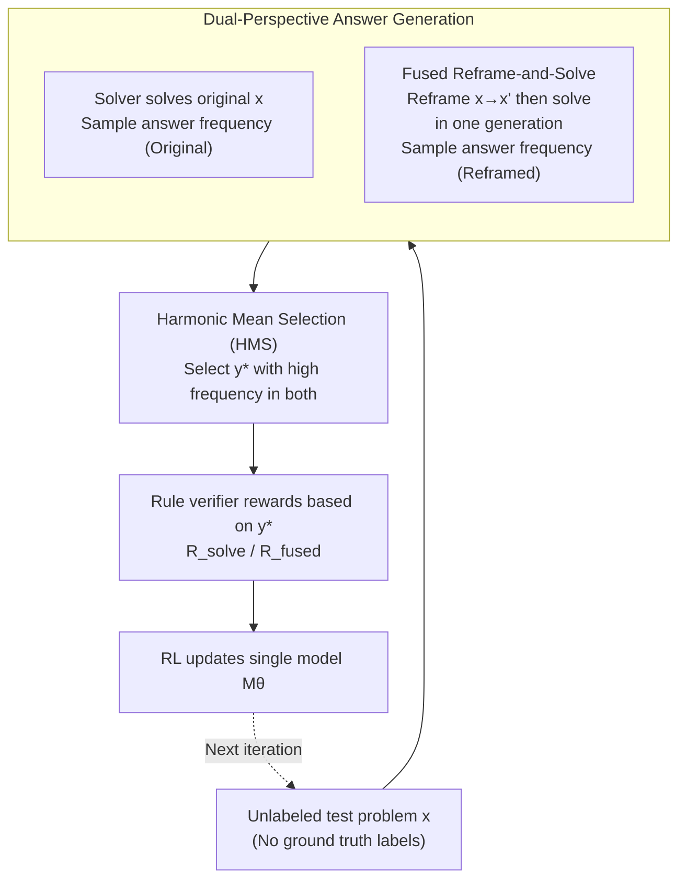

# Self-Harmony: Learning to Harmonize Self-Supervision and Self-Play in Test-Time Reinforcement Learning

**Conference**: ICLR 2026  
**arXiv**: [2511.01191](https://arxiv.org/abs/2511.01191)  
**Code**: [Self-Harmony](https://github.com/) (Marked as publicly available in the paper)  
**Area**: LLM Reasoning / Test-Time Reinforcement Learning  
**Keywords**: Test-Time RL, Self-Play, Pseudo-Label, Harmonic Mean, LLM Reasoning

## TL;DR

The Self-Harmony framework is proposed, where a single model plays two roles (Solver solving the original problem + Reframer restating the problem). The harmonic mean score of the answer under both original and reframed perspectives is used as the pseudo-label selection criterion, replacing traditional majority voting. It achieves SOTA in 28 out of 30 experimental settings with zero training failures.

## Background & Motivation

**Background**: **Test-Time Reinforcement Learning (TTRL) is a new paradigm for LLM reasoning**. TTRL allows models to improve themselves during the inference stage by utilizing unlabeled test data through self-generated feedback signals, without the need for human-annotated data or external model assistance.

**Limitations of Prior Work**: **Majority voting has fatal flaws**. When a model has systematic reasoning defects, incorrect answers may appear more frequently than correct ones. In such cases, majority voting not only fails to correct the error but also amplifies it by selecting the wrong answer as the training target—creating an "echo chamber" effect. Liu et al. (2025b) theoretically proved that when $p(\text{Correct}|x) < p(\text{Wrong}|x)$, the probability of majority voting recovering the correct answer approaches zero as the number of samples increases.

**Key Insight**: **Correct answers should remain stable under different semantically equivalent expressions**. Humans often verify the robustness of an answer by thinking from a different angle when facing uncertainty. Fragile reasoning paths are easily disrupted by changes in wording, whereas correct reasoning remains unaffected by surface forms.

**Limitations of Prior Work**: While external verifiers or reward models (Lightman et al., 2024; Khalifa et al., 2025) are effective, they violate the principle of a "fully self-contained" test-time setup.

## Method

### Overall Architecture

Self-Harmony allows a single model $M_\theta$ to switch between two roles: acting as a Solver $\pi_\theta$ to generate answers to the problem, and as a Reframer $\rho_\theta$ to restate the problem into a semantically equivalent but differently worded version. The system first solves the original problem, then reframes it, and solves the reframed version. This obtains two independent answer distributions for the same problem. Finally, the harmonic mean is used to select answers that are stable across both perspectives as pseudo-labels for reinforcement learning updates. The entire process involves no external verifiers or teacher models, relying solely on a single-model self-play closed loop.

### Key Designs

**1. Dual-perspective answer generation: Using "ask again in a different way" to expose fragile incorrect answers**

Test-time RL lacks ground truth labels and must select pseudo-labels from the model's own samples. The blind spot of majority voting is that incorrect answers can also appear with high frequency. Self-Harmony breaks this by introducing the view-invariance assumption: a truly correct answer should be sampled stably regardless of how the problem is reframed, whereas incorrect answers often depend on specific wording and collapse under different expressions. Specifically, the original problem $x$ is sampled to get answer set $\{y_i\}$, and the reframed problem $x'$ is sampled to get $\{y'_i\}$, calculating the empirical frequencies $\hat{p}_0(a)$ and $\hat{p}_1(a)$ for each candidate answer. Experiments verify this assumption—correct answers show significantly higher consistency across perspectives than incorrect ones, providing the physical basis for pseudo-label filtering.

**2. Harmonic Mean Selection (HMS): Requiring approval from both perspectives**

After obtaining two sets of frequencies, the key is how to fuse them. Self-Harmony uses neither the arithmetic mean nor separate voting, but selects the answer with the highest harmonic mean score as the pseudo-label: $y^\star = \arg\max_a \frac{2\hat{p}_0(a)\hat{p}_1(a)}{\hat{p}_0(a) + \hat{p}_1(a)}$. The harmonic mean is crucial because it is highly sensitive to low values—if an answer's frequency is low in either perspective, the score collapses. Thus, only answers that are frequent in both original and reframed distributions can win. Fragile pseudo-answers that happen to be high-frequency in only one perspective are naturally filtered out. This is not just a heuristic: the paper provides an information-theoretic derivation showing that the harmonic mean is a second-order approximate optimal solution for the View-Invariant Infomax objective $J_\lambda(a) = I(Z_a; A) - \lambda I(Z_a; X)$ at $\lambda = 2$ (Theorem 3.2), theoretically guaranteeing its robustness over majority voting.

**3. Fused Reframe-and-Solve: Compressing three calls into two**

A naive implementation requires three steps: solve → reframe → solve, which involves three model calls and high inference overhead. Self-Harmony uses a system prompt to instruct the model to reframe the problem and immediately solve it within a single generation. This combines reframing and solving into one action, reducing the process to only two model calls and saving one-third of the inference cost without losing the dual-perspective signal.

### Loss & Training

The reward for the solve action is supervised by the pseudo-label: $R_{\text{solve}}(y) = \mathbb{I}[y = y^\star]$. The reward for the fused reframe-solve action uses a gated design—a correct answer is a prerequisite, upon which format and diversity penalties are layered:

$$R_{\text{fused}}(y') = (1 - w_f R_{\text{format}}^{\text{penalty}}(y'))(1 - w_d R_{\text{div}}^{\text{penalty}}(y', y))\mathbb{I}[y' = y^\star]$$

The diversity penalty is measured by the Jensen-Shannon divergence between the answer distributions of the original and reframed problems, encouraging the reframer to provide a truly different perspective rather than just paraphrasing. The gated (rather than additive) design avoids rewarding reframings that "look good but have wrong answers."

## Key Experimental Results

### Main Results

Performance of Qwen3-1.7B-Base on multiple benchmarks:

| Method | MATH500 | GSM8K | AIME2024 | AMC | GPQA | MMLU-Pro |
|------|---------|-------|----------|-----|------|----------|
| Before RL | 42.70 | 65.58 | 3.33 | 26.50 | 20.30 | 16.61 |
| GT-Reward (Upper Bound) | 71.80 | 85.97 | 20.83 | 53.01 | 53.80 | 85.71 |
| Majority-Voting | 64.64 | 83.80 | 9.37 | 37.65 | 24.68 | 44.82 |
| Co-Reward | 64.67 | 86.59 | 6.67 | 39.75 | 23.66 | 47.14 |
| **Self-Harmony** | **69.60** | **87.47** | **10.00** | **40.51** | **27.92** | **53.66** |

Significant improvement for Llama-3.1-8B: GSM8K increased from 60.5% to 91.6%

Significant improvement for Qwen3-4B: MATH500 increased from 60.2% to 78.5%

### Ablation Study

| Configuration | Effect |
|------|------|
| Harmonic Mean vs. Majority Voting | Harmonic mean is superior in almost all settings |
| Dual-perspective Majority Voting vs. Harmonic Mean | Harmonic mean is more stable; dual-perspective voting still has failure modes |
| Gated Reward vs. Additive Reward | Gated design avoids rewarding well-formatted but incorrect outputs |
| Role of Diversity Penalty | Encourages generating reframings that provide new perspectives rather than simple repetition |

### Key Findings

1. **Ranked 1st in 28 out of 30 experimental settings**: Covering 5 open-source models × 6 reasoning benchmarks.
2. **Zero training failures**: No training crashes occurred in any experiments, demonstrating unprecedented stability.
3. **Only 16+16 rollouts needed**: 16 original and 16 reframed rollouts are sufficient for powerful improvement.
4. **Significantly narrowed gap with Ground-Truth Reward (GT-Reward)**: Performance of Self-Harmony is close to the upper bound using real labels.
5. **Instability in baselines like Intuitor and Rent**: These require reporting peak scores (marked *), whereas Self-Harmony uses final step scores.

## Highlights & Insights

1. **Theoretical elegance of the Harmonic Mean**: Naturally derived from the View-Invariant Infomax objective rather than introduced as a heuristic, providing a solid theoretical foundation.
2. **Minimalist single-model dual-role design**: No auxiliary models or external verifiers are needed; roles are switched via prompts, maintaining simplicity and scalability.
3. **Simple yet profound core intuition**: The observation that "correct answers should be stable across perspectives" stems from human cognitive robustness checks and applies equally to LLMs.
4. **Zero failure rate as a major engineering advantage**: The training instability of TTRL methods is a hurdle for deployment; Self-Harmony's stability offers strong practical value.

## Limitations & Future Work

1. **Reframing quality depends on model capability**: If the model itself has weak reframing abilities (e.g., very small models), the Reframer role may cause semantic shifts.
2. **Doubled computational overhead**: Two sets of rollouts (original + reframed) are required for each problem, making inference cost approximately 2x standard TTRL.
3. **Limitations of the View-Invariance assumption**: For some tasks truly sensitive to wording (e.g., logical directionality in NLI), the correct answer might change with the expression.
4. **Validated only on reasoning tasks**: The applicability of harmonic mean pseudo-labels to open-ended generation or summarization has not been explored.
5. **Sensitivity of hyperparameters $w_f, w_d$**: The optimal configuration for weights in the fused reward may vary across different tasks and models.

## Related Work & Insights

- **TTRL (Zuo et al., 2025)**: Pioneered the test-time RL paradigm; Self-Harmony addresses its core weakness in majority voting.
- **Co-Reward**: Uses two models to verify each other; Self-Harmony replaces this with two roles of a single model, making it more concise.
- **Invariant Risk Minimization (Arjovsky et al., 2019)**: Self-Harmony introduces the cross-environment invariance of IRM to TTRL pseudo-label selection.
- **FixMatch (Sohn et al., 2020)**: A pioneer in semi-supervised learning using strong/weak augmentation consistency for pseudo-labeling, serving as a spiritual predecessor to Self-Harmony in the LLM reasoning domain.
- Insight: The harmonic mean as a measure of cross-perspective consistency may be applicable to other scenarios requiring multi-view alignment (e.g., multi-modal fusion, ensemble learning).

## Rating

- **Novelty**: ⭐⭐⭐⭐⭐ — The combination of harmonic mean pseudo-labels and single-model self-play is highly creative and theoretically elegant.
- **Experimental Thoroughness**: ⭐⭐⭐⭐⭐ — 5 models × 6 datasets × multiple baselines; 30 settings are comprehensively covered, and the zero training failure rate is impressive.
- **Writing Quality**: ⭐⭐⭐⭐ — Clear motivation, complete theoretical proofs, and intuitive framework diagrams, though the method section is notation-heavy.
- **Value**: ⭐⭐⭐⭐⭐ — Solves a core problem in TTRL (the majority voting trap); its stability and universality make it a promising default method for TTRL.

<!-- RELATED:START -->

## Related Papers

- [\[ICLR 2026\] SPELL: Self-Play Reinforcement Learning for Evolving Long-Context Language Models](spell_self-play_reinforcement_learning_for_evolving_long-context_language_models.md)
- [\[ICLR 2026\] R-Zero: Self-Evolving Reasoning LLM from Zero Data](r-zero_self-evolving_reasoning_llm_from_zero_data.md)
- [\[ICLR 2026\] Self-Improving Skill Learning for Robust Skill-based Meta-Reinforcement Learning](self-improving_skill_learning_for_robust_skill-based_meta-reinforcement_learning.md)
- [\[ICLR 2026\] SPIRAL: Self-Play on Zero-Sum Games Incentivizes Reasoning via Multi-Agent Multi-Turn Reinforcement Learning](spiral_self-play_on_zero-sum_games_incentivizes_reasoning_via_multi-agent_multi-.md)
- [\[ICLR 2026\] Self-Aligned Reward: Towards Effective and Efficient Reasoners](self-aligned_reward_towards_effective_and_efficient_reasoners.md)

<!-- RELATED:END -->
