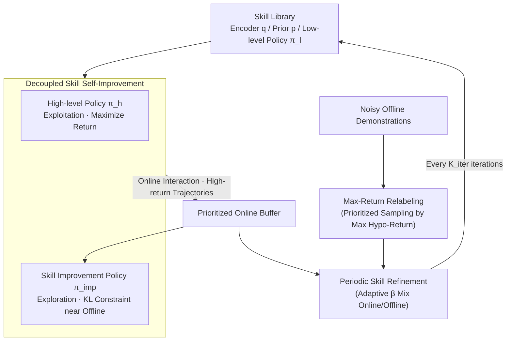

# Self-Improving Skill Learning for Robust Skill-based Meta-Reinforcement Learning

**Conference**: ICLR 2026  
**arXiv**: [2502.03752](https://arxiv.org/abs/2502.03752)  
**Code**: [github.com/epsilog/SISL](https://github.com/epsilog/SISL)  
**Area**: Reinforcement Learning / Meta-Reinforcement Learning / Skill Learning  
**Keywords**: meta-RL, skill learning, noisy demonstrations, self-improvement, maximum return relabeling

## TL;DR

Ours proposes SISL (Self-Improving Skill Learning), which achieves robust skill learning under noisy offline demonstration data by decoupling high-level policies from skill improvement policies and incorporating a skill prioritization mechanism based on maximum return relabeling. This significantly enhances the performance of skill-based meta-reinforcement learning in long-horizon tasks.

## Background & Motivation

**Background**: Skill-based meta-RL methods (such as SiMPL) decompose long state-action sequences into reusable skills, achieving success in long-horizon tasks through hierarchical decision-making. These methods rely on offline demonstration data to learn a low-level skill library, followed by a high-level policy that selects skills online.

**Limitations of Prior Work**: Existing methods are highly dependent on high-quality offline demonstrations. However, real-world data is often noisy due to hardware aging, environmental perturbations, and sensor drift. When offline data quality degrades, the learned skill library becomes contaminated, and this degradation propagates to the high-level policy, ultimately harming adaptation performance.

**Key Challenge**: Existing methods treat all trajectories equally (uniform sampling), causing low-quality samples to dominate skill learning. For example, in the Kitchen Microwave task, skills learned from noisy data may fail even at the basic grasping stage.

**Key Insight**: A self-improvement mechanism is designed to decouple the high-level exploitation policy from an independent skill improvement policy. This allows the improvement policy to explore superior behaviors near the offline data distribution while prioritizing high-value trajectories through return relabeling.

## Method

### Overall Architecture

SISL separates "executing skills" and "improving skills" into two parallel, alternating tracks. In the online stage, the high-level policy $\pi_h$ utilizes the current skill library to maximize task returns, focusing solely on exploitation. Meanwhile, an independent skill improvement policy $\pi_{\text{imp}}$ explores superior behaviors near the offline data distribution, storing discovered high-performance trajectories into a prioritized online buffer. On the offline side, instead of treating all data uniformly, "maximum return relabeling" is used to prioritize each noisy trajectory, suppressing the influence of low-quality samples. Every $K_{\text{iter}}$ iterations, the relabeled offline data and high-return online exploration data are mixed using adaptive weights to retrain the skill encoder $q$, skill prior $p$, and low-level policy $\pi_l$. This allows the skill library to be refined iteratively rather than being fixed by the original noisy data.

### Key Designs

**1. Decoupled Skill Self-Improvement: Separating Exploitation and Exploration**

If the online interaction is handled by a single high-level policy that must both maximize scores and explore new behaviors, the two objectives may conflict—conservative exploitation fails to learn better skills, while aggressive exploration sacrifices current returns. SISL decouples these into two policies: $\pi_h$ focuses on maximizing returns using the current skill library, while a separate improvement policy $\pi_{\text{imp}}$ explores superior behaviors. The training objective for $\pi_{\text{imp}}$ combines an RL loss with a KL constraint: $\sum_i \mathbb{E}_{\tau^i \sim \mathcal{B}_{\text{imp}}^i \cup \mathcal{B}_{\text{on}}^i} [\mathcal{L}_{\text{imp}}^{\text{RL}}(\pi_{\text{imp}})] + \lambda_{\text{imp}}^{\text{kld}} \mathbb{E}_{\tau^i \sim \mathcal{B}_{\text{on}}^i} \mathcal{D}_{\text{KL}}(\hat{\pi}_d^i \| \pi_{\text{imp}})$. The former drives it to discover higher-return behaviors, while the latter uses KL divergence to keep it near the offline demonstration distribution, preventing erratic exploration outside the existing skill space. High-return trajectories from exploration enter the prioritized online buffer $\mathcal{B}_{\text{on}}^i$, serving as both self-supervised feedback for $\pi_{\text{imp}}$ and clean samples for subsequent skill refinement.

**2. Skill Prioritization via Maximum Return Relabeling: Suppressing Noise**

If skill refinement samples offline data uniformly, noisy trajectories dominate because there is no metric to distinguish trajectory quality during training. SISL trains a reward model $\hat{R}(s_t, a_t, i)$ to calculate the maximum hypothetical return for each offline trajectory across all tasks: $\hat{G}(\tilde{\tau}) = \max_i \{ \sum_t \gamma^t \hat{R}(s_t, a_t, i) \}$. This identifies "the value of a trajectory if assigned to its most suitable task." Sampling is then performed according to the distribution $P_{\mathcal{B}_{\text{off}}}(\tilde{\tau}) = \text{Softmax}(\hat{G}(\tilde{\tau}) / T)$. High-value trajectories are sampled more frequently, while noisy ones are down-weighted. The temperature $T$ controls the sharpness of this preference (e.g., 1.0 for Kitchen, 0.5 for Maze2D). This ensures offline samples are "cleaned" before entering skill refinement.

### Loss & Training

The final objective for skill refinement dynamically mixes "filtered offline data" and "exploratory online data": $\mathcal{L}_{\text{skill}} = (1 - \beta) \mathbb{E}_{\tilde{\tau} \sim P_{\mathcal{B}_{\text{off}}}} [\mathcal{L}(\pi_l, q, p, z)] + \frac{\beta}{N_{\mathcal{T}}} \sum_i \mathbb{E}_{\tau^i \sim \mathcal{B}_{\text{on}}^i} [\mathcal{L}(\pi_l, q, p, z)]$. The mixing coefficient $\beta$ is not a fixed hyperparameter but is calculated adaptively based on the average returns of online and offline data: $\beta = \frac{\exp(\bar{G}_{\text{on}} / T)}{\exp(\bar{G}_{\text{on}} / T) + \exp(\bar{G}_{\text{off}} / T)}$. When explored online data is superior to the original offline data, $\beta$ increases to favor online samples; otherwise, it retains the weight of offline data, acting as an automated curriculum.

## Key Experimental Results

### Main Results: Average Final Test Returns across Four Long-Horizon Environments

| Environment (Noise) | SAC | PEARL | SPiRL | SiMPL | **SISL** |
|------------|-----|-------|-------|-------|----------|
| Kitchen (Expert) | 0.01 | 0.23 | 3.11 | 3.40 | **3.97** |
| Kitchen ($\sigma=0.2$) | - | - | 2.06 | 2.18 | **3.73** |
| Kitchen ($\sigma=0.3$) | - | - | 0.83 | 0.81 | **3.48** |
| Office (Expert) | 0.00 | 0.01 | 0.65 | 2.50 | **2.86** |
| Office ($\sigma=0.3$) | - | - | 0.42 | 0.11 | **1.68** |
| Maze2D (Expert) | 0.20 | 0.10 | 0.77 | 0.80 | **0.87** |
| Maze2D ($\sigma=1.5$) | - | - | 0.81 | 0.68 | **0.99** |
| AntMaze (Expert) | 0.00 | 0.00 | 0.64 | 0.67 | **0.81** |

### Ablation Study: Component Contributions (Kitchen $\sigma=0.3$)

| Variant | Final Return |
|------|---------|
| **SISL (Full)** | **3.48** |
| w/o $\mathcal{B}_{\text{off}}$ | Sig. Decrease |
| w/o $P_{\mathcal{B}_{\text{off}}}$ (Uniform) | Notable Decrease |
| w/o $\mathcal{B}_{\text{on}}$ | Sig. Decrease |
| w/o $\pi_{\text{imp}}$ | Notable Decrease |

### Key Findings

- SPiRL and SiMPL suffer severe performance degradation as noise increases, whereas SISL remains robust across all noise levels.
- In Kitchen $\sigma=0.3$, SiMPL returns only 0.81, while SISL reaches 3.48 (a 4.3x improvement).
- In Maze2D $\sigma=1.5$, SISL achieves a nearly perfect success rate of 0.99.
- SISL increases training computational overhead by only ~16%, with zero increase in meta-test costs.

## Highlights & Insights

1. **Novel Problem Identification**: Systematically identifies the propagation chain from noisy skill libraries to high-level policy degradation.
2. **Decoupled Design**: Separating exploitation (high-level policy) and exploration (improvement policy) prevents objective conflicts.
3. **Adaptive Mixing**: The $\beta$ coefficient dynamically adjusts based on data quality, forming an automated curriculum.
4. **Lightweight Enhancement**: Significant performance gains with only 16% additional computation, requiring no changes to the meta-testing pipeline.

## Limitations & Future Work

- Meta-testing still requires fine-tuning (0.5K iterations); zero-shot skill transfer remains an important direction.
- The reward model relies on simple sub-task completion rewards; complex reward functions might require task-wise normalization.
- The temperature parameter $T$ requires environment-specific tuning (1.0 for Kitchen, 0.5 for Maze2D) and should ideally be adaptive.
- Evaluations are limited to simulated environments; verification on real robots is currently lacking.

## Related Work & Insights

- SPiRL/SiMPL serve as direct baselines: SISL naturally extends these frameworks with a self-improvement mechanism.
- Distinction from offline-to-online RL: The latter assumes reward-labeled offline data for pre-training, whereas SISL performs skill learning from reward-free offline data.
- The maximum return relabeling concept can be generalized to other scenarios requiring learning from low-quality data (e.g., learning from human demonstrations).

## Rating

- **Novelty**: ⭐⭐⭐⭐ — The combination of decoupled improvement policies and return relabeling is effective and novel.
- **Experimental Thoroughness**: ⭐⭐⭐⭐ — Comprehensive testing across multiple environments and noise levels with solid ablations.
- **Writing Quality**: ⭐⭐⭐⭐ — Clear motivation and intuitive diagrams.
- **Value**: ⭐⭐⭐⭐ — Addresses the critical issue of uncontrollable data quality in practical applications.

<!-- RELATED:START -->

## Related Papers

- [\[ICLR 2026\] Reference Grounded Skill Discovery](reference_grounded_skill_discovery.md)
- [\[ICLR 2026\] Skill Learning via Policy Diversity Yields Identifiable Representations for Reinforcement Learning](skill_learning_via_policy_diversity_yields_identifiable_representations_for_rein.md)
- [\[ICLR 2026\] Master Skill Learning with Policy-Grounded Synergy of LLM-based Reward Shaping and Exploring](master_skill_learning_with_policy-grounded_synergy_of_llm-based_reward_shaping_a.md)
- [\[ICLR 2026\] SUSD: Structured Unsupervised Skill Discovery through State Factorization](susd_structured_unsupervised_skill_discovery_through_state_factorization.md)
- [\[ICLR 2026\] Masked Skill Token Training for Hierarchical Off-Dynamics Transfer](masked_skill_token_training_for_hierarchical_off-dynamics_transfer.md)

<!-- RELATED:END -->
