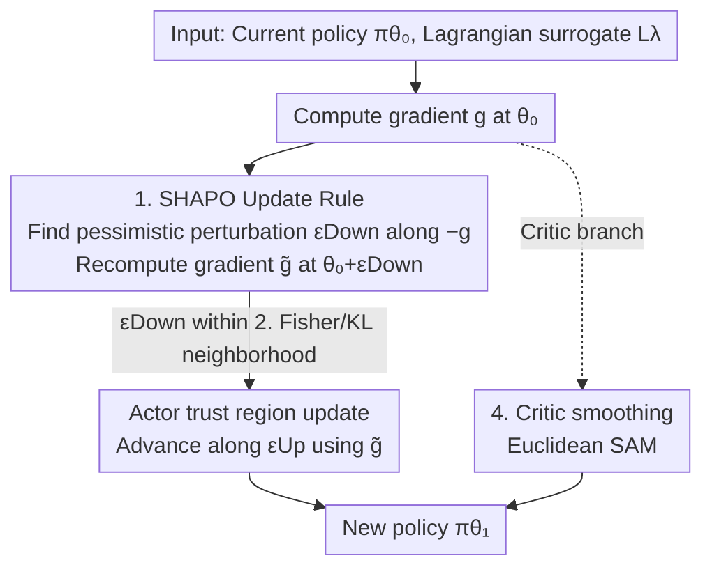

# SHAPO: Sharpness-Aware Policy Optimization for Safe Exploration

**Conference**: ICLR 2026  
**OpenReview**: [https://openreview.net/forum?id=7cUxi8LbKD](https://openreview.net/forum?id=7cUxi8LbKD)  
**Code**: https://anonymous.4open.science/r/Safe-Policy-Optimization-813E (Available)  
**Area**: Reinforcement Learning / Safe Reinforcement Learning  
**Keywords**: Safe Exploration, Sharpness-Aware Optimization, Epistemic Uncertainty, Policy Optimization, Fisher Information

## TL;DR
SHAPO applies Sharpness-Aware Minimization (SAM) to policy updates: instead of taking the gradient at the current parameters $\theta_0$, it first identifies a nearby parameter $\theta_0+\epsilon_{\text{Down}}$ under Fisher/KL geometry that "worsens" the objective, and then uses the gradient from that point to update the policy. This maintains pessimism regarding the actor's epistemic uncertainty, simultaneously improving safety and returns across multiple continuous control tasks and significantly broadening the safety-efficiency Pareto frontier.

## Background & Motivation
**Background**: The prerequisite for deploying reinforcement learning in safety-critical scenarios is "safe exploration"—agents must collect informative experiences while avoiding catastrophic failures. This is typically modeled as a Constrained Markov Decision Process (CMDP), using a Lagrangian objective $J_\lambda(\pi_\theta)=J_r(\pi_\theta)-\lambda\big(J_c(\pi_\theta)-\beta\big)$ to balance reward and cost, paired with on-policy algorithms like TRPO/CPO/PIDLag for trust region updates.

**Limitations of Prior Work**: During early training, agents inevitably enter states they "know little about"—regions with high **epistemic uncertainty**. In these areas, estimates of both the policy and value functions are unreliable, and a single exploratory step can cause irreversible danger. However, existing work handling uncertainty focuses almost entirely on the **critic side** (ensembles, dropout, distributional critics + risk measures). These characterize reward fluctuations but **do not provide a concept for actor parameter uncertainty that can be directly used for optimization**. Maintaining an explicit posterior for policy parameters is largely infeasible in deep on-policy RL, leaving a void in actor-side risk aversion.

**Key Challenge**: Safe exploration depends on every policy encountered during the learning process; thus, the **update rule itself** should be pessimistic toward unreliable estimates. Standard policy gradients are calculated at $\theta_0$, representing an "overconfident" update that ignores parameter uncertainty around $\pi_0$.

**Goal**: Design an actor-side update rule that applies a "discount" for parameter uncertainty at every step, reducing both cumulative training costs and occasional high-cost tail events.

**Key Insight**: The authors observe a property of Sharpness-Aware Optimization (SAM/Fisher-SAM)—**sharpness (sensitivity to parameter perturbations) can serve as a practical proxy for epistemic uncertainty**. If a small perturbation can flip policy behavior, it indicates insufficient data support and high uncertainty at that point.

**Core Idea**: Replace the "gradient at the current point" with the "gradient at the worst neighbor"—first find a perturbed parameter that is distributionally close to $\pi_0$ but worsens the objective, then take the gradient there to update the policy, achieving "pessimism in the face of epistemic uncertainty."

## Method

### Overall Architecture
SHAPO is not a new standalone algorithm but a **replacement update rule** that can be embedded into almost all on-policy safe RL algorithms (TRPO-Lagrangian, CPO, PIDLag, CRPO, SauteRL). The standard approach computes the gradient $g=\nabla_\theta L^\lambda_{\pi_0}(\theta)|_{\theta_0}$ of the Lagrangian surrogate objective $L^\lambda_{\pi_0}$ at the current parameters $\theta_0$, followed by a trust region update along $g$. SHAPO inserts an intermediate step: it first finds the perturbation $\epsilon_{\text{Down}}=U_{F_{\theta_0}}(-g,\delta_{\text{Down}})$ that most **deteriorates** the objective within a **Fisher trust region** $\frac12\epsilon^\top F_{\theta_0}\epsilon\le\delta_{\text{Down}}$; it then recomputes the gradient $\tilde g=\nabla_\theta L^\lambda_{\pi_0}(\theta)|_{\theta_0+\epsilon_{\text{Down}}}$ at this "pessimistic neighbor" $\theta_0+\epsilon_{\text{Down}}$; finally, it performs the trust region update $\epsilon_{\text{Up}}=U_{F_{\theta_0}}(\tilde g,\delta_{\text{Up}})$ using $\tilde g$ (instead of $g$) to obtain the new policy. Additionally, a Euclidean SAM is applied to the critic side for smoothing. The process is outlined below:

### Key Designs

**1. SHAPO Update Rule: Gradient from the "Worst Neighbor"**

Standard trust region updates rely only on the gradient $g$ at $\theta_0$, which assumes "my current estimate is correct," leaving the agent vulnerable to overconfidence in data-sparse regions early in training. SHAPO introduces the SAM principle of "maximizing the worst-case objective within a neighborhood" $\max_\pi \min_{\tilde\pi\in N(\pi)} J_\lambda(\tilde\pi)$ into policy optimization. It first solves the inner minimization $\min_{\tilde\pi\in N(\pi_0)} L^\lambda_{\pi_0}(\tilde\pi)$ to find a policy $\tilde\pi=\pi_{\theta_0+\epsilon_{\text{Down}}}$ that is worse than $\pi_0$ but remains within the neighborhood, then uses the gradient at that point to update $\theta_0$. Because it only replaces the gradient direction without changing other hyperparameters, it can be applied as a plug-and-play enhancement to any on-policy safe RL algorithm.

**2. Defining Perturbation Neighborhoods in Fisher/KL Geometry**

The choice of the perturbation neighborhood $N(\pi_0)$ is critical. Using a Euclidean neighborhood $\|\theta-\theta_0\|_2$ does not guarantee that the policy remains close to $\pi_0$ in terms of $D^{\max}_{\text{KL}}$—a small step in parameter space might lead to a completely different distribution, causing the surrogate objective validity (Theorem 1) to fail. SHAPO utilizes **distributional geometry**: the inner minimization is framed as a constrained problem with a KL trust region $\min_{\tilde\pi} L^\lambda_{\pi_0}(\tilde\pi)\ \text{s.t.}\ D^{\max}_{\text{KL}}(\pi_0,\tilde\pi)\le\delta_{\text{Down}}$. After second-order approximation, the KL constraint becomes the Fisher metric $\frac12\epsilon^\top F_{\theta_0}\epsilon\le\delta_{\text{Down}}$, and the perturbation $\epsilon_{\text{Down}}=U_{F_{\theta_0}}(-g,\delta_{\text{Down}})$ follows the local geometry of the statistical manifold.

**3. Interpreting Perturbations as Pessimistic Estimates under Epistemic Uncertainty**

The authors provide a Bayesian justification for perturbing in the direction that worsens the objective. Using the Bernstein–von Mises theorem, uncertainty regarding current parameters is modeled as $Q(\theta)=\mathcal N(\theta_0,\tfrac1n F^{-1})$ (where $n$ is the number of effective independent samples). Parameter uncertainty propagates to the reward: under first-order approximation, the reward deviation $Y=L^\lambda_{\pi_0}(\theta)$ follows $\mathcal N(0,\sigma^2)$ with $\sigma^2=\tfrac1n g^\top F^{-1}g$. The mean $L^\lambda_{\pi_0}(\theta_0)=0$ is an "optimistic estimate," whereas parameters at low quantiles (e.g., 5%) reflect "credible but bad scenarios." Proposition 2 proves that under the constraint $\delta_{\text{Down}}=\tfrac{z_\alpha^2}{2n}$, SHAPO's $\epsilon_{\text{Down}}$ exactly matches the parameter that is most likely under $Q(\theta)$ while falling into the $\alpha$-quantile tail. Thus, when updating $\theta_0$, SHAPO prioritizes improving a **pessimistic reward estimate**, with $\delta_{\text{Down}}$ acting as a dial for "confidence/pessimism."

**4. Tasks for Actor (Fisher-SAM) and Critic (Euclidean SAM)**

SHAPO uses different versions of SAM for the actor and critic. The actor uses the Fisher geometry perturbation described above, as only this can inject true "risk aversion" into policy updates. The critic uses the standard Euclidean SAM to keep the value function within flatter, more stable regions. The authors emphasize an asymmetry: adding SAM only to the critic (SAM Critic) does not promote safe exploration and may even increase costs, as squared error perturbations treat underestimation and overestimation symmetrically. Adding SHAPO only to the actor (SHAPO Actor) significantly improves safety, and using both yields the best results.

### Loss & Training
The core objective remains the CMDP surrogate $L^\lambda_{\pi_0}$ with Lagrangian multipliers; SHAPO simply changes the evaluation point for its gradient. The key hyperparameters are the pessimism intensity $\delta_{\text{Down}}$ (and $\rho_{\text{critic}}$ for the critic). Baseline hyperparameters are frozen when adding SHAPO, ensuring the safety-efficiency trade-off is determined by the baseline while SHAPO provides an orthogonal improvement. $\delta_{\text{Down}}$ can be scheduled by keeping it fixed (pessimism increases as samples $n_t$ accumulate) or by fixing the quantile $\alpha$ and letting $\delta^t_{\text{Down}}=\tfrac{z_\alpha^2}{2n_t}$ decay.

## Key Experimental Results

### Main Results
Experiments were conducted in Safety Gym (PointGoal1-v0, PointButton1-v0 with cost threshold $\beta=10$) and MuJoCo (Ant-v4, Walker2d-v4), with 5 random seeds. Main results are presented via **safety-efficiency Pareto scatter plots** (Cost Rate vs Return for Safety Gym, Cumulative Failures/Total Cost for MuJoCo).

| Task | Safety Metric | SHAPO Performance vs. Baselines |
|------|---------------|---------------------------------|
| PointGoal1-v0 | Cost Rate vs Return | Consistently expands the Pareto frontier across four baselines; reduces cost even for low cost-rate baselines like SauteRL without sacrificing reward. |
| PointButton1-v0 | Cost Rate vs Return | Improves both safety and efficiency simultaneously. |
| Ant-v4 | Cumulative Failures | Reduces cumulative failures and suppresses the 95th percentile cost tail. |
| Walker2d-v4 | Cumulative Failures | Reduces cumulative failures and suppresses the 80th percentile cost tail. |

Sweeping the initial multiplier $\lambda_{\text{init}}$ for PIDLag (Fig. 4) shows that SHAPO pushes the Pareto frontier outward in **every configuration**, proving the improvement is not dependent on specific hyperparameter settings. SHAPO also systematically suppresses the heavy tail of episodic cost distributions.

### Ablation Study

| Configuration | Conclusion | Explanation |
|------|------|------|
| Fisher Perturbation (SHAPO) vs. Euclidean (E-SAM) | SHAPO is consistently better | Fisher perturbations align with the local geometry of on-policy data. |
| SAM on Critic only (SAM Critic) | No safety gain; may increase cost | Symmetric perturbations in squared error lack directional risk aversion. |
| SHAPO on Actor only (SHAPO Actor) | Significant safety improvement | Actor-side pessimism is the primary driver of safe exploration. |
| Complete SHAPO (Actor + Critic) | Strongest performance | Synergistic effects between the two. |

### Key Findings
- **Actor is more critical than critic**: Applying sharpness-aware optimization to the actor has a far greater impact on safe exploration than applying it to the critic.
- **Fisher geometry is indispensable**: Euclidean perturbations (E-SAM) are consistently weaker than Fisher perturbations, confirming that pessimism must be applied within the distributional/KL geometry.
- **Tail suppression**: SHAPO does not just lower average cost; it specifically suppresses high-percentile cost tails, which is crucial for safety-critical exploration.

## Highlights & Insights
- **Sharpness as a proxy for epistemic uncertainty**: Using sensitivity to parameter perturbations to approximate data sufficiency bypasses the impossibility of maintaining parameter posteriors in deep on-policy RL.
- **Unified language of optimization and Bayes**: Proposition 2 maps the trust region constraint $\delta_{\text{Down}}$ directly to a quantile $\alpha$, giving "pessimism level" both an optimization and probabilistic interpretation.
- **Plug-and-play**: Orthogonal improvements to CPO/PIDLag/CRPO/SauteRL by adjusting only $\delta_{\text{Down}}$ while freezing other parameters.
- **Transferability**: The "gradient at the worst neighbor" approach is not limited to safe RL and could benefit any policy optimization requiring pessimism (e.g., offline RL, robust control).

## Limitations & Future Work
- **Estimating sample size $n$**: The theory $\delta_{\text{Down}}=\tfrac{z_\alpha^2}{2n}$ depends on independent samples, which is difficult to calculate in RL due to temporal correlation.
- **Hyperparameter tuning**: The perturbation radii $\delta_{\text{Down}}$ and $\rho_{\text{critic}}$ remain task-dependent.
- **Simplified analytical model**: The intuition regarding rare action weighting comes from 1D Gaussian policies; its strict validity in high-dimensional deep networks remains empirical.
- **Evaluation scale**: The study relies on scatter plots across 4 tasks; it lacks large-scale numerical tables, making statistical significance harder to parse.

## Related Work & Insights
- **vs. Critic-side uncertainty (Ensembles/Dropout)**: These methods characterize reward fluctuations for risk-sensitive control but do not address optimizable actor parameter uncertainty. SHAPO fills this gap.
- **vs. SAM/Fisher-SAM (Supervised Learning)**: While original SAM seeks flat minima for generalization, SHAPO reinterprets it as "pessimism toward epistemic uncertainty" within Fisher/KL geometry.
- **vs. SauteRL/State Augmentation**: Those methods control constraints by incorporating remaining budget into the state. SHAPO is a pure update-rule improvement that can be stacked with them.

## Rating
- Novelty: ⭐⭐⭐⭐⭐ Reinterprets sharpness/Fisher-SAM as actor-side epistemic pessimism with a strong Bayesian-optimization link.
- Experimental Thoroughness: ⭐⭐⭐⭐ Covers 5 baselines and multiple seeds with good ablations, though numerical tables are missing.
- Writing Quality: ⭐⭐⭐⭐ Clear theoretical derivation and motivation.
- Value: ⭐⭐⭐⭐⭐ Plug-and-play, orthogonal to baselines, and specifically targets cost tail suppression for practical safety.

<!-- RELATED:START -->

## Related Papers

- [\[ICLR 2026\] Safe Exploration via Policy Priors](safe_exploration_via_policy_priors.md)
- [\[ICLR 2026\] Off-Policy Safe Reinforcement Learning with Constrained Optimistic Exploration](off-policy_safe_reinforcement_learning_with_cost-constrained_optimistic_explorat.md)
- [\[ICLR 2026\] Geometric-Mean Policy Optimization](geometric-mean_policy_optimization.md)
- [\[ICLR 2026\] Deep SPI: Safe Policy Improvement via World Models](deep_spi_safe_policy_improvement_via_world_models.md)
- [\[ICLR 2026\] Primal-Dual Policy Optimization for Linear CMDPs with Adversarial Losses](primal-dual_policy_optimization_for_linear_cmdps_with_adversarial_losses.md)

<!-- RELATED:END -->
