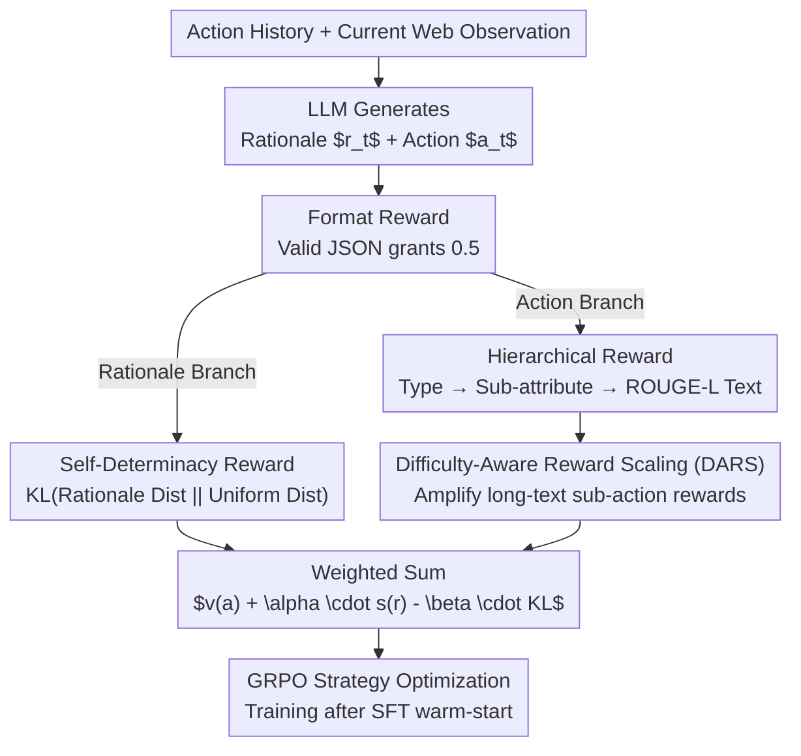

# Shop-R1: Rewarding LLMs to Simulate Human Behavior in Online Shopping via Reinforcement Learning

## Meta Information
- **Conference**: ICLR 2026
- **arXiv**: [2507.17842](https://arxiv.org/abs/2507.17842)
- **Code**: [https://damon-demon.github.io/shop-r1.html](https://damon-demon.github.io/shop-r1.html)
- **Area**: Reinforcement Learning
- **Keywords**: LLM, reinforcement learning, human behavior simulation, online shopping, hierarchical reward, GRPO

## TL;DR
The authors propose Shop-R1, a framework that utilizes a hierarchical reward mechanism and difficulty-aware scaling in reinforcement learning to significantly enhance the ability of LLMs to simulate real human online shopping behavior. Compared to SFT baselines, it achieves an improvement of over 65% in exact action matching.

## Background & Motivation
- LLMs show potential in simulating human web behavior, but existing methods (zero-shot prompting, SFT) remain suboptimal.
- **Zero-shot prompting**: Lacks personalization and adaptability, yielding extremely low accuracy (0.32%).
- **SFT methods**: Use Claude 3.5 Sonnet to generate "rationale-action" training data for fine-tuning, but performance is limited by the capability ceiling of the teacher model.
- **RL Challenges**: Direct RL using sparse binary rewards performs poorly (1.01%) and is prone to reward hacking—where the model repeatedly predicts simple "terminate" actions to obtain easy rewards.
- Core Problem: How to design RL rewards suitable for behavior simulation (rather than task completion)?

## Method

### Overall Architecture
Shop-R1 decomposes "simulating human shopping" into two prediction steps: given the current web context and action history, the model first generates a behavior rationale ($r_t$) and then predicts the next action ($a_t$)—click, type_and_submit, or terminate. The challenge lies in the lack of ground truth for real rationales and the tendency for models to exploit binary rewards by outputting "terminate" repeatedly. The core contribution of Shop-R1 is a set of progressive reward functions designed specifically for behavior simulation: a **Format Reward** ensures output parsability; a **Self-Determinacy Reward** provides unsupervised supervision for the rationale branch; a **Hierarchical Reward** scores the action branch at both coarse and fine granularities; and **Difficulty-Aware Reward Scaling (DARS)** eliminates reward hacking. After SFT warm-starting, the policy is optimized using GRPO with these four integrated signals.

### Key Designs

**1. Format Reward: Ensuring Reliability for Subsequent Reward Calculations**

Behavior simulation rewards must be calculated separately for the rationale and action fields, which requires reliable parsing. Shop-R1 uses a binary format reward as a gatekeeper: if the output is valid JSON containing both rationale and action keys, it receives 0.5; otherwise, it receives 0. This step does not judge content quality but ensures structural availability for downstream rewards, preventing meaningless gradients from malformed outputs.

**2. Self-Determinacy Reward: Supervising Rationale Quality Without Labels**

Real human rationales are difficult to obtain, making supervised signals for rationales unavailable. Shop-R1 uses the model's "confidence" in its own reasoning as a proxy: the average KL divergence between the rationale token distribution and a uniform distribution is used as a reward $s(r_t | q_t) = \frac{1}{N|V|} \sum_{j=1}^{N} \sum_{i=1}^{|V|} p_{ij} \log\left(\frac{p_{ij}}{U_i}\right)$, where $N$ is the number of tokens, $|V|$ is vocabulary size, and $U_i$ is the uniform distribution. A sharper distribution indicates higher certainty and consistency, yielding a higher reward. This drives the rationale toward being "confident and consistent" rather than vague.

**3. Hierarchical Reward: Providing Signals at Both Coarse and Fine Granularities**

Action correctness is not binary; predicting the correct action type is partially correct, but sub-action attributes (button names, input text) must also match. Shop-R1 aggregates action rewards hierarchically—first checking the type, then the attributes, and finally the text similarity (using ROUGE-L). The specific values are as follows:

| Action Type | Type Reward | Sub-attribute Reward | Text Similarity Reward |
|---------|---------|--------------|--------------|
| terminate | 0.3 | N/A | N/A |
| click | 0.3 | +0.2 (if name ≠ ∅) | +DARS × ROUGE-L(name) |
| type_and_submit | 0.3 | +0.1 (name) + 0.1 (text) | +0.1×ROUGE-L(name) + DARS×ROUGE-L(text) |

This additive structure allows the model to receive partial credit for correct types or near-matches, optimizing for both category-level and exact-match objectives.

**4. Difficulty-Aware Reward Scaling (DARS): Solving the Terminate Exploitation**

Predicting an action type (1-of-3) is much easier than predicting a specific button label or search query. If components are weighted equally, the model discovers it can achieve consistent rewards by repeatedly outputting the simple "terminate" action (reward hacking). DARS applies a large multiplier (default 1000) to reward terms associated with difficult long-text sub-actions. This ensures that the payoff for correctly predicting difficult components far outweighs the easy rewards from "terminate," mechanically eliminating the shortcut.

### Loss & Training
The overall RL objective combines the hierarchical action reward with the self-determinacy term and KL regularization against the reference policy:

$$\max_{\pi_\theta} \mathbb{E}_{r,a \sim \pi_\theta(q)} \left[ v(a) + \alpha s(r) - \beta \text{KL}(\pi_\theta(r,a|q) \| \pi_{\text{ref}}(r,a|q)) \right]$$

Where $v(a)$ is the hierarchical action reward, $\alpha=0.005$ controls the self-determinacy weight, and $\beta=0.001$ regulates the KL penalty to prevent divergence from the SFT policy. Training occurs in two stages: an SFT warm-start (4 epochs, lr=2e-5) on rationale-action data generated by Claude to learn basic formats, followed by GRPO strategy optimization (500 steps, lr=1e-7, batch=64, context length 32K).

## Key Experimental Results

### Main Results: Performance Comparison Across Methods

| Model (Qwen-2.5-3B) | Exact Action Match | Action Type Accuracy | Action Type F1 |
|---------------------|------------|--------------|-----------|
| Zero-shot | 0.32% | 15.33% | 16.15% |
| RL (Binary) | 1.01% | 6.17% | 9.92% |
| SFT | 16.76% | 22.25% | 24.52% |
| SFT + RL (Binary) | 16.55% | 23.74% | 28.07% |
| **Shop-R1 (Ours)** | **27.72%** | **36.40%** | **31.28%** |

> Shop-R1 improves exact match performance by over 65% compared to the SFT baseline, while simultaneously enhancing action type and fine-grained matching.

### Ablation Study: Performance Across Model Scales

| Model Scale | SFT | Shop-R1 | Gain |
|---------|-----|---------|------|
| Qwen-2.5-0.5B | 9.90% | **27.72%** | +180% |
| Qwen-2.5-1.5B | 10.86% | **24.11%** | +122% |
| Qwen-2.5-3B | 16.76% | **27.72%** | +65% |

> The hierarchical reward mechanism provides more significant gains for smaller models; the 0.5B model even matches the performance of the 3B model.

### Key Findings
1. Sparse binary RL rewards are insufficient for behavior simulation and can lead to model degradation.
2. Hierarchical rewards simultaneously improve coarse-grained (type-level) and fine-grained (exact match) performance.
3. DARS effectively prevents reward hacking (stopping the model from only predicting "terminate").
4. The self-determinacy signal provides effective supervision for rationales lacking ground truth.
5. The framework generalizes across different web pages and GUI interaction tasks.

## Highlights & Insights
- **First application of RL to simulation-oriented behavior modeling**, distinct from task-completion-oriented Web Agent research.
- **Meticulous reward engineering**: A progressive design from format to reasoning, action type, and sub-action attributes.
- **The DARS mechanism** elegantly addresses the reward hacking problem in multi-step action prediction.
- **0.5B Model = 3B Model Performance**: Demonstrates that reward design can be more critical than model scale in specific simulation tasks.

## Limitations & Future Work
- Tasks remain confined to a specific e-commerce environment (Shop-CART dataset); generalization needs further validation.
- Rationale quality is only indirectly evaluated via self-determinacy, lacking external verification.
- A significant gap remains between model predictions and real human behavior (27.72% exact match).
- Context length constraints (32K tokens) may result in the loss of information during long sessions.

## Related Work & Insights
- **LLM Behavior Simulation**: ReAct (Yao et al., 2023), WebAgent (Gur et al., 2023), UX-Agent (Lu et al., 2025).
- **Reward Design**: RLHF (Ouyang et al., 2022), DPO (Rafailov et al., 2023), RLVR/DeepSeek-R1 (Guo et al., 2025).
- **Shopping Navigation Agents**: WebArena (Zhou et al., 2023), which focuses on task completion rather than behavior simulation.

## Rating
- Novelty: ⭐⭐⭐⭐ — First use of RL for behavior simulation (non-task completion); creative hierarchical reward design.
- Theoretical Depth: ⭐⭐⭐ — Primarily engineering innovation with less theoretical contribution.
- Experimental Thoroughness: ⭐⭐⭐⭐ — Validated across multiple model scales, ablations, and datasets.
- Value: ⭐⭐⭐⭐ — High practical value for simulating e-commerce user behavior.

<!-- RELATED:START -->

## Related Papers

- [\[ICLR 2026\] Solving Parameter-Robust Avoid Problems with Unknown Feasibility using Reinforcement Learning](solving_parameter-robust_avoid_problems_with_unknown_feasibility_using_reinforce.md)
- [\[ICLR 2026\] SPELL: Self-Play Reinforcement Learning for Evolving Long-Context Language Models](spell_self-play_reinforcement_learning_for_evolving_long-context_language_models.md)
- [\[ICLR 2026\] SPIRAL: Self-Play on Zero-Sum Games Incentivizes Reasoning via Multi-Agent Multi-Turn Reinforcement Learning](spiral_self-play_on_zero-sum_games_incentivizes_reasoning_via_multi-agent_multi-.md)
- [\[ICLR 2026\] Unsupervised Learning of Efficient Exploration: Pre-training Adaptive Policies via Self-Imposed Goals](unsupervised_learning_of_efficient_exploration_pre-training_adaptive_policies_vi.md)
- [\[ICLR 2026\] RuleReasoner: Reinforced Rule-based Reasoning via Domain-aware Dynamic Sampling](rulereasoner_reinforced_rule-based_reasoning_via_domain-aware_dynamic_sampling.md)

<!-- RELATED:END -->
