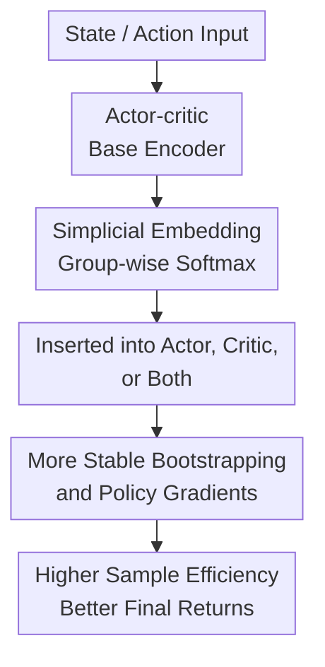

# Simplicial Embeddings Improve Sample Efficiency in Actor-Critic Agents

**Conference**: ICLR2026  
**OpenReview**: [https://openreview.net/forum?id=mCpq1GCKxA](https://openreview.net/forum?id=mCpq1GCKxA)  
**Code**: To be confirmed  
**Area**: Reinforcement Learning / Actor-critic / Sample Efficiency  
**Keywords**: Simplicial Embeddings, Actor-Critic, Sample Efficiency, Representation Collapse, FastTD3

## TL;DR
This paper introduces Simplicial Embeddings (SEM) as a lightweight geometric constraint for representation layers in actor-critic networks. By mapping hidden features of the actor and critic into a product space of multiple simplices, it mitigates representation collapse caused by non-stationary bootstrapping. The method improves sample efficiency across FastTD3, FastSAC, PPO, and various robotic and Atari environments.

## Background & Motivation
**Background**: Recent deep reinforcement learning (RL) has moved towards faster wall-clock training but remains constrained by the number of environment interactions. Methods like FastTD3, FastSAC, and parallel PPO achieve faster real-time training for robotic control through massive parallelization, large batches, and engineered critic designs.

**Limitations of Prior Work**: "Fast execution" does not equate to "low sample usage." In scenarios like robotics, offline-to-online fine-tuning, and real-system tuning, interaction remains expensive. Even if simulators generate data quickly, low sample efficiency leads to higher energy consumption, poor reproducibility, and longer iteration cycles. The authors note that high-throughput agents like FastTD3 still require substantial interaction to reach peak performance.

**Key Challenge**: The training objectives of actor-critic methods are inherently non-stationary. The critic's target value originates from $y_t(s,a)=r(s,a)+\gamma Q_{\phi^-}(s',\pi_\theta(s'))$. Both the data distribution in the replay buffer and the next actions produced by the actor shift during training. As the critic chases a moving target and the actor relies on critic gradients, the coupling amplifies representation drift, dormant neurons, and effective rank collapse.

**Goal**: The authors aim to answer a specific question: Can a simple inductive bias in the representation layer accelerate and stabilize actor-critic learning without changing RL losses or introducing complex auxiliary tasks?

**Key Insight**: The paper shifts focus from "RL trick tuning" to "geometrical stability of hidden representations." Building on prior work suggesting that restricting features to a product space of simplices improves generalization, this work applies these geometric constraints to actor and critic networks to resist the non-stationarity of bootstrapped targets.

**Core Idea**: Use group-wise softmax to project hidden features onto multiple simplices, making the features bounded, sparse, and group-competitive. This maintains representation diversity and effective rank during non-stationary training.

## Method

### Overall Architecture
The proposed method is not a new RL algorithm but a representation layer that can be integrated into existing actor-critic networks. Given the MLP of an actor/critic in FastTD3, FastSAC, or PPO, the SEM module is inserted into the hidden layers near the output. The hidden vector is split into $L$ groups of size $V$, followed by a softmax within each group, ensuring each group represents a point on a probability simplex. Consequently, the actor's policy output and the critic's value estimation are built upon bounded, sparse, and grouped features.

In the main experiments with FastTD3, SEM is evaluated in three configurations: actor-only, critic-only, and both. In the critic, SEM regularizes the representation for the distributional C51 head. In the actor, SEM is placed between the penultimate layer and the final linear+tanh layer, ensuring policy actions are determined by bounded sparse features. The actor-side SEM was found to be the most stable for early acceleration and cross-algorithmic generalization.

### Key Designs
**1. Simplicial Embeddings: Bounded Sparse Representations via Group-wise Softmax**

Standard MLP hidden layers often face two issues in non-stationary RL: activations in certain directions explode while other neurons remain dormant, leading to ill-conditioned covariance matrices. SEM addresses this by assuming the encoder output is $z\in\mathbb{R}^{L\times V}$, splitting it into groups, and calculating:

$$
\tilde z_{\ell,v}=\frac{\exp(z_{\ell,v}/\tau)}{\sum_{v'=1}^{V}\exp(z_{\ell,v'}/\tau)}.
$$

Each group output is a $V$-dimensional probability distribution; thus, the total representation lies in $\Delta^{V-1}\times\cdots\times\Delta^{V-1}$. This produces three effects: the sum of mass in each group is 1 (preventing norm drift); group-wise softmax creates competition (promoting sparsity at low temperatures); and multiple groups provide capacity without a single discrete bottleneck. It functions as an activation layer without requiring reconstruction losses or extra training stages.

**2. Insertion Points: Placing Constraints at Policy Gradient Bottlenecks**

SEM is primarily applied to the penultimate representation. This position receives state/action encodings and directly determines the critic's Q-distribution or the actor's actions, meaning its geometric quality is amplified by bootstrapped targets. Critic-side SEM stabilizes value estimates and reduces disagreement between critic branches. Actor-side SEM subjects the policy to sparse, grouped feature selection, filtering noise before action generation.

**3. Explaining Sample Efficiency through Non-stationarity**

A toy experiment on CIFAR-10 illustrates the mechanism: training is stable with fixed labels, but periodic label shuffling (simulating RL moving targets) causes loss fluctuations, increased dormant neurons, and decreased effective rank. SEM mitigates these issues. In RL, the target $y_t$ and data distribution $D_t$ both shift with the policy. SEM maintains feature existence via "mass conservation" in simplices and preserves higher effective rank through inter-group diversity.

**4. Capacity Control via $L\times V$**

The core hyperparameters are the number of groups $L$ and the dimension per group $V$. Capacity increases with $L \times V$. In HumanoidBench experiments, increasing $L$ or $V$ significantly improved returns at low capacities, with gains saturating as capacity increased. This makes SEM a controllable architectural bias rather than a "bigger is better" module.

### Loss & Training
The method does not modify basic actor-critic losses. FastTD3 continues to use parallel simulation, large batches, and distributional critics; SEM only changes the intermediate representations. PPO experiments follow the CleanRL implementation, only adding SEM to the representation layers. Key metrics tracked include human-normalized scores, effective rank, feature norms, and Q-discrepancy ($|Q_1-Q_2|$).

## Key Experimental Results

### Main Results

| Experimental Setup | Metric | Baseline | SEM Configuration | Main Findings |
| :--- | :--- | :--- | :--- | :--- |
| 5 HumanoidBench tasks, 6 seeds | Avg Normalized Return | FastTD3 | Actor / Critic / Both | Actor or Actor+Critic SEM significantly accelerates early learning; $V=64$ is most stable. |
| h1hand-walk, h1hand-stand | Episode Return + Rank | FastTD3 | SEM Actor | SEM achieves high returns faster while maintaining higher effective rank and compact features. |
| 3 HumanoidBench Baselines | Avg Normalized Return | FastTD3, SimBaV2, FastSAC | SEM Actor | Gains across all algorithms indicate efficiency is not limited to TD3-style critics. |
| PPO on ALE (28 games) / Isaac Gym | Human-norm / Norm score | PPO | SEM Actor | Accelerates convergence and improves performance in both pixel Atari and continuous control. |
| Booster T1 Humanoid Robot | Episode Return | FastTD3 | Actor / Actor+Critic | Accelerated learning on real-robot relative benchmarks. |

### Ablation Study

| Configuration | Key Metric | Description |
| :--- | :--- | :--- |
| SEM vs CReLU / Gumbel+ST / VQ | Aggregated Avg Return | SEM outperforms alternatives; likely because it avoids straight-through estimators, yielding smoother optimization. |
| Fixed $V$, Varying $L$ | Avg Return | Increasing $L$ significantly boosts performance at low capacities. |
| Fixed $L$, Varying $V$ | Avg Return | Increasing $V$ helps at small $L$; at large $L$, differences diminish ($V=4$ can be sufficient). |
| Insertion Position | Sample Efficiency | Actor-only and Actor+Critic provide the strongest gains; Critic-only is helpful but less impactful. |
| Reduced Data / Reduced Tricks | Avg Return | SEM remains effective with fewer environments or stripped FastTD3 components (no CDQ/C51). |

### Key Findings
- SEM gains are most stable at the actor side, suggesting the representation bottleneck before policy output is critical for sample efficiency.
- Representation diagnostics align with performance: SEM increases effective rank and reduces dormant neurons.
- SEM is complementary to FastTD3 engineering. It works even when reducing the number of parallel environments or simplified critic designs.
- While effective in FastTD3, FastSAC, and PPO, results on value-based PQN were unstable, indicating it may not be a universal fix for all RL paradigms.

## Highlights & Insights
- Framing sample efficiency as a representation geometry problem is the paper's primary contribution. Rather than adding complex regularizers, a small activation-like module constrains the hidden space.
- The engineering cost is minimal: no changes to rewards, Bellman targets, or auxiliary losses are required.
- The non-stationary CIFAR-10 experiment effectively isolates moving targets into a controllable mechanism to demonstrate how SEM prevents collapse.

## Limitations & Future Work
- SEM is not a universal stabilizer; representation collapse and critic drift can still occur in extreme distribution shifts or sparse reward tasks.
- Hyperparameters ($L, V, \tau$) require tuning, and RL is sensitive to architectural choices.
- Evaluations are primarily focused on continuous control, robotics, and Atari; validity in language-conditioned RL or long-horizon agents remains unverified.
- Performance in purely value-based RL (DQN-style) is inconsistent.

## Related Work & Insights
- **vs. FastTD3**: FastTD3 optimizes wall-clock time; SEM complements this by addressing the "high throughput but high sample count" drawback.
- **vs. TD7 / Representation RL**: Methods like TD7 change algorithmic structures more deeply, whereas SEM is a lightweight plug-in module.
- **vs. CReLU / VQ**: Unlike Gumbel-Softmax or Vector Quantization, SEM does not require straight-through estimators, providing a smoother optimization path via continuous group-wise softmax.
- **Insight**: Sample efficiency stems not just from data reuse, but from preventing the loss of effective representation directions under non-stationary targets.

## Rating
- Novelty: ⭐⭐⭐⭐☆ Applying simplicial embeddings to actor-critic RL is a well-placed application that addresses the specific problem of non-stationary collapse.
- Experimental Thoroughness: ⭐⭐⭐⭐☆ Covers a wide range of benchmarks and algorithms; however, more unified numerical tables would improve clarity over learning curves.
- Writing Quality: ⭐⭐⭐⭐☆ Clear narrative from mechanism to main results; appendix information is extensive.
- Value: ⭐⭐⭐⭐⭐ Highly practical for researchers in actor-critic and robotic control due to its low implementation cost and consistent gains.

<!-- RELATED:START -->

## Related Papers

- [\[ICML 2025\] Actor-Critics Can Achieve Optimal Sample Efficiency](../../ICML2025/reinforcement_learning/actor-critics_can_achieve_optimal_sample_efficiency.md)
- [\[ICLR 2026\] Convergence of an actor-critic gradient flow for entropy regularised MDPs in general spaces](convergence_of_an_actor-critic_gradient_flow_for_entropy_regularised_mdps_in_gen.md)
- [\[ICLR 2026\] Flow Actor-Critic for Offline Reinforcement Learning (FAC)](flow_actor-critic_for_offline_reinforcement_learning.md)
- [\[ICLR 2026\] Neural+Symbolic Approaches for Interpretable Actor-Critic Reinforcement Learning](neuralsymbolic_approaches_for_interpretable_actor-critic_reinforcement_learning.md)
- [\[ICLR 2026\] Chunking the Critic: A Transformer-based Soft Actor-Critic with N-Step Returns](chunking_the_critic_a_transformer-based_soft_actor-critic_with_n-step_returns.md)

<!-- RELATED:END -->
