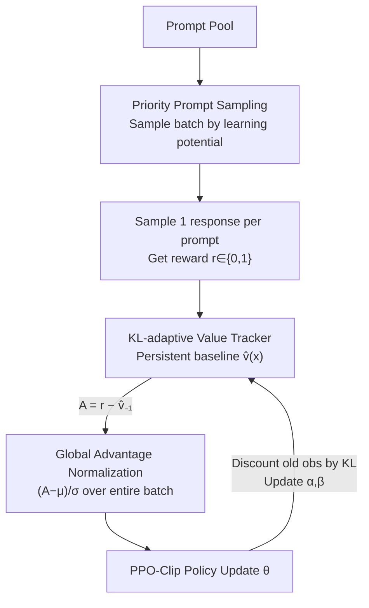

# Single-stream Policy Optimization

**Conference**: ICLR 2026  
**OpenReview**: [https://openreview.net/forum?id=b61UW62K7W](https://openreview.net/forum?id=b61UW62K7W)  
**Code**: https://github.com/verl-project/verl-recipe/tree/main/spo  
**Area**: Reinforcement Learning / LLM Reasoning / Policy Optimization  
**Keywords**: Policy Gradient, GRPO, Baseline Estimation, Bayesian Value Tracking, RLVR

## TL;DR
SPO (Single-stream Policy Optimization) completely abandons the "collect a group per prompt and calculate relative advantages within the group" approach used in GRPO. It returns to the classic single-stream policy gradient: employing a lightweight KL-adaptive Bayesian value tracker to maintain a persistent success rate baseline for each prompt, performing global advantage normalization across the entire batch, and utilizing this baseline for an adaptive curriculum via priority sampling. On Qwen3-8B, it achieves an average maj@32 improvement of +3.4 pp across five math competition benchmarks compared to GRPO. Simultaneously, its "group-free" design leads to a 4.35× throughput acceleration in variable-length agentic scenarios.

## Background & Motivation

**Background**: RLVR (Reinforcement Learning from Verifiable Rewards) is a dominant paradigm for enhancing LLM reasoning capabilities, with GRPO being the most popular algorithm in this domain. The core trick of GRPO is "group-relative": it samples $G$ responses for each prompt simultaneously, uses the mean reward of this group as an on-the-fly baseline, and normalizes within the group to obtain relative advantages, thereby eliminating the large and hard-to-train critic network of PPO.

**Limitations of Prior Work**: The group-relative paradigm has two structural flaws. First is the **degenerate group**—when all responses in a group are either all correct or all incorrect, the intra-group reward variance is zero, and the relative advantages for the entire group collapse to 0. This results in no gradient signal from these rollouts, wasting computational resources and data. To remedy this, works like DAPO resort to engineering heuristics like "dynamic sampling" (sampling until a non-zero advantage appears), which increases complexity. Second is the **synchronization barrier**—in distributed training, the group for a prompt must wait for the slowest response to finish generation. In scenarios with highly uneven generation times, such as multi-turn tool calls or long-horizon agents, a single slow trajectory can stall the entire group.

**Key Challenge**: Both problems stem from the "group" architecture: the baseline is derived from **concurrently generated responses in the same batch** rather than historical persistent estimates. Consequently, it requires $G$ times the generation and is bound by the slowest member. Subsequent improvements (RLOO, OPO, GRESO, Lite PPO) have not escaped this framework.

**Goal**: Return to "single-stream"—where each training sample is an independent (prompt, response) pair—while solving the **high variance** issue inherent in single-stream policy gradients (where REINFORCE's raw reward variance is high without an intra-group baseline).

**Key Insight**: The optimal baseline is the ground-truth value function $V_\pi(x)=\mathbb{E}_{y\sim\pi}[R(x,y)]$, which depends only on the prompt and not the current action. Instead of approximating it with a group of concurrent samples, it is better estimated online using a tracker that is **persistent across iterations and adaptively decays as the policy changes**. This allows each sample to receive a low-variance baseline and completely eliminates groups.

**Core Idea**: A trio of a KL-adaptive Bayesian value tracker replacing the intra-group baseline, batch-level global advantage normalization, and priority sampling based on the tracker, synthesized into a group-free, low-variance, and scalable single-stream policy optimization.

## Method

### Overall Architecture

SPO addresses policy optimization under binary verifiable rewards (success +1 / failure 0). The core challenge is "how to estimate the non-stationary success rate of each prompt with low variance for an evolving policy." The pipeline is: in each round, the value tracker calculates a sampling weight for all prompts (favoring those with high learning potential) → a batch of prompts is sampled based on weights, with each prompt generating only **one** response → the baseline $\hat v_{-1}(x)$ from the previous round is used to calculate the raw advantage $A=r-\hat v_{-1}$ → global normalization is performed across the whole batch to obtain $\tilde A$ → the policy is updated using PPO-Clip → the tracker is updated with the newly observed reward. Comparing with GRPO: GRPO follows $x\to\{y_1..y_G\}\to$ group normalization $\to A_i$; SPO follows $x\to y\to A$ (baseline from tracker $\hat v$).

### Key Designs

**1. KL-adaptive Bayesian Value Tracker: Replacing Fragile Group Baselines with Persistent Success Rate Estimates**

To address the flaw that "group baselines use only $G$ concurrent samples and are high-variance estimates of the ground truth," SPO maintains a **tabular** Bayesian tracker for each prompt. Since RLVR rewards are binary, the conjugate prior for a Bernoulli process is the Beta distribution. Thus, the success rate is modeled as $\hat v(x)\sim\mathrm{Beta}(\alpha(x),\beta(x))$, with the value estimate taken as the posterior mean $\hat v(x)=\alpha(x)/(\alpha(x)+\beta(x))$. Crucially, it must track a **non-stationary** target—as the policy changes, old observations become obsolete. Thus, for each new reward $r(x,y)$, the old Beta parameters are decayed by a discount factor $\rho(x)$ before absorbing new evidence:

$$\alpha(x)=\rho(x)\alpha_{-1}(x)+r(x,y),\quad \beta(x)=\rho(x)\beta_{-1}(x)+(1-r(x,y))$$

The discount factor $\rho(x)=2^{-D(x)/D_{\text{half}}}$ is determined by the **KL divergence** $D(x)$ between the current policy and the policy last applied to that prompt. The more the policy changes, the faster the tracker forgets; $D_{\text{half}}$ is a hyperparameter controlling the forgetting rate. Ours also proves this Bayesian update is equivalent to an adaptive EMA: $\hat v=\hat v_{-1}+\eta(x)(r-\hat v_{-1})$, where the learning rate $\eta(x)=(\rho(x)N_{\text{eff},-1}(x)+1)^{-1}$ adapts based on policy drift ($\rho$) and statistical confidence (effective sample size $N_{\text{eff}}=\alpha+\beta$). This way, every sample gets a low-variance baseline that incorporates historical information without needing to sample a full group.

**2. Global Advantage Normalization: Moving Beyond Unstable Small-Sample Statistics**

GRPO performs normalization **within** each prompt's group (dividing by the intra-group standard deviation $\sigma_G$). Since the group is small, this statistic is jittery. SPO changes this to normalization across the **entire batch** $B$. First, the raw advantage $A(x,y)=r(x,y)-\hat v_{-1}(x)$ is calculated using the baseline from the previous step, ensuring it is independent of the current action and the policy gradient is unbiased. Then, $\tilde A(x,y)=(A(x,y)-\mu_B)/\sigma_B$ is computed, where $\mu_B,\sigma_B$ are the mean and standard deviation of all advantages in the batch. The normalized advantage is broadcast to each token in the response sequence for standard PPO-Clip updates. This estimator is compatible with orthogonal techniques like Clip-Higher, CISPO, and GSPO. Its benefit lies in the statistics coming from a much larger sample pool, resulting in controllable variance and removing the need for "groups."

**3. Priority Prompt Sampling: Reusing the Tracker for Adaptive Curriculum**

Since the tracker already maintains $\hat v$ and the effective sample size $N_{\text{eff}}$ for each prompt, it can be turned into a curriculum at zero cost—concentrating compute on prompts with the "highest learning potential." The sampling weight is defined as:

$$w_i(x)\propto \frac{\sqrt{\hat v_{-1}(x)\,(1-\hat v_{-1}(x))}}{N_{\text{eff},-1}^{\gamma}(x)}+\epsilon$$

The numerator $\sqrt{\hat v(1-\hat v)}$ is exactly the standard deviation of a Bernoulli outcome, naturally giving higher weight to intermediate-difficulty prompts that are neither "almost always solved" ($\hat v\approx 1$) nor "almost never solved" ($\hat v\approx 0$). The denominator $N_{\text{eff}}^{\gamma}$ ($\gamma\in[0,1]$) downweights prompts that are already accurately estimated, allowing the sampler to balance "value uncertainty priority" and "broad exploration." An exploration bonus $\epsilon=0.05$ ensures every prompt has a non-zero probability of being sampled, preventing curriculum collapse. In contrast, GRPO defaults to uniform sampling, wasting compute on mastered or currently too difficult prompts; SPO solves the scheduling problem **before generation**, which is more efficient than DAPO's "generate then discard" approach.

### Loss & Training

Policy updates use the standard PPO-Clip objective, with advantages using the normalized $\tilde A$ described above:

$$L^{\text{CLIP}}(\theta)=\mathbb{E}_{s,t}\Big[\min\big(\tfrac{\pi_\theta(a_t|s_t)}{\pi_{\theta_{\text{old}}}(a_t|s_t)}\tilde A,\ \mathrm{clip}(\tfrac{\pi_\theta(a_t|s_t)}{\pi_{\theta_{\text{old}}}(a_t|s_t)},1-\varepsilon,1+\varepsilon)\tilde A\big)\Big]$$

At initialization, $n_0$ samples are collected to calculate initial estimates $\hat v_0(x)$, and the initial effective sample size is set to the equilibrium value $N_0=1/(1-\rho_{\min})$ to avoid early tracker jitter. Then $\alpha_0=N_0\hat v_0$ and $\beta_0=N_0(1-\hat v_0)$ are initialized. The full process is shown in Algorithm 1 of the original paper. For non-binary rewards, $\hat v$ can be tracked directly via EMA instead of $\alpha, \beta$.

## Key Experimental Results

Setup: Qwen3-8B, training data from the English subset of the DAPO dataset, outcome reward only (no format reward). Evaluation included Tool-Integrated Reasoning (TIR with a Python interpreter). Benchmarks were five math competition sets, with BRUMO 25 / HMMT 25 / AIME 25 being notably clean of data contamination.

### Main Results

| Benchmark | Metric | GRPO | SPO | Gain |
|-----------|------|------|-----|------|
| AIME 24 | maj@32 | 83.3 | **84.0** | +0.7 |
| AIME 25 | maj@32 | 72.1 | **76.5** | +4.4 |
| BeyondAIME | maj@32 | 45.6 | **46.9** | +1.3 |
| BRUMO 25 | maj@32 | 56.7 | **64.0** | +7.3 |
| HMMT 25 | maj@32 | 44.2 | **47.5** | +3.3 |
| **Average** | maj@32 | 60.4 | **63.8** | **+3.4** |

SPO outperforms GRPO on **all** five benchmarks in maj@32, with an average gain of +3.4 pp. The improvements are concentrated on the hardest and least contaminated sets (BRUMO +7.3, AIME 25 +4.4), indicating improved generalization rather than overfitting the DAPO training set. While GRPO remains competitive on avg@32 in some sets (SPO 56.0 vs GRPO 55.7 on average), the consistent maj@32 advantage suggests SPO learns more robust and reproducible solutions. Pass@k curves show SPO dominating GRPO across all $k$.

### Key Findings
- **Degenerate groups are wasteful; SPO's near-zero advantages are not**: In GRPO, over 80% of samples fall into degenerate groups with zero gradient late in training. In SPO, near-zero advantages increase as the tracker becomes more accurate, but these samples still produce well-defined gradients and are not discarded, reflecting prediction accuracy rather than compute loss.
- **Baseline quality determines variance**: Ablations (Appendix F) confirm SPO gains come from "principled baseline estimation + global normalization." Removing the baseline ($\hat v=0$) degrades performance to high-variance naive policy gradients. GRPO's "effective advantage" actually exhibited the highest variance.
- **Group-free advantage is amplified in agentic scenarios**: Simulations show that when interaction times have high variance (e.g., multi-turn tools, long-range rollouts with up to 40+ tool calls and 150k tokens), the group synchronization barrier stalls the entire group. SPO fetches the fastest samples from a larger pool, achieving **4.35× throughput**.

## Highlights & Insights
- **Shifting the "Baseline" from Spatial to Temporal Dimension**: Group methods estimate baselines using concurrent samples; SPO uses a persistent tracker across iterations. This is the core paradigm shift, saving $G$ times the generation and decoupling synchronization.
- **Elegant combination of Bayesian Beta conjugate + KL-adaptive forgetting**: Using the Beta posterior mean naturally provides success rate estimates for binary rewards. Tying the discount factor to policy KL provides a principled basis for "forgetting as much as the policy changes" rather than a fixed EMA coefficient.
- **Triple-use tracker**: The same $\hat v$ serves as the baseline, the difficulty signal for sampling weights, and the source of $N_{\text{eff}}$ confidence. Implementing curriculum learning becomes nearly zero-cost by reusing an existing state.
- **Counter-current advocacy**: The authors explicitly oppose adding "incidental complexity" (dynamic sampling, filtering, multi-stage pipelines) to RL algorithms, arguing that returning to fundamental principles is the path for the next wave of LLM reasoning progress.

## Limitations & Future Work
- **Design focused on binary verifiable rewards**: While the authors suggest non-binary rewards can be tracked via EMA, the elegance of the Bayesian Beta setup only holds for binary rewards. Performance under continuous/dense rewards has not been empirically verified.
- **4.35× agentic acceleration is from simulation, not real training**: The throughput gain was measured in a "simulated variable interaction time" setting; end-to-end gains in real multi-turn tool-use training still need verification.
- **Validations limited to Qwen3-8B**: Generalization across model scales and task types (non-math reasoning) is unknown. Managing tabular trackers for extremely large prompt pools might involve memory/management costs.
- **Limited disclosure on hyperparameter sensitivity**: Analysis of $D_{\text{half}}$, $\gamma$, $\epsilon$, and $\rho_{\min}$ is primarily in the appendix.

## Related Work & Insights
- **vs GRPO**: GRPO uses intra-group concurrent sample means as baselines and intra-group normalization. SPO uses a persistent tracker as the baseline and global batch normalization. SPO is group-free, single-sample, avoids degenerate group waste, and removes synchronization barriers, at the cost of maintaining a tabular tracker.
- **vs DAPO (Dynamic Sampling)**: DAPO remedies degenerate groups by "sampling until non-zero advantage," a post-hoc fix after generation. SPO uses priority sampling before generation to avoid invalid samples from the start.
- **vs RLOO / OPO**: These still use intra-group baselines (leave-one-out / length-weighted means) and share GRPO's synchronization and generation overhead. SPO uses historical persistent estimates.
- **vs A*-PO**: A*-PO also uses a single-sample route but estimates a policy-independent optimal value $V^*$ offline, which remains fixed and constrained by a reference policy. Ours' tracker is $V_\pi$, which evolves online adaptively with the policy KL.

## Rating
- Novelty: ⭐⭐⭐⭐⭐ Decoupling the baseline from "intra-group concurrency" to "KL-adaptive persistent tracking" is a clean and powerful shift.
- Experimental Thoroughness: ⭐⭐⭐⭐ Solid across five benchmarks + signal efficiency/variance analysis, but limited to a single model scale and simulated agentic acceleration.
- Writing Quality: ⭐⭐⭐⭐⭐ Clear logical chain from motivation to method and analysis; excellent use of GRPO comparisons and derivations.
- Value: ⭐⭐⭐⭐⭐ Provides a more scalable and low-variance algorithm base for RLVR; the "anti-incidental complexity" stance is methodologically significant.

<!-- RELATED:START -->

## Related Papers

- [\[ICLR 2026\] Geometric-Mean Policy Optimization](geometric-mean_policy_optimization.md)
- [\[ICLR 2026\] Group Verification-based Policy Optimization for Interactive Coding Agents](group_verification-based_policy_optimization_for_interactive_coding_agents.md)
- [\[ICLR 2026\] Sample More to Think Less: Group Filtered Policy Optimization for Concise Reasoning](sample_more_to_think_less_group_filtered_policy_optimization_for_concise_reasoni.md)
- [\[ICLR 2026\] SRFT: A Single-Stage Method with Supervised and Reinforcement Fine-Tuning for Reasoning](srft_a_single-stage_method_with_supervised_and_reinforcement_fine-tuning_for_rea.md)
- [\[ICLR 2026\] On the Tension Between Optimality and Adversarial Robustness in Policy Optimization](on_the_tension_between_optimality_and_adversarial_robustness_in_policy_optimizat.md)

<!-- RELATED:END -->
