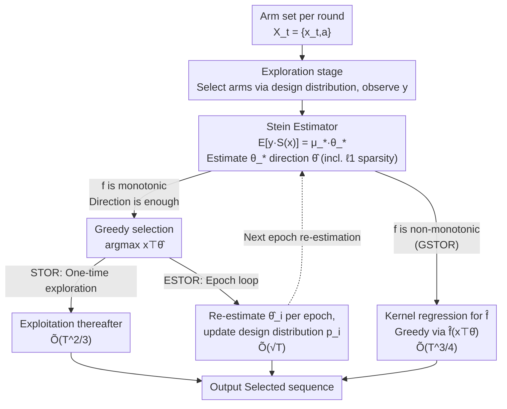

# Single Index Bandits: Generalized Linear Contextual Bandits with Unknown Reward Functions

**Conference**: ICLR 2026  
**arXiv**: [2506.12751](https://arxiv.org/abs/2506.12751)  
**Code**: None  
**Area**: Reinforcement Learning/Online Learning  
**Keywords**: Contextual Multi-armed Bandits, Generalized Linear Model (GLM), Single Index Model (SIM), Stein's Method, Regret Bound  

## TL;DR

This paper proposes the Single Index Bandits (SIB) problem, extending generalized linear bandits to settings with unknown reward functions. A family of efficient algorithms (STOR/ESTOR/GSTOR) based on Stein's method is designed, achieving a near-optimal regret bound of $\tilde{O}(\sqrt{T})$ under monotonically increasing reward functions.

## Background & Motivation

- **Background**: Generalized Linear Bandits (GLB) are significant extensions of contextual bandits, widely applied in recommendation systems, clinical trials, and precision medicine. However, all existing methods assume the reward function (link function) is known.
- **Limitations of Prior Work**: Misspecification of the reward function causes existing GLB algorithms to fail completely, often resulting in linear regret. In practical applications, the underlying parametric form is typically unknown and unidentifiable.
- **Key Challenge**: Existing UCB and Thompson Sampling methods require solving (quasi-)maximum likelihood estimators, which inherently rely on the explicit form of the reward function. Similarly, existing theoretical analyses depend on vector-valued martingale concentration inequalities involving the explicit reward function, making these techniques inapplicable when the reward function is unknown.
- **Goal**: To design efficient bandit algorithms with sublinear regret guarantees when the reward function is completely unknown.
- **Key Insight**: Drawing from Single Index Models (SIM) in statistical learning, the authors leverage Stein's method to bypass the dependency on the reward function's form and directly estimate the direction of the unknown parameters.
- **Core Idea**: By utilizing the Stein identity $\mathbb{E}[y_i S(x_i)] = \mu_* \theta_*$, the direction of the parameter $\theta_*$ can be estimated without knowledge of $f(\cdot)$, enabling robust optimization for unknown reward functions.

## Method

### Overall Architecture

In each round $t$, the agent observes an arm set $\mathcal{X}_t = \{x_{t,a} \in \mathbb{R}^d : a \in [K]\}$, selects an arm $x_t$, and receives a reward $y_t = f(x_t^\top \theta_*) + \eta_t$. The difficulty lies in the fact that both the link function $f(\cdot)$ and the parameter $\theta_*$ **are unknown**. Traditional GLB algorithms rely on the explicit form of $f$ for Maximum Likelihood Estimation (MLE), an approach that fails in SIB. The key breakthrough is that greedy arm selection only requires knowing the **direction** of $\theta_*$; as long as $f$ is monotonically increasing, a larger $x^\top\theta_*$ implies a higher reward, making it unnecessary to estimate $f$ itself.

The methodology utilizes a shared Stein estimator as a foundation, following the path of "estimating direction → applying direction to arm selection," and splits into two branches based on whether $f$ is monotonic. If $f$ is monotonic, the direction suffices: STOR uses a simple Explore-then-Commit (EtC) approach ($\tilde{O}(T^{2/3})$), while ESTOR employs epoch scheduling to compress regret to near-optimal levels ($\tilde{O}(\sqrt{T})$). If $f$ is non-monotonic, the direction alone is insufficient; GSTOR adds a kernel regression step to estimate $f$ ($\tilde{O}(T^{3/4})$).

### Key Designs

**1. Stein-based Parameter Estimator: Estimating $\theta_*$ Direction Without Knowing $f$**

This serves as the foundation for the entire framework. While GLB MLE requires $f$ within the likelihood function, SIB requires an estimator that bypasses $f$. The authors achieve this using Stein's identity: under the arm design distribution, it holds that

$$\mathbb{E}[y_i\, S(x_i)] = \mu_*\, \theta_*,$$

where $S(x) = -\nabla_x \log p(x)$ is the score function of the design distribution, and $\mu_* = \mathbb{E}[f'(X^\top \theta_*)]$ is an unknown positive scalar. Crucially, the shape of $f$ is absorbed into the scalar $\mu_*$, while the direction on the right side remains $\theta_*$. By using the sample mean of $y_i S(x_i)$ to approximate the left side, the direction of $\theta_*$ can be recovered without ever defining $f$. The specific estimator is:

$$\hat{\theta} = \arg\min_{\theta \in \Theta} \|\theta\|_2^2 - \frac{2}{n} \sum_{i=1}^n \phi_\tau\big(y_i \cdot S(x_i)\big)^\top \theta + \lambda \|\theta\|_1,$$

where $\phi_\tau$ is an element-wise truncation function used to handle heavy-tailed noise and balance variance/bias. This estimator achieves minimax optimal accuracy $\|\hat{\theta} - \mu_* \theta_*\|_2 = \tilde{O}(\sqrt{d/n})$. Since it is a quadratic form, it has a closed-form solution and requires no iterative optimization, with $O(nd)$ time and $O(d)$ space complexity—significantly cheaper than repetitive MLE solvers in GLB. The $\ell_1$ regularization also covers high-dimensional sparse scenarios: when $\theta_*$ is high-dimensional $d$ but only $s \ll d$ components are non-zero, setting $\lambda > 0$ allows $d$ to be replaced by $s$ in the error bound.

**2. STOR: Simplest Version via Explore-then-Commit**

With the direction estimator, the most straightforward application is EtC: perform random exploration for the first $T_1$ rounds to collect samples and calculate $\hat{\theta}$; subsequently, select $x_t = \arg\max_{x \in \mathcal{X}_t} x^\top \hat{\theta}$ for all remaining rounds. This validates the "direction is enough" strategy, though the fixed split between exploration and exploitation in the EtC framework leads to a suboptimal regret of $R_T = \tilde{O}(d^{2/3} T^{2/3})$.

**3. ESTOR: Near-Optimal $\sqrt{T}$ Regret via Epoch Scheduling**

ESTOR improves upon STOR by using phased, rolling updates. Epoch lengths grow exponentially ($e_i = (2^i - 1)T_0$). At the start of each epoch, the estimate $\hat{\theta}_i$ is refreshed using data from the previous epoch, and the design distribution induced by greedy arm selection is recalculated:

$$p_i(x) = K \cdot p(x) \cdot F_i(x^\top \hat{\theta}_i)^{K-1}.$$

The Stein estimation for the next epoch is built on this updated distribution. This allows the algorithm to start with short epochs for quick initial estimates and longer subsequent epochs to aggregate more samples, geometrically reducing estimation error. The cumulative regret is suppressed to $R_T = \tilde{O}(dK^{3/2}\sqrt{T})$, which is near-optimal $\tilde{O}_T(\sqrt{T})$ relative to $T$. It remains computationally efficient with $O(dT)$ time and $O(d)$ space.

**4. GSTOR: Estimating $f$ for Non-monotonic Functions**

When $f$ is non-monotonic, the direction $\hat{\theta}$ alone is insufficient because a larger $x^\top\theta_*$ no longer guarantees a higher reward. GSTOR uses a two-stage Explore-then-Commit: the first stage uses the Stein estimator for the direction $\hat{\theta}$; the second stage projects samples onto the one-dimensional line $x_i^\top\hat{\theta}_0$ and uses kernel regression:

$$\hat{f}(z) = \frac{\sum_i y_i K_h(z - x_i^\top \hat{\theta}_0)}{\sum_i K_h(z - x_i^\top \hat{\theta}_0)}$$

to approximate the unknown link function. Subsequent exploitation follows $\hat f(x^\top\hat\theta)$. Estimating a 1D function incurs a higher cost, and regret increases to $\mathbb{E}(R_T) = O(d^{3/8} T^{3/4})$.

### Loss Function

The estimator's loss is the $\ell_2 + \ell_1$ regularized quadratic form mentioned in Key Design 1. Its simplicity—offering a closed-form solution when $\lambda = 0$ (no sparsity constraint)—is the source of its non-iterative scalability.

## Key Experimental Results

### Main Results

Comparison across four link functions ($T=10,000$, $d=10$):

| Method | Linear $f(x)=x$ | Poisson $f(x)=e^x$ | Square $f(x)=\text{sign}(x)x^2+2x$ | Fifth $f(x)=x^5$ |
|---|---|---|---|---|
| LinUCB/UCB-GLM | Optimal (Specified) | Decent (Specified) | Linear Regret (Misspecified) | Linear Regret (Misspecified) |
| ESTOR | Comparable to LinUCB | Comparable to UCB-GLM | **Significantly better** than GLB | **Significantly better** than GLB |
| Speed | 100x+ faster than UCB-GLM | 1000x+ faster than GLM-TSL | Same as left | Same as left |

### Ablation Study

- **Model Misspecification**: Using incorrect link functions for GLB under Square/Fifth cases led to severe performance degradation.
- **High-dimensional Sparsity**: ESTOR maintained the $\sqrt{T}$ regret rate at $d=100, s=5$.
- **Real-world Data**: On Forest Cover Type and Yahoo News datasets, all SIB algorithms consistently outperformed GLB methods.

### Key Findings

1. When the link function is correctly specified, ESTOR performs comparably to optimal algorithms (LinUCB, UCB-GLM).
2. When the link function is misspecified, GLB algorithms degrade severely while ESTOR/STOR remain robust.
3. ESTOR vastly exceeds GLB baselines in computational efficiency (100x to 1000x faster).
4. In real-world data where the underlying link function is typically unknown, the advantages of SIB methods are even more pronounced.

## Highlights & Insights

1. **High Value in Problem Definition**: Formally proposes the SIB problem, filling a critical theoretical gap in GLB literature.
2. **Elegant Application of Stein's Method**: The use of score functions to bypass $f(\cdot)$ dependency via $\mathbb{E}[yS(x)] = \mu_* \theta_*$ is highly elegant.
3. **Dual Breakthrough**: Provides both near-optimal regret bounds and an extremely efficient practical algorithm (closed-form, non-iterative, $O(d)$ space).
4. **Novel Use of Truncation**: Adapts truncation techniques from heavy-tailed noise processing to handle the ambiguity of unknown reward functions.

## Limitations & Future Work

1. **Distribution Assumption**: Assumes arms are sampled i.i.d. from a fixed distribution $\mathcal{D}$, which does not support adversarial selection—a significant theoretical constraint.
2. **Gaussian Assumption in GSTOR**: The algorithm for general reward functions depends on Gaussian design assumptions, which may differ from practical applications.
3. **$K$ Dependence**: ESTOR has a $K^{3/2}$ dependence on the number of arms $K$ in worst-case scenarios, though this can be improved to $\sqrt{\log K}$ under Gaussian settings.
4. **Sub-optimality of $T^{3/4}$**: Whether the $T^{3/4}$ rate for general non-monotonic cases can be improved remains an open question.

## Related Work & Insights

- **GLB Literature**: UCB-GLM (Li et al., 2017) and GLM-TSL (Kveton et al., 2020) are standard baselines but require a known link function.
- **SIM Statistical Learning**: While Stein's method has been used in low-rank matrix bandits (Kang et al., 2022), this paper is the first to introduce it to linear/GLB settings.
- **Contextual Bandits under Realizability**: These methods require powerful regression oracles, whereas SIM does not have suitable oracles with finite-sample guarantees.
- **Insights**: The potential of Stein's method in online learning warrants further exploration, particularly in practical scenarios where models are partially unknown.

## Rating

⭐⭐⭐⭐⭐ (5/5)

- **Novelty**: ⭐⭐⭐⭐⭐ New problem definition, highly original method, and significant theoretical contribution.
- **Experimental Thoroughness**: ⭐⭐⭐⭐ Validated on synthetic and real-world data with comprehensive comparisons.
- **Writing Quality**: ⭐⭐⭐⭐⭐ Rigorous theoretical derivation and clear progression.
- **Value**: ⭐⭐⭐⭐ Efficient and implementable algorithms, though limited by distribution assumptions.

<!-- RELATED:START -->

## Related Papers

- [\[ICML 2026\] Practical and Optimal Algorithm for Linear Contextual Bandits with Rare Parameter Updates](../../ICML2026/reinforcement_learning/practical_and_optimal_algorithm_for_linear_contextual_bandits_with_rare_paramete.md)
- [\[NeurIPS 2025\] Exploration via Feature Perturbation in Contextual Bandits](../../NeurIPS2025/reinforcement_learning/exploration_via_feature_perturbation_in_contextual_bandits.md)
- [\[ICLR 2026\] Revisiting Matrix Sketching in Linear Bandits: Achieving Sublinear Regret via Dyadic Block Sketching](revisiting_matrix_sketching_in_linear_bandits_achieving_sublinear_regret_via_dya.md)
- [\[NeurIPS 2025\] Tractable Multinomial Logit Contextual Bandits with Non-Linear Utilities](../../NeurIPS2025/reinforcement_learning/tractable_multinomial_logit_contextual_bandits_with_non-linear_utilities.md)
- [\[NeurIPS 2025\] Generalized Linear Bandits: Almost Optimal Regret with One-Pass Update](../../NeurIPS2025/reinforcement_learning/generalized_linear_bandits_almost_optimal_regret_with_one-pass_update.md)

<!-- RELATED:END -->
