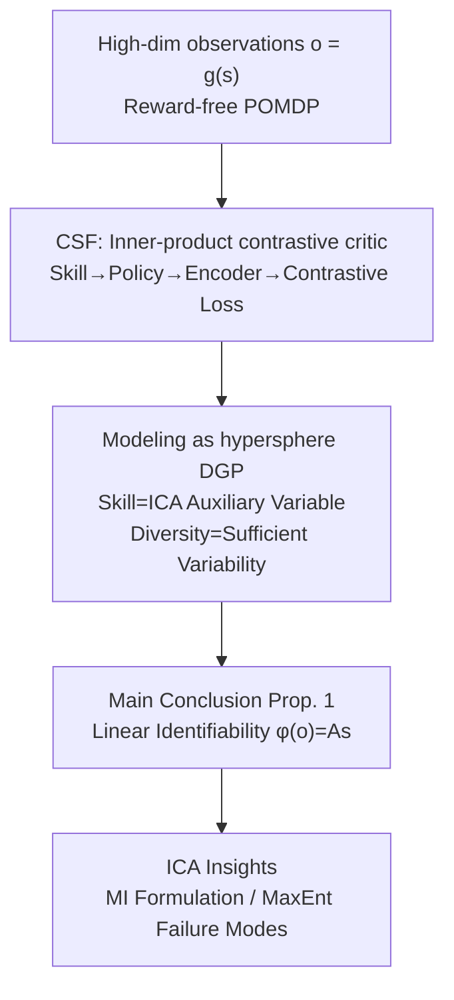

# Skill Learning via Policy Diversity Yields Identifiable Representations for Reinforcement Learning

**Conference**: ICLR 2026  
**OpenReview**: [https://openreview.net/forum?id=xsPWWSod4M](https://openreview.net/forum?id=xsPWWSod4M)  
**Code**: https://github.com/bmucsanyi/identifiable-misl  
**Area**: Reinforcement Learning / Representation Learning / Identifiability Theory  
**Keywords**: Mutual Information Skill Learning, Identifiability, Nonlinear ICA, Contrastive Successor Features, Self-supervised RL

## TL;DR
This paper employs the identifiability theory of nonlinear ICA to explain why "Mutual Information Skill Learning (MISL)" is effective. Taking Contrastive Successor Features (CSF) as a representative, it proves that as long as skills are sufficiently diverse and the critic is parameterized by an inner product, the learned features can recover the true environment state "up to a linear transformation." This provides the first identifiability guarantee for representation learning in RL and clarifies the advantages/disadvantages of design choices like inner-product parameterization, mutual information formulations, and maximum entropy regularization.

## Background & Motivation
**Background**: In RL scenarios with sparse rewards, difficult exploration, or hard-to-design reward functions, many works turn to self-supervised "Unsupervised Skill Discovery (USD)." One class of these methods, driven by mutual information objectives, is called MISL. They enable a "skill-conditioned policy" $\pi(a\mid o,z)$ to maximize the discriminability between skills, thereby learning general representations and incentivizing exploration for downstream task transfer.

**Limitations of Prior Work**: Although MISL methods share the design factor of "using mutual information objectives," their empirical performance varies significantly. While certain heuristics exist (e.g., inner-product parameterization for Q-functions is better), there is **no theoretical explanation** for why similar principles lead to such large performance gaps. The role of representations and how mutual information should be parameterized remain theoretical black boxes.

**Key Challenge**: RL fundamentally deals with POMDPs—only high-dimensional observations $o=g(s)$ are visible, while true states $s$ are hidden. There is a lack of verifiable criteria to determine if a representation has "captured" state information. Identifiability theory in self-supervised learning specifically addresses whether latent factors can be recovered from high-dimensional observations, but it has not yet been linked to skill learning in RL.

**Goal**: To introduce identifiability theory into RL to answer two sub-questions: (1) How well can MISL-learned features recover the true state? (2) Which design choices (inner product, diversity, MI formulation, entropy regularization) are critical for success, and which are pitfalls?

**Key Insight**: The authors observe that "learning diverse skills" is essentially equivalent to "discriminating data under different distribution shifts/interventions," which is the "sufficient variability" assumption required in nonlinear ICA. USD pursues exploration diversity, while ICA pursues sample coverage of all latent factors—the two objectives are naturally aligned.

**Core Idea**: Treat the "skills" in MISL as "auxiliary variables" in ICA. Translate the POMDP into a data generating process (DGP) on a hypersphere, then apply ICA identifiability proof techniques to demonstrate that features learned by CSF can recover the true state up to a linear transformation.

## Method

### Overall Architecture
This paper does not propose a new algorithm but provides a theoretical explanation for the effectiveness of a representative MISL method, CSF. The analysis chain is: define the target object (skill → policy → encoder → inner-product critic → contrastive loss), formalize its underlying probabilistic structure as a DGP on a hypersphere (interpreting skills as ICA auxiliary variables), verify its adherence to nonlinear ICA identifiability assumptions, and finally derive the main conclusion—features are identified up to a linear transformation (Prop. 1). Practice-driven insights (MI selection, MaxEnt failure) are then deduced from this theory.

### Key Designs

**1. CSF Inner-product Contrastive Objective: Formulating Skill Learning as Instance Discrimination of State Differences**

The studied CSF method learns an encoder $\phi$ and a skill-conditioned policy simultaneously. Skills $z$ are sampled uniformly from the unit hypersphere $\mathcal{S}^{d-1}$. The critic uses **inner-product parameterization** to discriminate the skill from the feature difference of adjacent observations:

$$q(z_i\mid \phi(o),\phi(o'))=\frac{p(z_i)\exp\big[(\phi(o')-\phi(o))^\top z_i\big]}{\mathbb{E}_{p(z)}\exp\big[(\phi(o')-\phi(o))^\top z\big]}.$$

This contrastive lower bound is equivalent to a cross-entropy loss and can be viewed as parametric instance discrimination on the feature difference $\phi(o')-\phi(o)$. The policy maximizes the reward $r_z(\phi(o),\phi(o'))=(\phi(o')-\phi(o))^\top z$, aligning the feature difference with the skill vector $z$. This paper explains why the **use of feature differences** (reflecting transition dynamics) and **inner products** (as opposed to arbitrary nonlinear critics) are crucial.

**2. Skills as ICA Auxiliary Variables & POMDP as Hypersphere DGP: Diversity as Sufficient Variability**

To apply identifiability theory, MISL designs are translated into formal DGP assumptions. Skills are represented as $z_i\in\mathcal{S}^{d-1}$, serving as **auxiliary variables**—given these, latent factors are conditionally independent. State differences $s'-s$ are defined on a hypersphere with a conditional distribution $p(s'-s\mid z)$. "Diverse skills" is defined as: an ideal discriminative model can uniquely infer skill $z_i$ from $(s,s')$ (Defn. 1), or equivalently, state transition integrals induced by different skills are non-equal almost everywhere. This maps to **sufficient variability** in ICA and **interventional discrepancy** in causal representation learning. Assumption 1 summarizes five conditions: skills form an affine spanning set for $\mathbb{R}^d$, adjacent states are close given a skill, state difference margins are equiprobable, observations are generated by a continuous injective generator ($\dim o\ge\dim s$), and the encoder matches the state dimension with inner-product parameterization.

**3. Main Conclusion Prop. 1: Identifiability of Feature Differences**

Under Assumption 1, when a continuous encoder and linear classifier globally minimize the cross-entropy objective, the state difference is identified up to a linear mapping $A\in\mathbb{R}^{d\times d}$:

$$\phi(o')-\phi(o)=A\,[s'-s].$$

The proof adapts techniques from Reizinger et al. (2024a). Since this mapping $A$ is consistent across all normalized state differences and the model uses inner-product parameterization, linear identifiability extends from "state differences" to the "states" themselves (Prop. 3). This represents the **first identifiability guarantee** in RL representation learning, ensuring that the encoder preserves state information rather than finding shortcuts to minimize the loss.

**4. Failure Mode Insights from ICA: Geometric Consequences of MI Format and MaxEnt**

The theory diagnoses design choices: (1) **MI Formulation**: While $I(s,s';z)$ and $I(s;z)$ both seem to provide identifiability, they impose different geometric constraints. Maximizing $[\phi(o')-\phi(o)]^\top z$ forces $\phi(o)$ and $\phi(o')$ to be **different** (otherwise the difference is zero); whereas $I(s;z)$ requires both to be parallel to $z$, leading to representation **collapse** at the same point. Thus, parameterizing $I(s,s';z)$ with feature differences is superior. (2) **MaxEnt Side Effects**: Excessive entropy regularization causes policies to deviate from skills toward a maximum entropy policy. Once transitions no longer depend on skills, the discriminator $q(z\mid s,s')$ cannot infer skills from state pairs, theoretically explaining why MaxEnt MISL methods often perform poorly. (3) **Diversity as a Condition Number Problem**: While theory requires simple matrix invertibility for diversity, a full-rank but ill-conditioned matrix leads to performance degradation.

### Loss & Training
The core training objective is the contrastive bound (Eq. 1). The policy maximizes discounted returns $\mathbb{E}_{p(z)}\mathbb{E}_{\pi}\big[\sum_t\gamma^t r_z(\phi(o),\phi(o'))\big]$ with a uniform prior $p(z)=\mathrm{Uniform}(\mathcal{S}^{d-1})$. To evaluate identifiability, the feature dimension is set equal to the true state dimension, and a linear mapping $A$ is fitted by minimizing $\lVert s-A\phi(o)\rVert_2^2$, reporting $R^2$.

## Key Experimental Results

Experiments aim to **verify theoretical predictions**: whether CSF recovers states linearly while exploring, and the necessity of assumptions like diversity and dimensionality. Tests use MuJoCo and DeepMind Control with state or pixel observations.

### Main Results

| Environment (Observation) | Metric | Findings |
|--------|------|------|
| Half Cheetah / Quadruped State | CDR2, Oracle Return | Explores state space and linearly identifies true states; CDR2 correlates strongly with oracle return. |
| Quadruped Pixel / Kitchen / Robobin | CDR2, Oracle Return | Still extracts true states, but oracle return is noisier and correlation is weaker. |

**CDR2 (coverage-dependent $R^2$)** is a new metric: the harmonic mean of "normalized coverage" and "$R^2$". It distinguishes "sufficient exploration" from "collapsed/unexplored" states where a standard $R^2$ might be misleadingly high.

### Ablation Study

| Configuration | Findings |
|------|---------|
| Skill Count 3→5→10→29→...→Sampled | Low coverage and $R^2$ with few fixed skills. | Validates Assum. 1(i): Diverse skills must span $\mathbb{R}^d$ for identifiability. |
| Latent Dim 2→5→15→29→40 ($\dim s=29$) | $R^2$ drops when $\dim\phi < \dim s$, but oracle return improves. | Validates Assum. 1(v) for identifiability; however, low-dim bottlenecks can aid task transfer. |

### Key Findings
- **Exploration and Identifiability are Coupled**: CSF doesn't just minimize contrastive loss; it preserves complete state information (linearly decodable), confirming Prop. 1.
- **Identifiability Correlates with Returns, but is not Equivalent**: Lowering latent dimensionality harms linear identifiability ($R^2$ drops) but can improve zero-shot transfer, suggesting a tension between "recovering all latent factors" and "performing on specific tasks."
- **Diversity is a Necessary Condition**: A small set of discrete skills can achieve high identifiability if they span $\mathbb{R}^d$; too few skills lead to collapse.

## Highlights & Insights
- **Mapping "Diverse Skills" to "Data Discrimination under Interventions"**: This analogy connects the USD exploration objective to the ICA sufficient variability condition seamlessly.
- **First Identifiability Guarantee for RL Representation Learning**: Brings identifiability from CV/SSL into POMDPs, providing a mathematical answer to whether features capture the state.
- **Theoretical Foundations for Engineering Heuristics**: Explains why inner-product parameterization, feature differences, and avoiding strong entropy regularization are successful strategies.
- **Reusability of CDR2 Metric**: The harmonic mean of coverage and fit prevents being misled by collapsed solutions, applicable to any self-supervised RL evaluation.

## Limitations & Future Work
- Findings are primarily based on CSF and rely on technical assumptions in Assumption 1 (hypersphere, continuity, etc.).
- Identifiability is only guaranteed "within a linear transformation"; nonlinear decodability for low-dimensional features lacks a complete theoretical framework.
- Pixel-based environments show weaker correlations between identifiability and return, suggesting that identifies from high-dimensional pixels are more fragile.
- Analysis focuses primarily on CSF; applicability to other MI formulations remains a matter of inference rather than direct proof.

## Related Work & Insights
- **vs. Empirical MISL Tuning (Zheng et al. 2025)**: While they empirically found inner-product parameterization effective, this paper provides the underlying identifiability reasons.
- **vs. Nonlinear ICA / Causal Representation Learning**: Reuses the auxiliary variable framework but adapts it to the RL setting where the policy must actively collect samples rather than relying on a static dataset.
- **vs. MaxEnt USD (DIAYN, DADS)**: Theoretically identifies that excessive entropy regularization breaks the dependency between policy and skills, leading to failure modes.

## Rating
- Novelty: ⭐⭐⭐⭐⭐ First identifiability guarantee in RL; novel bridge between ICA and MISL.
- Experimental Thoroughness: ⭐⭐⭐⭐ Validated across state/pixel environments; focuses heavily on CSF.
- Writing Quality: ⭐⭐⭐⭐ Good mix of theory and intuition, though high formula density is demanding.
- Value: ⭐⭐⭐⭐⭐ Grounding engineering heuristics in theory provides direct guidance for algorithm design.

<!-- RELATED:START -->

## Related Papers

- [\[ICLR 2026\] Self-Improving Skill Learning for Robust Skill-based Meta-Reinforcement Learning](self-improving_skill_learning_for_robust_skill-based_meta-reinforcement_learning.md)
- [\[ICLR 2026\] Master Skill Learning with Policy-Grounded Synergy of LLM-based Reward Shaping and Exploring](master_skill_learning_with_policy-grounded_synergy_of_llm-based_reward_shaping_a.md)
- [\[ICLR 2026\] Wavelet Predictive Representations for Non-Stationary Reinforcement Learning](wavelet_predictive_representations_for_non-stationary_reinforcement_learning.md)
- [\[ICLR 2026\] When Is Diversity Rewarded in Cooperative Multi-Agent Learning?](when_is_diversity_rewarded_in_cooperative_multi-agent_learning.md)
- [\[ICLR 2026\] Bridging Successor Measure and Online Policy Learning with Flow Matching-Based Representations](bridging_successor_measure_and_online_policy_learning_with_flow_matching-based_r.md)

<!-- RELATED:END -->
